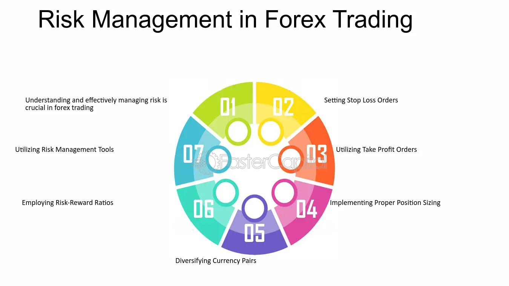

## Table of Contents

## What is Forex trading and how does it work?

Forex trading, also known as foreign exchange trading, is the process of buying and selling currencies on the foreign exchange market. It's the largest and most liquid financial market in the world, where people, businesses, and banks exchange one currency for another. The main goal of Forex trading is to make a profit from the changes in the value of one currency compared to another. For example, if you think the value of the Euro will go up compared to the US Dollar, you might buy Euros with Dollars, and then sell the Euros back for Dollars later if their value has increased.

Forex trading works through a network of banks, brokers, and traders all over the world. This market operates 24 hours a day, five days a week, allowing traders to buy and sell currencies at any time during the trading week. The price of currencies is influenced by many factors, including economic news, political events, and market sentiment. Traders use different strategies and tools, like charts and indicators, to predict how currency values might change. They can make money if they correctly predict these changes and trade accordingly.

## How can beginners start making money with Forex trading?

For beginners looking to start making money with Forex trading, the first step is to learn the basics. This means understanding what Forex trading is, how it works, and the different terms used in the market. It's important to know about currency pairs, how to read charts, and what affects currency values. A good way to learn is by using online resources, like tutorials and courses, which can teach you the fundamentals. It's also helpful to practice with a demo account, which lets you trade with fake money so you can get a feel for the market without risking real money.

Once you have a good understanding of the basics, you can start trading with real money. It's wise to start small, with an amount you can afford to lose, because Forex trading can be risky. Many beginners find it helpful to use a trading strategy, which is a plan for when to buy and sell currencies. You can find simple strategies online or develop your own based on what you've learned. As you gain more experience, you can slowly increase the amount of money you trade with and try more complex strategies. Remember, the key to making money in Forex trading is to keep learning and to be patient, as it takes time to become good at it.

## What are the basic strategies for Forex trading?

One basic strategy for Forex trading is called the trend-following strategy. This means you try to find out which way the market is moving and then trade in that direction. For example, if the price of a currency is going up, you would buy it, hoping it will keep going up so you can sell it later for a profit. To use this strategy, you need to look at charts and use tools like moving averages to see the trend. It's important to be patient and wait for the right time to enter and [exit](/wiki/exit-strategy) trades.

Another simple strategy is the range trading strategy. This is when you find currencies that move up and down between two prices, like a yo-yo. You buy the currency when it's at the low price and sell it when it reaches the high price. To do this, you need to watch the market closely and use tools like support and resistance levels to know where to buy and sell. This strategy can work well in markets that aren't moving a lot, but it needs you to be quick and pay attention to the market.

A third strategy is the [breakout](/wiki/breakout-trading) strategy. This is when you wait for the price of a currency to break out of a certain range. If the price breaks above the high of the range, you buy it, expecting it to keep going up. If it breaks below the low of the range, you sell it, expecting it to keep going down. To use this strategy, you need to be good at spotting when a breakout is likely to happen and be ready to act fast. It can be exciting but also risky, so it's important to use stop-loss orders to limit your losses if the breakout doesn't go as planned.

## What are the risks involved in Forex trading and how can they be managed?

Forex trading can be risky because the market can change quickly and unexpectedly. One big risk is losing money if the currency you buy goes down in value instead of up. This can happen because of many things, like news about the economy or big events in the world. Another risk is using too much leverage, which means borrowing money to trade. While leverage can make your profits bigger, it can also make your losses bigger if things don't go your way. Also, emotions like fear and greed can make you make bad decisions, like holding onto a losing trade too long or jumping into a trade without thinking.

To manage these risks, it's important to have a plan and stick to it. One way to do this is by using stop-loss orders, which automatically close your trade if the price goes against you by a certain amount. This can help limit how much money you lose on a single trade. Another way is to not use too much leverage. Starting with a small amount of money and slowly increasing it as you get more experience can help you avoid big losses. It's also important to keep your emotions in check by following your trading plan and not making quick decisions based on how you feel. Learning about the market and practicing with a demo account before using real money can also help you understand the risks better and trade more safely.

## How does leverage work in Forex trading and what are its benefits and dangers?

Leverage in Forex trading is like borrowing money from your broker to trade bigger amounts than you have in your account. For example, if you have $1,000 and your broker gives you 100:1 leverage, you can trade with $100,000. This means you can control a lot more money than you actually have, which can make your profits bigger if the trade goes your way. The benefit of leverage is that it lets you make more money with less of your own money. If the currency you buy goes up in value, you can make a lot more profit than if you were just using your own money.

But leverage can also be very dangerous. If the trade doesn't go your way, your losses can be much bigger than if you were just using your own money. Using the same example, if the currency you bought goes down in value, you could lose more than your $1,000 very quickly. This is why it's important to use leverage carefully and not to use too much of it. If you're not careful, you could lose all your money in just one bad trade. So, while leverage can help you make more money, it can also lead to big losses if you're not careful.

## What are the most common currency pairs to trade and why?

The most common currency pairs to trade in Forex are called the "major pairs." These include the EUR/USD (Euro/US Dollar), USD/JPY (US Dollar/Japanese Yen), GBP/USD (British Pound/US Dollar), and USD/CHF (US Dollar/Swiss Franc). These pairs are popular because they involve the world's biggest economies and are traded the most. The EUR/USD is the most traded pair because the Eurozone and the US have big economies and a lot of trade between them. The USD/JPY is also very popular because Japan is a big economy and the US and Japan have a lot of financial ties.

Another group of currency pairs that are often traded are the "cross pairs" or "minors." These pairs don't include the US Dollar, like EUR/GBP (Euro/British Pound) and EUR/JPY (Euro/Japanese Yen). These pairs are less traded than the majors but still very popular. People trade them because they want to take advantage of the movements between two big economies without the influence of the US Dollar. For example, if you think the Euro will go up compared to the Pound, you might trade EUR/GBP.

There are also "exotic pairs," which include one major currency and one from a smaller or emerging economy, like USD/TRY (US Dollar/Turkish Lira) or USD/MXN (US Dollar/Mexican Peso). These pairs are less common because they can be more risky and less liquid, meaning it can be harder to buy and sell them quickly. But some traders like them because they can offer big opportunities for profit if you can predict their movements well.

## How can technical analysis improve Forex trading outcomes?

Technical analysis can help improve Forex trading outcomes by giving traders tools to predict how currency prices might move. It involves looking at past price data and using charts and indicators to spot patterns. For example, if a trader sees a certain pattern that has led to price increases in the past, they might buy a currency expecting the same thing to happen again. By using technical analysis, traders can make better decisions about when to buy and sell, which can lead to more profits and fewer losses.

Another way technical analysis helps is by showing support and resistance levels on charts. These are price points where the currency has had trouble moving past before. If a currency price gets close to a support level, a trader might buy it, thinking it will bounce back up. If it gets close to a resistance level, they might sell it, expecting it to go down again. By understanding these levels, traders can plan their trades better and manage their risks more effectively, which can lead to better trading outcomes overall.

## What role does fundamental analysis play in Forex trading?

Fundamental analysis in Forex trading is about looking at the big picture to understand why a currency's value might go up or down. It involves studying things like a country's economy, its interest rates, political events, and even natural disasters. For example, if a country's economy is doing well, its currency might get stronger because more people want to invest there. On the other hand, if there's bad news like a war or a big drop in jobs, the currency might get weaker. By keeping an eye on these factors, traders can make better guesses about where a currency's value is headed.

Using [fundamental analysis](/wiki/fundamental-analysis) can help traders make smarter decisions. For instance, if a trader knows that a country's central bank is about to raise interest rates, they might buy that country's currency because higher interest rates often make a currency stronger. By understanding these big events and economic reports, traders can plan their trades to take advantage of the changes in currency values. This way, fundamental analysis works hand-in-hand with technical analysis to give traders a fuller picture of the market, helping them to trade more effectively and hopefully make more money.

## How can advanced traders use algorithmic trading to enhance their Forex strategies?

Advanced traders can use [algorithmic trading](/wiki/algorithmic-trading) to enhance their Forex strategies by automating their trading decisions based on pre-set rules and conditions. This means they can write computer programs, called algorithms, that automatically buy or sell currencies when certain things happen in the market. For example, if a trader has a strategy that works well when a currency's price breaks out of a certain range, they can program an algorithm to do this trade for them automatically. This can save a lot of time and help them make trades faster than they could by hand. It also helps them stick to their trading plan without letting emotions get in the way, which can lead to better results.

Another way algorithmic trading helps is by letting traders test their strategies on past data, a process called [backtesting](/wiki/backtesting). This means they can see how their strategy would have worked in the past before using real money. If the strategy did well in the backtest, the trader might feel more confident using it in the real market. Also, algorithms can trade in many currency pairs at the same time, something that would be hard for a person to do. This can help traders take advantage of more opportunities and possibly make more money. But it's important for traders to keep an eye on their algorithms and make sure they're working right, because the market can change and what worked before might not work in the future.

## What are the psychological aspects of Forex trading and how can they impact financial gains?

The psychological aspects of Forex trading can have a big impact on a trader's financial gains. One important part is managing emotions like fear and greed. When traders are afraid, they might sell their currencies too soon, missing out on potential profits. On the other hand, if they're too greedy, they might hold onto a trade for too long, hoping for even bigger gains, which can lead to big losses if the market turns against them. Keeping emotions in check is crucial because letting them control your decisions can lead to bad trades and less money in the end.

Another psychological aspect is discipline. Successful traders stick to their trading plans and strategies, even when the market gets tough. This means they don't make quick decisions based on how they feel at the moment. Having discipline helps traders avoid chasing after every little market move and instead focus on their long-term goals. By staying disciplined, traders can make more consistent profits and avoid the big losses that come from impulsive trading. In the end, understanding and managing these psychological factors can make a big difference in how much money a trader makes in Forex trading.

## How do global economic events influence Forex markets and trading opportunities?

Global economic events can have a big impact on Forex markets because they can change how people think about different currencies. For example, if a country's economy is doing well, like having more jobs or growing faster, its currency might get stronger. People might want to buy that currency because they think it will keep going up in value. On the other hand, if there's bad news, like a war or a big drop in jobs, the currency might get weaker. Traders watch these events closely because they can create chances to make money. If a trader knows about an upcoming event, like a central bank raising interest rates, they might buy that country's currency before it happens, hoping to sell it later for a profit.

These events can also cause big swings in currency prices, which can be both good and bad for traders. Big swings mean more chances to make money, but they also mean more risk. For example, if a country suddenly has a big problem, like a natural disaster, its currency might drop a lot very quickly. Traders who are ready for this might sell the currency before it drops and buy it back later at a lower price. But if they're not careful, they could lose money if the market moves in a way they didn't expect. So, understanding how global events affect currencies is important for finding good trading opportunities and managing risks.

## What are the long-term strategies for maximizing financial gains in Forex trading?

One long-term strategy for maximizing financial gains in Forex trading is to focus on building a solid trading plan and sticking to it. This means figuring out what works best for you, like which currency pairs to trade, what times of day to trade, and what strategies to use. A good plan helps you stay disciplined and avoid making quick decisions based on emotions. Over time, sticking to a well-thought-out plan can lead to more consistent profits. It's also important to keep learning and adjusting your plan as you gain more experience and as the market changes. By doing this, you can slowly improve your trading skills and increase your chances of making more money in the long run.

Another long-term strategy is to manage your money carefully. This means not risking too much money on any single trade and using tools like stop-loss orders to limit your losses. It's also a good idea to keep some of your profits aside instead of putting all your money back into trading. This way, you can grow your trading account slowly and steadily. By being careful with your money and not trying to get rich quick, you can protect yourself from big losses and build up your gains over time. In the end, patience and careful money management are key to maximizing your financial gains in Forex trading.

## References & Further Reading

[1]: ["Triennial Central Bank Survey of Foreign Exchange and Over-The-Counter (OTC) Derivatives Markets"](https://www.bis.org/statistics/rpfx22.htm) by the Bank for International Settlements

[2]: Bergstra, J., Bardenet, R., Bengio, Y., & Kégl, B. (2011). ["Algorithms for Hyper-Parameter Optimization."](https://dl.acm.org/doi/10.5555/2986459.2986743) Advances in Neural Information Processing Systems 24.

[3]: ["Advances in Financial Machine Learning"](https://www.amazon.com/Advances-Financial-Machine-Learning-Marcos/dp/1119482089) by Marcos Lopez de Prado

[4]: ["Evidence-Based Technical Analysis: Applying the Scientific Method and Statistical Inference to Trading Signals"](https://www.amazon.com/Evidence-Based-Technical-Analysis-Scientific-Statistical/dp/0470008741) by David Aronson

[5]: ["Machine Learning for Algorithmic Trading"](https://github.com/PacktPublishing/Machine-Learning-for-Algorithmic-Trading-Second-Edition) by Stefan Jansen

[6]: ["Quantitative Trading: How to Build Your Own Algorithmic Trading Business"](https://books.google.com/books/about/Quantitative_Trading.html?id=j70yEAAAQBAJ) by Ernest P. Chan