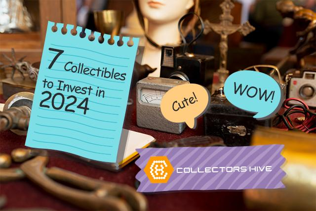

## Table of Contents

## What are collectibles and why might someone want to purchase them?

Collectibles are items that people collect because they are special or rare. These can be things like stamps, coins, toys, or even old comic books. People often collect these items because they like them or because they remind them of the past. Sometimes, collectibles can also be worth a lot of money, especially if they are hard to find.

People might want to buy collectibles for many reasons. One reason is that they enjoy collecting and it makes them happy. It can be fun to find and add new items to their collection. Another reason is that some people hope the collectibles will become more valuable over time. They might buy them as an investment, hoping to sell them later for more money. Either way, collecting can be a fun hobby that brings joy and sometimes profit.

## What are some common types of collectibles that are popular among beginners?

Some common types of collectibles that are popular among beginners are coins and stamps. These are easy to start collecting because you can find them almost anywhere. Coins from different countries or old coins can be fun to collect. Stamps are also popular because they often have pretty pictures and come from all over the world. Both coins and stamps can be found at low prices, making them good choices for people new to collecting.

Another popular type of collectible for beginners is trading cards. These can be sports cards, like baseball or basketball cards, or cards from games like Pokémon or Magic: The Gathering. Trading cards are fun because you can trade them with friends or play games with them. They are also easy to find in stores or online. Many people start collecting trading cards because they enjoy the excitement of opening packs and seeing what cards they get.

Lastly, action figures and toys are also common collectibles for beginners. These can include things like superhero figures, dolls, or old toys from childhood. Collecting action figures and toys can be nostalgic and fun. They are often easy to find at toy stores, flea markets, or online. Many people enjoy the memories that come with collecting toys they loved as kids.

## How can someone start a collection on a budget?

Starting a collection on a budget is easy if you know where to look. You can find many collectibles at low prices at places like garage sales, thrift stores, and flea markets. These places often have items that people no longer want, and you can buy them for a lot less than they would cost new. You can also look online on websites like eBay or Craigslist, where people sell things they don't need anymore. Sometimes, you can even trade items with other collectors to grow your collection without spending much money.

Another way to start a collection on a budget is to focus on common items that are not too expensive. For example, you can start collecting coins or stamps, which are often cheap and easy to find. You can also look for trading cards or small toys that are not rare but still fun to collect. By starting with items that don't cost a lot, you can build your collection slowly over time. Remember, the most important thing is to enjoy what you are collecting, not how much it costs.

## What are the key factors to consider when choosing collectibles to invest in?

When choosing collectibles to invest in, it's important to think about how rare the item is. Rare items are usually more valuable because there are not many of them. You should also look at the condition of the collectible. Items that are in good shape are worth more than ones that are damaged. Another thing to consider is the history of the item. Collectibles that have an interesting story or are connected to famous people or events can be more valuable. Finally, think about how popular the collectible is. If a lot of people want it, the price might go up.

It's also a good idea to do some research before you buy. Look at what similar items have sold for in the past. This can give you an idea of how much the collectible might be worth in the future. You should also think about how easy it is to sell the collectible. Some items are harder to sell than others, so make sure there is a market for what you want to buy. Remember, investing in collectibles can be risky, so only spend money you can afford to lose.

## How do you determine the value of a collectible?

To determine the value of a collectible, you need to look at a few things. First, check how rare the item is. If there are not many of them around, it might be worth more money. Next, see what condition the collectible is in. Items that are in good shape, without any damage, are usually worth more than ones that are broken or worn out. You should also think about the history of the item. If it has an interesting story or is connected to someone famous, it could be more valuable.

Another important thing to consider is how popular the collectible is. If a lot of people want it, the price might go up. To get a good idea of the value, you can look at what similar items have sold for in the past. Websites like eBay can show you recent sales prices. Talking to other collectors or visiting a professional appraiser can also help you figure out how much your collectible is worth. Remember, the value can change over time, so it's good to keep checking.

## What are the best practices for storing and preserving collectibles?

Storing and preserving collectibles is important to keep them in good condition. You should keep your collectibles in a cool, dry place away from sunlight. Sunlight can fade colors and damage materials over time. It's also a good idea to use protective cases or boxes. For example, you can put coins in coin holders, and trading cards in card sleeves. This helps protect them from dust and scratches. Make sure to handle your collectibles carefully, using clean hands or gloves to avoid leaving fingerprints or oils on them.

Another important thing is to keep your collectibles away from places with a lot of changes in temperature or humidity. Basements and attics can be bad because they can get too hot or too damp. If you have a lot of collectibles, you might want to use a dehumidifier to keep the air dry. Also, try to keep your collectibles organized. Label your storage boxes so you know what's inside without having to open them all the time. This helps you find things easily and reduces the chance of damaging them by moving them around too much.

## How can one stay updated on trends and emerging collectible markets?

To stay updated on trends and emerging collectible markets, it's a good idea to read magazines and websites that focus on collectibles. These sources often have articles about what's new and popular. You can also join online forums and social media groups where collectors talk about their hobbies. People in these groups share news and tips about what's hot in the world of collectibles. Another way to stay informed is by going to collectible shows and events. At these places, you can see new items and talk to other collectors and experts.

It's also helpful to follow auction houses and dealers. They often have information about what items are selling for and what's becoming more valuable. You can sign up for their newsletters or check their websites regularly. Watching videos on platforms like YouTube can also be a good way to learn about trends. Many collectors and experts make videos about the latest in the collectible world. By using these different methods, you can keep up with what's happening and find out about new collectible markets as they emerge.

## What are some advanced strategies for building a valuable collection?

Building a valuable collection takes more than just buying things you like. You need to think about what might become popular in the future. One way to do this is by looking at what young people are interested in now. Things like new video games or popular movies can turn into valuable collectibles later. Another strategy is to focus on limited edition items. These are made in small numbers, so they can become rare and valuable over time. You should also keep an eye on what's happening in the world. Big events or changes can make certain items more interesting to collectors.

Another important part of building a valuable collection is networking with other collectors. Going to shows and events can help you meet people who know a lot about collectibles. They can give you tips and help you find items that are hard to get. You can also trade items with other collectors to get things you need for your collection. It's also a good idea to keep learning. Read [books](/wiki/algo-trading-books), watch videos, and stay updated on what's happening in the collectible world. The more you know, the better you can make choices about what to buy and when to sell.

## How do auctions and online marketplaces impact the collectible market?

Auctions and online marketplaces have made a big difference in the collectible market. They make it easier for people to buy and sell collectibles from anywhere in the world. Before, you had to go to special stores or shows to find collectibles. Now, you can just go online and find what you want. This means more people can join in and the market can grow bigger. Auctions also help set prices for collectibles. When people bid on items, it shows how much they are willing to pay. This can make some collectibles more valuable if a lot of people want them.

These platforms also change how fast the market moves. New trends can spread quickly online. If a new movie comes out and people start collecting things from it, you can see that happening right away on auction sites and online marketplaces. This can make prices go up fast. But it can also make prices go down if people lose interest. It's important to keep an eye on these places to know what's happening in the collectible world. They can help you find good deals and understand what might be valuable in the future.

## What role does authentication and provenance play in the value of high-end collectibles?

Authentication and provenance are very important for high-end collectibles. Authentication means making sure the item is real and not a fake. This is important because fakes can look just like the real thing but are not worth as much money. Collectors often use experts or special tools to check if an item is real. Provenance is the history of the item, like who owned it before and where it came from. Knowing the history can make an item more valuable, especially if it was owned by someone famous or was part of an important event.

Both authentication and provenance help collectors feel sure about what they are buying. When an item is proven to be real and has a good history, people are willing to pay more for it. This is why high-end collectibles with good authentication and provenance can be worth a lot of money. Without these, it's hard to know if you are getting a good deal or if the item is worth what you are paying. So, they play a big role in deciding the value of high-end collectibles.

## How can one diversify a collectible portfolio to mitigate risk?

Diversifying a collectible portfolio means collecting different types of items instead of just one kind. This can help lower the risk because if one type of collectible loses value, the others might still be worth a lot. For example, if you only collect comic books and their value goes down, you could lose a lot of money. But if you also collect coins and stamps, those might still be valuable even if comic books are not. By having different kinds of collectibles, you spread out the risk and protect your investment.

To diversify your portfolio, you can start by choosing collectibles from different categories. You might pick some sports memorabilia, some art pieces, and some vintage toys. Each of these can have its own market and trends, so they won't all go up or down at the same time. It's also a good idea to look at collectibles from different time periods and places. This way, you're not just betting on one era or one country. By mixing things up, you can enjoy a wider range of items and feel more secure about your collection's overall value.

## What are the future trends and technologies that could influence the collectible market?

Future trends and technologies could change the collectible market in big ways. One trend is the rise of digital collectibles, like NFTs (non-fungible tokens). These are unique digital items that you can own and trade, just like physical collectibles. They are becoming more popular, especially with younger people who grew up with technology. Another trend is the use of blockchain technology, which helps keep track of who owns what and makes sure items are real. This can make buying and selling collectibles safer and easier.

New technologies like 3D printing and augmented reality (AR) could also affect the collectible market. With 3D printing, people might be able to make their own collectibles at home, which could change how rare items are. AR can make collecting more fun by letting you see and interact with your collectibles in new ways, like seeing a dinosaur come to life from a toy. These technologies could make the market more exciting and attract more people to collecting.

## References & Further Reading

[1]: ["NFT Market Trends Report 2021"](https://www.nature.com/articles/s41598-021-00053-8) by NonFungible.com

[2]: ["Vintage Electronics in Auction Trends"](https://www.retrotechlab.com/investing-in-retro-tech-a-guide-to-valuable-vintage-electronics/) by Barnebys Group

[3]: [Bergstra, J., Bardenet, R., Bengio, Y., & Kégl, B. (2011). "Algorithms for Hyper-Parameter Optimization."](https://dl.acm.org/doi/10.5555/2986459.2986743) Advances in Neural Information Processing Systems 24.

[4]: ["Advances in Financial Machine Learning"](https://www.amazon.com/Advances-Financial-Machine-Learning-Marcos/dp/1119482089) by Marcos Lopez de Prado

[5]: ["Evidence-Based Technical Analysis: Applying the Scientific Method and Statistical Inference to Trading Signals"](https://onlinelibrary.wiley.com/doi/book/10.1002/9781118268315) by David Aronson

[6]: ["Machine Learning for Algorithmic Trading"](https://github.com/stefan-jansen/machine-learning-for-trading) by Stefan Jansen

[7]: ["Quantitative Trading: How to Build Your Own Algorithmic Trading Business"](https://www.amazon.com/Quantitative-Trading-Build-Algorithmic-Business/dp/1119800064) by Ernest P. Chan