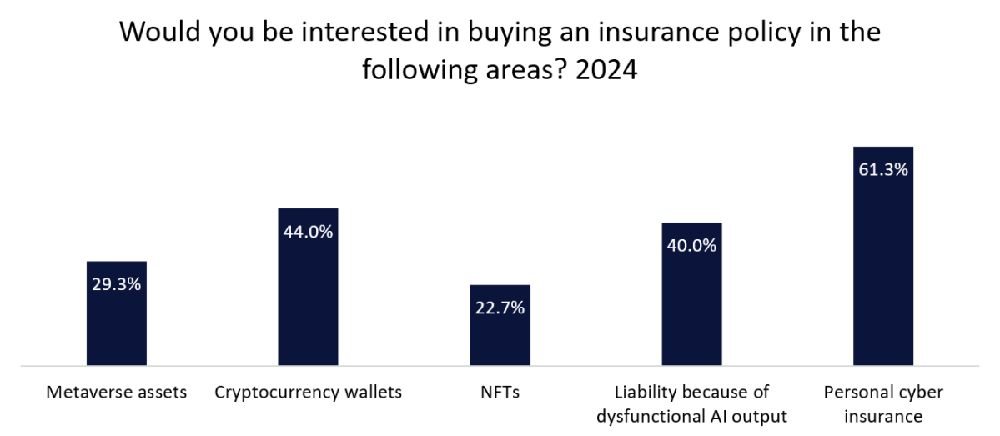

## Table of Contents

## What is cryptocurrency insurance?

Cryptocurrency insurance is a type of insurance that protects people who own digital currencies like Bitcoin or Ethereum. It helps cover losses if someone steals your cryptocurrency or if there's a problem with the platform where you keep your digital money. Just like how you might insure your home or car, cryptocurrency insurance gives you peace of mind knowing that your digital assets are protected.

There are different types of cryptocurrency insurance. Some policies cover losses from hacking or theft, while others might protect against mistakes made by the company holding your cryptocurrency. It's important to read the details of any insurance policy to understand what is covered and what isn't. As more people start using cryptocurrencies, insurance companies are beginning to offer more options to help keep digital money safe.

## Why is cryptocurrency insurance important?

Cryptocurrency insurance is important because it helps protect your digital money from being stolen or lost. Just like you might have insurance for your house or car, having insurance for your cryptocurrency can give you peace of mind. If someone hacks into your account or if the platform where you keep your cryptocurrency has a problem, insurance can help you get your money back.

As more people start using cryptocurrencies, the risk of losing money to theft or mistakes can go up. Without insurance, you might lose all your digital money if something bad happens. Having insurance means you don't have to worry as much about these risks, and you can feel safer keeping your money in digital form.

## What are the current challenges in the cryptocurrency insurance market?

One big challenge in the [cryptocurrency](/wiki/cryptocurrency) insurance market is that it's still pretty new. Not many insurance companies offer policies for digital money, so it can be hard to find the right one. Also, because cryptocurrencies can go up and down a lot in value, it's tricky for insurance companies to figure out how much to charge for their policies. They need to make sure they can cover any losses without charging too much.

Another challenge is that there's a lot of risk involved with cryptocurrencies. They can be stolen easily if someone hacks into your account or the platform where you keep your money. This makes it hard for insurance companies to decide how much risk they're willing to take on. They have to balance offering good coverage with keeping their business safe, which can make it tough to come up with policies that work for everyone.

Lastly, there aren't many rules and laws about cryptocurrency insurance yet. This means that what's covered can be different from one policy to another, and it can be confusing for people trying to buy insurance. Without clear rules, it's harder for insurance companies to know what they can and can't do, which can slow down the growth of the market.

## How does cryptocurrency insurance differ from traditional insurance?

Cryptocurrency insurance is different from traditional insurance because it deals with digital money instead of physical things like houses or cars. Traditional insurance usually covers things you can touch, like your home, car, or belongings. But cryptocurrency insurance covers digital assets that exist only on the internet, like Bitcoin or Ethereum. This means that the risks are different. With traditional insurance, you might worry about fire, theft, or accidents. With cryptocurrency insurance, the main worries are hacking, theft of digital wallets, and problems with the platforms where you keep your digital money.

Another big difference is how new and less common cryptocurrency insurance is compared to traditional insurance. Traditional insurance has been around for a long time, so there are many companies offering all sorts of policies. But cryptocurrency insurance is still pretty new, so there aren't as many options. This can make it harder to find the right policy. Also, because cryptocurrencies can change in value a lot, it's trickier for insurance companies to figure out how much to charge for their policies. They need to make sure they can cover any losses without charging too much, which can be a challenge.

## What types of coverage are available in cryptocurrency insurance?

Cryptocurrency insurance can offer different types of coverage to help protect your digital money. One common type is theft and hacking coverage. This helps you get your money back if someone steals your cryptocurrency or hacks into your account. Another type is custodial insurance, which covers losses if the company holding your cryptocurrency makes a mistake or goes out of business. This is important because many people keep their digital money on platforms run by other companies.

There's also coverage for errors and omissions, which protects you if the company managing your cryptocurrency makes a mistake. This can include things like sending your money to the wrong place or losing track of it. Some policies might also offer coverage for physical damage, like if your computer or phone with your digital wallet gets damaged or destroyed. Each type of coverage helps in different ways, so it's good to know what you need before choosing a policy.

## Who are the main providers of cryptocurrency insurance?

Some of the main providers of cryptocurrency insurance are companies like Lloyd's of London, which is a big name in the insurance world. They offer policies that cover losses from hacking and theft. Another provider is Coincover, which focuses on protecting digital assets and offers coverage for errors and mistakes made by the companies holding your cryptocurrency. These companies are trying to make it easier for people to feel safe about using digital money.

Other providers include Evertas, which offers insurance for crypto exchanges and custodians, and Nexus Mutual, a decentralized insurance platform that lets people pool their money to cover losses. These companies are working to meet the growing demand for cryptocurrency insurance as more people start using digital currencies. Each provider has different policies, so it's important to look at what they offer to find the best fit for your needs.

## What are the regulatory considerations for cryptocurrency insurance?

Regulatory considerations for cryptocurrency insurance are still developing because digital money is a new thing. Many countries don't have clear rules yet about how to insure cryptocurrencies. This makes it hard for insurance companies to know what they can and can't do. They have to be careful to follow the rules that do exist, like those about money laundering and fraud. As more people use cryptocurrencies, governments are starting to think about making new rules to help keep digital money safe and make sure insurance companies can offer good policies.

In some places, like the United States, insurance companies have to follow rules from groups like the National Association of Insurance Commissioners (NAIC). These rules help make sure that insurance companies are treating people fairly and can pay out if something goes wrong. But because cryptocurrencies are different from regular money, these rules might not cover everything. Insurance companies need to work with regulators to figure out how to offer good coverage without breaking any laws. As the rules get clearer, it will be easier for more companies to offer cryptocurrency insurance and for people to feel safe using digital money.

## How has the demand for cryptocurrency insurance evolved over the past few years?

Over the past few years, the demand for cryptocurrency insurance has grown a lot. As more people start using digital money like Bitcoin and Ethereum, they want to make sure their money is safe. Big events like hacks and thefts have shown people how risky it can be to keep their money in digital form. This has made more people look for insurance to protect their digital assets. Insurance companies have noticed this and are starting to offer more options to meet the growing demand.

The rise in demand has also pushed insurance companies to come up with new types of coverage. They are trying to cover different risks, like hacking, theft, and mistakes made by the companies holding the cryptocurrency. As the market for digital money gets bigger, more people are looking for ways to feel safe about using it. This has made the cryptocurrency insurance market grow quickly, even though it's still pretty new and there aren't many rules yet.

## What are the potential growth drivers for the cryptocurrency insurance industry?

The cryptocurrency insurance industry is growing because more people are using digital money. As more people buy and trade cryptocurrencies like Bitcoin and Ethereum, they want to make sure their money is safe. Big events like hacks and thefts have shown how risky it can be to keep money in digital form. This makes people look for insurance to protect their digital assets. Insurance companies see this and are starting to offer more options to meet the growing demand.

Another reason for growth is that insurance companies are coming up with new types of coverage. They are trying to cover different risks, like hacking, theft, and mistakes made by the companies holding the cryptocurrency. As the market for digital money gets bigger, more people are looking for ways to feel safe about using it. This has made the cryptocurrency insurance market grow quickly, even though it's still pretty new and there aren't many rules yet.

## What technological innovations could impact the future of cryptocurrency insurance?

New technology could change how cryptocurrency insurance works. One big change could come from blockchain technology, which is what cryptocurrencies use to keep track of money. Blockchain can make things more secure and easier to check, so insurance companies might use it to see if someone's digital money was stolen or lost. This could make it faster and easier to get money back if something goes wrong. Also, smart contracts, which are like automatic agreements on the blockchain, could help make insurance claims quicker and less complicated. If a policy says you get money back if your digital wallet is hacked, a smart contract could automatically give you the money without needing to talk to an insurance person.

Another technology that could help is [artificial intelligence](/wiki/ai-artificial-intelligence) (AI). AI can look at a lot of information quickly and find patterns that might show when someone's digital money is at risk. This could help insurance companies offer better protection and maybe even lower prices for people who are less likely to have problems. AI could also make it easier to check if a claim is real, which could stop people from trying to cheat the system. As these technologies get better, they could make cryptocurrency insurance safer and easier to use, helping more people feel okay about keeping their money in digital form.

## How might global economic trends influence the expansion of cryptocurrency insurance?

Global economic trends can have a big impact on how fast cryptocurrency insurance grows. When the economy is doing well, more people might want to try new things like digital money. This means more people will look for insurance to keep their digital money safe. But if the economy is not doing so well, people might be more careful with their money and less likely to use cryptocurrencies. This could slow down the growth of cryptocurrency insurance because fewer people would be buying it.

Also, big changes in the economy, like inflation or new rules about money, can change how much people trust cryptocurrencies. If people start to see digital money as a safe place to keep their savings, especially if regular money is losing value, then the demand for cryptocurrency insurance could go up. On the other hand, if new rules make it harder to use cryptocurrencies, or if there are big losses because of hacks or thefts, people might be more scared to use them. This would make the need for insurance go down. So, the growth of cryptocurrency insurance really depends on what's happening in the world economy.

## What are the expert predictions for the future market size and growth rate of the cryptocurrency insurance industry?

Experts think that the cryptocurrency insurance industry will grow a lot in the next few years. They say this because more people are using digital money and they want to make sure it's safe. Some experts think the market could be worth billions of dollars by 2025 or 2030. They see the growth rate being very fast, maybe even growing by double digits each year. This is because as more people use cryptocurrencies, the need for insurance to protect them will go up.

The exact numbers can be different depending on who you ask. Some experts think the market could grow at a rate of around 20% to 30% each year. Others think it might be even faster, especially if big events like hacks make more people want insurance. But everyone agrees that the future of cryptocurrency insurance looks bright, with lots of room to grow as digital money becomes more common.

## References & Further Reading

[1]: Bergstra, J., Bardenet, R., Bengio, Y., & Kégl, B. (2011). ["Algorithms for Hyper-Parameter Optimization."](https://dl.acm.org/doi/10.5555/2986459.2986743) Advances in Neural Information Processing Systems 24.

[2]: ["Advances in Financial Machine Learning"](https://www.amazon.com/Advances-Financial-Machine-Learning-Marcos/dp/1119482089) by Marcos Lopez de Prado

[3]: Edwards, E., & Cervantes, J. (2020). ["Blockchain and Cryptocurrency Regulation."](https://www.hklaw.com/en/insights/publications/2019/10/blockchain-cryptocurrency-regulation-2020) Global Legal Insights.

[4]: Tang, H. (2021). "Cryptocurrency as an Asset Class." Journal of Investment Strategies, 10(4), 1-27. [DOI:10.2139/ssrn.3711777](https://papers.ssrn.com/sol3/papers.cfm?abstract_id=3077685)

[5]: Kahale, N. (2021). "Algorithmic Trading and Investment Risk: Strategies for Managing Risks." Journal of Portfolio Management, 47(1), 88-101. [DOI:10.3905/jpm.2020.1.192](https://jpm.pm-research.com/content/early/2020/11/06/jpm.2020.1.192)

[6]: ["Evidence-Based Technical Analysis: Applying the Scientific Method and Statistical Inference to Trading Signals"](https://www.amazon.com/Evidence-Based-Technical-Analysis-Scientific-Statistical/dp/0470008741) by David Aronson

[7]: ["Machine Learning for Algorithmic Trading"](https://github.com/stefan-jansen/machine-learning-for-trading) by Stefan Jansen

[8]: ["Quantitative Trading: How to Build Your Own Algorithmic Trading Business"](https://www.amazon.com/Quantitative-Trading-Build-Algorithmic-Business/dp/0470284889) by Ernest P. Chan