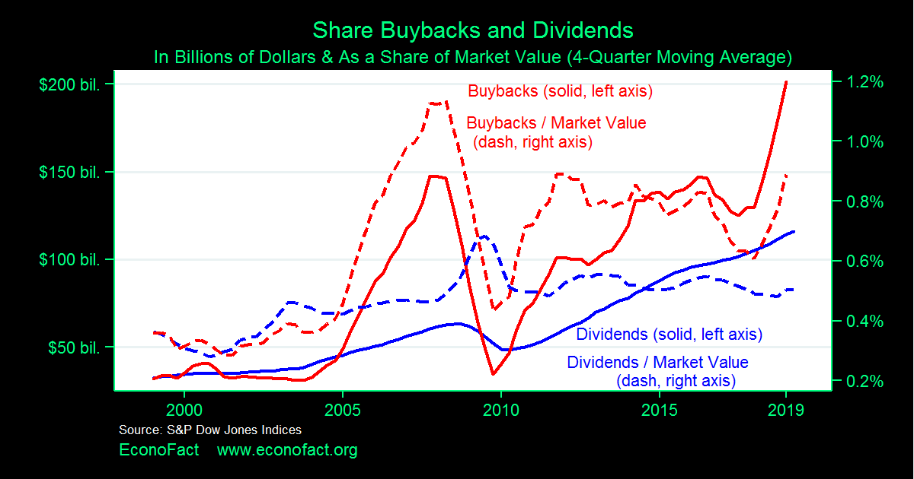

## Table of Contents

## What is a stock buyback?

A stock buyback, also known as a share repurchase, is when a company buys back its own shares from the marketplace. This means the company is essentially investing in itself by reducing the number of shares available to the public. Companies might do this for several reasons, like if they think their stock is undervalued or if they want to increase the value of the remaining shares.

When a company buys back its shares, it uses its own money to do so. This money can come from profits or other funds the company has. By reducing the number of shares, the value of each remaining share can go up because the company's earnings are now spread over fewer shares. This can make the stock more attractive to investors and can also be a way for the company to return money to shareholders without paying dividends.

## Why do companies engage in stock buybacks?

Companies engage in stock buybacks for a few main reasons. One big reason is that they think their stock is priced too low. When a company believes its stock is undervalued, it can buy back shares to show confidence in its future. This can make the stock price go up because there are fewer shares available, and it tells investors that the company thinks its stock is a good investment.

Another reason is to return money to shareholders without paying dividends. Sometimes, companies have extra cash and want to give it back to investors. Instead of paying dividends, which are taxed, they can buy back shares. This can be a more tax-efficient way to return money to shareholders. It also helps increase the value of the remaining shares, which can make shareholders happy.

Lastly, buybacks can be used to improve financial ratios like earnings per share (EPS). When a company buys back its shares, it reduces the total number of shares. This means the company's earnings are divided among fewer shares, so EPS goes up. A higher EPS can make the company look more profitable and attractive to investors, which can help boost the stock price.

## What are the potential benefits of stock buybacks for a company?

Stock buybacks can help a company in several ways. One big benefit is that they can make the stock price go up. When a company buys back its shares, it reduces the number of shares available. This means the company's earnings are spread over fewer shares, which can make each share more valuable. This can attract more investors and make the stock more appealing in the market.

Another benefit is that buybacks can be a good way to return money to shareholders without paying dividends. Sometimes, companies have extra cash and want to give it back to investors. Instead of paying dividends, which can be taxed, they can buy back shares. This can be a more tax-efficient way to return money and can also make shareholders happy because it increases the value of their remaining shares.

Lastly, buybacks can improve a company's financial ratios, like earnings per share (EPS). When a company buys back its shares, the total number of shares goes down. This means the company's earnings are divided among fewer shares, so EPS goes up. A higher EPS can make the company look more profitable and attractive to investors, which can help boost the stock price even more.

## How can stock buybacks negatively affect a company's financial health?

Stock buybacks can hurt a company's financial health if the company uses too much money to buy back shares. When a company spends a lot of money on buybacks, it might not have enough cash left for other important things like investing in new projects, paying off debts, or keeping enough money in reserve for emergencies. If the company runs into financial trouble later, it could be in a bad spot because it spent too much on buybacks.

Another way buybacks can be bad is if the company buys back shares when the stock price is too high. If the stock price goes down after the buyback, the company might have spent too much money on shares that are now worth less. This can make the company look like it made a bad investment, and it can hurt the company's value and the trust of investors.

## Can stock buybacks lead to increased executive compensation, and if so, how?

Yes, stock buybacks can lead to increased executive compensation. A common way this happens is through stock options or performance-based pay. Many executives get part of their pay in the form of stock options, which let them buy company stock at a set price. When a company buys back its shares, it often makes the stock price go up because there are fewer shares available. If the stock price goes up, the value of the executives' stock options also goes up, which means they can make more money when they sell those options.

Another way buybacks can increase executive pay is through performance metrics like earnings per share (EPS). Some executive compensation packages are tied to how well the company does on certain financial measures, like EPS. When a company buys back its shares, it reduces the number of shares, which can make EPS go up even if the company's overall earnings stay the same. If executives are rewarded for higher EPS, they can earn more money when the company does buybacks, even if the company's actual performance hasn't improved.

## What are the potential negative impacts of stock buybacks on shareholders?

Stock buybacks can sometimes hurt shareholders if the company spends too much money on them. When a company uses a lot of its cash to buy back shares, it might not have enough money left for other important things like growing the business or paying off debts. If the company runs into financial trouble later, it could be in a bad spot because it spent too much on buybacks. This can make the stock price go down, which is bad for shareholders who own the stock.

Another way buybacks can be bad for shareholders is if the company buys back shares when the stock price is too high. If the stock price goes down after the buyback, the company might have spent too much money on shares that are now worth less. This can make the company look like it made a bad investment, and it can hurt the value of the stock. Shareholders might lose money if the stock price drops a lot after a buyback.

## How might stock buybacks influence a company's long-term growth and innovation?

Stock buybacks can affect a company's long-term growth and innovation in a big way. When a company spends a lot of money on buying back its own shares, it might not have enough money left to invest in new projects or ideas. This means the company might miss out on chances to grow or come up with new products. If a company focuses too much on buybacks, it might not be able to keep up with changes in the market or new technology, which can hurt its growth in the long run.

On the other hand, if a company uses buybacks wisely, it can still have money left to invest in growth and innovation. The key is to balance buying back shares with spending on new projects. If a company can do this, it can make its shareholders happy by increasing the value of their shares while also working on new ideas and growth. But if the company spends too much on buybacks and not enough on innovation, it might struggle to grow and stay competitive in the future.

## What role do stock buybacks play in income inequality?

Stock buybacks can make income inequality worse. When companies buy back their own shares, it often makes the stock price go up. This is good for people who own a lot of stock, like rich people and top executives. They can make more money when the stock price goes up. But it doesn't help regular workers or people who don't own much stock. So, the rich get richer, and the gap between them and everyone else gets bigger.

Also, when companies spend a lot of money on buybacks, they might not have enough money left to pay their workers more or invest in new jobs. This means regular workers might not see their wages go up, even if the company is doing well. Over time, this can make income inequality even worse because the people at the top keep getting more money, while the people at the bottom don't see much change in their pay.

## How do stock buybacks affect the overall economy?

Stock buybacks can have a big effect on the overall economy. When companies spend a lot of money buying back their own shares, it can make the stock market go up. This is good for people who own stocks, but it might not be good for the whole economy. If companies use too much of their money on buybacks, they might not have enough left to invest in new projects or hire more workers. This can slow down economic growth because businesses are not spending as much on things that can help the economy grow.

On the other hand, if companies use buybacks wisely, it can help the economy in some ways. When stock prices go up because of buybacks, people who own stocks might feel richer and spend more money. This can help boost spending in the economy. But if too many companies focus on buybacks instead of investing in new ideas or expanding their businesses, it can make the economy less healthy in the long run. It's all about finding a balance between making shareholders happy and helping the economy grow.

## What are the regulatory concerns and changes related to stock buybacks?

Some people worry that stock buybacks can be used in ways that are not good for everyone. They think companies might use buybacks to make their stock prices go up quickly, which can help top executives make more money but might not be good for the company or the economy in the long run. Because of these worries, some lawmakers and regulators want to change the rules about buybacks. They want to make sure companies are not using buybacks just to help a few people at the top, but are also thinking about the health of the company and the economy.

In the United States, there have been some changes to the rules about stock buybacks. For example, a new rule from the Securities and Exchange Commission (SEC) says companies have to wait a certain amount of time before they can buy back their shares after they announce their earnings. This is to stop companies from using inside information to buy back shares at the best time. Some people also want to see more rules that make companies explain why they are doing buybacks and how it will help the company and its workers, not just the people at the top.

## Can you discuss any historical examples where stock buybacks led to negative outcomes?

One famous example of stock buybacks leading to bad results is what happened with IBM in the early 2010s. IBM spent a lot of money buying back its own shares, hoping to make the stock price go up. But while they were doing this, they were not spending enough money on new ideas and projects. This meant IBM fell behind other companies in the tech world. Their stock price did go up for a while, but then it started to go down because the company was not growing or coming up with new things. This shows how focusing too much on buybacks can hurt a company in the long run.

Another example is General Electric (GE) in the years before 2008. GE used a lot of its money to buy back its shares, which made the stock price go up for a while. But when the financial crisis hit in 2008, GE did not have enough money saved up to deal with the problems. They had to cut back on a lot of things and even had to ask for help from the government. This shows that spending too much on buybacks can leave a company in a bad spot when things get tough.

## What are the expert opinions and debates surrounding the ethics and efficacy of stock buybacks?

Some experts think stock buybacks are a good way for companies to use their money. They say buybacks can make the stock price go up, which is good for shareholders. It can also be a way to return money to investors without paying dividends, which can be taxed. These experts believe that if a company thinks its stock is undervalued, buying back shares is a smart move. They argue that buybacks can help make the company look more profitable and attractive to investors, which can be good for everyone involved.

But other experts worry about the ethics and long-term effects of buybacks. They say that when companies spend a lot of money on buybacks, they might not have enough left to invest in new projects or pay their workers more. This can hurt the company's growth and make income inequality worse because the rich people who own a lot of stock get richer, while regular workers don't see much benefit. Some also think that buybacks can be used to make the stock price go up quickly, which can help top executives make more money but might not be good for the company or the economy in the long run. These experts want to see more rules to make sure buybacks are used in a way that helps everyone, not just a few people at the top.

## References & Further Reading

[1]: Fried, J. M., & Wang, C. C. Y. (2017). ["Short-Termism and Capital Flows"](https://www.ecgi.global/sites/default/files/working_papers/documents/finalfriedwang12.pdf). The University of Chicago Law Review, 85(4), 1649-1690.

[2]: Kahle, K. M., & Stulz, R. M. (2020). ["Why are Corporate Payouts So High in the 2000s?"](https://www.sciencedirect.com/science/article/abs/pii/S0304405X21002907) Journal of Economic Literature, 58(3), 725-752.

[3]: Lazonick, W. (2014). ["Profits Without Prosperity: Stock Buybacks Manipulate the Market and Leave Most Americans Worse Off"](https://hbr.org/2014/09/profits-without-prosperity) Harvard Business Review, 92(9), 46-55.

[4]: Kirilenko, A. A., et al. (2017). ["The Flash Crash: The Impact of High-Frequency Trading on an Electronic Market"](https://papers.ssrn.com/sol3/papers.cfm?abstract_id=1686004). The Journal of Finance, 72(3), 967-998.

[5]: López de Prado, M. (2018). ["Advances in Financial Machine Learning"](https://www.amazon.com/Advances-Financial-Machine-Learning-Marcos/dp/1119482089) Wiley.

[6]: {Stiglitz, J. E. (1989). ["Using antitrust law to remedy bank failures."](https://documents1.worldbank.org/curated/en/239281468741290885/pdf/multi-page.pdf)} Brookings Papers on Economic Activity, 1989(2), 75-143.

[7]: Zhang, L. (2019). ["The Taming of 'Quants': How U.S. Policymakers Should Shape Regulation to Address the Risks Posed by High-Frequency Trading"](https://pubmed.ncbi.nlm.nih.gov/31061532/) Cornell Law Review, 104(6), 1685-1726.