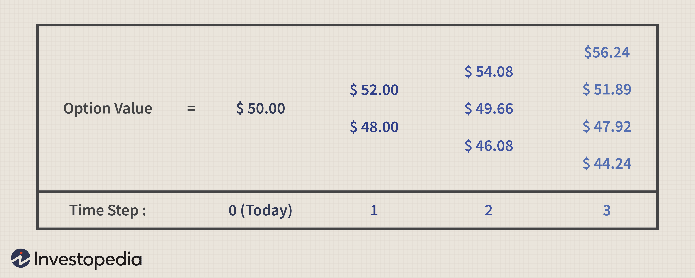

Options trading has garnered increasing attention among investors due to its potential for significant returns and strategic risk management capabilities. This form of trading involves contracts that provide the buyer the right, but not the obligation, to buy or sell an asset at a predetermined price on or before a specified date. Investors are increasingly turning to options trading as a means to diversify portfolios and capitalize on market movements.

Key concepts within options trading include profit and loss analysis, call options, and algorithmic trading. Profit and loss analysis is crucial for traders to gauge the financial outcome of options strategies, determining the potential benefit or detriment from holding or closing an option at a given point. Call options, a primary component of options trading, grant the holder the right to purchase an underlying asset at a defined strike price, providing opportunities for profit if the asset’s market price increases above the strike price prior to expiration.



Algorithmic trading leverages technological advancements to automate and optimize trading strategies, particularly in the context of options markets. These algorithms analyze vast datasets at high speeds, offering the ability to execute trades with precision that is beyond human capability. The impact of algorithmic trading on call options is profound, offering the potential to minimize human error, enhance decision-making efficiency, and improve overall trading outcomes.

The purpose of this article is to explore how algorithmic trading affects profit and loss outcomes in the context of call options. By integrating algorithmic tools, traders can potentially refine their strategies, leading to improved predictions of market trends and outcomes. This examination highlights the crucial role of technology in modern trading, demonstrating how innovative computational methods redefine possibilities in financial markets.

Ultimately, this article aims to provide actionable insights for traders interested in harnessing algorithmic tools for options trading. By understanding the nuances of technology-enhanced strategies, traders can better navigate the complexities of the options market and enhance their chances of achieving desirable investment outcomes.

## Table of Contents

## Understanding Options Trading and Call Options

Options trading is a financial instrument that provides traders with strategic opportunities to speculate or hedge on the movement of asset prices. Fundamentally, an options contract is a derivative based on the value of an underlying asset, such as a stock. Traders have the right, but not the obligation, to buy or sell this underlying asset at a predetermined price, known as the strike price, before a specified date, called the expiration date.

Call and put options are the two primary types of options contracts. A call option grants the holder the right to buy an asset at the strike price, while a put option allows the seller to sell an asset at the strike price. The intrinsic value of a call option is realized when the market price of the asset exceeds the strike price, whereas a put option becomes profitable when the market price falls below the strike price.

Call options play a significant role in investment strategies as they allow traders to leverage positions, leading to potentially higher returns with a comparatively smaller investment. They are frequently used for risk management through hedging, as purchasing call options can act as insurance against rising prices of underlying assets or assets already owned.

Several factors influence call option pricing. The strike price and expiration date are crucial elements. A lower strike price or a longer time before expiration generally increases a call's value. Market conditions, including [volatility](/wiki/volatility-trading-strategies), interest rates, and dividends, also significantly impact pricing. Higher volatility typically increases an option's premium since it's more likely that the market price will exceed the strike price.

Calculating potential profit and loss for call options involves understanding the option's premium, which is the price paid for the option. The basic formula to determine profit for a call option can be expressed as:

$$
\text{Profit} = (\text{Market Price of Asset} - \text{Strike Price} - \text{Premium Paid}) \times \text{Number of Contracts}
$$

If the result is negative, it represents a loss, as the total cost (including premiums) exceeds the gain from exercising the option.

Here is a simple Python code snippet to calculate the profit or loss of a call option:

```python
def calculate_call_option_profit(market_price, strike_price, premium, num_contracts=1):
    # Calculate profit
    profit = (market_price - strike_price - premium) * num_contracts
    return profit

# Example Usage
market_price = 150
strike_price = 140
premium = 5
num_contracts = 10

profit = calculate_call_option_profit(market_price, strike_price, premium, num_contracts)
print(f"Profit from call option: ${profit}")
```

This code calculates the potential profit from owning a call option, handy for traders looking to assess their gains or losses based on market variations. Understanding these basics lays the groundwork for employing more advanced strategies, such as integrating algorithmic tools into options trading to enhance decision-making and optimize outcomes.

## Algorithimic Trading: Revolutionizing the Options Market

Algorithmic trading has transformed financial markets by enabling rapid, data-driven decision-making and execution of trades. Originating in the 1970s with the advent of computerized trading systems, [algorithmic trading](/wiki/algorithmic-trading) has evolved to become a dominant force, particularly in the options market. As technology advanced, so did the complexity and efficiency of algorithms, allowing traders to process vast amounts of market data in real-time and execute orders faster than any human could.

Algorithms in options trading function as predefined sets of rules and mathematical models that determine the optimal conditions for buying or selling options. These algorithms leverage a variety of strategies, prioritizing speed and precision to capitalize on inefficiencies or market conditions. Commonly employed strategies in options trading include:

1. **Market Making**: Algorithmic systems provide liquidity by continuously quoting buy and sell prices, profiting from the bid-ask spread.
2. **Arbitrage**: Identifying and exploiting price discrepancies between different exchanges or markets, algorithms execute trades rapidly to lock in risk-free profits.
3. **Trend Following**: These strategies analyze market data to identify trends and generate buy or sell signals based on momentum indicators.
4. **Mean Reversion**: Algorithms predict that the price of an asset will revert to its mean, executing trades based on temporary deviations detected in real-time data.

The benefits of using algorithmic trading in analyzing and predicting market trends are numerous. Algorithms excel in processing large datasets at high speed, enhancing decision-making accuracy by factoring in various market indicators and conditions instantaneously. This enhanced speed and precision allow traders to capture smaller and more frequent gains, reducing transaction costs by utilizing automated execution to prevent slippage.

Despite its advantages, algorithmic trading comes with inherent risks, particularly in volatile markets. The reliance on complex models can sometimes be flawed, potentially leading to substantial financial loss if the algorithms misinterpret market signals. High-frequency trading also poses systemic risks, as it can amplify market volatility or cause flash crashes, where prices plummet rapidly before rebounding, due to rapid-fire erroneous trades.

One of the main challenges is the need for robust risk management systems and continuous monitoring to adapt strategies swiftly in response to changing market conditions. Technical issues, such as software glitches or hardware malfunctions, can also affect the performance of algorithmic systems, underscoring the need for failsafe measures and redundancy protocols.

Algorithmic trading continues to shape the future of options markets by offering the tools necessary for enhanced analytical capabilities and precise execution. However, successful implementation requires a deep understanding of both the potential and limitations of these technologies.

## Profit and Loss Analysis in Call Options with Algo Trading

Measuring profit and loss in options trading requires a thorough understanding of the variables involved, which include the strike price, expiration date, underlying asset's market price, and volatility. For call options, the profit occurs when the asset's price exceeds the strike price plus the premium paid for the option. The profit and loss (P&L) can be represented as:

$$
\text{Profit} = \max(0, S_t - K) - C
$$

where $S_t$ is the asset price at expiration, $K$ is the strike price, and $C$ is the premium paid.

Algorithmic trading can significantly enhance the accuracy in predicting the performance of call options by leveraging vast datasets and advanced computational techniques. Algorithms can process market data at unprecedented speed, identify patterns, and execute trades based on pre-set criteria or adaptive [machine learning](/wiki/machine-learning) models. For instance, high-frequency trading algorithms can rapidly exploit short-term market inefficiencies, while machine learning algorithms can model complex relationships influencing option prices.

Several case studies highlight the successful implementation of algorithmic strategies in options trading. A notable example is the use of delta-neutral strategies that aim to hedge against price movements in the underlying asset, maintaining a balanced portfolio through algorithmic recalibrations. These strategies utilize mathematical models and historical data to adjust the delta, or sensitivity of an option's price to changes in the price of the underlying asset, thus minimizing risk and optimizing returns.

To maximize profitability while managing risk through algorithmic trading in call options, traders should focus on a few key practices:

1. **Diversification of Strategies**: Employ multiple algorithms to cater to different market conditions and trading goals.
2. **Robust Backtesting**: Test algorithms extensively using historical data to evaluate performance and uncover potential pitfalls.
3. **Dynamic Risk Management**: Implement stop-loss mechanisms and adaptive risk assessments to prevent substantial losses in volatile markets.
4. **Continuous Monitoring**: Regularly update and refine algorithms to adapt to evolving market dynamics and emerging patterns.

Looking ahead, the future of algorithmic trading in options offers exciting prospects. Advances in [artificial intelligence](/wiki/ai-artificial-intelligence), particularly [deep learning](/wiki/deep-learning), could allow for even more sophisticated predictive models. Furthermore, the integration of [alternative data](/wiki/best-alternative-data) sources, such as social media signals and geopolitical events, is expected to enhance the predictive power of trading algorithms. Automation will continue to blend with human oversight, enabling traders to focus on strategic decision-making rather than routine tasks. As the landscape of algorithmic options trading evolves, staying informed and adapting to new technologies and methodologies will be crucial for traders aiming to maintain a competitive edge in the financial markets.

Traders are encouraged to explore the potential of algorithmic tools, combining them with sound trading principles to enhance their overall performance in the options market.

## Conclusion

In summary, the exploration of algorithmic trading in call options has highlighted its transformative impact on options trading strategies. Algorithmic trading has brought increased precision and speed to profit and loss analysis, offering traders the potential to more effectively navigate the complexities of the options market. A disciplined approach to options trading remains vital, as rigorous risk management and strategic decision-making underpin successful trading outcomes.

Traders are encouraged to leverage algorithmic tools as they can provide considerable advantages in improving trading results. These sophisticated tools equip traders to handle large datasets, identify patterns, and execute trades with optimal timing and efficiency. The integration of algorithms into traditional trading practices represents a significant step forward in bridging the gap between information and strategic execution.

The role of technology in shaping the future of financial markets continues to grow. From enabling real-time data analysis to facilitating complex [arbitrage](/wiki/arbitrage) strategies, technology is at the forefront of innovation in trading. As advancements in algorithmic trading continue, the landscape of options trading is set to evolve, driven by emerging technologies and new methodologies.

In conclusion, staying informed and continuously learning about new trading strategies and technologies is essential for traders aiming to maintain a competitive edge. By embracing these advancements and cultivating a disciplined approach, traders can better position themselves to capitalize on opportunities within the dynamic environment of financial markets.

## References & Further Reading

[1]: Bergstra, J., Bardenet, R., Bengio, Y., & Kégl, B. (2011). ["Algorithms for Hyper-Parameter Optimization."](https://papers.nips.cc/paper/4443-algorithms-for-hyper-parameter-optimization) Advances in Neural Information Processing Systems 24.

[2]: ["Advances in Financial Machine Learning"](https://www.amazon.com/Advances-Financial-Machine-Learning-Marcos/dp/1119482089) by Marcos Lopez de Prado

[3]: ["Evidence-Based Technical Analysis: Applying the Scientific Method and Statistical Inference to Trading Signals"](https://www.amazon.com/Evidence-Based-Technical-Analysis-Scientific-Statistical/dp/0470008741) by David Aronson

[4]: ["Machine Learning for Algorithmic Trading"](https://github.com/stefan-jansen/machine-learning-for-trading) by Stefan Jansen

[5]: ["Quantitative Trading: How to Build Your Own Algorithmic Trading Business"](https://www.amazon.com/Quantitative-Trading-Build-Algorithmic-Business/dp/1119800064) by Ernest P. Chan