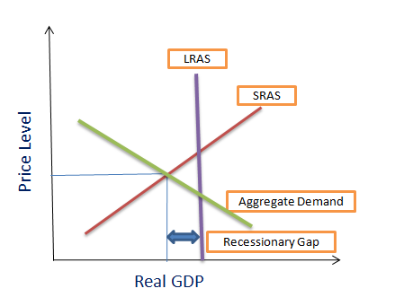

The jobs report, officially known as the Employment Situation Summary, is a crucial tool for gauging the health of an economy. Released monthly by the U.S. Bureau of Labor Statistics (BLS), it offers a comprehensive overview of the labor market by detailing employment, unemployment, and other related metrics. Economists and policymakers closely scrutinize these reports as they are vital indicators of economic trends and potential recessions.

One of the key metrics within the jobs report is the unemployment rate, which signifies the percentage of the labor force that is without work but actively seeking employment. Another critical metric is the number of jobs created, which provides insight into whether businesses are expanding and hiring more workers. The labor force participation rate, indicating the proportion of the population that is either employed or actively looking for work, further complements these statistics. These data points collectively help in understanding the broader economic environment and potential challenges.

Algorithmic trading, which has become increasingly prevalent in financial markets, heavily relies on economic data, including employment figures, to execute trades. Algorithms are designed to process vast amounts of information quickly and can respond to new data releases almost instantaneously. For instance, a stronger-than-expected jobs report may lead algorithms to anticipate potential interest rate hikes, prompting them to adjust portfolios accordingly. The swift reaction facilitated by algorithmic trading highlights the importance of employment data in shaping financial market dynamics.

Integrating employment data into economic trend prediction is essential for several reasons. Firstly, employment figures reflect consumer spending power, which drives a significant portion of economic activity. Secondly, these figures can indicate potential inflationary pressures. A tight labor market, where jobs are plentiful, might lead to higher wages, influencing the Federal Reserve's monetary policy decisions. Hence, integrating employment data allows economists and investors to construct a more accurate picture of the business cycle and anticipate future economic conditions.

As we navigate through the current economic climate, understanding the role of employment data as both a mirror and a predictor of economic health becomes increasingly important. This understanding sets the foundation for further examination of employment data's impact on economic strategies, policies, and market behaviors. Analyzing these dynamics will provide valuable insights into how various stakeholders can better respond to emerging economic challenges.

## Table of Contents

## Understanding the Jobs Report

A jobs report is a comprehensive compilation of employment-related data that provides insights into the health and direction of an economy. In the United States, the Bureau of Labor Statistics (BLS) is responsible for producing this report on a monthly basis. This report is eagerly anticipated by economists, policymakers, investors, and journalists, as it contains critical information regarding job creation, unemployment rates, and labor force participation.

The primary components of a jobs report include the unemployment rate, which is the percentage of the labor force that is jobless and actively seeking employment. This data is crucial for assessing economic performance, as lower unemployment rates generally indicate economic expansion, while higher rates may signal economic distress or contraction.

Job creation figures are another vital element of the jobs report. This metric indicates the number of new jobs added to the economy over the previous month. A robust job creation number can suggest economic strength, while weaker figures may raise concerns about economic growth sustainability.

Labor force participation rate is also a key part of the jobs report. It measures the percentage of the working-age population that is either employed or actively looking for work. A declining participation rate might imply that people are becoming discouraged about their job prospects or are opting out of the workforce for other reasons.

To compile this data, the BLS conducts two primary surveys: the Current Population Survey (CPS) and the Current Employment Statistics (CES) survey. The CPS, also known as the household survey, collects data through interviews with a sample of households to provide information on the labor force status, demographics, and other characteristics of workers. The CES, or establishment survey, gathers data from employers to measure employment, hours, and earnings across various industries.

The importance of the jobs report extends beyond mere numbers. Economists use this data to analyze labor market trends, forecast economic growth, and guide monetary policy decisions. Traders and investors rely heavily on jobs reports to make informed decisions on buying or selling securities, as employment trends can significantly impact financial markets.

Historically, jobs reports have been pivotal in signaling changes in economic health. For instance, sharp declines in job creation and rising unemployment rates have often preceded economic recessions, providing an early warning signal that economic conditions may be deteriorating. Conversely, sustained job growth has frequently aligned with periods of economic expansion and prosperity.

Given the jobs report's critical role in analyzing economic trends, understanding its components and implications is essential for anyone seeking to interpret current economic conditions or predict future developments.

## The Sahm Rule: A Recession Indicator

Economist Claudia Sahm developed a notable recession indicator known as the Sahm Rule, which leverages unemployment data to signal economic downturns. The rule is defined by a straightforward mechanism: it triggers a recession warning when the three-month moving average of the national unemployment rate rises by 0.5 percentage points or more relative to its lowest level over the previous 12 months. Mathematically, the Sahm Rule can be expressed as:

$$
\text{Recession Signal} = 
\begin{cases} 
1, & \text{if } \bar{U}_{t,3} - U_{\text{min},t-12} \geq 0.5 \\ 
0, & \text{otherwise} 
\end{cases} 
$$

where $\bar{U}_{t,3}$ is the three-month moving average unemployment rate at time $t$, and $U_{\text{min},t-12}$ is the lowest unemployment rate in the last 12 months.

Historically, the Sahm Rule has demonstrated reliability in providing timely warnings of recessions. Its efficacy was apparent in recent economic cycles, where it successfully indicated forthcoming recessions by identifying significant upward trends in unemployment. The simplicity and rapid response of the Sahm Rule make it an attractive tool for both economists and policymakers who seek early detection of economic contractions.

While recent jobs reports have seen fluctuations, the Sahm Rule's framework allows for an effective interpretation of such data against the backdrop of potential recessionary signals. For instance, if recent data showcase an ascending trajectory in unemployment akin to the parameters defined by the Sahm Rule, it lends credence to predictions of an impending downturn.

Despite its strengths, the Sahm Rule does face criticisms and limitations. It relies solely on unemployment metrics, potentially overlooking other critical economic indicators. The rule does not necessarily account for structural changes in the labor market or the nature of unemployment fluctuations, such as temporary job losses that may not signify broader economic weakness. Additionally, while useful in the U.S. context, its applicability may vary across different economies with fluctuating labor market characteristics.

Overall, the Sahm Rule remains a pivotal tool for recession prediction, though it is prudent to use it in conjunction with other economic indicators to attain a holistic view of economic health.

## Employment Data and Algo Trading

Algorithmic trading refers to the use of computer algorithms to automate the process of trading financial instruments. These algorithms make decisions based on predefined criteria, relying heavily on vast quantities of data to analyze and execute trades with minimal human intervention. The efficiency and efficacy of [algorithmic trading](/wiki/algorithmic-trading) strategies hinge on the quality and timeliness of the data feed, making economic indicators, such as employment data, indispensable.

Employment data is crucial for algorithmic trading algorithms due to its ability to signal underlying economic conditions, informing forecasts on consumer spending, business investment, and monetary policy. Key metrics within employment data—including the unemployment rate, job creation numbers, and labor force participation—provide algorithms with insights into market sentiment and [momentum](/wiki/momentum), allowing them to adjust trading positions accordingly. For instance, a lower-than-expected unemployment rate could signal economic strength, prompting algorithms to invest in equities anticipating a market rally.

Unexpected shifts in employment figures, however, can significantly impact trading strategies. A sudden rise in unemployment might suggest an economic slowdown, prompting a recalibration of risk models and a pivot towards safer asset classes such as bonds or gold. Algorithms are programmed to recognize these anomalies in data and can swiftly execute trades to mitigate potential losses or capitalize on new opportunities. The rapid adaptation to unexpected data is crucial, as financial markets are highly sensitive to changes in economic indicators.

Automation plays a pivotal role in algorithmic trading, particularly in responding to changes in employment data. Algorithms can analyze, interpret, and react to new data releases in milliseconds, far surpassing human capabilities. This speed advantage ensures that trading strategies are implemented before the broader market can digest the latest information, often securing a competitive edge. Automation reduces errors associated with manual trading, ensuring consistency and precision in the execution of trades.

Recent case studies highlight the influence of employment data on algorithmic trading. For example, during the COVID-19 pandemic, significant disruptions in employment data led to extraordinary [volatility](/wiki/volatility-trading-strategies) in financial markets. Trading algorithms adjusted promptly to the drastic fluctuations in unemployment figures, which initially surged to historic highs before stabilizing as economies gradually reopened. These reactions exemplify the importance of algorithms in securing optimal trading outcomes amid rapidly evolving economic conditions.

In conclusion, the integration of employment data into algorithmic trading ensures that strategies remain aligned with the latest economic developments. The ability to rapidly parse and respond to this data is not merely advantageous but essential in navigating the complexities of modern financial markets.

## Current Economic Landscape

The current economic landscape is characterized by intricate employment trends with far-reaching implications for the global and U.S. economies. Recent job [statistics](/wiki/bayesian-statistics) illustrate a fluctuating but generally positive labor market. The U.S. Bureau of Labor Statistics reports a stable rate of job creation, with the unemployment rate hovering around pre-pandemic levels. This stability suggests that, although growth may not be as robust as during recovery phases, the labor market remains resilient. However, this resilience is not without its challenges.

Economic indicators, such as the unemployment rate and labor force participation rate, provide insight into potential recession indicators. Analysts often scrutinize the unemployment rate, which remains a critical metric in foreseeing economic downturns. A sudden and sustained increase in unemployment would typically be a warning signal, yet recent data shows a relatively stable unemployment rate, suggesting that the economy is not immediately on the verge of recession. However, the labor force participation rate—a measure that reflects the active engagement of working-age individuals in the labor market—remains slightly below pre-pandemic levels, hinting at potential underemployment issues or workforce structural changes.

Federal Reserve policies play a pivotal role in influencing the dynamics of employment and inflation. The Federal Open Market Committee (FOMC) adjusts interest rates and uses other monetary tools to regulate economic activity. In response to high inflation rates, the Fed has gradually increased interest rates to temper economic overheating while striving to achieve a balance between fostering employment growth and containing inflation. This dual mandate of maximizing employment while stabilizing prices is challenging amidst persistent global supply chain disruptions and fluctuating demand.

Global events, including the pandemic and geopolitical tensions, notably impact U.S. job statistics. The COVID-19 pandemic disrupted labor markets, leading to unprecedented job losses and shifts towards remote work, which continue to shape employment patterns. Conflicts, such as those affecting energy prices, further complicate the economic environment, influencing sectors from manufacturing to services, and thereby affecting employment figures. The ongoing impact of these events requires careful monitoring as they pose risks and opportunities within the labor market.

Economic forecasts and market expectations are shaped by these varied factors, with economists expressing cautious optimism. While some forecasts suggest a potential slowdown due to tightening monetary conditions, others anticipate modest growth supported by a strong labor market. Inflation continues to be a concern, but gradual adjustments by the Fed aim to avert a stagflation scenario.

In summary, while the current employment trends do not immediately signal a recession, ongoing vigilance is key. Federal Reserve policies, global events, and fluctuating employment metrics must be steadily analyzed to understand their long-term impact on economic stability.

## Conclusion

Jobs data serve as an essential recession indicator, providing timely insights into the health of the economy. A critical function of employment data lies in its ability to signal economic downturns through metrics such as the unemployment rate, job creation figures, and labor force participation rates. These indicators are pivotal for investors and policymakers who rely on them to make informed decisions amidst evolving economic conditions.

Employment data is a cornerstone for algorithmic trading, where precise and prompt data is crucial. Trading algorithms utilize employment reports to adjust strategies and mitigate risks based on anticipated economic shifts. The swift reaction of these systems to changes in employment statistics underscores their dependence on accurate and real-time data.

Recent trends highlight the need for investors and policymakers to adapt strategies in response to employment data. A key takeaway is the understanding that while jobs reports are crucial, relying solely on them can be limiting. The unpredictability of global events, like pandemics and geopolitical conflicts, has demonstrated that a diversified set of economic indicators can provide a more robust framework for forecasting economic changes. 

It is, therefore, vital for stakeholders to remain informed about future employment reports to detect early signals of economic shifts. By keeping abreast of these developments, investors and policymakers can better anticipate economic trends, ultimately leading to more resilient economic strategies and policies. Engaging with comprehensive analyses and staying updated with ongoing employment statistics will provide a competitive edge in understanding macroeconomic movements.

## Further Reading and Resources

### Further Reading and Resources

For readers interested in expanding their knowledge of economic indicators and their implications, a variety of resources are suggested below:

1. **Academic Papers on Sahm Rule and Recession Forecasting**:
   - Claudia Sahm, a noted economist, developed the Sahm Rule, which uses unemployment data as an early indicator of recessions. Interested readers can explore her paper, "Direct Stimulus Payments to Individuals," available in the Social Science Research Network (SSRN) repository, which discusses her methodology and its implications for economic forecasting.
   - Another insightful paper is "Real-time Forecasts of Economic Activity: The Phillips Curve and Other Approaches” which can be found in economic journals and libraries. It provides a comprehensive look at various approaches to economic forecasting, including those related to the Sahm Rule.

2. **Guide to Understanding Algorithmic Trading**:
   - For an introduction to algorithmic trading and its dependence on data, "Algorithmic Trading: Winning Strategies and Their Rationale" by Ernest P. Chan is a highly recommended book. It covers the basic principles as well as advanced strategies in algorithmic trading.
   - Online platforms like Coursera and edX offer courses in algorithmic trading, often including modules that focus on the integration of economic data into trading algorithms. These courses can provide practical insights and hands-on experience.

3. **Glossary of Terms**:
   - Readers new to the field of economic data may benefit from a glossary of terms typically used in employment statistics and economic analyses. Websites such as the U.S. Bureau of Labor Statistics (BLS) or Investopedia provide comprehensive glossaries that cover terms like “labor force participation rate,” “nonfarm payrolls,” and “unemployment rate.”

4. **Financial Newsletters**:
   - To stay informed about current updates on economic trends, subscribing to financial newsletters is beneficial. Platforms like Bloomberg and The Wall Street Journal offer newsletters that cover significant economic reports, including employment data. 
   - Additionally, specialized newsletters such as "The Daily Shot" provide global macroeconomic updates, giving readers a broader perspective on economic changes.

These resources can provide a broader understanding and various perspectives on employment data’s role in economic analysis. Engaging with these materials can aid in recognizing early signs of economic shifts and understanding the complex interplay of data in markets.

## References & Further Reading

[1]: Sahm, Claudia. ["Direct Stimulus Payments to Individuals."](https://www.hamiltonproject.org/assets/files/Sahm_web_20190506.pdf) Social Science Research Network (SSRN).

[2]: Chan, Ernest P. ["Algorithmic Trading: Winning Strategies and Their Rationale."](https://github.com/ftvision/quant_trading_echan_book) Wiley.

[3]: ["Real-time Forecasts of Economic Activity: The Phillips Curve and Other Approaches."](https://www.investopedia.com/terms/p/phillipscurve.asp) National Bureau of Economic Research.

[4]: ["The Employment Situation – September 2023."](https://www.bls.gov/news.release/archives/empsit_10062023.pdf) U.S. Bureau of Labor Statistics.

[5]: Jansen, Stefan. ["Machine Learning for Algorithmic Trading - Second Edition."](https://www.amazon.com/Machine-Learning-Algorithmic-Trading-alternative/dp/1839217715) Packt Publishing.