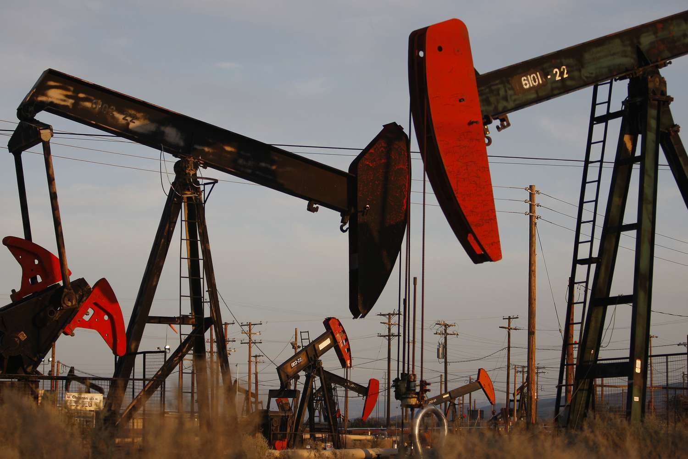

## Table of Contents

## What are oil and gas stocks?

Oil and gas stocks are shares of companies that explore, produce, refine, or sell oil and natural gas. These companies can be big or small, and they work in different parts of the oil and gas industry. When you buy their stocks, you own a small part of these companies and can make money if the stock price goes up or if the company pays dividends.

The price of oil and gas stocks often goes up and down with the price of oil and gas. If the price of oil goes up, these stocks usually do well because the companies make more money. But if the price of oil goes down, the stocks can lose value. This makes oil and gas stocks a bit risky, but they can also be a good way to invest in the energy industry.

Some people like to invest in oil and gas stocks because they think the world will always need oil and gas. But others worry about the environment and think that renewable energy will become more important. So, it's important to think about these things before deciding to buy oil and gas stocks.

## Why might someone be interested in investing in oil and gas stocks?

Someone might be interested in investing in oil and gas stocks because they think these companies will make a lot of money. Oil and gas are still very important for things like cars, heating homes, and making electricity. If the price of oil goes up, the companies that find and sell oil can make more profit. This means their stock prices might go up too, and investors could make money from that.

Another reason is that oil and gas stocks can pay dividends. Dividends are like a share of the company's profits that they give to people who own their stocks. Some oil and gas companies have a history of paying good dividends, which can be attractive if you want to get regular income from your investments.

But, it's not all good news. Oil and gas stocks can be risky because the price of oil can change a lot. If the price of oil goes down, the stocks can lose value quickly. Also, more people are worried about the environment and want to use less oil and gas. This could mean less demand for oil in the future, which might make oil and gas stocks less valuable. So, people need to think about these risks before deciding to invest.

## What factors influence the price of oil and gas stocks?

The price of oil and gas stocks goes up and down because of many things. One big thing is the price of oil itself. If oil prices go up, oil and gas companies make more money, and their stocks usually go up too. But if oil prices go down, these companies make less money, and their stocks can lose value. Another thing that matters is how much oil and gas people want to use. If more people need oil, like when the economy is doing well, the stocks can do better. But if people start using less oil, maybe because they are worried about the environment, the stocks might not do as well.

Another [factor](/wiki/factor-investing) is what's happening in the world. If there are problems in countries that make a lot of oil, like wars or strikes, it can make oil prices go up because there might be less oil to go around. Also, new rules from governments about oil and gas can change things. If a government says companies have to pay more taxes or follow new rules, it can make it harder for oil and gas companies to make money, and their stocks might go down. Finally, what investors think about the future of oil and gas matters too. If they think oil will be important for a long time, they might buy more stocks, pushing the price up. But if they think renewable energy will take over, they might sell their stocks, making the price go down.

## How have oil and gas stocks performed historically?

Over the years, oil and gas stocks have gone up and down a lot. When oil prices were high, like in the early 2000s and around 2010 to 2014, these stocks did really well. People made a lot of money because the companies were making big profits. But when oil prices crashed, like in 2008 during the financial crisis and again in 2014 to 2016, oil and gas stocks lost a lot of value. Many investors lost money during those times because the companies were not making as much profit.

In more recent years, oil and gas stocks have had a bit of a roller coaster ride. In 2020, when the world was dealing with the COVID-19 pandemic, oil prices dropped to very low levels because people were not traveling as much. This made oil and gas stocks fall a lot. But then, as the world started to recover and people started using more oil again, the stocks began to recover too. By 2022, with oil prices going up because of things like the war in Ukraine, oil and gas stocks saw a big jump in value. So, while oil and gas stocks can be a good investment, they can also be risky because they depend a lot on what's happening with oil prices and the world economy.

## What are the risks associated with investing in oil and gas stocks?

Investing in oil and gas stocks can be risky because the price of oil goes up and down a lot. If oil prices drop, the companies that find and sell oil make less money, and their stock prices can fall quickly. This happened in 2008 during the financial crisis and again in 2014 to 2016 when oil prices crashed. It also happened in 2020 when the world was dealing with the COVID-19 pandemic and people were not using as much oil. So, if you invest in these stocks, you could lose money if oil prices go down.

Another risk is that the world might start using less oil and gas in the future. More people are worried about the environment and want to use renewable energy like wind and solar power instead. If this happens, oil and gas companies might not make as much money, and their stocks could lose value. Governments might also make new rules that make it harder for oil and gas companies to make money, like higher taxes or stricter environmental laws. So, it's important to think about these risks before deciding to invest in oil and gas stocks.

## What are some strategies for investing in oil and gas stocks?

One strategy for investing in oil and gas stocks is to look at the big picture. You can try to guess where oil prices might go by watching what's happening in the world. If there are problems in countries that make a lot of oil, like wars or strikes, oil prices might go up. You can buy oil and gas stocks when you think oil prices will go up, and sell them when you think prices will go down. Another way is to invest in companies that pay good dividends. Some oil and gas companies give part of their profits to people who own their stocks. If you want to get regular money from your investments, you might like these stocks.

Another strategy is to spread your money around. Instead of putting all your money into one oil and gas company, you can buy stocks from different companies. This way, if one company does badly, you won't lose all your money. You can also buy stocks from companies that do different things in the oil and gas industry, like finding oil, making it into gas, or selling it. This can help you make money no matter what part of the industry is doing well. But remember, oil and gas stocks can be risky, so it's important to think about these risks before you invest.

## How can one identify undervalued oil and gas stocks?

To find undervalued oil and gas stocks, you can start by looking at the price-to-earnings (P/E) ratio. This number tells you how much you are paying for each dollar of the company's earnings. If the P/E ratio is lower than other companies in the same industry, the stock might be undervalued. Another thing to check is the price-to-book (P/B) ratio, which compares the stock price to the company's net assets. A lower P/B ratio can also mean the stock is undervalued. You can find these numbers on financial websites or in the company's financial reports.

Another way to spot undervalued oil and gas stocks is to look at the company's future plans and the overall market conditions. If a company has good projects coming up, like new oil fields or better ways to get oil out of the ground, it might be worth more than its current stock price shows. Also, if oil prices are low right now but you think they will go up soon, the stocks might be a good buy. You can read news and reports about the oil and gas industry to get a better idea of what might happen in the future. Remember, finding undervalued stocks takes time and research, but it can help you make smarter investment choices.

## What are the key financial metrics to look at when analyzing oil and gas stocks?

When you want to analyze oil and gas stocks, you should look at some important financial numbers. One key metric is the price-to-earnings (P/E) ratio. This tells you how much you are paying for each dollar of the company's earnings. If the P/E ratio is lower than other companies in the same industry, the stock might be a good deal. Another important number is the price-to-book (P/B) ratio, which compares the stock price to the company's net assets. A lower P/B ratio can mean the stock is undervalued. You can find these numbers on financial websites or in the company's financial reports.

Another thing to check is the company's debt levels. Oil and gas companies often need a lot of money to find and get oil out of the ground, so they might have a lot of debt. You can look at the debt-to-equity ratio to see how much debt the company has compared to its equity. A high debt-to-equity ratio can be risky, especially if oil prices go down. Also, look at the company's cash flow. This tells you how much money the company is making from its operations. Good cash flow means the company can pay its bills and invest in new projects. By looking at these financial metrics, you can get a better idea of whether an oil and gas stock is a good investment.

## How do geopolitical events impact oil and gas stock prices?

Geopolitical events can really shake up oil and gas stock prices. When there are problems in countries that make a lot of oil, like wars or strikes, it can make oil prices go up. This happens because people worry that there might be less oil to go around. If oil prices go up, oil and gas companies can make more money, and their stock prices usually go up too. But if these events make people think there will be less need for oil in the future, like if countries start fighting over oil and decide to use less of it, oil and gas stock prices might go down.

Another way geopolitical events can affect oil and gas stocks is through new rules from governments. If a government decides to put more taxes on oil and gas companies or make them follow stricter environmental laws, it can make it harder for these companies to make money. This can cause their stock prices to drop. Also, if big countries like the United States or China change their energy policies, it can change how much oil and gas people use around the world. So, keeping an eye on what's happening in the world can help you understand why oil and gas stock prices are going up or down.

## What role do technological advancements play in the recovery of oil and gas stocks?

Technological advancements can help oil and gas stocks recover by making it easier and cheaper for companies to find and get oil out of the ground. New technologies like fracking and horizontal drilling let companies reach oil that was hard to get before. This can make more oil available, which can help keep oil prices stable or even bring them down. When oil prices are stable or lower, oil and gas companies can make more money because they can sell more oil without the price going up too much. This can make their stocks go up because investors see the companies making more profit.

Also, technology can help oil and gas companies be more environmentally friendly. New ways to capture and store carbon dioxide or reduce emissions can make these companies look better to people who care about the environment. If people think oil and gas companies are doing a good job with the environment, they might be more willing to invest in their stocks. This can help the stocks recover because more people want to buy them. But, it's important to remember that technology can also make renewable energy cheaper and better, which might make people use less oil and gas in the future. So, while technology can help oil and gas stocks recover, it can also make things harder for them in the long run.

## How do environmental regulations affect the potential recovery of oil and gas stocks?

Environmental regulations can make it harder for oil and gas stocks to recover. When governments make new rules to protect the environment, like rules about how much pollution companies can make, it can cost oil and gas companies a lot of money. They might have to spend money on new equipment or ways to clean up their operations. This can make it harder for them to make a profit, and if they make less money, their stock prices might not go up as much. Also, if the rules are very strict, some oil and gas projects might not be able to go ahead, which means less oil and gas to sell and less money for the companies.

On the other hand, if oil and gas companies can show that they are following the environmental rules well, it might help their stocks recover. People who care about the environment might be more willing to invest in these companies if they see them trying to be cleaner and safer. This can make the stocks more popular and help their prices go up. But, if the rules keep getting stricter and make it too hard for oil and gas companies to make money, people might start investing in other kinds of energy, like wind or solar power, instead. So, environmental regulations can be a big challenge for oil and gas stocks, but they can also be a chance to show that the companies are doing the right thing.

## What are the long-term prospects for oil and gas stocks in a transitioning energy market?

The long-term prospects for oil and gas stocks in a transitioning energy market are uncertain because the world is moving towards using less oil and more renewable energy. Many countries are setting goals to reduce their use of fossil fuels and increase the use of clean energy like wind, solar, and electric cars. This shift can make it harder for oil and gas companies to make money because there might be less demand for their products. If people start using less oil and gas, the prices might go down, and oil and gas stocks could lose value. So, investors need to think about these changes when deciding whether to buy oil and gas stocks.

But, oil and gas stocks might still have a place in the future. Oil and gas are still important for many things, like making plastics and other materials. Also, some oil and gas companies are trying to be more environmentally friendly by using new technologies to reduce pollution. If they can show they are doing a good job with the environment, people might still want to invest in them. Plus, not all countries are moving away from oil and gas at the same speed, so there might still be a need for oil and gas in some parts of the world. So, while the future is uncertain, oil and gas stocks could still be a part of a good investment plan if you think about all these things.

## References & Further Reading

[1]: Bergstra, J., Bardenet, R., Bengio, Y., & Kégl, B. (2011). ["Algorithms for Hyper-Parameter Optimization."](https://dl.acm.org/doi/10.5555/2986459.2986743) Advances in Neural Information Processing Systems 24.

[2]: ["Advances in Financial Machine Learning"](https://www.amazon.com/Advances-Financial-Machine-Learning-Marcos/dp/1119482089) by Marcos Lopez de Prado

[3]: ["Evidence-Based Technical Analysis: Applying the Scientific Method and Statistical Inference to Trading Signals"](https://www.amazon.com/Evidence-Based-Technical-Analysis-Scientific-Statistical/dp/0470008741) by David Aronson

[4]: ["Machine Learning for Algorithmic Trading"](https://github.com/stefan-jansen/machine-learning-for-trading) by Stefan Jansen

[5]: ["Quantitative Trading: How to Build Your Own Algorithmic Trading Business"](https://github.com/LucindaYa/quant-resources/blob/master/Quantitative%20Trading%20How%20to%20Build%20Your%20Own%20Algorithmic%20Trading%20Business.pdf) by Ernest P. Chan