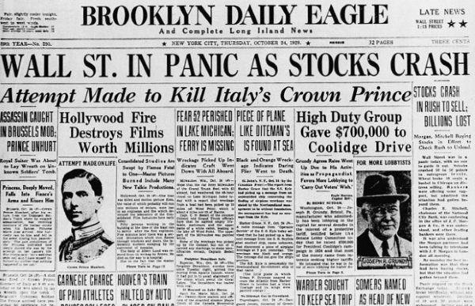

Economic downturns and financial collapses are significant events in the financial landscape, each carrying distinct definitions and implications. An economic downturn refers to a period characterized by reduced economic activity, often marked by a decline in GDP, employment, and other macroeconomic indicators. These downturns can be cyclical and may result from various factors such as decreased consumer spending, fiscal tightening, or global economic conditions. In contrast, a financial collapse is a more severe and rapid breakdown of financial markets and institutions, often precipitating a deeper economic crisis. It involves massive financial instability, as seen during bank runs, stock market crashes, and failures of major financial entities.

The 1929 stock market crash, a historical hallmark of financial collapse, is a prime example of such economic upheaval. Occurring over a few days in October, the crash wiped out substantial wealth and triggered the Great Depression, a global economic malaise lasting a decade. The crash was precipitated by a combination of speculative investing, excessive leverage, and underlying economic weaknesses. These events highlight the critical interplay between market structures and investor behavior, offering lessons for today’s market participants.

This article focuses on the intricate dynamics between economic downturns, financial collapses, and algorithmic trading in contemporary financial systems. Algorithmic trading, which involves using computer algorithms to execute trades at speeds and frequencies impractical for human traders, has become an integral part of modern markets. Its role in volatility and market behavior during economic stresses warrants scrutiny to understand potential risks and preventable measures.

Understanding these concepts is crucial in today's financial context, where market dynamics have become increasingly complex. The rise of technology and globalization has introduced new variables into financial markets, making past lessons and modern innovations relevant for future stability. By examining the connections between historical events like the 1929 crash and current technological advancements, we can better anticipate potential challenges and pitfalls in today's economy.

The article is structured to provide a comprehensive exploration of these themes. It will first recount the historical background of the 1929 stock market crash, setting the stage for discussing the broader concepts of economic downturns and financial collapses. Following this, an exploration of the rise of algorithmic trading will be undertaken, before analyzing the risks posed by such trading during economic downturns. Finally, the article draws comparisons between the financial environments of 1929 and today, offering insights into how a similar event might unfold in the presence of modern trading technologies and how we might avert such crises.

## Table of Contents

## Historical Background: The 1929 Stock Market Crash

The 1929 Stock Market Crash stands as one of the most significant financial disasters in modern history, proving to be a pivotal event that shaped economic policies and market regulations for the future. Understanding the timeline, causes, and effects of this crash provides essential insights into the vulnerabilities and dynamics of financial systems.

### Timeline of Events Leading to the 1929 Crash

The late 1920s were characterized by robust economic growth and extensive speculative investments in the stock market. By the summer of 1929, stock prices had reached unprecedented levels, driven by optimism about economic progress and the proliferation of credit. 
- **September 1929:** Economic indicators began to show signs of weakness, with declines in automobile sales and industrial production.
- **October 1929:** The stock market started experiencing extreme volatility. On October 24th, known as Black Thursday, the market lost 11% of its value at the opening bell, after a record volume of trading. Efforts by leading financiers to stabilize the market resulted in a temporary recovery.
- **October 28, 1929:** Known as Black Monday, saw a further market slide with the Dow Jones Industrial Average plunging by 13%.
- **October 29, 1929:** Black Tuesday resulted in a complete collapse of market prices, as panic selling wiped out large amounts of previously recorded financial gains.

### Key Factors Contributing to the Economic Collapse

Several intertwined factors contributed to the market's eventual collapse:
- **Speculative Investment:** Many investors engaged in speculation, buying stocks on margin, which created an unsustainable bubble.
- **Bank Failures:** The fragility of banks, which invested depositors' money into the stock market, contributed significantly. As stocks plummeted, banks experienced massive withdrawals.
- **Lack of Regulatory Frameworks:** There were no sufficient regulatory measures to prevent the risky trading practices that led to the bubble.
- **Economic Weaknesses:** Structural weaknesses in the economy, such as rural decline and industrial overproduction, exacerbated the situation.

### Impact on the Global Economy and the Great Depression

The 1929 crash was a catalyst for the Great Depression, a decade-long economic downturn that saw mass unemployment, deflation, and significant declines in production and trade worldwide. 
- **Global Trade and Credit:** The financial crisis led to a contraction in global trade. Nations adopted protectionist trade measures, which worsened the global economic situation.
- **Unemployment:** In the United States, the Depression reached its peak with approximately 25% unemployment, affecting millions across the globe.

### Lessons Learned from the Crash and Its Aftermath

The devastation wrought by the 1929 Crash led to several long-term changes in financial practices and government policies:
- **Financial Reforms:** In the U.S., the government implemented significant financial reforms, such as the Securities Exchange Act of 1934 and the establishment of the Securities and Exchange Commission (SEC) to regulate securities markets and protect investors.
- **Monetary Policies:** The crash influenced future monetary policy, emphasizing the need for central banking systems to stabilize economies.
- **Global Economic Cooperation:** The necessity for international cooperation to ensure economic stability and prevent protectionism was recognized.

Understanding the intricacies of the 1929 Stock Market Crash offers valuable lessons on the ramifications of speculative practices, the importance of robust financial regulations, and the global interconnectedness of economies. Its legacy continues to inform and shape contemporary economic policies and financial market management.

## Understanding Economic Downturns and Financial Collapses

Economic downturns and financial collapses are critical concepts in understanding the dynamics of financial systems. While both involve periods of economic decline, they differ in scope, severity, and impact.

### Definition and Differences

An **economic downturn** is defined as a slowdown in economic activity, typically marked by a decrease in GDP, employment, and spending. This reduction in economic output can arise from various factors such as decreased consumer confidence, reduced investment, or global supply chain disruptions. Downturns are generally temporary and may be addressed through policy interventions like fiscal stimuli or monetary easing.

A **financial collapse**, however, is a more severe and sudden breakdown of financial systems, often leading to widespread economic disturbance. It may involve the failure of one or more major financial institutions, rapid declines in asset prices, or significant [liquidity](/wiki/liquidity-risk-premium) shortages. Unlike downturns, collapses often require more extensive government intervention, including bailouts or systemic reforms.

### Common Causes of Financial Crises and Collapses

Financial crises can result from a combination of factors including:

1. **Excessive Speculation:** Speculative bubbles occur when asset prices deviate significantly from intrinsic values, often fueled by irrational investor behavior. The bursting of these bubbles often leads to collapses.

2. **Leverage and Debt:** High levels of leverage can precipitate financial instability. When assets lose value, heavily indebted entities may default, causing cascading effects across the economy.

3. **Market Inefficiencies:** Information asymmetries or regulatory failings can create environments where risks are not properly managed or understood, augmenting the likelihood of a crisis.

4. **Global Imbalances:** Disparities in trade balances or currency valuations can cause stresses in international financial relationships, potentially leading to crises.

### Consequences for Businesses, Investors, and the General Public

The consequences of financial collapses can be catastrophic:

- **Businesses** may face reduced access to capital, lower consumer demand, and increased bankruptcy rates. Small and medium enterprises, in particular, may struggle to survive.

- **Investors** might experience substantial losses in asset values, leading to reduced net worth, lower retirement savings, and increased risk aversion.

- The **general public** can suffer from increased unemployment rates, decreased disposable income, loss of homes and savings, and increased economic inequality.

### Historical Examples

Before 1929, there were several notable economic downturns and crises:

- **The Panic of 1873**: Triggered by the collapse of railroad overbuilding and resulting in numerous bank failures, this crisis led to a severe depression in Europe and North America.

- **The 1907 Bankers' Panic**: A liquidity crisis that nearly crippled the U.S. financial system, it was primarily resolved through interventions by private financiers, most notably J.P. Morgan.

- **The South Sea Bubble (1720)**: A classic example of an asset bubble, where speculative investments in the South Sea Company led to widespread ruin when the bubble burst.

Understanding these historical precedents is essential for anticipating potential weaknesses in the current financial framework and avoiding similar pitfalls. As global markets become increasingly interconnected, recognizing the signals of impending downturns and collapses becomes paramount in safeguarding economic stability.

## The Rise of Algorithmic Trading in Modern Markets

Algorithmic trading refers to the use of computer algorithms to automate the process of buying and selling securities in financial markets. These algorithms utilize predefined criteria to execute trades at optimal prices, speeds, and volumes. Algorithmic trading has transformed financial markets by enabling traders to process vast amounts of data and make decisions within milliseconds. According to the Bank for International Settlements, it accounts for a substantial portion of trading [volume](/wiki/volume-trading-strategy), especially in equity and foreign exchange markets [1].

### Advantages and Disadvantages

Algorithmic trading offers several advantages. One significant benefit is speed. Algorithms can execute trades much faster than human traders, enabling them to capitalize on brief windows of opportunity that arise in the market. Additionally, they can manage multiple assets across diverse markets simultaneously, reducing the time and labor associated with manual trading. Algorithms also minimize human error and emotion in decision-making, which can often lead to more systematic and rational trading strategies.

However, there are disadvantages. Algorithms, depending on their complexity, can be susceptible to flaws in design, which may lead to unintended trading behaviors. Another concern is the potential for increased market [volatility](/wiki/volatility-trading-strategies). For instance, high-frequency trading algorithms can exacerbate price swings by amplifying short-term trends. This has raised concerns over fairness and market stability, prompting regulators to consider implementing safeguards [2].

### Comparison to Traditional Trading Methods

Traditional trading methods typically rely on human judgment, intuition, and manual order execution. Traders perform analysis based on fundamental and technical data before making decisions. While this approach allows for discretionary adjustments based on market sentiment and unforeseen events, it is slower and more labor-intensive than algorithmic strategies.

In contrast, [algorithmic trading](/wiki/algorithmic-trading) relies on mathematical models and computational algorithms to make trading decisions. This method allows for [backtesting](/wiki/backtesting) strategies using historical data to optimize performance, a process that is cumbersome in traditional trading. Moreover, traditional trading may be limited by human cognitive biases, whereas algorithmic decisions are guided by structured data and pre-defined rules.

### Historical Development

The development of algorithmic trading can be traced back to the 1970s with the introduction of computer systems in financial markets. The New York Stock Exchange introduced the “DOT” (Designated Order Turnaround) system in 1976 to route orders electronically [3]. The 1980s and 1990s saw significant advances in computing power and data availability, paving the way for the more sophisticated algorithms that emerged in the early 2000s. These included high-frequency trading and complex quantitative strategies, as seen in the rise of hedge funds.

As technology continues to evolve, algorithmic trading has become increasingly advanced, incorporating [machine learning](/wiki/machine-learning) and [artificial intelligence](/wiki/ai-artificial-intelligence) to predict market movements. It plays a critical role in today's trading ecosystem, continually shaping the landscape of modern financial markets.

**References:**
1. Bank for International Settlements: Triennial Central Bank Survey, Foreign Exchange and Over-the-Counter (OTC) derivatives markets in 2019.
2. U.S. Securities and Exchange Commission, Algorithmic Trading: Pros and Cons of Automating Trading Strategies.
3. New York Stock Exchange history resources.

It should be noted that while algorithmic trading offers significant efficiencies, it also requires robust risk management frameworks to mitigate potential market disruptions. Exploring historical precedent alongside modern technological implementations can provide a comprehensive understanding of its evolving impact on financial systems.

## Risks of Algorithmic Trading in Economic Downturns

Algorithmic trading has become an integral component of modern financial markets, leveraging complex algorithms to execute trades with speed and precision that surpass human capabilities. However, its role during economic downturns presents notable risks, primarily related to increased market volatility.

The potential for exacerbating market volatility stems from the rapid execution of a large volume of trades based on pre-set algorithms, often without human intervention. During times of economic stress, this can lead to so-called "flash crashes," where markets plummet and recover quickly. One notable example occurred on May 6, 2010, known as the Flash Crash, when the Dow Jones Industrial Average dropped about 1,000 points in mere minutes before recovering the losses within the day. Algorithmic trading, particularly high-frequency trading ([HFT](/wiki/high-frequency-trading-strategies)), was identified as a key contributor to this volatility.

Moreover, algorithmic systems can fail under market stress, as seen during the 2012 Facebook IPO. Technical glitches in the algorithms used by NASDAQ failed to process trade orders correctly, leading to significant losses and lawsuits.

Regulatory challenges further complicate the landscape. The speed and complexity of algorithmic trades pose significant difficulties for regulators attempting to monitor and control market activities effectively. Existing frameworks, like the U.S. Securities and Exchange Commission's (SEC) rule 15c3-5, aimed at risk management and oversight, often struggle to keep pace with evolving technological capabilities. This leads to gaps in regulation that can be exploited, inadvertently increasing systemic risk during market downturns.

Mitigating the risks associated with algorithmic trading requires a multifaceted approach. Regulators and market participants must work together to establish more robust frameworks that include circuit breakers, which temporarily halt trading during precipitous declines to curb panic-driven decisions. Enhanced transparency measures, mandating detailed disclosures of algorithmic strategies, can also help identify potential points of failure before they materialize in crisis situations.

Additionally, implementing advanced monitoring systems using artificial intelligence (AI) could preemptively detect anomalous trading patterns indicative of potential flash crashes. By integrating sophisticated risk management protocols directly into trading algorithms, firms can dynamically adjust their strategies in response to real-time market conditions, thereby reducing the likelihood of contributing to runaway volatility during downturns.

In summary, while algorithmic trading offers efficiency gains, it also presents significant risks during economic downturns. Addressing these requires concerted efforts to enhance regulatory frameworks, improve transparency, and leverage AI for proactive market monitoring, thereby balancing technological advancement with financial stability.

## Analyzing the Interconnection: 1929 vs. Today

The financial environment of 1929 was characterized by minimal regulatory oversight, rampant speculation, and a lack of investor protections. The stock market boom of the 1920s was fueled by margin buying, where investors could purchase stocks by paying only a fraction of the price, borrowing the remainder. This created a speculative bubble that eventually burst in October 1929, leading to a cascade of bank failures and significant losses to investors, precipitating the Great Depression.

In contrast, today's financial environment is marked by high-speed, technology-driven markets, with algorithmic trading (AT) playing a significant role. Algorithmic trading involves the use of complex algorithms to execute trades at speeds and volumes far beyond the capability of human traders. While this technology has increased market efficiency and liquidity, it has also introduced new risks, particularly in the context of economic downturns.

One possible scenario where an event like the 1929 crash could unfold today involves the acceleration of market declines due to algorithmic trading. Algorithms designed to sell off assets in falling markets can contribute to a downward spiral, leading to a flash crash. For example, the Flash Crash of May 6, 2010, saw the Dow Jones Industrial Average plummet nearly 1,000 points within minutes, partially due to automated trading systems.

To mitigate such risks, several preventive measures can be adopted, leveraging today's technological advancements. One key measure is the implementation of circuit breakers, which temporarily halt trading to prevent panic selling. These provide a cooling-off period, allowing traders and algorithms to reassess market conditions.

Additionally, improving the transparency and regulation of algorithmic trading is essential. Regulators could require enhanced disclosure of algorithms used in trading, enabling better surveillance and understanding of their potential impact on market stability.

Finally, fostering robust risk management systems within trading firms is crucial. By employing machine learning techniques, firms can develop predictive models to anticipate market shifts and adjust trading strategies accordingly, thus minimizing the risk of exacerbating market downturns.

By comparing the circumstances surrounding the 1929 crash to today's technologically advanced financial systems, it becomes clear that while technology presents new challenges, it also offers solutions that can enhance market resilience against future financial crises.

## Conclusion

The analysis of economic downturns and financial collapses, particularly through the lens of the 1929 stock market crash, reveals the critical importance of historical awareness in the ongoing efforts to prevent future financial catastrophes. Learning from past events, such as the Great Depression, highlights how deeply interconnected global economies are vulnerable to seismic shifts when financial systems falter. By examining the timeline and factors leading to the 1929 collapse, we gain insights into the potential consequences that poor risk management and speculative excess can have on the global economy.

The rise of algorithmic trading introduces a modern dimension to these historical lessons. While algorithmic systems offer unprecedented speed and efficiency in executing trades, they also introduce new risks, particularly during periods of economic stress. Historical instances where algorithmic trading exacerbated market volatility serve as a cautionary tale, emphasizing the need for robust regulatory frameworks and improved algorithmic strategies to safeguard market stability.

Balancing technological advancement with financial stability requires thoughtful consideration. As technology continues to evolve, financial operators must ensure that safeguards are in place to mitigate the adverse effects that sophisticated trading mechanisms can potentially unleash. This balance is crucial for fostering a resilient economic environment capable of withstanding the shocks of future downturns.

Encouraging further research into economic safety mechanisms is vital for developing an adaptive and secure financial system. By prioritizing education and continuous analysis of both historical data and modern trading technologies, stakeholders can better prepare to anticipate and navigate the complexities of future economic crises. The ongoing quest to blend historical insights with cutting-edge innovations will be fundamental in crafting strategies that promote enduring economic stability.

## References & Further Reading

[1]: Galbraith, J. K. (1955). ["The Great Crash, 1929."](https://en.wikipedia.org/wiki/The_Great_Crash,_1929) Houghton Mifflin.

[2]: Malkiel, B. G. (2003). ["A Random Walk Down Wall Street."](https://yourknowledgedigest.org/wp-content/uploads/2020/04/a-random-walk-down-wall-street.pdf) W.W. Norton & Company.

[3]: Friedman, M., & Schwartz, A. J. (1963). ["A Monetary History of the United States, 1867-1960."](https://www.jstor.org/stable/j.ctt7s1vp) Princeton University Press.

[4]: Patterson, S. (2012). ["Dark Pools: The Rise of the Machine Traders and the Rigging of the U.S. Stock Market."](https://www.amazon.com/Dark-Pools-Machine-Traders-Rigging/dp/0307887189) Crown Business.

[5]: Lewis, M. (2015). ["Flash Boys: A Wall Street Revolt."](https://en.wikipedia.org/wiki/Flash_Boys) W. W. Norton & Company.

[6]: Hauptfleisch, A., Mallick, S. K., & Reid, M. (2021). ["Algorithmic Trading: Patterns, Predictions, and Best Practices."](https://www.researchgate.net/publication/378287610_Machine_learning_in_financial_markets_A_critical_review_of_algorithmic_trading_and_risk_management) Springer.

[7]: U.S. Securities and Exchange Commission. ["Potential Risks in Algorithmic Trading."](https://financefeeds.com/24-exchange-secures-sec-approval-for-23-hour-us-securities-trading/) 

[8]: Carlson, M. (2005). ["Causes of Bank Distress During the Great Depression."](https://www.sciencedirect.com/science/article/pii/S0014498307000034) Federal Reserve Board of Governors.

[9]: Mishkin, F. S. (2003). ["The Economics of Money, Banking, and Financial Markets."](https://www.pearsonhighered.com/assets/preface/0/1/3/4/0134855388.pdf) Pearson.