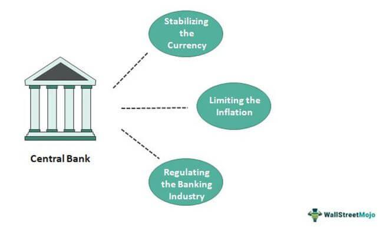

The Indian financial markets are currently navigating a period of significant upheaval, driven by persistent rumors concerning the potential resignation of senior officials from the Reserve Bank of India (RBI). These speculations have not only caused immediate ripples across financial markets but have also spotlighted the intricate dynamics between central bank governance and the emerging financial technologies reshaping the sector, particularly algorithmic trading. Understanding these implications is vital as algorithmic trading, or "algo trading," increasingly becomes a central element of India's financial ecosystem.

The RBI, as India's central bank, plays a crucial role in maintaining financial stability and setting monetary policy. The departure of key officials could lead to shifts in policy direction, affecting everything from inflation control measures to foreign exchange management. Such transitions carry the potential for increased volatility in the markets, particularly when investor confidence in central leadership is shaken. History has shown that markets can react sharply to uncertainties related to central bank leadership, with stock indices and currency valuations often bearing the brunt of such changes.



Simultaneously, the rise of algorithmic trading has introduced a new dimension to market operations. This technology-driven approach allows for the execution of complex trading strategies at speeds impossible for human traders, thereby significantly influencing market liquidity and volatility. In this context, the regulatory environment governed by institutions like the RBI becomes even more crucial. The interplay between central bank decisions and technological advancements in trading can have profound effects on the financial markets' structure and functioning.

This article aims to dissect these complex interactions between central bank politics and algorithmic trading's evolving landscape in India. By exploring these connections, we can better understand the challenges and opportunities facing India's financial markets and how these elements could shape future economic resilience and growth.

## Table of Contents

## Background of the Central Bank Resignation

In recent years, tensions between the Indian government and the Reserve Bank of India (RBI) have escalated, largely due to differing views on the control and direction of monetary policies. A significant point of contention has been the government's demand for increased influence over the RBI's functioning, especially concerning decisions that directly impact the country’s economic landscape. These tensions came to a head during Urjit Patel's tenure as the Governor of the RBI, sparking speculation about his potential resignation. The potential of Patel stepping down was a development that sent shockwaves through financial markets, reflecting the critical role of stable leadership within central banking institutions.

Urjit Patel's possible resignation was primarily linked to the increasing pressure from the government for the RBI to adopt more lenient monetary policies that could stimulate short-term economic growth, often at the expense of long-term stability. This pressure was evident in demands for lower interest rates and increased lending to micro, small, and medium enterprises (MSMEs). Additionally, the government sought greater access to the RBI’s reserves to fund public expenditure, a move that traditionally falls outside the purview of central banking operations.

The speculation surrounding Patel's resignation underscored the importance of central bank independence in maintaining market stability. The uncertainty led to noticeable [volatility](/wiki/volatility-trading-strategies) within Indian financial markets, with key stock indices like the NIFTY 50 and SENSEX experiencing significant fluctuations. These variations were a direct response from investors who feared that greater governmental control over the RBI might destabilize the macroeconomic environment, adversely affecting investments and economic growth.

This period highlighted the broader implications of a potential shift in central bank governance. Confidence in the RBI, as an independent and prudent institution, plays a crucial role in safeguarding the Indian economy's stability. Leadership changes at the top can trigger concerns about the central bank's commitment to its core objectives, such as controlling inflation and managing currency stability. Consequently, the speculation regarding Urjit Patel’s potential resignation reflected the broader unease regarding the balance of power between the Indian government and the central bank. Such developments underscored how leadership changes, or even the mere speculation thereof, have the potential to influence not just domestic but also international perceptions of India's economic stability.

## Impact of Central Bank Resignation on Financial Markets

The prospect of a senior official's resignation from a central bank, such as the Reserve Bank of India (RBI), often incites a significant response in financial markets. This is primarily due to the role central banks play in shaping monetary policy and maintaining economic stability. For India, even the speculation regarding the resignation of an RBI governor can induce volatility, as reflected in the fluctuations of major stock indices like the NIFTY 50 and SENSEX.

Market volatility typically arises because investors interpret such events as signals of potential policy shifts or institutional instability. In India's case, the mere rumor of a governor's departure may lead investors to anticipate changes in monetary policy, interest rates, or currency management. Consequently, this uncertainty prompts adjustments in portfolios, leading to noticeable swings in stock indices. Empirical observations demonstrate that during periods of rumored or actual central bank instability, indices like the NIFTY 50 and SENSEX can experience higher-than-usual volatility.

A potential resignation also has a substantial psychological impact on investor confidence. Market participants might view such instability as an indicator of deeper systemic issues, leading to a cascading effect on various asset classes. For instance, an erosion of confidence could drive a sell-off in stocks, leading investors to seek refuge in perceived safer investments, thus affecting bond yields and commodity prices. 

Moreover, foreign investors closely monitor the stability of central banks in emerging markets, as these institutions are critical for economic predictability and investment security. Any hint of upheaval can result in shifts in foreign capital flows, impacting currency valuations and leading to adjustments in foreign investment portfolios. 

Domestic investments are similarly affected, as local investors might reassess their investments in light of perceived economic and policy risks associated with central bank changes. Such uncertainty can lead to a reduction in market [liquidity](/wiki/liquidity-risk-premium) as both domestic and foreign investors may adopt a 'wait-and-see' approach, further exacerbating market instability.

In summary, the speculation or actual resignation of a senior official from the RBI introduces considerable uncertainty, affecting both domestic and international investor sentiment. The resulting market reactions underscore the integral role central banks play in not just implementing monetary policy, but also in underpinning market stability and investor confidence. Keeping abreast of and understanding these dynamics is crucial for market participants and policymakers, ensuring they can navigate and mitigate the risks associated with such disruptions.

## Algorithmic Trading in India: An Overview

Algorithmic trading, often referred to as algo trading, has become a pivotal aspect of the Indian stock market landscape, driving significant portions of trading volumes on exchanges. At its core, this method employs computer algorithms to execute trading strategies at speeds and frequencies that are beyond the capabilities of human traders. 

Historically, the Indian stock market has transformed with the advent of technology, where the initial stages involved simple electronic trading. However, the introduction and integration of more sophisticated [algorithmic trading](/wiki/algorithmic-trading) platforms have marked a distinct shift towards automated and data-driven investment strategies. The precise execution and swift decision-making inherent in algorithmic trading have allowed traders to exploit small price discrepancies, thereby enhancing market liquidity and efficiency.

From a regulatory perspective, the Securities and Exchange Board of India (SEBI) plays a critical role in overseeing and managing the growth of algo trading. SEBI has instituted a regulatory framework aimed at minimizing the risks associated with high-frequency trading and ensuring a level playing field for all market participants. Regulations focus on ensuring adequate disclosures, managing systemic risks, and protecting investors from potential market abuses linked to automated trading systems.

Innovations in algorithmic trading in India are also noteworthy. Technological advancements have resulted in the development of [machine learning](/wiki/machine-learning) models and predictive analytics tools that further enhance trading strategies. These tools analyze vast datasets and apply complex mathematical algorithms to predict market trends, optimize portfolios, and execute trades with minimal human intervention. Here is a simple example of how a basic trading algorithm can be conceptualized using Python:

```python
import pandas as pd

def moving_average_strategy(prices, short_window, long_window):
    signals = pd.DataFrame(index=prices.index)
    signals['signal'] = 0.0
    signals['short_mavg'] = prices['price'].rolling(window=short_window, min_periods=1, center=False).mean()
    signals['long_mavg'] = prices['price'].rolling(window=long_window, min_periods=1, center=False).mean()

    signals['signal'][short_window:] = \
        np.where(signals['short_mavg'][short_window:] > signals['long_mavg'][short_window:], 1.0, 0.0)   
    signals['positions'] = signals['signal'].diff()
    return signals

# Sample prices data
prices = pd.DataFrame({'price': [120, 121, 123, 119, 115, 118, 125, 129, 128]})
signals = moving_average_strategy(prices, short_window=2, long_window=4)
print(signals)
```

This code calculates short-term and long-term moving averages of stock prices to generate buy/sell signals, an example of a fundamental trading strategy.

In conclusion, algorithmic trading is reshaping India's financial markets by harnessing advances in [artificial intelligence](/wiki/ai-artificial-intelligence) and machine learning. The resultant landscape offers both opportunities and challenges, necessitating continuous innovation, strategic regulation, and an understanding of the dynamic interplay between technology and market forces. As the sector evolves, it promises to deliver enhanced market efficiencies and robust investment strategies tailored for the modern era.

## Regulatory Challenges and Opportunities in Algo Trading

The Securities and Exchange Board of India (SEBI) plays a crucial role in shaping the regulatory framework for algorithmic trading in India. As algorithmic trading grows in prominence, accounting for a substantial portion of the total trading [volume](/wiki/volume-trading-strategy) on Indian exchanges, SEBI has been proactive in implementing regulations to mitigate associated risks and ensure fair trading practices.

SEBI's approach to regulating algorithmic trading involves several measures aimed at increasing transparency, reducing market manipulation, and ensuring equitable access to trading facilities. One significant regulatory intervention is the requirement for brokers to label orders generated by algorithms. This measure helps in identifying and monitoring the volume and types of automated trades, thus preventing market abuse and manipulation.

Another critical area addressed by SEBI is latency [arbitrage](/wiki/arbitrage), which can occur due to differential access speeds among market participants. To mitigate this, SEBI has proposed the introduction of latency equalization measures, such as time-synchronization standards across trading platforms and the introduction of randomization in order execution. These measures aim to create a level playing field for all traders, thereby reducing unfair advantages gained by some through faster access to market data.

Risk management in algorithmic trading is another focal point of SEBI's regulations. The board mandates robust risk management systems for any entities engaged in algotrading. These systems must include pre-trade risk controls, such as margin checks and order quantity limits, to prevent erroneous trades that could destabilize the markets.

In addition to risk management, SEBI underscores the importance of testing and deploying algorithms in a controlled environment. Entities involved in algo trading are required to test their algorithms thoroughly in test markets or sandboxes provided by exchanges. This pre-implementation testing ensures the algorithms function as intended and comply with regulatory standards before they go live in actual market conditions.

Despite these stringent regulations, SEBI remains cognizant of the need to foster innovation within the financial markets. The regulatory framework thus encourages the use of "Regulatory Sandboxes," allowing fintech companies and trading firms to experiment with novel trading strategies and technologies under the watchful eye of the regulators. Such an approach helps in promoting technological advancements while safeguarding market integrity and stability.

The impact of SEBI's regulations on traders is multifaceted. While regulatory compliance may increase operational overheads for trading firms, these measures are essential in maintaining market trust and preventing systemic risks. Over the long term, a well-regulated environment can enhance investor confidence, attract foreign investment, and potentially lead to innovations that benefit the broader market ecosystem.

SEBI's regulatory framework offers both challenges and opportunities for the algo trading sector in India. While traders must navigate a complex regulatory landscape, the opportunity to innovate within a structured framework can lead to a more robust and competitive market. As India continues to evolve as a financial hub, balancing stringent regulation with technological progress will be critical to supporting the sustainable growth of algorithmic trading.

## Future Prospects: Balancing Governance and Technological Innovation

India's financial market, in the midst of political and technological dynamism, stands at a pivotal crossroads. The integration of algorithmic trading and fintech innovations forms the backbone of this transformation, offering an optimistic yet challenging horizon for growth. Strong governance is essential to harness the potential of these advancements while safeguarding market integrity.

The critical task for policymakers is to develop a framework that provides a robust regulatory environment, curbing risks without stifling innovation. The Reserve Bank of India (RBI) and the Securities and Exchange Board of India (SEBI) play a crucial role in this process. As they craft regulations to address these complexities, a nuanced understanding of technological trends is paramount. Algorithmic trading relies heavily on computer algorithms to execute trades at speeds and frequencies beyond human capability, requiring precise regulations for risk management and market fairness.

Moreover, the financial market's resilience is contingent on its adaptability to technological disruptions. Embracing artificial intelligence and machine learning in trading strategies can enhance efficiency and accuracy. However, this technological embrace necessitates an adept regulatory oversight to mitigate potential algorithmic biases and systemic risks.

Collaboration between government bodies, technology firms, and financial institutions will facilitate a balanced approach to innovation and governance. Initiatives such as sandboxes, where fintech innovations are tested under regulatory supervision, could emerge as key enablers of responsible innovation.

Furthermore, public-private partnerships can drive advanced research and development, fostering a more robust and competitive market landscape. Investments in infrastructure, particularly in cybersecurity, are vital to bolster confidence among domestic and international investors.

As India navigates these challenges, learning from global counterparts’ experiences can provide valuable insights. Countries that successfully balance governance and innovation often exhibit strong institutional frameworks and agile policy adaptations—an approach India could emulate to ensure sustained financial market growth.

In conclusion, India's financial market stands on the threshold of transformative growth. By striking a strategic balance between governance and innovation, India can ensure its financial market's resilience, achieving sustainable economic growth and stability.

## Conclusion

The dynamics between central bank governance and financial markets are complex and deeply interwoven. Central banks play a vital role in ensuring economic stability, with their policies and leadership decisions having far-reaching effects on financial systems. Leadership changes at central banks, particularly resignations or speculations thereof, can significantly impact market sentiments and trigger volatility across various asset classes. This reaction is often due to the uncertainty such changes introduce, which challenges investor confidence and economic predictability. 

In parallel, the rapid evolution of algorithmic trading introduces both opportunities and challenges. Algo trading, driven by advanced computational methods and large datasets, has transformed the financial landscape by increasing trading efficiency and liquidity. However, it also introduces regulatory challenges, necessitating policies that ensure market fairness and integrity without stifling technological innovation. 

For investors and policymakers, staying informed about developments in central bank leadership and algorithmic trading is essential. These factors are crucial for interpreting market movements and making informed decisions in an increasingly complex financial ecosystem. 

The way forward for Indian financial markets demands a nuanced strategy that balances regulatory prudence with technological evolution. Striking this balance is pivotal for fostering a resilient and adaptive financial system, capable of leveraging technology while protecting market participants. Achieving this requires collaborative efforts among government bodies, regulatory authorities, and industry stakeholders to craft policies that support innovation while safeguarding economic stability.

## References & Further Reading

[1]: Rajan, R. G. (2014). ["The changing paradigms of central banking."](https://www.jstor.org/stable/3094536) Speech at the Reserve Bank of India.

[2]: ["Algorithmic Trading and DMA: An Introduction to Direct Access Trading Strategies"](https://www.amazon.com/Algorithmic-Trading-DMA-introduction-strategies/dp/0956399207) by Barry Johnson

[3]: ["Higher Order Backward Differentiation Formulae for Machine Learning Applications"](https://dengking.github.io/machine-learning/Theory/Deep-learning/Book-deep-learning/Part-II-Deep-Networks-Modern-Practices/6-Deep-Feedforward-Networks/6.5-Back-Propagation-and-Other-Differentiation-algorithms/6.5-Back-Propagation-and-Other-Differentiation/) by Tianqi Chen et al. 

[4]: Monperrus, M., & Lin, J. (2018). ["The Source Code of Algorithmic Trading Systems."](https://dl.acm.org/doi/abs/10.1145/3510003.3510222) Stanford University

[5]: Subbarao, D. (2011). ["Central Bank Governance Issues."](https://www.bis.org/review/r110510b.pdf) Speech at the Conference of Indian Economic Association.