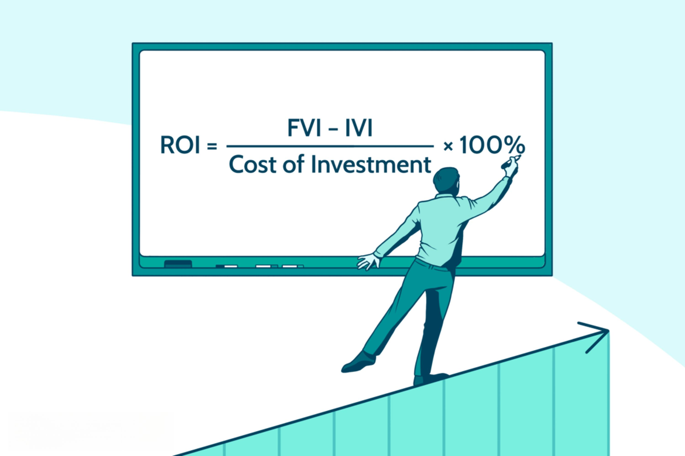

In today's dynamic investment landscape, gold remains a focal point for investors seeking stability and diversification. With its long-standing reputation as a safe haven asset, gold continues to capture the attention of those wanting to protect and enhance their wealth. This article comprehensively examines the potential returns of investing in gold over a 20-year period and explores how algorithmic trading significantly impacts investment returns.

The rising interest in automated trading systems has reshaped traditional investment paradigms, emphasizing the need to understand gold's role in long-term strategies. As a diverse range of investors—from individual traders to large financial institutions—increasingly incorporate technology into their portfolios, the ability to make data-driven decisions becomes paramount.



This discussion will elucidate the complexities of gold trading, highlighting historical return patterns and projecting future prospects for algorithm integration. By analyzing how algorithmic strategies can optimize trading outcomes, we provide a blueprint for both novice and experienced traders to consider when entering the gold market.

By merging insights into gold's historical and current performance with a forward-looking perspective on algorithmic trading, this article aims to serve as a vital resource for investors seeking to explore or enhance their approach to gold investing. This ensures they are well-equipped to navigate the ever-evolving financial landscape effectively.

## Table of Contents

## Understanding Gold as an Investment

Gold has been esteemed as a safe haven during periods of economic turmoil, largely due to its intrinsic value and historical resilience. Its appeal lies in its capacity to preserve value amidst inflation and currency devaluation, thus serving as a diversified financial asset in investment portfolios.

**Physical Gold Options**

Physical gold investments are among the most traditional forms of investing in the precious metal. This includes gold bullion, coins, and jewelry. Gold bullion, which is valued based on its weight and purity, is typically available in the form of bars or ingots. Popular gold coins, such as the American Gold Eagle and the Canadian Maple Leaf, are other widely recognized options for investors. An advantage of physical gold is its tangible ownership, a feature that reassures investors who wish to hold a real, valuable asset.

However, physical gold comes with certain drawbacks, including storage and insurance costs. Investors must ensure secure storage facilities, whether through a safety deposit box or a private vault, to protect their assets. The costs associated with these storage solutions can be significant and should be considered when investing in physical gold.

**Gold-backed Financial Instruments**

For those seeking exposure to gold without the complexities of physical ownership, various financial instruments offer an attractive alternative. Gold Exchange-Traded Funds (ETFs) are among the most popular. These funds track the price of gold and trade like stocks on major exchanges, thus providing [liquidity](/wiki/liquidity-risk-premium) and ease of trading. For instance, the SPDR Gold Shares (GLD) is one of the largest gold ETFs and gives investors a cost-effective way to gain exposure to gold.

Gold futures and options present another avenue for investment, allowing traders to speculate on future price changes or hedge existing positions. While these instruments can offer substantial returns, they come with increased risk and complexity, requiring a thorough understanding of the derivatives market.

**Influence of Economic Indicators on Gold Prices**

Gold prices are affected by a plethora of economic indicators. Inflation rates, currency valuations, and interest rates profoundly influence gold's market performance. Generally, when inflation rises, the appeal of gold increases as it tends to hold its value better than fiat currencies. Similarly, currency devaluation, particularly of the U.S. dollar, typically results in higher gold prices since gold is dollar-denominated.

Central bank policies and geopolitical events also have significant impacts. For instance, during times of geopolitical tension, investors may flock to gold as a precautionary measure, driving up its price. Understanding these multifaceted variables is crucial for assessing gold's role in an investment strategy.

In conclusion, gold's enduring position as a hedge against inflation and market [volatility](/wiki/volatility-trading-strategies) renders it a vital component of diversified investment portfolios. By exploring both physical gold options and gold-backed securities, along with acknowledging the influence of economic indicators, investors can make informed decisions regarding gold investments. This structured approach enables them to capitalize on gold's unique characteristics as a resilient financial asset.

## Gold's Historical Performance and 20-Year Investment Perspective

Over the past two decades, gold prices have experienced significant fluctuations due to various economic forces and global events. Analyzing historical data from 2000 to 2020 illustrates how these factors have influenced gold as a long-term investment. In January 2000, the price of gold was approximately $282 per ounce. By the end of 2020, it had surged to around $1,887 per ounce, marking substantial growth over the period. An initial investment of $200 in gold at the start of the millennium could have thus increased significantly, highlighting the metal's potential as a stable store of value over the long term.

The catalysts for such price movements often include economic instability, geopolitical tensions, currency fluctuations, and changes in inflation rates. For instance, during the 2008 financial crisis, investors flocked to gold as a safe haven, driving prices upward. Similarly, gold saw a price surge during the COVID-19 pandemic due to economic uncertainties and market volatilities. These examples underscore gold's resilience and capacity to preserve wealth during turbulent times.

A comparative analysis with other investment options like stocks and bonds further emphasizes gold's unique role. While equities, represented by indices such as the S&P 500, have also yielded considerable returns, they are typically associated with higher volatility and market risk. For example, the S&P 500 rose from about 1,429 points at the end of 2000 to approximately 3,756 by the end of 2020. However, this growth was punctuated by significant downturns during market crashes, demonstrating the greater risk compared to gold.

Bonds, particularly U.S. Treasury bonds, offer a safer alternative to equities with relatively stable but lower returns. Bond yields during this period declined, reflecting [interest rate](/wiki/interest-rate-trading-strategies) cuts and monetary policy easing, which inversely benefited gold prices. Gold's non-correlation with bonds enhances its appeal as a diversifier in investment portfolios.

To summarize, gold's performance over the last 20 years underscores its suitability as a long-term investment, capable of navigating financial fluctuations and offering a buffer against economic uncertainties. Investors considering gold for diversification are drawn to its historical stability and lower correlation with traditional securities, making it a viable asset for risk management.

## Algorithmic Trading and its Impact on Investment Returns

Algorithmic trading has significantly advanced financial markets by allowing investors to execute transactions with greater precision and speed. The fundamental component behind this innovation is the automation of trading strategies, which eliminates human error and emotional biases from the trading process. In the gold market, this has opened the door to exploiting micro-opportunities—slight price discrepancies or [arbitrage](/wiki/arbitrage) situations—that manual trading might overlook.

### Advantages of Algorithmic Trading

1. **Speed and Efficiency**: Algorithms can monitor markets 24/7 and execute trades in milliseconds, far outpacing human capabilities. This rapid execution is crucial in volatile markets like gold, where price movements can be swift and unpredictable.

2. **Precision**: Algorithms allow for highly precise market analysis and order execution, minimizing slippage. They use sophisticated mathematical models to assess the optimum points for buying and selling, taking into account vast amounts of market data.

3. **Cost Reduction**: By automating the trading process, firms can reduce transaction costs associated with manual trading. This can include lower brokerage fees and reduced slippage costs due to faster execution times.

4. **Data Handling and Analysis**: Algorithmic trading systems can analyze extensive datasets to identify patterns and trends. Machine learning and artificial intelligence are often employed to refine these models, enhancing the decision-making process.

### Enhancing Returns with Algorithmic Trading

The primary goal of [algorithmic trading](/wiki/algorithmic-trading) is to enhance investment returns by optimizing trade execution. Strategies employed in algorithmic trading include market-making, [statistical arbitrage](/wiki/statistical-arbitrage), and [trend following](/wiki/trend-following). These strategies leverage quantitative models and [backtesting](/wiki/backtesting) against historical data to predict future market behavior. The returns from such trading are often dependent on model accuracy and data quality.

Consider a simple algorithmic strategy, a moving average crossover, where the strategy buys when a short-term moving average crosses above a long-term moving average and sells in the inverse situation. The Python implementation below showcases a basic structure of this strategy:

```python
import pandas as pd
import numpy as np

def moving_average_crossover_strategy(data, short_window=40, long_window=100):
    signals = pd.DataFrame(index=data.index)
    signals['price'] = data['price']
    signals['short_mavg'] = data['price'].rolling(window=short_window, min_periods=1, center=False).mean()
    signals['long_mavg'] = data['price'].rolling(window=long_window, min_periods=1, center=False).mean()

    signals['signal'] = 0.0
    signals['signal'][short_window:] = np.where(
        signals['short_mavg'][short_window:] > signals['long_mavg'][short_window:], 1.0, 0.0
    )

    signals['positions'] = signals['signal'].diff()

    return signals
```

### Risks Associated with Algorithmic Trading

Despite its advantages, algorithmic trading is not without risks. A significant potential drawback is model risk, where the underlying assumptions of the model may not hold in all market conditions. Additionally, overfitting during backtesting can lead to false confidence in a strategy's effectiveness when applied in real-world scenarios.

1. **Market Volatility**: In highly volatile conditions, algorithms might execute trades based on fleeting price movements, leading to potential losses.

2. **Technology Failures**: Technical glitches, server failures, or data feed issues can cause algorithms to malfunction, resulting in substantial financial losses.

3. **Regulatory Risks**: Compliance with regulatory frameworks is critical as algorithmic trading is subject to scrutiny from financial regulators. Non-compliance can lead to legal issues and financial penalties.

In conclusion, while algorithmic trading presents lucrative opportunities for enhancing investment returns, particularly in volatile markets such as gold, it requires robust risk management strategies to mitigate the inherent risks. Investors must continuously monitor the performance of trading algorithms and adapt to changing market conditions to optimize their investment outcomes.

## Comparing Gold with Other Asset Classes

Gold has long been esteemed for its unique capability to offer value stability amidst fluctuating economic cycles. Unlike other asset classes, gold does not generate income through dividends or rents, yet its intrinsic value and historical context position it distinctively in a diversified portfolio. 

To compare gold with other major asset classes—stocks, real estate, and emerging markets—it is essential to examine historical performance and the conditions under which each class has flourished or faltered. Historically, stocks have been lauded for their growth potential, significantly outperforming gold during bull markets. However, during times of economic uncertainty or high inflation, such as the financial crisis of 2008 and the stagflation of the 1970s, gold often emerged as a superior asset, maintaining or increasing in value while stocks plummeted.

Real estate, another asset class, offers tangible income through rents and has generally appreciated over time. Yet, its market is also susceptible to interest rate fluctuations, regulatory changes, and economic downturns, as evident during the 2007-2009 housing market crash. In contrast, gold, being a global commodity, retains its liquidity and has historically served as an inflation hedge, offering a safety net against currency devaluation which real estate might not always provide.

Emerging markets present a high-risk, high-reward investment avenue. During periods of robust global economic growth, these markets can outperform more stable asset classes, including gold. However, they [carry](/wiki/carry-trading) heightened risks due to political instability, currency volatility, and less mature financial systems, which can lead to significant drawdowns. Gold's performance, on the other hand, is less volatile in such situations, offering a defensive layer during emerging market downturns.

To illustrate these comparisons numerically, consider the annualized returns over the past 20 years: while the global stock market index (as represented by indices such as the MSCI World Index) has averaged around 6-7% annual returns, gold has returned approximately 9% in specific periods of economic stress. Real estate, captured through indices like the S&P Global REIT, has shown varied performance based on geographic location and economic conditions, often providing average annual returns of 8-10%.

Asset allocation and risk management strategies must be finely tuned to each investor's financial goals and risk tolerance. For a conservative investor, a higher allocation in gold might safeguard the portfolio during economic downturns, complemented by a measured exposure to stocks and real estate. Conversely, a more aggressive investor might pursue maximum growth potential through greater exposure to stocks and emerging markets, employing gold as a stabilizing component against volatility.

Ultimately, a strategic blend of these asset classes can enhance portfolio resilience, leveraging gold’s stability against the growth potential of stocks and real estate. Financial software tools, such as Python libraries (e.g., NumPy for financial calculations or pandas for data analysis), can aid investors in simulating different allocation scenarios to determine optimal strategies based on historical data and projected economic conditions.

```python
import numpy as np
import pandas as pd

# Example: Calculating Returns of Different Asset Classes

# Assume we have annual return data
years = np.arange(2000, 2021)
gold_returns = np.random.normal(loc=0.09, scale=0.02, size=len(years))
stock_returns = np.random.normal(loc=0.065, scale=0.15, size=len(years))
real_estate_returns = np.random.normal(loc=0.08, scale=0.1, size=len(years))
emerging_market_returns = np.random.normal(loc=0.12, scale=0.2, size=len(years))

returns_df = pd.DataFrame({
    'Year': years,
    'Gold': gold_returns,
    'Stocks': stock_returns,
    'Real_Estate': real_estate_returns,
    'Emerging_Markets': emerging_market_returns
})

# Calculate cumulative returns
cumulative_returns = (1 + returns_df.drop('Year', axis=1)).cumprod() - 1

print(cumulative_returns.tail())
```

This analysis underscores that by understanding when and how each asset class can outperform, investors can tailor their portfolios to harness the benefits of gold alongside other investments, aligning with their individual financial aspirations and market outlook.

## Risks and Benefits of Gold Investments

Gold investments present a complex mix of advantages and potential risks that investors need to carefully evaluate. One of the primary benefits of gold is its role as a hedge against inflation and currency devaluation. Historically, gold has maintained its value over time, providing stability during periods of economic uncertainty when other asset classes may experience volatility. This intrinsic value makes gold a reliable component in a diversified investment portfolio, helping to protect against unforeseen market downturns.

Another significant advantage of gold is its contribution to portfolio diversification. Since gold often moves independently of stock market trends, including gold in an investment strategy can reduce overall portfolio risk. This diversification is crucial for risk-averse investors who seek to balance their investments across various asset classes to mitigate potential losses.

However, investing in gold is not without its challenges. One of the primary risks associated with gold is its market volatility. Despite its reputation as a stable asset, gold prices can fluctuate due to changes in global economic conditions, geopolitical tensions, and currency markets. These fluctuations can result in variable returns, sometimes leading to losses.

Additionally, unlike dividend-paying stocks or interest-bearing bonds, gold does not generate income. Gold's lack of yield means investors must rely on capital appreciation to realize their returns. This absence of regular income can be a drawback for those seeking steady cash flow from their investments.

For those considering physical gold, considerations for storage and security add another layer of complexity. Storing physical gold securely requires additional costs and precautions, whether through home safes, bank vaults, or specialized precious metals storage facilities. These expenses can eat into potential profits and must be factored into the overall investment strategy.

Balancing these benefits and risks is crucial for informed decision-making regarding gold investments. Investors should carefully consider their financial goals, risk tolerance, and market conditions when deciding the role gold will play in their investment portfolios. By recognizing both the hedging potential and the associated risks, such as market volatility and lack of income generation, investors can make strategic decisions that align with their long-term financial objectives.

## Conclusion

Gold remains a dependable asset in financial planning, especially when enhanced by modern trading technologies. Investors exploring gold should consider historical trends, future projections, and the integration of algorithmic trading to boost returns. Historically, gold has provided a hedge against economic uncertainty, acting as a buffer during market volatility. By analyzing past performance, one can appreciate the enduring value gold offers, despite market fluctuations. 

The integration of algorithmic trading presents a significant advancement in optimizing gold investment strategies. Algorithms enable precise execution and capitalize on slight market inefficiencies, enhancing potential returns. However, it's crucial to align these technological capabilities with individual risk tolerances and investment objectives. A balanced portfolio that includes gold and utilizes algorithmic trading can offer stability and growth, especially during uncertain economic periods. 

To capitalize on these opportunities, investors should maintain awareness of the evolving economic landscape and technological advancements. This vigilance ensures that gold retains its role as a core component of a diversified investment strategy. As the financial environment continues to change, staying informed about gold's position and the latest trading technologies will be essential for achieving sustained profitability in long-term investment planning.

## References & Further Reading

[1]: Bergstra, J., Bardenet, R., Bengio, Y., & Kégl, B. (2011). ["Algorithms for Hyper-Parameter Optimization."](https://papers.nips.cc/paper/4443-algorithms-for-hyper-parameter-optimization) Advances in Neural Information Processing Systems 24.

[2]: ["Advances in Financial Machine Learning"](https://www.amazon.com/Advances-Financial-Machine-Learning-Marcos/dp/1119482089) by Marcos Lopez de Prado

[3]: ["Evidence-Based Technical Analysis: Applying the Scientific Method and Statistical Inference to Trading Signals"](https://www.amazon.com/Evidence-Based-Technical-Analysis-Scientific-Statistical/dp/0470008741) by David Aronson

[4]: ["Machine Learning for Algorithmic Trading"](https://github.com/stefan-jansen/machine-learning-for-trading) by Stefan Jansen

[5]: ["Quantitative Trading: How to Build Your Own Algorithmic Trading Business"](https://books.google.com/books/about/Quantitative_Trading.html?id=j70yEAAAQBAJ) by Ernest P. Chan