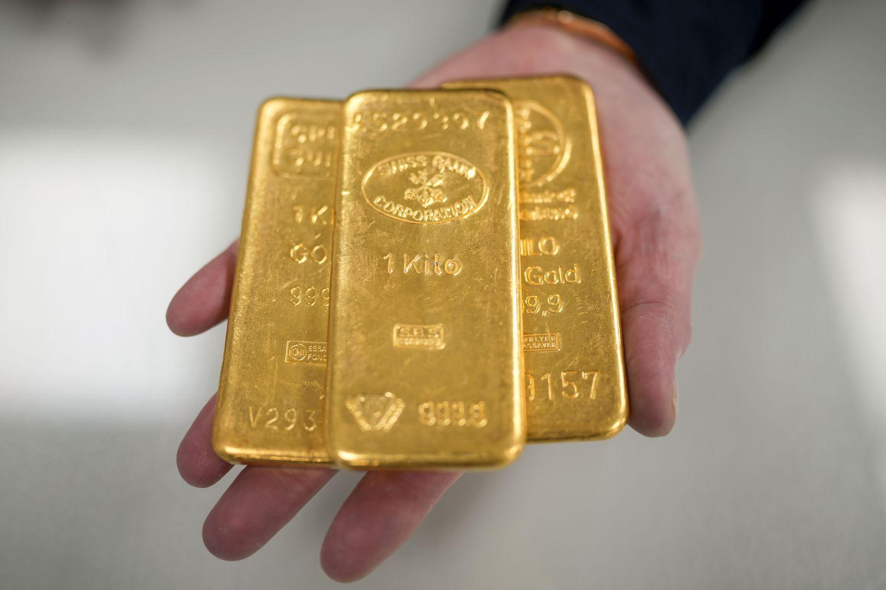

## Table of Contents

## What is the current price of gold?

The current price of gold is around $2,300 per ounce. This price can change a lot from day to day because many things affect it, like the economy, interest rates, and what people think will happen in the future.

Gold is often seen as a safe investment when times are uncertain. That's why its price can go up when there is bad news or when people are worried about money. Right now, many people are buying gold because they want to keep their money safe.

## How has the price of gold changed over the past 20 years?

Over the past 20 years, the price of gold has gone up a lot. In the year 2003, gold was about $360 per ounce. By 2011, it had jumped to around $1,800 per ounce. That's a big increase! The price went up because more people wanted to buy gold, especially during the financial crisis in 2008 when they were looking for safe places to put their money.

After 2011, the price of gold went down a bit and stayed around $1,200 to $1,300 per ounce for a few years. But then, starting around 2020, the price started going up again. This was because of things like the global health crisis and other big events that made people feel unsure about the future. By 2023, the price of gold had climbed back up to around $2,300 per ounce.

So, over the past 20 years, the price of gold has had its ups and downs, but overall, it has gone up a lot. It's a good example of how gold can be a safe investment when people are worried about the economy or other big problems in the world.

## What factors influence the price of gold?

The price of gold is affected by many things. One big factor is the economy. When the economy is not doing well, people often buy more gold because they think it's a safe investment. This is called a "safe haven." When people are worried about their money, they might sell other things like stocks and buy gold instead. Another important thing that affects gold prices is interest rates. When interest rates are low, gold becomes more attractive because other investments, like savings accounts, don't give much money back. But when interest rates go up, people might choose to put their money in those other investments instead of gold.

Another factor is what people think will happen in the future. If people think there will be problems, like inflation or a big financial crisis, they might buy more gold to protect their money. Also, the value of the dollar plays a big role. When the dollar is weak, gold usually costs more because it's priced in dollars. On the other hand, when the dollar is strong, gold might be cheaper. Finally, how much gold is available and how much people want to buy it also affects the price. If there's a lot of gold and not many people want to buy it, the price might go down. But if there's not much gold and a lot of people want it, the price can go up.

In addition to these factors, things like political events and natural disasters can also change the price of gold. For example, if there's a war or a big earthquake, people might buy more gold because they're worried about the future. Also, the actions of big investors and central banks can move the price of gold. If a central bank decides to buy a lot of gold, that can push the price up. And if big investors start selling their gold, that can make the price go down. So, the price of gold is influenced by a mix of economic, political, and even emotional factors.

## What are the different ways to invest in gold?

There are several ways to invest in gold. One way is to buy physical gold, like gold bars or gold coins. You can keep them at home or in a safe place like a bank's safe deposit box. Another way is to buy gold jewelry, but remember that jewelry often costs more because of the work that goes into making it. You can also invest in gold through something called a gold IRA, which is a special kind of retirement account where you can hold physical gold.

Another way to invest in gold is through financial products. You can buy shares in gold mining companies, which are companies that find and sell gold. The price of these shares can go up if the price of gold goes up. You can also buy gold exchange-traded funds (ETFs), which are like baskets of gold that you can buy and sell like stocks. These ETFs track the price of gold, so if the price of gold goes up, the value of your ETF goes up too. Finally, you can trade gold futures and options, which are agreements to buy or sell gold at a certain price in the future. These can be more complicated and risky, but they can also be a way to make money if you know what you're doing.

So, there are many ways to invest in gold, from buying physical gold to using financial products. Each way has its own pros and cons, so it's important to think about what you want and what you're comfortable with before you decide how to invest.

## How does inflation affect the value of gold?

Inflation is when the prices of things go up over time, and it can make the value of money go down. Gold is often seen as a good way to protect your money from inflation. When there's inflation, people might start buying more gold because they want to keep their money safe. If a lot of people start buying gold, the price of gold can go up. So, inflation can make the value of gold go up because more people want to buy it.

But it's not always that simple. Sometimes, if inflation is really high, it can make the economy not work well. This can make people worried about buying gold because they might not have money to spend on it. Also, if the government or central banks do things to stop inflation, like raising interest rates, that can make other investments more attractive than gold. So, while inflation often makes the value of gold go up, other things can change how much people want to buy gold and what happens to its price.

## What are the risks associated with investing in gold?

Investing in gold can be risky because the price of gold can go up and down a lot. Sometimes, the price can change a lot in just one day. This can happen because of things like the economy, interest rates, or big events in the world. If you buy gold and the price goes down, you might lose money. Also, if you keep your money in gold for a long time, you might miss out on other investments that could give you more money back, like stocks or bonds.

Another risk is that if you buy physical gold, like bars or coins, you have to find a safe place to keep it. If you keep it at home, there's a chance it could get stolen. If you keep it in a bank's safe deposit box, you have to pay for that, and you might not be able to get to your gold quickly if you need it. Also, if you want to sell your physical gold, you might not get as much money for it as you paid, because the price of gold can change and there might be fees to sell it.

Finally, if you invest in gold through things like ETFs or futures, there are other risks. ETFs can have fees that can eat into your profits. Futures and options can be very complicated and risky, and you could lose a lot of money if you don't know what you're doing. So, while gold can be a good way to protect your money, it's important to understand the risks before you decide to invest in it.

## How does the global economic environment impact gold prices?

The global economic environment can really change the price of gold. When the world's economy is not doing well, people often buy more gold because they think it's a safe place to keep their money. This is called a "safe haven." For example, during big financial crises like the one in 2008, a lot of people bought gold, and the price went up a lot. Also, when countries are having problems, like wars or big political changes, people might buy more gold because they're worried about the future. So, when the global economy is shaky, the demand for gold can go up, and that can make the price of gold go up too.

Another way the global economic environment affects gold prices is through interest rates and the value of the dollar. When interest rates are low, gold becomes more attractive because other investments, like savings accounts, don't give much money back. But when interest rates go up, people might choose to put their money in those other investments instead of gold. The value of the dollar also matters. When the dollar is weak, gold usually costs more because it's priced in dollars. On the other hand, when the dollar is strong, gold might be cheaper. So, the global economic environment, including interest rates and the value of the dollar, can have a big impact on the price of gold.

## What historical data can predict future gold price trends?

Looking at history can help us guess what might happen to the price of gold in the future. Over the past few decades, we've seen that when the economy is not doing well, like during the financial crisis in 2008 or the global health crisis in 2020, the price of gold tends to go up. This is because more people want to buy gold to keep their money safe when times are tough. Also, when inflation is high, gold often becomes more valuable because it's seen as a good way to protect money from losing value. So, if we see these kinds of economic problems happening again, we might expect the price of gold to go up.

Another thing to look at is interest rates and the value of the dollar. When interest rates are low, gold usually does well because other investments don't give much money back. But when interest rates go up, people might choose other investments instead of gold. The value of the dollar also matters a lot. When the dollar is weak, gold tends to cost more because it's priced in dollars. So, if we see interest rates going down or the dollar getting weaker, that could be a sign that the price of gold might go up. By looking at these patterns from the past, we can make better guesses about what might happen to gold prices in the future.

## How do geopolitical events influence gold investment returns?

Geopolitical events, like wars or big political changes, can make the price of gold go up. When there's a lot of uncertainty in the world, people often buy more gold because they think it's a safe place to keep their money. For example, if there's a war or a big political crisis, people might be worried about what will happen next. They might sell other things like stocks and buy gold instead. This can make the demand for gold go up, and when more people want to buy gold, the price usually goes up too.

Another way geopolitical events can affect gold investment returns is by changing how people feel about the economy. If there's a big event that makes people think the economy will not do well, they might buy more gold to protect their money. This can happen even if the event is far away, because the global economy is all connected. So, if you see a big geopolitical event happening, it might be a good time to think about investing in gold, because the price could go up as more people try to keep their money safe.

## What are the tax implications of investing in gold for 20 years?

When you invest in gold for 20 years, you need to think about taxes. If you make money by selling your gold for more than you paid for it, you have to pay capital gains tax. The tax rate depends on how long you held the gold. If you held it for more than one year, it's called long-term capital gains, and the tax rate is usually lower than if you held it for less than a year, which is called short-term capital gains. For gold held for 20 years, you'll pay long-term capital gains tax, which can be 0%, 15%, or 20%, depending on your income.

Another thing to think about is if you keep your gold in a special retirement account called a gold IRA. With a gold IRA, you don't have to pay taxes on the money you make from your gold until you take it out of the account. When you do take it out, it's taxed as regular income, not as capital gains. So, if you keep your gold in a gold IRA for 20 years, you won't have to pay taxes on any gains until you start taking money out of the account, and the tax rate will depend on your income at that time.

## How can diversification strategies enhance returns on a gold investment?

Diversification means spreading your money across different kinds of investments. When you invest in gold, you can make your investment safer and possibly get better returns by also putting money into other things like stocks, bonds, or real estate. Gold can go up and down a lot, but other investments might not move in the same way. So, if the price of gold goes down, your other investments might still be doing well. This can help balance out your losses and make your overall investment more stable.

For example, if you have all your money in gold and the price drops, you could lose a lot. But if you also have some money in stocks or bonds, those might go up when gold goes down. This can help protect your money and even make you more money in the long run. By mixing gold with other investments, you can take advantage of the good things about gold, like it being a safe place to keep your money, while also getting the benefits of other investments that might grow faster over time.

## What advanced financial models can be used to forecast long-term gold investment returns?

To forecast long-term gold investment returns, people often use something called the ARIMA model. ARIMA stands for AutoRegressive Integrated Moving Average. It's a way to look at past prices of gold and use that information to guess what might happen in the future. The model looks at patterns and trends in the data to make these guesses. It can be really helpful because it takes into account how gold prices have moved up and down over time. But, it's not perfect. It's just a guess, and real life can be different from what the model predicts.

Another model that can be used is the GARCH model, which stands for Generalized Autoregressive Conditional Heteroskedasticity. This model is good at looking at how much the price of gold might change in the future. It's especially useful for understanding how risky gold investments can be. The GARCH model can help investors understand if the price of gold might go up and down a lot, which can help them decide how much gold to buy. Like the ARIMA model, the GARCH model uses past data to make guesses about the future, but it focuses more on the ups and downs of the price rather than just the price itself.

## References & Further Reading

[1]: Bergstra, J., Bardenet, R., Bengio, Y., & Kégl, B. (2011). ["Algorithms for Hyper-Parameter Optimization."](https://papers.nips.cc/paper/4443-algorithms-for-hyper-parameter-optimization) Advances in Neural Information Processing Systems 24.

[2]: ["Advances in Financial Machine Learning"](https://www.amazon.com/Advances-Financial-Machine-Learning-Marcos/dp/1119482089) by Marcos Lopez de Prado

[3]: ["Evidence-Based Technical Analysis: Applying the Scientific Method and Statistical Inference to Trading Signals"](https://www.amazon.com/Evidence-Based-Technical-Analysis-Scientific-Statistical/dp/0470008741) by David Aronson

[4]: ["Machine Learning for Algorithmic Trading"](https://github.com/stefan-jansen/machine-learning-for-trading) by Stefan Jansen

[5]: ["Quantitative Trading: How to Build Your Own Algorithmic Trading Business"](https://books.google.com/books/about/Quantitative_Trading.html?id=j70yEAAAQBAJ) by Ernest P. Chan