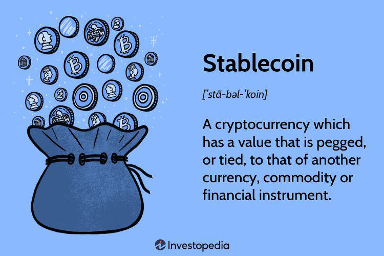

The cryptocurrency market is rapidly evolving, presenting investors and developers with a landscape filled with both remarkable opportunities and substantial challenges. As digital currencies have gained popularity, their notorious volatility has become a significant concern. The dramatic price fluctuations not only pose risks to their function as a stable store of value but also impede their broader adoption as a reliable medium of exchange. Furthermore, the lack of comprehensive regulatory frameworks across different jurisdictions complicates the integration of cryptocurrencies into conventional financial systems, raising questions about legal compliance and consumer protection.

Understanding these underlying challenges is critical for engaging with the dynamic cryptocurrency space effectively. Amidst these challenges, stablecoins and algorithmic trading emerge as two pivotal innovations designed to offer tangible solutions. Stablecoins strive to bridge the gap between the inherent volatility of cryptocurrencies and the stability offered by fiat currencies. They achieve this by utilizing mechanisms such as collateralization and algorithmic control to maintain their value stability, thereby making them attractive for traders and consumers seeking more reliability in digital assets.



Algorithmic trading, on the other hand, leverages sophisticated algorithms and automated systems to enhance trading efficiency and liquidity in cryptocurrency markets. This approach mitigates the influence of human error and emotional decision-making, enabling traders to respond swiftly to market movements and capitalize on volatility-driven opportunities.

This article will explore the array of issues confronting the cryptocurrency sphere and examine how stablecoins and algorithmic trading contribute viable solutions by enhancing stability and trading efficiency. By delving into these topics, investors and developers can better navigate the intricate environment of cryptocurrencies, harnessing innovative tools to overcome challenges and seize opportunities in this rapidly evolving market.

## Table of Contents

## Challenges Facing Cryptocurrencies

Cryptocurrencies present both compelling potential and notable challenges. A primary concern is their inherent volatility, which can undermine their function as a store of value and a medium of exchange. This high volatility often results from various factors, including speculative trading, differing regulatory announcements across regions, and overall market sentiment. For instance, the price of Bitcoin, one of the most well-known cryptocurrencies, has been observed to fluctuate wildly within short periods due to these influences. Such instability can deter both individual and institutional investors who seek more certainty and predictability in their investments.

Regulatory scrutiny is another significant hurdle facing cryptocurrencies. Due to the decentralized and relatively anonymous nature of digital currencies, governments worldwide are concerned about their use in illicit activities, such as money laundering and tax evasion. This has led to a patchwork of regulatory responses, with some jurisdictions imposing stringent rules while others maintain a laissez-faire attitude. The lack of a coherent global regulatory framework creates uncertainty and hampers the broad acceptance of cryptocurrencies. It also poses operational challenges for companies involved in cryptocurrency transactions, as they must navigate varying rules and compliance requirements across different regions.

The decentralized architecture of cryptocurrencies, while offering benefits such as increased security and autonomy from centralized control, comes with its own set of challenges. Security concerns, particularly the potential for hacking and fraud, remain significant. Despite the robustness of blockchain technology, exchange platforms and individual wallets have been targets for cybercriminals. Additionally, the decentralized system often lacks comprehensive oversight mechanisms, which can lead to discrepancies and trust issues within the community. The absence of traditional safeguards and the irreversible nature of most blockchain transactions can make recovery from fraudulent activities difficult, adding another layer of risk for users.

These challenges underscore the complexities faced by cryptocurrencies as they seek wider adoption and integration into the mainstream financial system. Addressing these issues is crucial for the future evolution of cryptocurrencies, and it involves not only technological advancements but also coherent international regulatory frameworks that ensure security without stifling innovation.

## Stablecoins as Solutions to Volatility

Stablecoins aim to provide [cryptocurrency](/wiki/cryptocurrency) traders and consumers with the stability of fiat currencies while maintaining the benefits of digital currencies. These digital assets are designed to minimize price [volatility](/wiki/volatility-trading-strategies), a common issue in the cryptocurrency market. Stablecoins achieve this stability by anchoring their value to a stable asset, such as a fiat currency or another form of collateral.

There are several types of stablecoins, each utilizing different mechanisms to maintain stability. The most prominent categories include fiat-collateralized, commodity-collateralized, crypto-collateralized, and algorithmic stablecoins.

Fiat-collateralized stablecoins are backed by reserves of real-world currencies. For example, Tether (USDT) is pegged to the US dollar and claims to hold equivalent reserves to back its circulating supply [¹](https://tether.to). This setup provides a relatively stable value, as the coins are directly tied to a tangible asset. The promise of redeemability for fiat currency instills confidence among users, making these stablecoins popular choices for those seeking refuge from the volatility of other cryptocurrencies.

Commodity-collateralized stablecoins are supported by reserves of physical commodities, such as gold or real estate. These stablecoins offer the added security of tangible support, although they might be subject to the fluctuations of the commodity market. An example of a commodity-backed stablecoin is Digix Gold Token (DGX), which is backed by physical gold [²](https://digix.global).

Crypto-collateralized stablecoins, such as DAI, are backed by other cryptocurrencies instead of fiat or tangible assets [³](https://makerdao.com). These stablecoins are typically over-collateralized to account for the volatile nature of the underlying assets. Their value retention requires a robust and well-maintained decentralized system to manage reserves.

Algorithmic stablecoins represent a novel approach to achieving stability without relying on collateral. These stablecoins utilize algorithms and smart contracts to adjust their supply dynamically, in response to changes in demand, to maintain their value peg. The algorithmic model resembles a decentralized central bank, aiming to stabilize price through automated supply management. For instance, Ampleforth (AMPL) employs an elastic supply model where user balances expand or contract based on price fluctuations [⁴](https://www.ampleforth.org).

Through these diverse mechanisms, stablecoins provide critical solutions to the volatility problem prevalent in the cryptocurrency market, offering both traders and consumers a stable medium of exchange and store of value while preserving the fundamental benefits of digital currencies such as transparency and efficiency.

---

References:
1. Tether. (n.d.). Available at: [https://tether.to](https://tether.to)
2. Digix. (n.d.). Available at: [https://digix.global](https://digix.global)
3. MakerDAO: DAI. (n.d.). Available at: [https://makerdao.com](https://makerdao.com)
4. Ampleforth. (n.d.). Available at: [https://www.ampleforth.org](https://www.ampleforth.org)

## The Role of Algorithmic Trading in Cryptocurrency

Algorithmic trading in cryptocurrency markets harnesses sophisticated algorithms to automate the buying and selling of digital assets, thereby increasing both market efficiency and [liquidity](/wiki/liquidity-risk-premium). Unlike human traders, algorithms can process vast amounts of data and execute trades at speeds that humans cannot match, leading to a more streamlined and effective trading process.

The primary advantage of [algorithmic trading](/wiki/algorithmic-trading) is its ability to reduce the risks associated with human error and emotional decision-making. Human traders are often swayed by emotions such as fear and greed, which can lead to poor decision-making and suboptimal trading outcomes. Algorithms, however, follow predetermined rules and logic, ensuring that trades are executed based on data-driven strategies rather than emotional impulses.

Algorithmic trading strategies are designed to take advantage of market volatility, which is a hallmark of the cryptocurrency markets. Common strategies include [arbitrage](/wiki/arbitrage), which exploits price discrepancies between different exchanges or trading pairs, and [market making](/wiki/market-making), which involves providing liquidity by placing buy and sell orders simultaneously. Momentum trading is another approach, where algorithms identify and capitalize on the continuing trend in the market prices.

While the implementation of algorithmic trading requires a significant understanding of both financial markets and computer programming, the tools and techniques developed can significantly enhance trading performance. For instance, traders might use a Python script to create a simple moving average crossover strategy to automate trading decisions:

```python
import pandas as pd
import numpy as np

# Load historical price data
data = pd.read_csv('crypto_prices.csv')

# Calculate short-term and long-term moving averages
short_window = 40
long_window = 100

data['short_mavg'] = data['Close'].rolling(window=short_window, min_periods=1).mean()
data['long_mavg'] = data['Close'].rolling(window=long_window, min_periods=1).mean()

# Generate signals
data['signal'] = 0.0  
data['signal'][short_window:] = np.where(data['short_mavg'][short_window:] > data['long_mavg'][short_window:], 1.0, 0.0)   

# Calculate trading positions
data['positions'] = data['signal'].diff()

print(data[['Date', 'short_mavg', 'long_mavg', 'signal', 'positions']])
```

This snippet calculates the short and long-term moving averages, generates buy/sell signals, and determines trading positions, thus showcasing how a basic algorithmic strategy can automate aspects of trading.

In summary, algorithmic trading represents a powerful tool for navigating the complexities of crypto markets. By leveraging advanced algorithms, traders can improve their chances of success through precise, data-driven decision-making processes that capitalize on market dynamics efficiently.

## Regulatory Considerations for Stablecoins

The rise of stablecoins has attracted significant regulatory attention globally, primarily due to concerns over money laundering, consumer protection, and financial stability. Stablecoins, by design, retain a stable value by pegging to a reserve of assets; however, this raises questions about the transparency and integrity of these reserves. Regulators are particularly wary of the potential for stablecoins to be used in illicit activities such as money laundering. This concern is amplified by the pseudo-anonymous nature of transactions conducted on blockchain networks. Regulatory bodies stress the importance of implementing Know Your Customer (KYC) and Anti-Money Laundering (AML) protocols to mitigate these risks.

Different countries are establishing varied regulatory frameworks to address these concerns. The European Union has proposed the Markets in Crypto-Assets (MiCA) regulation, which aims to create a consistent regulatory environment for cryptocurrencies, including stablecoins. MiCA focuses on overseeing issuers and service providers, ensuring they maintain adequate reserves and clear information disclosures. Meanwhile, the United States is also considering more stringent regulations, with reports and discussions from the Financial Stability Oversight Council emphasizing the need for action to prevent systemic risks.

Maintaining financial stability is paramount, as some regulators fear a scenario where a major stablecoin becomes too large, potentially posing systemic risks similar to those presented by traditional financial institutions. Ensuring a stablecoin's redeemability — the process by which holders can exchange their stablecoins for the underlying assets — is a critical measure for financial stability. Regulators often require issuers to maintain a one-to-one reserve ratio to guarantee redeemability and bolster consumer trust.

Furthermore, compliance with international standards, such as those set by the Financial Action Task Force (FATF), is increasingly seen as essential for stablecoins to gain widespread acceptance and legitimacy. As regulatory landscapes evolve, stablecoin issuers must adapt to changing requirements and engage with regulatory bodies to promote trust and secure their place within the global financial system. This engagement will be crucial as stablecoins continue to integrate into broader financial markets, potentially altering traditional financial systems and methodologies.

## Future Implications and Considerations

As stablecoins and algorithmic trading continue to evolve, they offer promising prospects for the widespread adoption of cryptocurrencies and their integration into the global financial system. The increasing adoption of blockchain technology, which underpins cryptocurrencies, sets the stage for sustained growth in this sector. Advances in blockchain can lead to more efficient, secure, and scalable solutions, enhancing the overall appeal of digital currencies.

Stablecoins, by providing a stable medium of exchange, can facilitate everyday transactions and cross-border payments, potentially boosting financial inclusion. These digital assets have the capacity to bridge the gap between traditional finance and the burgeoning world of cryptocurrencies, making them a crucial component in the transition towards a digital economy.

Algorithmic trading contributes to this dynamic landscape by improving market efficiency and liquidity. The automation of trading processes reduces transaction costs and the potential for human error, fostering a more efficient market. As the sophistication of algorithmic strategies increases, so too does the potential for profit, attracting more participants to the cryptocurrency space.

Despite these opportunities, market participants must remain vigilant about the risks associated with cryptocurrencies. The volatility inherent in this market requires constant monitoring and an adaptive approach to trading strategies. Furthermore, the regulatory environment is continuously evolving, with authorities around the world striving to implement frameworks that ensure consumer protection and financial stability. Staying informed about these regulatory changes is crucial for both developers and investors.

In conclusion, the future of cryptocurrencies is promising, with stablecoins and algorithmic trading playing pivotal roles in this evolution. As these technologies advance, they foster greater adoption and integration into financial markets, yet they also necessitate ongoing awareness of regulatory updates and technological innovations.

## Conclusion

Stablecoins and algorithmic trading have emerged as significant innovations in addressing some of the most persistent challenges in the cryptocurrency market. By offering a semblance of stability and robust trading mechanisms, these advancements contribute to a more resilient and accessible digital economy. Stablecoins mitigate the notorious volatility associated with cryptocurrencies by pegging their value to more stable assets like fiat currencies or commodities, thereby providing a reliable option for traders and consumers seeking to minimize risk. For instance, fiat-collateralized stablecoins such as Tether (USDT) afford users the benefits of blockchain technology without the extreme price fluctuations typical of other cryptocurrencies.

Algorithmic trading, utilizing sophisticated algorithms and computational prowess, enhances market efficiency and liquidity. This technology enables automated trading, minimizing human error and the pitfalls of emotional decision-making. By swiftly capitalizing on market volatility, algorithmic trading strategies create new opportunities for profit, making the cryptocurrency market more attractive to a broader range of investors.

For investors and developers, adapting to and leveraging stablecoins and algorithmic trading is crucial. Embracing these tools enables a proactive approach to navigating the complexities and risks inherent in the cryptocurrency landscape. As blockchain technology and interest in digital currencies continue to grow, these innovations are set to facilitate wider adoption and integration into the global financial system. To fully realize the potential of stablecoins and algorithmic trading, stakeholders must remain agile, informed, and aligned with ongoing technological advancements and regulatory developments.

## References & Further Reading

[1]: Bergstra, J., Bardenet, R., Bengio, Y., & Kégl, B. (2011). ["Algorithms for Hyper-Parameter Optimization."](https://papers.nips.cc/paper/4443-algorithms-for-hyper-parameter-optimization) Advances in Neural Information Processing Systems 24.

[2]: ["Advances in Financial Machine Learning"](https://www.amazon.com/Advances-Financial-Machine-Learning-Marcos/dp/1119482089) by Marcos Lopez de Prado

[3]: ["Evidence-Based Technical Analysis: Applying the Scientific Method and Statistical Inference to Trading Signals"](https://www.amazon.com/Evidence-Based-Technical-Analysis-Scientific-Statistical/dp/0470008741) by David Aronson

[4]: ["Machine Learning for Algorithmic Trading"](https://github.com/stefan-jansen/machine-learning-for-trading) by Stefan Jansen

[5]: ["Quantitative Trading: How to Build Your Own Algorithmic Trading Business"](https://www.amazon.com/Quantitative-Trading-Build-Algorithmic-Business/dp/1119800064) by Ernest P. Chan