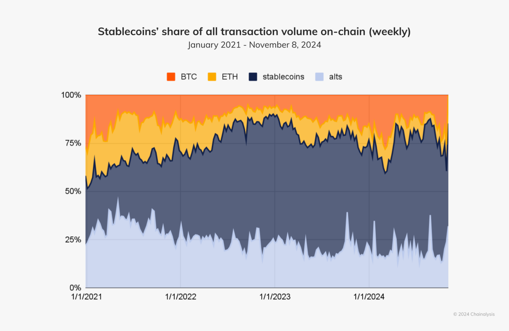

## Table of Contents

## What are stablecoins and how do they differ from other cryptocurrencies?

Stablecoins are a type of cryptocurrency designed to have a stable value, unlike other cryptocurrencies like Bitcoin or Ethereum, which can have big price swings. Stablecoins achieve this stability by being tied to something else that has a steady value, like the US dollar or gold. This means that if you have a stablecoin, its value should stay about the same, making it easier to use for everyday things like buying stuff online or sending money to friends.

The main difference between stablecoins and other cryptocurrencies is this stability. Other cryptocurrencies can go up or down a lot in value, which can be exciting but also risky. For example, if you buy Bitcoin and its price drops, you could lose money. But with stablecoins, you don't have to worry about that as much because their value is meant to stay the same. This makes stablecoins more useful for people who want to use cryptocurrency without the risk of big price changes.

## What are the main types of stablecoins and how do they maintain their stability?

There are three main types of stablecoins: fiat-collateralized, crypto-collateralized, and algorithmic stablecoins. Fiat-collateralized stablecoins are backed by real-world currencies like the US dollar. For example, for every stablecoin in circulation, there's an equivalent amount of dollars held in a bank. This means the stablecoin's value stays close to the dollar's value. Tether (USDT) and USD Coin (USDC) are popular examples of this type.

Crypto-collateralized stablecoins are backed by other cryptocurrencies, like Ethereum. These stablecoins use smart contracts to keep their value stable. For instance, if the stablecoin's value starts to drop, the smart contract might automatically sell some of the backing [cryptocurrency](/wiki/cryptocurrency) to buy more stablecoins and bring the value back up. DAI is a well-known crypto-collateralized stablecoin. 

Algorithmic stablecoins don't use any collateral. Instead, they use algorithms and smart contracts to control the supply of the stablecoin. If the stablecoin's value goes down, the algorithm might reduce the supply to make the value go back up. If the value goes up too much, the algorithm might increase the supply to bring it down. TerraUSD (UST) was an example of an algorithmic stablecoin, though it faced challenges and is no longer in use.

## How can stablecoins help in reducing the volatility associated with cryptocurrencies?

Stablecoins help reduce the ups and downs of cryptocurrencies by being tied to something with a steady value, like the US dollar or gold. When you use a stablecoin, its value doesn't jump around like Bitcoin or Ethereum might. This makes it easier to use cryptocurrencies for everyday things, like buying stuff online or sending money to friends, without worrying about losing money because the price changed suddenly.

For example, if you want to buy something that costs $100, you can use a stablecoin like USDT, which is always worth about $1. If you used Bitcoin instead, its price might drop to $90 by the time you make the purchase, and you'd lose money. But with a stablecoin, you know it will still be worth $100, so you can use it without worrying about the price changing. This makes stablecoins a safer choice for people who want to use cryptocurrencies but don't want to deal with the risk of big price swings.

## What role can stablecoins play in enhancing the adoption of cryptocurrencies for everyday transactions?

Stablecoins can make it easier for people to use cryptocurrencies in their daily lives because they don't change in value as much as other cryptocurrencies like Bitcoin. When you use a stablecoin, you know it will be worth about the same amount of money tomorrow as it is today. This makes it a lot like using regular money, like dollars or euros, which people are already used to. Because stablecoins are more predictable, people feel more comfortable using them to buy things online, pay bills, or send money to friends and family.

This predictability can help more people start using cryptocurrencies for everyday things. When people see that stablecoins work well for buying coffee, groceries, or other regular purchases, they might feel more confident about trying other cryptocurrencies too. Stablecoins can act like a bridge, helping people get used to the idea of using digital money. As more businesses start accepting stablecoins, it becomes easier for everyone to use them, which can lead to more people using all kinds of cryptocurrencies in their daily lives.

## How do stablecoins address the issue of scalability in blockchain networks?

Stablecoins can help with the problem of scalability in blockchain networks by making transactions faster and cheaper. When you use a stablecoin, you're often using a blockchain that's designed to handle a lot of transactions quickly. For example, some stablecoins use the Ethereum network but with special ways to speed things up, like layer-2 solutions. These solutions let the blockchain process more transactions at once, so it doesn't get slow or expensive when a lot of people are using it.

This is important because other cryptocurrencies, like Bitcoin, can get slow and costly when too many people try to use them at the same time. If you want to buy something with Bitcoin, you might have to wait a long time and pay a lot in fees. But with stablecoins, you can make your purchase quickly and cheaply. This makes stablecoins a good choice for everyday transactions, helping more people use blockchain technology without running into the problems of slow and expensive transactions.

## What are the regulatory challenges faced by stablecoins and how are they being addressed?

Stablecoins face a lot of regulatory challenges because they are tied to real-world money like the US dollar. Governments and financial watchdogs worry that stablecoins could be used for illegal activities, like money laundering or funding terrorism. They also worry that if a lot of people use stablecoins, it could affect the regular money system. Because of these worries, different countries have different rules about stablecoins. Some countries have strict rules, while others are still figuring out what to do.

To address these challenges, many countries are working on new laws and rules for stablecoins. For example, in the United States, the government is thinking about new rules that would make stablecoin companies follow the same rules as banks. This would help make sure stablecoins are safe and not used for bad things. In Europe, they are also working on rules to make sure stablecoins are used in a safe and fair way. These efforts are trying to balance the benefits of stablecoins, like faster and cheaper transactions, with the need to keep the financial system safe and secure.

## How can stablecoins improve financial inclusion in underbanked regions?

Stablecoins can help people in underbanked regions by giving them a way to use money that's easy and doesn't need a bank account. In many places, people don't have easy access to banks or can't afford to use them. Stablecoins can be used on a phone, which a lot of people have, even if they don't have a bank account. This means they can send and receive money, pay for things, and save money without needing a bank. This can help people in these areas to take part in the economy in ways they couldn't before.

Also, stablecoins can make it cheaper and faster to send money across borders. For people who work in one country but send money back home to their families, the fees and time it takes can be a big problem. Stablecoins can cut down on these fees and make the money arrive faster. This can make a big difference for families who rely on this money to live. By making it easier and cheaper to move money around, stablecoins can help more people in underbanked regions to have better financial lives.

## What are the potential risks and security concerns associated with stablecoins?

Stablecoins can have some risks and security problems. One big worry is that the company behind the stablecoin might not have enough real money or assets to back it up. If a lot of people want to change their stablecoins back into dollars or another currency, and the company can't do it, the stablecoin's value could drop a lot. This is called a "run on the bank," and it can make people lose trust in the stablecoin. Another risk is that stablecoins can be used for illegal things, like money laundering or funding terrorism, because they can be hard to track.

There are also security concerns with the technology that stablecoins use. Since stablecoins are on a blockchain, they can be hacked. If someone finds a weak spot in the blockchain or the smart contracts that run the stablecoin, they could steal money or mess up the system. This could make the stablecoin lose its value or stop working properly. It's important for the people who make stablecoins to keep their systems safe and secure to protect users' money.

## How do stablecoins facilitate cross-border payments and remittances?

Stablecoins make it easier and cheaper to send money across borders. When you use stablecoins for remittances, you don't have to worry about big fees that banks or other money transfer services might charge. These fees can be a lot, especially for people who send money to their families in other countries. With stablecoins, the fees are usually much smaller, so more of the money you send actually reaches your family. Also, sending stablecoins can be a lot faster than using traditional methods. Instead of waiting days for the money to arrive, it can get there in just a few minutes.

Another way stablecoins help with cross-border payments is by making it easier to use money in different countries. If you're traveling or working in another country, you can use stablecoins to pay for things without needing to change your money into the local currency. This can save you time and money, and it's especially helpful in places where it's hard to find a good exchange rate or where banks are not easy to use. By using stablecoins, people can send and receive money more easily, no matter where they are in the world.

## What impact could stablecoins have on traditional banking and financial systems?

Stablecoins could change the way traditional banks and financial systems work. They can make it easier and cheaper for people to send money around the world. This is because stablecoins don't need banks to move money, so they can cut out the big fees that banks charge. If more people start using stablecoins for things like paying bills or sending money to family in other countries, banks might lose some of their business. This could push banks to change how they do things, maybe by offering better services or lower fees to keep their customers.

But stablecoins also bring new challenges for banks and financial systems. Governments and banks worry that stablecoins could be used for illegal things, like money laundering, because they can be hard to track. This might lead to new rules and laws to make sure stablecoins are safe and not used for bad things. If stablecoins become very popular, they could also affect the regular money system. For example, if a lot of people start using stablecoins instead of dollars or euros, it could change how much those currencies are worth. So, while stablecoins can make some things easier, they also need to be watched carefully to make sure they don't cause problems for the overall financial system.

## How are stablecoins being integrated into decentralized finance (DeFi) platforms?

Stablecoins are a big part of decentralized finance, or DeFi, platforms. DeFi is all about using blockchain technology to do things like lending, borrowing, and trading without needing a bank. Stablecoins are used a lot in DeFi because they don't change in value as much as other cryptocurrencies. This makes them a good choice for people who want to use DeFi without worrying about losing money because the price of their cryptocurrency goes down. For example, if you want to lend money on a DeFi platform, you can use a stablecoin to know that the value of your loan will stay about the same.

In DeFi, stablecoins are used in many different ways. They can be used as a way to pay for things, like interest on loans or fees for using the platform. They can also be used as a way to keep your money safe while you're using DeFi. For example, if you're trading cryptocurrencies on a DeFi platform, you might want to keep some of your money in stablecoins so that it doesn't lose value if the market goes down. This makes stablecoins a key part of making DeFi easier and safer for people to use.

## What are the future developments and innovations expected in the stablecoin ecosystem?

In the future, we might see stablecoins become even more stable and easier to use. One idea is to make stablecoins that are backed by more than just one thing, like a mix of dollars, gold, and other assets. This could make them even safer and less likely to lose value. Another idea is to make stablecoins work better with regular money systems, so you can use them to pay for things in more places, like at stores or online. This could help more people start using stablecoins for everyday things.

We might also see new technology that makes stablecoins faster and cheaper to use. For example, new blockchains or ways to make transactions faster could help stablecoins work better for sending money across borders or for use in DeFi platforms. As more people and businesses start using stablecoins, we could see new rules and laws that make them safer and easier to use. This could help stablecoins become a bigger part of the financial world, making it easier for everyone to use digital money.

## References & Further Reading

[1]: Bergstra, J., Bardenet, R., Bengio, Y., & Kégl, B. (2011). ["Algorithms for Hyper-Parameter Optimization."](https://papers.nips.cc/paper/4443-algorithms-for-hyper-parameter-optimization) Advances in Neural Information Processing Systems 24.

[2]: ["Advances in Financial Machine Learning"](https://www.amazon.com/Advances-Financial-Machine-Learning-Marcos/dp/1119482089) by Marcos Lopez de Prado

[3]: ["Evidence-Based Technical Analysis: Applying the Scientific Method and Statistical Inference to Trading Signals"](https://www.amazon.com/Evidence-Based-Technical-Analysis-Scientific-Statistical/dp/0470008741) by David Aronson

[4]: ["Machine Learning for Algorithmic Trading"](https://github.com/stefan-jansen/machine-learning-for-trading) by Stefan Jansen

[5]: ["Quantitative Trading: How to Build Your Own Algorithmic Trading Business"](https://www.amazon.com/Quantitative-Trading-Build-Algorithmic-Business/dp/1119800064) by Ernest P. Chan