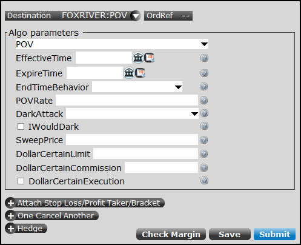

Algorithmic trading has fundamentally transformed the landscape of financial markets by enabling rapid and precise execution of trades based on pre-defined strategies. This approach leverages sophisticated algorithms to execute orders in a manner that eliminates human error and maximizes efficiency. A prevalent strategy within algorithmic trading is the Percentage of Volume (POV) algorithm. The POV algorithm is designed to execute trades at a set percentage of the market's trading volume, adjusting dynamically to the ebb and flow of market activity. Understanding the intricacies of the POV algorithm is essential for traders aiming to optimize their trading execution strategies while minimizing market impact.

This article will provide a comprehensive examination of the POV algorithm, including its mechanisms, effects on the market, and important considerations for its use. With the ability to adapt to real-time market conditions, POV can significantly enhance trading efficiency by mimicking natural market behaviors—executing larger trades when volumes are high and scaling back during periods of lower activity. However, the benefits of POV are accompanied by potential challenges, such as increased transaction costs and the risk of exacerbating market volatility.



By understanding the Percentage of Volume algorithm, traders can better navigate the complexities of modern financial markets. This knowledge not only aids in executing large trades more discreetly but also contributes to the development of tailored strategies that align with specific market conditions and objectives. In this article, we uncover both the advantages and limitations of the POV algorithm, offering insights into how it can be effectively employed to achieve desired trading outcomes.

## Table of Contents

## Overview of POV (Percentage of Volume)

The Percentage of Volume (POV) algorithm is a sophisticated trading strategy designed to align trading activity with a specified percentage of the market volume over a given time frame. This approach allows traders to adapt to real-time market conditions by modifying the order size based on prevailing market volumes. Unlike other algorithmic strategies such as Time-Weighted Average Price (TWAP) or Volume Weighted Average Price (VWAP), which follow a predetermined trading schedule, POV dynamically adjusts to maintain a consistent participation rate in the market.

At its core, the POV algorithm aims to replicate natural trading patterns. During periods of high market activity, it increases trading volumes, while reducing activity during low-volume periods. This adaptive mechanism helps in dispersing trades throughout the trading day to minimize the visibility and impact on the market.

Traders typically employ POV for executing large orders, as it helps mitigate the potential market impact that comes with significant trade volumes. By spreading trades in alignment with the prevailing market volume, POV ensures that a trader's activity does not significantly alter market prices, maintaining a level of discretion and efficiency. This feature is particularly advantageous for institutional investors or large-scale traders looking to execute large volumes discreetly and efficiently.

## How POV Works

Traders set a target participation rate, which denotes the percentage of total market [volume](/wiki/volume-trading-strategy) they aim to trade. This algorithm is engineered to dynamically calculate the size of orders based on live market volumes. For instance, setting a participation rate at 5% would necessitate submitting orders for 50 shares every time 1,000 shares are traded within the market. The algorithm is structured to update its scheduling and execution strategies on a tick-by-tick basis, ensuring that trades are consistently aligned with ongoing market conditions. This necessitates vigilant, real-time monitoring and continual adjustments to synchronize with the fluidity of market activity.

To implement this, traders utilize technology that constantly reads and interprets market data, often employing software solutions capable of executing high-frequency updates and recalibrations. The fundamental logic of the POV algorithm is straightforward, yet its effectiveness relies heavily on precise and responsive adjustments to real-time data. This can be exemplified with a basic Python code snippet:

```python
def calculate_order_size(market_volume, participation_rate):
    order_size = market_volume * participation_rate
    return order_size

# Example usage:
market_volume = 1000
participation_rate = 0.05  # 5%
order_size = calculate_order_size(market_volume, participation_rate)
print(f"Order size to be submitted: {order_size} shares")
```

In practical application, sophisticated trading systems would employ more elaborate frameworks and incorporate many more variables to handle the complexities of live trading environments. This dynamic approach allows the POV algorithm not only to mirror natural trading patterns but also to adapt swiftly to fluctuating conditions, making it a preferred method for handling large volumes with minimal market disruption.

## Market Impact and Considerations for the POV Algorithm

The Percentage of Volume (POV) algorithm is primarily favored for its ability to execute trades in relation to the total market volume, allowing traders to achieve a specific participation rate. However, the nature of its execution—often employing market orders—can lead to higher spread expenses. This is because market orders prioritize speed over price, often purchasing at the asking price or selling at the bid price, which can widen the spread costs involved in trading.

POV functions as a [liquidity](/wiki/liquidity-risk-premium) taker. It typically initiates trades after surges in market volume, which means it may impact market prices due to the increased activity it instigates. This aspect of the algorithm makes it especially aggressive, potentially creating a feedback loop where increased market volumes trigger additional trading activity. For instance, if the algorithm aims to maintain a 5% participation rate and the market experiences a volume spike, the POV must increase its trading rate proportionally to adhere to its participation target, thus further amplifying volume fluctuations.

One critical consideration for traders using the POV algorithm is its performance in low-liquidity conditions. In such scenarios, the algorithm's capability to fulfill orders at the target participation rate can be limited. Since POV cannot assure complete order execution, especially when there is insufficient market activity or liquidity, traders might face challenges in executing their strategies effectively. This is particularly notable when dealing with illiquid stocks, which can exacerbate the issue. The limited availability of buy and sell orders in illiquid markets can make it difficult for the POV to operate efficiently, often rendering it less effective compared to other algorithmic strategies that might better handle sparse market conditions.

Therefore, while POV serves as a robust mechanism for aligning trade execution with market volume, traders need to be vigilant about its implications on market impact, especially concerning liquidity and potential cost increases. They must assess market conditions meticulously and calibrate the algorithm accordingly to mitigate the inherent risks associated with its aggressive trading style.

## Implementation Challenges

Implementing the Percentage of Volume (POV) algorithm demands meticulous calibration and frequent parameter adjustments to ensure alignment with real-time market conditions. The key parameters include start time, end time, volume percentage, and price bands, each requiring careful consideration to optimize the strategy's effectiveness.

The start and end times significantly influence the algorithm's performance, as different periods in the trading day exhibit varying levels of liquidity and [volatility](/wiki/volatility-trading-strategies). Timing adjustments can enhance the impact and efficiency of executions. The volume percentage determines the proportion of market flow to be targeted, which directly affects the scale and frequency of trades the algorithm executes.

Price bands act as boundaries within which the algorithm operates, thus preventing excessive market impact by ensuring trades occur within acceptable price ranges. Correctly configuring these price bands is critical to avoiding adverse price movements due to large trades.

Other important considerations include order sizes and intervals. The selection of order sizes is crucial; too large orders can cause sudden price changes, while too small orders may lead to increased transaction costs due to repeated market participation. The intervals on which the algorithm recalculates and submits orders must also be optimized to match market dynamics, ensuring timely but not overly aggressive participation.

Market dynamics, including liquidity levels and volatility, require continuous monitoring. Traders must adjust the algorithm in response to changing conditions, such as unexpected spikes in trading volume or sudden price movements. Hidden liquidity in the form of iceberg orders—large orders disguised by only displaying small portions at a time—interacts with the visible [order book](/wiki/order-book-trading-strategies) and adds complexity. Navigating these concealed orders requires an understanding of order book mechanics and careful strategy adjustment to execute efficiently without revealing too much trading intention.

Effective risk management is essential for the successful execution of POV strategies. Real-time oversight allows traders to intervene promptly if market conditions deviate significantly from expected patterns. This involves setting predefined risk limits and employing tools for monitoring critical market indicators.

In conclusion, executing the POV algorithm effectively involves a sophisticated balance of parameter settings, real-time market analysis, and strategic adjustments. While offering significant benefits in terms of reduced market impact, the challenges associated with its implementation necessitate a thorough understanding of market behavior and disciplined oversight.

## Conclusion

The Percentage of Volume (POV) algorithm presents traders with the capability to execute substantial volumes while seeking to minimize market impact, provided it is accurately calibrated. This strategy is adaptive and responds to fluctuations in market volume, thereby allowing traders to maintain a synchronized trading pattern with market dynamics. However, the effectiveness of POV hinges on meticulous monitoring and ongoing strategy refinement. The limitations inherent in POV, such as its reliance on market orders, necessitate that traders remain vigilant, particularly during periods of low liquidity or unexpected market volatility.

For traders looking to enrich their trading strategies, integrating POV with other algorithmic approaches such as the Volume Weighted Average Price (VWAP) can offer enhanced customization. This hybrid approach enables traders to leverage the strengths of multiple algorithms, thereby optimizing execution according to specific trading objectives and market conditions.

It is crucial for traders to evaluate the suitability of the POV algorithm in relation to different market conditions and security types. This involves considering factors such as liquidity levels, trading volume, and the volatility of the asset in question. By doing so, traders can better gauge the potential impact of their trading activities and adjust their strategies accordingly to achieve desired outcomes.

In conclusion, the POV algorithm stands as a robust tool for algorithmic traders who strive for execution that is responsive to market conditions. Its ability to align with natural market movements can make it a valuable asset for those trading large volumes. However, successful utilization requires not only an understanding of its mechanics but also a commitment to ongoing assessment and adaptation to the evolving market landscape.

## References & Further Reading

[1]: [“Algorithmic Trading and DMA: An introduction to direct access trading strategies”](https://www.amazon.com/Algorithmic-Trading-DMA-introduction-strategies/dp/0956399207) by Barry Johnson

[2]: Focardi, S. M., & Fabozzi, F. J. (2004). ["The Mathematics of Financial Modeling and Investment Management"](https://archive.org/details/mathematicsoffin0000foca). Wiley.

[3]: Kissell, R. (2013). ["The Science of Algorithmic Trading and Portfolio Management"](https://www.sciencedirect.com/book/9780124016897/the-science-of-algorithmic-trading-and-portfolio-management). Academic Press.

[4]: Chakraborti, A., Toke, I. M., Patriarca, M., & Abergel, F. (2011). ["Econophysics review: II. Agent-based models"](https://www.researchgate.net/publication/227624084_Econophysics_review_I_Empirical_facts) in Journal of Statistical Mechanics: Theory and Experiment.

[5]: Aldridge, I. (2013). ["High-Frequency Trading: A Practical Guide to Algorithmic Strategies and Trading Systems"](https://www.ahmetbeyefendi.com/wp-content/uploads/2020/07/High-Frequency-Trading-Irene-Aldridge.pdf). Wiley.