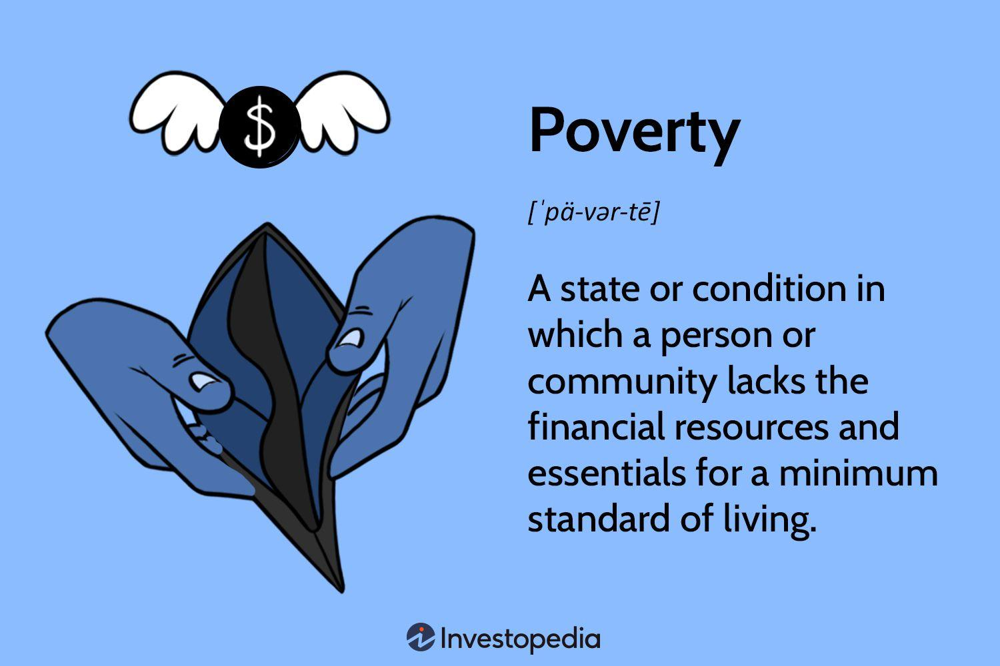

Poverty is a complex and multifaceted issue that affects millions of people worldwide. It manifests in various forms, including material deprivation, social exclusion, and a lack of access to basic services. The causes of poverty are diverse, with factors ranging from limited access to education and healthcare to systemic economic disparities and social discrimination. This article explores the intricacies of poverty, examining both individual and collective dimensions, and how poverty is measured through various socioeconomic indicators.

Moreover, poverty intersects with the emerging field of algorithmic trading in financial markets. Algorithmic trading involves the use of computer algorithms to make trading decisions, offering potential insights into economic patterns that might be relevant for understanding poverty. By analyzing large datasets, such algorithms can identify trends and anomalies that may relate to broader economic conditions. This intersection raises the possibility of using financial market data to inform poverty reduction strategies by identifying areas of economic growth or instability.

Addressing poverty requires a comprehensive approach that encompasses economic and social analysis. It involves collaboration between governments, non-governmental organizations, and the private sector to create effective policies and strategies. As societies confront the challenges of poverty, integrating economic methodologies with social policies can lead to innovative solutions and measurable improvements. This approach not only targets poverty alleviation but also aims to reduce economic disparities and promote sustainable development.

## Table of Contents

## Understanding Poverty: Definition and Context

Poverty refers to the state where individuals or communities lack the financial resources to achieve a minimum standard of living. It encompasses not only monetary insufficiency but also the inability to sustain basic needs such as food, shelter, education, and healthcare. According to the World Bank, a widely accepted measure is the international poverty line, set at a daily income of $1.90 per person, which serves as a benchmark to gauge extreme poverty globally [1].

Factors contributing to poverty are multifaceted and often interconnected. A key determinant is the lack of access to quality education. Education levels significantly impact employment prospects and earning potential. Individuals with limited or no education often find themselves unable to compete in an increasingly skill-oriented job market, perpetuating the cycle of poverty. Healthcare access is another critical factor; without adequate healthcare, individuals face increased vulnerability to diseases, leading to decreased productivity and higher medical costs [2].

Employment opportunities are essential for economic stability and growth. A lack of employment can stem from economic downturns, automation, or an economy's inability to create jobs commensurate with population growth. Economic growth rates are vital in understanding poverty, as they influence job creation and income distribution. Trickle-down effects of economic growth can sometimes disproportionately benefit higher-income groups, exacerbating income disparities.

Measuring poverty requires a comprehensive approach that considers income disparities, economic growth rates, and social welfare metrics. Income inequality is often quantified using measures such as the Gini coefficient, which ranges from 0 (perfect equality) to 1 (perfect inequality). Economic growth rates provide insights into the overall economic environment and its capacity to lift people out of poverty. Social welfare metrics include access to services like healthcare, education, and social protection systems, which are critical in providing safety nets for the vulnerable.

Poverty is not only an individual challenge but also a societal issue that hinders economic development. It often leads to increased rates of crime, political instability, and inadequate human capital development, which can perpetuate a cycle of underdevelopment. Addressing poverty is essential for fostering sustainable economic growth and development.

Addressing poverty requires targeted interventions and policies that span education, healthcare, employment, and social services. Governments, non-governmental organizations (NGOs), and other stakeholders must collaborate to ensure resources are effectively mobilized to alleviate poverty and drive economic development.

### References
1. The World Bank. "Poverty Overview." World Bank Group, www.worldbank.org/en/topic/poverty/overview.
2. UNDP. "Human Development Report 2019." United Nations Development Programme, 2019, hdr.undp.org/en/2019-report.

## Causes of Poverty

Poverty is a persistent global challenge with numerous underlying causes that often intersect and compound each other. One of the primary reasons many individuals are born into poverty is due to socioeconomic disparities, arising from unequal distribution of wealth and resources. These disparities are often entrenched in systems where individuals' access to education, healthcare, and employment is limited by their socio-cultural and economic backgrounds. Ethnicity and geographic factors further influence these dynamics, as marginalized ethnic groups and communities in remote or resource-scarce areas often face systemic barriers to economic advancement.

Natural disasters pose significant risks, contributing to poverty levels by disrupting livelihoods and destroying infrastructure critical for economic activities. Economic downturns, such as recessions, lead to unemployment and reduced income, exacerbating financial insecurity for already vulnerable populations. The increasing costs of living, driven by inflation and market shifts, further strain the limited financial resources available to those in poverty, making it difficult for them to afford basic needs such as food, housing, and healthcare.

Systematic issues such as inadequate infrastructure, sluggish job growth, and insufficient social support systems are substantial contributors to poverty. Poor infrastructure, including lack of access to transportation, energy, and communications, hampers economic activity and development. Limited job growth restricts employment opportunities, reducing individuals’ ability to earn a sustainable income. Where social support systems are lacking or ineffective, individuals in poverty have minimal safety nets to fall back on, perpetuating their economic hardships.

Social discrimination and systemic inequality severely restrict economic mobility for certain groups, keeping them entrenched in poverty. Discrimination based on race, gender, or disability can lead to unequal access to resources and opportunities, while systemic inequality can institutionalize these disparities in legal and economic systems. This results in marginalized groups facing barriers in education and employment opportunities, further entrenching cycles of poverty.

These causes of poverty are often interlinked, creating complex challenges for policymakers and stakeholders. Addressing these issues requires a multifaceted approach that not only targets the immediate needs of those in poverty but also focuses on dismantling the systemic barriers that hinder long-term economic growth and equality.

## Poverty Measurement Methods

Poverty is primarily measured by income thresholds that define the poverty line. This traditional approach identifies individuals or households with incomes below a certain level as impoverished. The poverty line varies by country and is often adjusted for inflation and cost of living, reflecting the minimum income necessary to meet basic needs such as food, shelter, and clothing.

Beyond monetary measures, Multidimensional Poverty Indexes (MPI) assess poverty through various non-monetary factors, providing a more comprehensive picture. MPI considers parameters such as education, health, and living standards. Education may be measured by years of schooling and child enrollment, while health indicators might include nutrition and child mortality rates. Living standards are often reflected through access to electricity, clean drinking water, improved sanitation, adequate flooring, modern cooking fuels, and asset ownership. This multidimensional approach highlights the various deprivations impoverished individuals face and how they intersect.

The Gini Index, another vital tool for measuring economic inequality, quantifies income distribution within a population. It provides insights into wealth disparity, with values ranging from 0 (perfect equality) to 1 (or 100% in percentage terms, denoting perfect inequality). Additionally, the Human Development Index (HDI) incorporates life expectancy, educational attainment, and per capita income, offering a broader perspective on development that encapsulates economic performance with social progress indicators.

Despite the utility of these metrics, critics advocate for more nuanced measures that consider local contexts and demographic variation. They argue that traditional poverty lines may not reflect regional economic conditions or cultural variations in living standards. As such, there is a growing call for poverty measures that are adaptive and sensitive to the diverse living conditions and economic realities present in different societies.

Incorporating local data and conditions ensures that poverty metrics are relevant and effective for policy-making and targeted intervention strategies. This facilitates the development of tailored solutions that address the specific needs and challenges faced by impoverished communities worldwide.

## Algorithmic Trading and Economic Insights

Algorithmic trading involves creating and deploying computer algorithms to systematically execute trading decisions in financial markets. These algorithms operate at high speed and efficiency, analyzing vast amounts of data to identify and exploit trading opportunities. The capacity for [algorithmic trading](/wiki/algorithmic-trading) to process large datasets enables it to detect economic patterns that may be obscure to human traders, thus potentially offering novel insights into economic conditions, including those affecting poverty.

Algorithms in trading can utilize various techniques, such as statistical analysis, [machine learning](/wiki/machine-learning), and [artificial intelligence](/wiki/ai-artificial-intelligence), to process historical and real-time data. This data includes stock prices, economic indicators, and news reports. By identifying patterns and correlations in this data, algorithms can make predictions about future market movements. These insights can be valuable beyond trading, as economic patterns observed through algorithmic trading can provide indicators of broader economic health, influencing factors related to poverty measurement.

Financial markets serve as a microcosm of the global economy, reflecting trends in employment rates, consumer demand, inflation, and other economic variables that are integral to understanding poverty. For example, fluctuations in commodity prices can impact food security in less developed regions, while changes in interest rates can affect housing affordability. By analyzing these market indicators, algorithmic trading can reveal trends and anomalies that may require policy intervention to address economic disparities.

Moreover, understanding markets through algorithmic observations can inform the development of financial tools aimed at poverty alleviation. For instance, algorithms can assist in designing investment strategies that target underdeveloped regions or sectors, offering funding solutions that address specific economic needs. Such targeted financial tools can mitigate economic disparities by directing capital to where it is most needed, potentially leveling the playing field and reducing poverty.

Incorporating algorithmic insights into socially responsible investment strategies opens avenues for financial markets to contribute positively to poverty reduction efforts. By aligning trading strategies with ethical standards and societal goals, market participants can help fund initiatives that address structural inequalities. Through this interplay between advanced trading technologies and economic analysis, society has the potential to harness financial markets for the greater social good, thereby addressing the multifaceted challenges of poverty.

## Integrating Poverty Alleviation and Market Strategies

Leveraging data analysis from algorithmic trading offers a novel approach to designing targeted poverty alleviation strategies. By automating the processing of extensive economic datasets, these algorithms can identify patterns and trends that may reveal underlying economic conditions contributing to poverty. This data-driven approach can guide policy-makers in crafting more effective interventions.

Financial markets, when aligned with ethical standards, have the potential to fund global anti-poverty initiatives. Through instruments such as social impact bonds and sustainable investment funds, capital can be channeled towards projects with measurable social benefits. These markets can facilitate investments in infrastructure, healthcare, and education, which are crucial for long-term poverty alleviation. 

Furthermore, addressing poverty requires collaboration among governments, non-governmental organizations (NGOs), and market participants. Governments can set the regulatory frameworks and incentives that encourage the private sector to invest in poverty-reducing initiatives. NGOs can play a crucial role in identifying local needs and executing grassroots projects, while market players provide the necessary financial resources and technical expertise.

A coordinated strategy that integrates social policies and financial market mechanisms can drive meaningful improvements in reducing poverty. Such an approach requires careful planning to ensure that market interventions align with social goals and do not exacerbate existing inequalities. By blending market efficiency with social equity, it is possible to create sustainable pathways out of poverty.

## Conclusion

Poverty is a multidimensional issue that necessitates intricate solutions incorporating both economic methodologies and social policies. Effectively measuring and addressing poverty demands an understanding of economic data, coupled with the application of financial innovations such as algorithmic trading. Algorithmic trading, by leveraging advanced data analytics, offers unique perspectives into economic trends and disparities that can be instrumental in designing targeted poverty alleviation strategies.

To mitigate poverty on a global scale, comprehensive strategies that integrate insights from multiple disciplines are essential. This requires cohesive efforts across economic, social, and technological fields, ensuring that innovative financial tools and policy frameworks work hand in hand. For instance, algorithmic trading not only aids in analyzing market trends but can also serve as a powerful instrument for identifying and reversing economic injustices.

Continued research and collaboration across sectors are fundamental for achieving lasting change in poverty alleviation. This involves partnerships between governments, non-governmental organizations, market players, and academic institutions to cultivate solutions that are both sustainable and inclusive. Through these collaborative efforts, it is possible to channel resources effectively, implement informed policy changes, and ultimately reduce poverty levels worldwide.

## References & Further Reading

[1]: The World Bank. "Poverty Overview." World Bank Group. Retrieved from [www.worldbank.org/en/topic/poverty/overview](https://www.worldbank.org/en/topic/poverty/overview).

[2]: UNDP. "Human Development Report 2019." United Nations Development Programme, 2019. Retrieved from [hdr.undp.org/en/2019-report](https://hdr.undp.org/content/human-development-report-2019).

[3]: Marcus, A. J., & Lopez de Prado, M. (2018). ["How to Design and Develop a Successful Algorithmic Trading Strategy."](https://www.quantresearch.org/Vita.htm) Journal of Investment Strategies.

[4]: European Commission. (2020). ["Poverty and Social Exclusion."](https://www.europarl.europa.eu/factsheets/en/sheet/60/the-fight-against-poverty-social-exclusion-and-discrimination) Eurostat Statistics Explained.

[5]: ["Understanding Poverty"](https://www.investopedia.com/terms/p/poverty.asp) by Abhijit V. Banerjee and Esther Duflo, Princeton University Press.

[6]: Jansen, S. (2018). ["Machine Learning for Algorithmic Trading: Predictive models to extract signals from market and alternative data for systematic trading strategies with Python."](https://www.amazon.com/Machine-Learning-Algorithmic-Trading-alternative/dp/1839217715) Packt Publishing.

[7]: Roine, J., Vlachos, J., & Waldenström, D. (2009). ["The long-run determinants of inequality: What can we learn from top income data?"](https://www.sciencedirect.com/science/article/abs/pii/S0047272709000383) Journal of Public Economics.