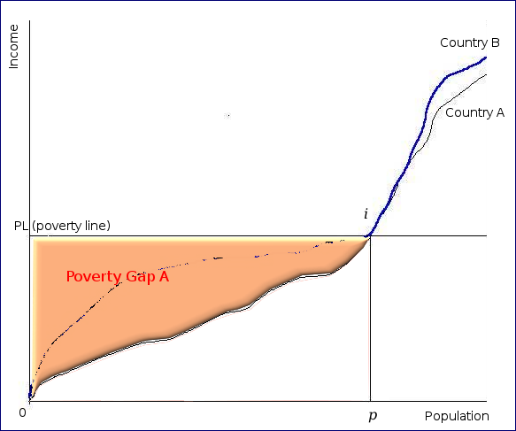

## Table of Contents

## What is the poverty gap?

The poverty gap is a way to measure how poor people are in a country. It shows the average difference between what poor people earn and the poverty line, which is the minimum amount of money needed to live. If the poverty gap is big, it means that poor people are earning much less than they need to meet their basic needs.

This measure helps governments and organizations understand how much money is needed to help poor people reach the poverty line. By knowing the poverty gap, they can plan better ways to support those in need, like giving them money or creating programs to help them earn more. It's an important tool for fighting poverty and making sure everyone has enough to live on.

## How is the poverty gap different from the poverty rate?

The poverty gap and the poverty rate are two different ways to understand poverty in a country. The poverty rate tells us the percentage of people who are poor. It's like counting how many people in a group are below the poverty line, which is the minimum amount of money needed to live. If a country has a high poverty rate, it means a large part of its population is struggling to meet their basic needs.

On the other hand, the poverty gap measures how far below the poverty line poor people are. It's not just about counting the poor; it's about figuring out how much money they are missing to reach the poverty line. For example, if someone earns $100 less than the poverty line, that $100 is part of the poverty gap. This helps us understand not just how many people are poor, but how poor they are and how much help they might need to improve their situation.

## What are the basic methods used to measure the poverty gap?

To measure the poverty gap, one common method is to calculate the average shortfall of income for all people living below the poverty line. This means you look at how much less money each poor person earns compared to the poverty line, and then you find the average of all those shortfalls. This gives you a single number that represents how far below the poverty line the average poor person is. It helps to understand the depth of poverty and how much money would be needed to lift everyone above the poverty line.

Another way to measure the poverty gap is by using the Poverty Gap Index. This index not only looks at the average shortfall but also takes into account the number of poor people. It's calculated by multiplying the average shortfall by the poverty rate, which is the percentage of people living below the poverty line. The result is a number between 0 and 100, where a higher number means a bigger gap. This method gives a more complete picture because it considers both how many people are poor and how poor they are.

## Can you explain the concept of the poverty gap index?

The poverty gap index is a way to measure how poor people are in a country. It looks at how far below the poverty line poor people are, and also takes into account how many people are poor. To find the poverty gap index, you first figure out the average amount of money that poor people are missing to reach the poverty line. Then, you multiply this average shortfall by the percentage of people who are poor. This gives you a number between 0 and 100 that shows the size of the poverty gap.

The poverty gap index is important because it tells us not just how many people are poor, but how poor they are. A high number means that a lot of people are very poor, and it would take a lot of money to help them reach the poverty line. This information helps governments and organizations plan how to help poor people better. For example, if the poverty gap index is high, they might need to give more money or create special programs to help poor people earn more.

## What data sources are typically used to calculate the poverty gap?

To calculate the poverty gap, people usually use data from surveys that ask people about their income or how much they spend on things. These surveys are done by governments or groups like the World Bank. They ask a lot of people in different places about their money, so they can understand how poor people are across the country.

Sometimes, other data like tax records or social security information can also be used. These sources help to make sure the numbers are correct and give a full picture of how much money people have. By putting all this information together, experts can figure out the average amount of money poor people are missing to reach the poverty line, which is important for calculating the poverty gap.

## How does the choice of poverty line affect the poverty gap measurement?

The choice of the poverty line really changes how we measure the poverty gap. The poverty line is like a line in the sand that says, "If you earn less than this, you're poor." If we move this line up or down, it changes who counts as poor and how much money they need to not be poor anymore. If we set the poverty line higher, more people will be below it, and the average amount of money they need to reach it will be bigger. This makes the poverty gap bigger too. On the other hand, if we set the poverty line lower, fewer people will be poor, and the gap will be smaller because they need less money to reach the line.

This is important because the poverty line can be different in different places or times. For example, what's enough money to live in one country might not be enough in another because things cost different amounts. Also, over time, prices go up, so what was enough money last year might not be enough this year. So, when we choose the poverty line, we have to think about these things to make sure our measure of the poverty gap is fair and useful for helping poor people.

## What are the limitations of using the poverty gap as a measure of poverty?

The poverty gap is a good way to see how poor people are, but it has some problems. One big problem is that it only looks at how much money people have, not other things that can make life hard. For example, someone might have enough money but still be poor if they don't have good health care or a safe place to live. Also, the poverty gap doesn't show if people have enough food, clean water, or education. These things are important for a good life, but the poverty gap doesn't tell us about them.

Another problem is that the poverty gap can change a lot depending on where we draw the poverty line. If we say the poverty line is higher, more people will be counted as poor, and the gap will look bigger. If we say it's lower, the gap will look smaller. This makes it hard to compare poverty between different places or times because the poverty line might be different. Also, the poverty gap doesn't tell us why people are poor or what we can do to help them, which is important for making good plans to fight poverty.

## How can the poverty gap index be used to compare poverty levels across different countries?

The poverty gap index is a useful tool for comparing how poor people are in different countries. It looks at both the number of poor people and how much money they need to reach the poverty line. By using this index, we can see not just how many people are poor in one country compared to another, but also how far below the poverty line they are. This helps us understand if poor people in one country are much poorer than in another, even if the number of poor people is the same.

However, comparing the poverty gap index across countries can be tricky because the poverty line might be different in each place. What counts as poor in one country might not be the same in another because the cost of living can be different. So, when we use the poverty gap index to compare countries, we need to make sure we're using the same poverty line or adjusting for these differences. This way, we can get a fair picture of how poverty compares around the world and plan better ways to help poor people everywhere.

## What advanced statistical techniques can be applied to improve the accuracy of poverty gap measurements?

One way to make poverty gap measurements more accurate is by using something called regression analysis. This is a fancy way of saying we look at a bunch of different things that might affect how poor people are, not just their income. For example, we might look at where they live, their education, their job, and even things like how easy it is for them to get to a doctor. By understanding these other factors, we can get a better idea of why people are poor and how much money they really need to not be poor anymore. This helps us make the poverty gap number more correct and useful.

Another technique is called small area estimation. This is useful when we don't have a lot of information about certain places or groups of people. Instead of just guessing, we can use what we know about bigger areas or other similar groups to make smarter guesses about the smaller ones. This way, we can still measure the poverty gap even in places where it's hard to get good data. It makes our measurements more complete and accurate, helping us understand poverty better, even in tough-to-reach areas.

## How do international organizations like the World Bank use the poverty gap index in their reports?

The World Bank uses the poverty gap index to show how poor people are in different countries around the world. They look at the average amount of money that poor people are missing to reach the poverty line. By using this index, the World Bank can see not just how many people are poor, but also how much money they need to not be poor anymore. This helps them understand the depth of poverty in different places and plan how to help poor people better.

In their reports, the World Bank often compares the poverty gap index across countries to see where poverty is the worst. They might use the same poverty line for all countries or adjust it to account for different costs of living. This helps them give a fair picture of how poverty compares around the world. By sharing this information, the World Bank helps governments and other groups make better plans to fight poverty and make sure everyone has enough to live on.

## What are some case studies where the poverty gap index has been effectively used to inform policy?

In Brazil, the government used the poverty gap index to help make their famous Bolsa Família program. This program gives money to poor families to help them reach the poverty line. By looking at the poverty gap index, the government could see how much money poor people were missing. This helped them decide how much money to give to each family. The program has been really successful in reducing poverty in Brazil, and the poverty gap index was a big part of making it work well.

In Ethiopia, the poverty gap index was used to help plan the Productive Safety Net Programme (PSNP). This program gives money or food to poor people so they can have enough to live on. The poverty gap index helped the government understand how poor people were and how much help they needed. By using this information, they could make the program better and help more people. The PSNP has been important in fighting poverty in Ethiopia, and the poverty gap index played a key role in making it effective.

## How can the poverty gap index be integrated with other socio-economic indicators for a more comprehensive analysis of poverty?

The poverty gap index can be used with other socio-economic indicators to get a fuller picture of poverty. For example, we can look at things like how many people have jobs, how healthy they are, and how much education they have. By putting the poverty gap index together with these other indicators, we can see not just how poor people are in terms of money, but also how their lives are affected in other ways. This helps us understand that poverty is not just about not having enough money, but also about not having enough of other important things.

Using the poverty gap index with other indicators can help make better plans to fight poverty. For instance, if we see that poor people also have bad health and low education, we might decide to start programs that give them better healthcare and more schooling. This way, we're not just helping them with money, but also making their lives better in other ways. By looking at all these things together, we can make sure our plans to help poor people are as good as they can be.

## What is an overview of poverty measurement?

Poverty measurement serves as an essential tool for policymakers and researchers, enabling them to assess the extent and depth of poverty across various regions. Central to this assessment are metrics such as the poverty index and the poverty gap.

The poverty index, often referred to as the headcount ratio, quantifies the proportion of individuals living below a specified poverty line. This line is typically determined by estimating the minimum income level required to meet basic needs, including food, shelter, and clothing. By calculating the percentage of the population that falls below this threshold, the poverty index provides a straightforward measure of poverty prevalence. For instance, if a country has a population of 1 million and 100,000 individuals are below the poverty line, the poverty index would be 10%.

However, the poverty index does not account for the depth or severity of poverty—it merely indicates how many people are poor without revealing how poor they are. This is where the poverty gap comes into play. The poverty gap measures the average shortfall of income from the poverty line, expressed as a percentage of that line. It provides insight into the intensity of poverty by calculating how far, on average, the incomes of those below the poverty line fall from the line itself.

The formula for the poverty gap can be expressed as:

$$
PG = \frac{1}{N} \sum_{i=1}^{q} \left( \frac{z - y_i}{z} \right)
$$

Where:
- $PG$ is the poverty gap.
- $N$ is the total population.
- $q$ is the number of people below the poverty line.
- $z$ is the poverty line.
- $y_i$ is the income of individual $i$.

This equation highlights that the poverty gap not only considers the number of individuals below the poverty line ($q$) but also captures how far their income ($y_i$) falls short of the required level ($z$).

The World Bank and other international organizations often use both the poverty index and the poverty gap to assess and compare poverty across different countries and regions, aiding in designing targeted poverty alleviation strategies. By employing these measurements, policymakers can identify not just the prevalence of poverty but also prioritize interventions for those who are severely impoverished.

## What is the Poverty Gap and How Can It Be Explained?

The poverty gap offers a quantitative measure of the severity of poverty beyond the basic headcount ratio, which merely reports the number of individuals living below the poverty line. By estimating the average shortfall of the incomes of the poor relative to the poverty line, the poverty gap index provides a more nuanced understanding of poverty dynamics. Mathematically, the poverty gap can be expressed as follows:

$$
\text{Poverty Gap Index} = \frac{1}{N} \sum_{i=1}^{q} \left( \frac{z - y_i}{z} \right)
$$

where:
- $N$ is the total population,
- $q$ is the number of individuals with income $y_i$ below the poverty line $z$,
- $z - y_i$ represents the income shortfall of the $i$-th individual.

This calculation helps in identifying not only the prevalence of poverty but also the depth of it across the population, providing valuable insights for policymakers. The poverty gap is particularly effective in highlighting the resources required to bring all individuals below the poverty line up to this threshold, essentially offering a measure of the intensity of poverty.

The World Bank utilizes the poverty gap to assess global poverty, facilitating the comparison of poverty severity among different countries and regions. It informs the determination of international poverty lines and the allocation of resources and strategies aimed at poverty reduction. The broader application of this metric enables global institutions and national governments alike to tailor their economic interventions to not merely reduce the number of people in poverty but to address the severe income deficits of those already impoverished.

## References & Further Reading

[1]: World Bank. [Poverty Measurement Methods](https://www.worldbank.org/en/topic/measuringpoverty).

[2]: Deaton, A. (1997). ["The Analysis of Household Surveys: A Microeconometric Approach to Development Policy."](https://documents.worldbank.org/en/publication/documents-reports/documentdetail/593871468777303124/the-analysis-of-household-surveys-a-microeconometric-approach-to-development-policy) The World Bank.

[3]: Lopez de Prado, M. (2018). ["Advances in Financial Machine Learning."](https://www.amazon.com/Advances-Financial-Machine-Learning-Marcos/dp/1119482089) Wiley.

[4]: Aronson, D. (2006). ["Evidence-Based Technical Analysis: Applying the Scientific Method and Statistical Inference to Trading Signals."](https://www.amazon.com/Evidence-Based-Technical-Analysis-Scientific-Statistical/dp/0470008741) Wiley.

[5]: Jansen, S. (2020). ["Machine Learning for Algorithmic Trading - Second Edition."](https://www.oreilly.com/library/view/machine-learning-for/9781839217715/) Packt Publishing.

[6]: Ravallion, M. (1994). ["Poverty Comparisons."](https://www.taylorfrancis.com/books/mono/10.4324/9781315015095/poverty-comparisons-ravallion) Routledge.

[7]: High-Level Experts and Leaders Panel on Water and Disasters (HELP). (2020). ["The Impact of COVID-19 on Water and Sanitation and Also Poverty: A WASH Perspective."](https://www.wateranddisaster.org/) United Nations.