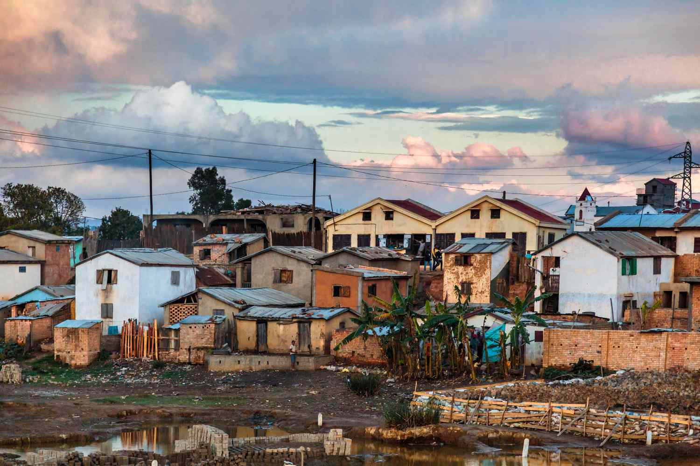

Understanding poverty is crucial for developing effective economic policies and promoting social equity. Poverty is a multifaceted issue that requires accurate measurement to devise strategies for its alleviation. Various metrics exist to encapsulate the different dimensions of poverty, such as the poverty index, which quantifies the proportion of the population living below a predetermined poverty line, and the poverty gap, which measures the average shortfall of the incomes of the poor relative to the poverty line. These metrics provide a clearer picture of economic deprivation and help tailor policies to effectively combat poverty.

Concurrently, advancements in technology and finance, particularly algorithmic trading, or 'algo trading', have introduced new paradigms in economic empowerment. Algorithmic trading employs complex computational algorithms to execute trades, offering higher speed and efficiency than traditional trading methods. This technological evolution raises questions about its potential impact on economic opportunities and whether it can play a role in reducing economic disparities.



This article aims to explore the intersection of poverty measurement and financial technology. By understanding how these two domains might converge, there is potential to address economic disparities more efficiently. The digital transformation of finance could provide innovative means to promote economic inclusivity, offering a promising albeit complex landscape for policymakers, technologists, and social researchers to navigate.

## Table of Contents

## Poverty Measurement: An Overview

Poverty measurement serves as an essential tool for policymakers and researchers, enabling them to assess the extent and depth of poverty across various regions. Central to this assessment are metrics such as the poverty index and the poverty gap.

The poverty index, often referred to as the headcount ratio, quantifies the proportion of individuals living below a specified poverty line. This line is typically determined by estimating the minimum income level required to meet basic needs, including food, shelter, and clothing. By calculating the percentage of the population that falls below this threshold, the poverty index provides a straightforward measure of poverty prevalence. For instance, if a country has a population of 1 million and 100,000 individuals are below the poverty line, the poverty index would be 10%.

However, the poverty index does not account for the depth or severity of poverty—it merely indicates how many people are poor without revealing how poor they are. This is where the poverty gap comes into play. The poverty gap measures the average shortfall of income from the poverty line, expressed as a percentage of that line. It provides insight into the intensity of poverty by calculating how far, on average, the incomes of those below the poverty line fall from the line itself.

The formula for the poverty gap can be expressed as:

$$
PG = \frac{1}{N} \sum_{i=1}^{q} \left( \frac{z - y_i}{z} \right)
$$

Where:
- $PG$ is the poverty gap.
- $N$ is the total population.
- $q$ is the number of people below the poverty line.
- $z$ is the poverty line.
- $y_i$ is the income of individual $i$.

This equation highlights that the poverty gap not only considers the number of individuals below the poverty line ($q$) but also captures how far their income ($y_i$) falls short of the required level ($z$).

The World Bank and other international organizations often use both the poverty index and the poverty gap to assess and compare poverty across different countries and regions, aiding in designing targeted poverty alleviation strategies. By employing these measurements, policymakers can identify not just the prevalence of poverty but also prioritize interventions for those who are severely impoverished.

## Explaining the Poverty Gap

The poverty gap offers a quantitative measure of the severity of poverty beyond the basic headcount ratio, which merely reports the number of individuals living below the poverty line. By estimating the average shortfall of the incomes of the poor relative to the poverty line, the poverty gap index provides a more nuanced understanding of poverty dynamics. Mathematically, the poverty gap can be expressed as follows:

$$
\text{Poverty Gap Index} = \frac{1}{N} \sum_{i=1}^{q} \left( \frac{z - y_i}{z} \right)
$$

where:
- $N$ is the total population,
- $q$ is the number of individuals with income $y_i$ below the poverty line $z$,
- $z - y_i$ represents the income shortfall of the $i$-th individual.

This calculation helps in identifying not only the prevalence of poverty but also the depth of it across the population, providing valuable insights for policymakers. The poverty gap is particularly effective in highlighting the resources required to bring all individuals below the poverty line up to this threshold, essentially offering a measure of the intensity of poverty.

The World Bank utilizes the poverty gap to assess global poverty, facilitating the comparison of poverty severity among different countries and regions. It informs the determination of international poverty lines and the allocation of resources and strategies aimed at poverty reduction. The broader application of this metric enables global institutions and national governments alike to tailor their economic interventions to not merely reduce the number of people in poverty but to address the severe income deficits of those already impoverished.

## Poverty Gap and Index in the U.S.

The United States employs specific poverty guidelines designed to account for variations across different states and household sizes. These guidelines are essential in calculating and understanding both the poverty index and the poverty gap within the country. The poverty index quantifies the proportion of individuals living below a designated poverty line, while the poverty gap measures the intensity of poverty by determining the average shortfall of the incomes of the poor in comparison to the poverty line.

In the U.S., the poverty line is established by the Department of Health and Human Services (HHS) and is used to determine eligibility for various federal assistance programs. These poverty guidelines are adjusted annually based on inflation and other economic factors. They vary according to household size and geographic location, with distinct multiples of thresholds applied to the 48 contiguous states, Alaska, and Hawaii due to differences in cost of living. For example, the poverty guideline is typically higher in Alaska and Hawaii compared to the mainland states.

Understanding the U.S. poverty gap allows policymakers to craft targeted measures aimed at addressing both the prevalence and intensity of poverty more effectively. The poverty gap serves as an indicator of how much additional income is required to elevate all individuals up to the poverty line, providing valuable insights into the economic needs of impoverished populations. This measurement is crucial for informing social programs and fiscal policies that are designed to reduce poverty at both the federal and state levels.

Federal programs, such as food assistance and health care, rely on poverty guidelines to determine eligibility, directly influencing the allocation of resources intended to alleviate poverty. Moreover, state-level programs may also use these guidelines to customize interventions that address local economic conditions and demographic realities.

In policy formulation, understanding the poverty gap is pivotal to designing comprehensive strategies that not only reduce the number of individuals living in poverty but also lessen the economic shortfalls they face. By acknowledging both the quantitative and qualitative aspects of poverty, these measures aim to foster an equitable distribution of resources, contributing significantly to long-term efforts to combat poverty in the U.S.

## The Role of Algorithmic Trading (Algo Trading)

Algorithmic trading, often referred to as algo trading, involves the use of advanced mathematical models and computer algorithms to execute trading decisions at remarkable speeds and efficiencies. This method of trading has become increasingly prevalent in modern financial markets, essentially transforming how trades are initiated and completed. Through automation, algo trading enables the processing of large volumes of data, allowing traders to capture minute price discrepancies and optimize their transactions more effectively than traditional methods.

Central to the efficiency of [algorithmic trading](/wiki/algorithmic-trading) is its capacity to employ various strategies, such as [arbitrage](/wiki/arbitrage), [market making](/wiki/market-making), and [trend following](/wiki/trend-following). These strategies are executed with minimal human intervention, leveraging sophisticated algorithms to manage data and execute orders in milliseconds. For example, a simple Python code snippet to outline a basic moving average crossover strategy might look like this:

```python
def moving_average(data, window_size):
    return data.rolling(window=window_size).mean()

def trade_signal(data, short_window, long_window):
    short_ma = moving_average(data, short_window)
    long_ma = moving_average(data, long_window)

    signal = np.where(short_ma > long_ma, 1, 0)  # Buy if short MA > long MA
    return signal

# Example use with stock data
data = pd.Series([120, 121, 125, 126, 124, 123, 127, 128])
signal = trade_signal(data, short_window=3, long_window=5)
```

Algorithmic trading has reshaped financial markets by enhancing [liquidity](/wiki/liquidity-risk-premium) and narrowing bid-ask spreads. However, it also introduces new complexities and potential risks, including market [volatility](/wiki/volatility-trading-strategies) and flash crashes. A notable instance was the "Flash Crash" of May 6, 2010, when the Dow Jones Industrial Average dropped nearly 1,000 points within minutes, largely attributed to high-frequency trading ([HFT](/wiki/high-frequency-trading-strategies)), a subset of algorithmic trading. This event highlighted how algorithms, while appearing efficient, could collectively exacerbate market volatility under specific conditions.

The advent of algo trading prompts discussions regarding its impact on economic opportunities and disparities. While it democratizes access to markets by enabling individual traders to deploy sophisticated strategies similar to those of institutional investors, it also tends to advantage those with superior infrastructure and technological resources. Consequently, this dichotomy raises concerns about compounded economic inequalities, as entities with greater technological capabilities can potentially dominate market activities.

In conclusion, algorithmic trading is a powerful tool that has forever altered the investment landscape, offering both enhanced efficiencies and inherent risks. Its role in possibly contributing to economic inequalities warrants careful consideration, particularly as financial markets continue to evolve with advancing technologies.

## Intersection of Poverty Measurement and Financial Technology

The digital transformation of finance holds significant potential for impacting socioeconomic disparities, with access to financial markets acting as a crucial tool for economic empowerment. Financial technology, particularly algorithmic trading, has revolutionized the accessibility and speed of trading, allowing more individuals to participate in markets that were once dominated by institutional investors.

Access to these markets can provide individuals, including those in impoverished areas, with opportunities to generate income and improve their economic situation. Platforms and applications designed to facilitate trading, accompanied by educational resources, can empower users with limited financial backgrounds. The increased availability of financial data and analytical tools enables traders to make informed decisions, potentially leading to profitable outcomes that could supplement income and help lift individuals out of poverty.

To align algorithmic trading with poverty reduction goals, innovative policies need to be formulated. This can include initiatives that promote the development of inclusive fintech solutions and educational programs that are specifically targeted at economically disadvantaged groups. By lowering the barriers to entry in algorithmic trading, more individuals without substantial capital or advanced technical skills can potentially benefit from these financial markets.

One approach to fostering inclusivity is the implementation of regulatory measures that ensure fairness and prevent systemic risks associated with high-frequency trading. Policies could mandate transparency and equal access to market data to prevent manipulation and ensure that algorithmic trading benefits a broader demographic.

The integration of poverty measurement tools with financial technology can enhance the targeting of poverty alleviation efforts. By using poverty data to identify underserved areas, fintech solutions can be tailored to address specific community needs. This targeted approach not only benefits individuals directly but also encourages economic growth within these communities, creating a multiplier effect.

Furthermore, the use of [machine learning](/wiki/machine-learning) and [artificial intelligence](/wiki/ai-artificial-intelligence) in algorithmic trading can offer predictive insights into market trends and economic conditions. These insights can be harnessed by policymakers to develop strategies that align financial market developments with broader socioeconomic objectives, including poverty reduction.

Overall, the intersection of poverty measurement and financial technology presents significant opportunity for economic inclusion. By strategically leveraging algorithmic trading and crafting thoughtful policies, we can work towards reducing economic disparities and enhancing the potential for financial technologies to contribute to poverty alleviation.

## Challenges and Opportunities

Balancing the benefits of algorithmic trading with its risks requires careful policy design and regulation. Algorithmic trading, while enhancing efficiency and liquidity in financial markets, poses several risks, including market volatility, systemic risks, and reinforcing existing economic inequalities. To address these, policymakers need to develop comprehensive regulatory frameworks that mitigate potential negative impacts while maximizing the opportunities algorithmic trading can offer.

Ensuring equitable access to financial technology is critical in mitigating socioeconomic disparities. Access to financial markets through technologies like algo trading has traditionally been restricted to institutional investors and individuals with considerable resources. Policies aimed at democratizing access to these technologies—such as implementing educational initiatives and creating platforms for retail investors—can provide broader participation, thereby allowing economically disadvantaged groups to benefit from financial market growth. 

Moreover, the potential for financial technologies to play a role in poverty alleviation is substantial if implemented inclusively. By developing tools and platforms that cater to low-income groups, financial institutions can facilitate access to financial resources and promote economic stability. For instance, micro-investment platforms and algorithm-driven credit scoring systems could offer low-income individuals opportunities for growing their wealth and enhancing their creditworthiness, respectively.

Careful regulation is essential to balance these benefits against the inherent risks of algorithmic trading. Regulators must monitor market practices to prevent unfair advantages and maintain market integrity. Algorithmic trading's complexity necessitates transparency measures, such as the disclosure of trading algorithms and strategies to regulatory bodies, to ensure that systems do not exploit market vulnerabilities. 

In summary, the challenge lies in crafting policies that ensure both the safe implementation of algorithmic trading technologies and equitable access for all socioeconomic groups. Through inclusive policies and vigilant regulation, financial technologies can significantly contribute to poverty alleviation, aligning economic growth with social equity objectives.

## Conclusion

The convergence of tools for poverty measurement and financial technology presents a promising but complex landscape. The intersection of these fields offers innovative avenues for addressing socio-economic disparities. By leveraging algorithmic trading for economic inclusivity, there is potential to address poverty more effectively. Algorithmic trading, with its speed and efficiency, could democratize access to financial markets, traditionally plagued by barriers such as high entry costs and information asymmetry. If structured inclusively, algorithmic trading systems could provide marginalized groups with greater financial opportunities, potentially reducing poverty levels.

Achieving these aims necessitates ongoing dialogue between policymakers, financial technologists, and social researchers. Such collaboration is crucial to designing systems and standards that mitigate risks and ensure equitable access. Importantly, policies must be developed to safeguard against exacerbating existing inequalities through technology misuse. Considerations around data privacy, ethical algorithms, and equitable access should be at the forefront of these discussions.

As the digital transformation of finance progresses, the potential for financial technologies to play a role in poverty alleviation is notable. However, the benefits of such technologies will only be realized through thoughtful implementation and inclusive policy-making aimed at bridging the digital divide. In this rapidly evolving landscape, continuous assessment and adaptation of policies and technologies will be vital to harnessing their full potential for social and economic equity.

## References & Further Reading

[1]: World Bank. [Poverty Measurement Methods](https://www.worldbank.org/en/topic/measuringpoverty).

[2]: Deaton, A. (1997). ["The Analysis of Household Surveys: A Microeconometric Approach to Development Policy."](https://documents.worldbank.org/en/publication/documents-reports/documentdetail/593871468777303124/the-analysis-of-household-surveys-a-microeconometric-approach-to-development-policy) The World Bank.

[3]: Lopez de Prado, M. (2018). ["Advances in Financial Machine Learning."](https://www.amazon.com/Advances-Financial-Machine-Learning-Marcos/dp/1119482089) Wiley.

[4]: Aronson, D. (2006). ["Evidence-Based Technical Analysis: Applying the Scientific Method and Statistical Inference to Trading Signals."](https://www.amazon.com/Evidence-Based-Technical-Analysis-Scientific-Statistical/dp/0470008741) Wiley.

[5]: Jansen, S. (2020). ["Machine Learning for Algorithmic Trading - Second Edition."](https://www.oreilly.com/library/view/machine-learning-for/9781839217715/) Packt Publishing.

[6]: Ravallion, M. (1994). ["Poverty Comparisons."](https://www.taylorfrancis.com/books/mono/10.4324/9781315015095/poverty-comparisons-ravallion) Routledge.

[7]: High-Level Experts and Leaders Panel on Water and Disasters (HELP). (2020). ["The Impact of COVID-19 on Water and Sanitation and Also Poverty: A WASH Perspective."](https://www.wateranddisaster.org/) United Nations.