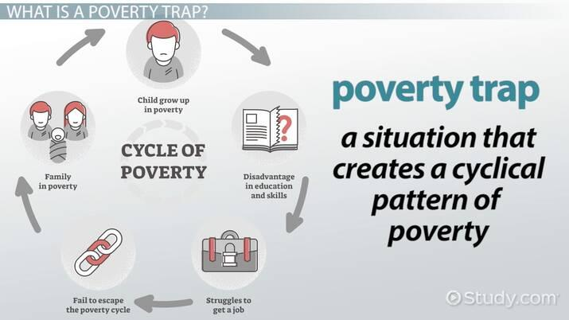

## Table of Contents

## What is a poverty trap?

A poverty trap is a situation where people or families stay poor because they can't get the resources they need to improve their lives. Imagine trying to climb out of a deep hole, but every time you try to climb, the walls crumble and you fall back down. This is what a poverty trap feels like. People in poverty traps often can't afford good education, healthcare, or even enough food, which makes it hard for them to find better jobs or save money.

For example, if someone is too poor to go to school, they might not learn the skills needed for a good job. Without a good job, they can't earn enough money to go to school or get better healthcare. This cycle keeps them trapped in poverty. Governments and organizations try to help by providing things like free education, healthcare, and financial aid, but breaking out of a poverty trap can still be very difficult.

## What are the common indicators of a poverty trap?

Common indicators of a poverty trap include low income and lack of savings. People stuck in a poverty trap often earn just enough to get by, but not enough to save money or invest in their future. This means they can't afford things like education or starting a small business, which could help them earn more money later. Without savings, any unexpected expense, like a medical bill or car repair, can push them even deeper into poverty.

Another indicator is poor access to education and healthcare. When people can't afford to go to school, they miss out on learning important skills that could lead to better jobs. Similarly, without good healthcare, they might get sick more often and can't work as much, which keeps their income low. This cycle of low education and poor health makes it hard for them to break out of the poverty trap.

Lastly, living in areas with few job opportunities is a big sign of a poverty trap. If there are no good jobs nearby, people can't earn enough money to improve their lives. Moving to a place with better job opportunities can be too expensive, so they stay where they are, stuck in poverty. This lack of mobility keeps them trapped in their current situation, unable to find a way out.

## How does lack of education contribute to poverty traps?

Lack of education makes it hard for people to get good jobs. When someone doesn't go to school, they miss out on learning important skills like reading, writing, and math. These skills are needed for many jobs that pay well. Without them, people often end up in low-paying jobs that don't offer much chance to earn more money. This keeps them stuck in poverty because they can't afford to go back to school or learn new skills.

Not having education also means people might not know about opportunities that could help them. For example, they might not know about government programs that offer free training or financial help. Without this knowledge, they can't take advantage of these resources. Over time, this lack of information and skills keeps them trapped in a cycle of poverty, making it very hard to break free and improve their lives.

## What role does geographic location play in creating poverty traps?

Where someone lives can make it hard for them to escape poverty. If you live in a place with few jobs, it's tough to find work that pays well. These areas often don't have big companies or industries that offer good jobs. Without good job opportunities nearby, people can't earn enough money to save or invest in their future. This keeps them stuck in poverty because they can't afford to move to a place with better job prospects.

Living in a remote or rural area can also mean less access to important services like good schools and hospitals. If the nearest school is far away, kids might not be able to go, which means they miss out on education. Without education, they can't get the skills needed for better jobs. Similarly, if healthcare is hard to reach, people might get sick more often and can't work as much. All these factors together create a situation where people can't improve their lives, trapping them in poverty.

## How do health issues perpetuate poverty traps?

Health issues can keep people stuck in poverty. When someone is sick, they might not be able to work as much or at all. This means they earn less money, which makes it hard to pay for things like food, rent, and medicine. Without enough money, they can't afford to see a doctor or get the treatment they need. This makes their health worse, and the cycle continues, trapping them in poverty.

Living in poverty can also make health problems worse. Poor people often can't afford good healthcare, so they might not get the care they need to stay healthy. They might live in crowded or dirty conditions, which can lead to more sickness. When people are always worried about money, it can also cause stress, which is bad for their health. All these things together make it very hard for someone to break out of a poverty trap.

## What are the economic factors that lead to poverty traps?

Economic factors play a big role in creating poverty traps. One major [factor](/wiki/factor-investing) is low wages. When people earn very little money, they can't save or invest in things like education or starting a business. This means they stay stuck in low-paying jobs because they can't afford to improve their skills or take risks that could lead to better opportunities. Another factor is lack of access to credit. Without the ability to borrow money, people can't start businesses or pay for education, which keeps them from [earning](/wiki/earning-announcement) more in the future.

Another economic factor is high inflation. When prices for things like food and housing go up quickly, people's money doesn't go as far. This makes it hard for them to afford basic needs, let alone save money. High inflation can also make it harder for people to plan for the future because they don't know how much things will cost. All these economic factors together make it very difficult for people to break out of poverty traps and improve their lives.

## How do social and cultural factors influence poverty traps?

Social and cultural factors can make poverty traps even harder to escape. One big factor is discrimination. If people are treated unfairly because of their race, gender, or where they come from, they might not get the same chances as others. This can mean they don't get good jobs or education, which keeps them poor. Another factor is social networks. If everyone around you is also poor, it can be hard to find people who can help you find better opportunities. You might not know anyone with a good job or the right connections to help you move up.

Culture can also play a role in poverty traps. In some places, there might be beliefs or traditions that make it hard for people to improve their lives. For example, if a culture values staying in the same job or role as your parents, people might not try to get new skills or move to a different place for better opportunities. Also, if a community doesn't value education, kids might not go to school, which means they miss out on learning important skills. All these social and cultural factors together can make it very hard for people to break out of poverty traps.

## What are some government policies that can help break poverty traps?

Governments can help break poverty traps by making sure everyone can go to school for free. When kids get a good education, they learn important skills that help them get better jobs later. Governments can also give money to poor families so they can buy food and pay for other basic needs. This helps them not worry so much about money and focus on improving their lives. Another way is to make sure everyone can see a doctor when they're sick, without it costing too much. Good healthcare keeps people healthy so they can work and earn money.

Governments can also create more jobs by building new roads, schools, and hospitals. When there are more jobs, people can work and earn money to support their families. They can also make rules that stop companies from paying very low wages. This helps people earn enough to save money and invest in their future. By doing these things, governments can help people break out of poverty traps and have a better life.

## How can microfinance initiatives address poverty traps?

Microfinance initiatives can help people stuck in poverty traps by giving them small loans. These loans are often used to start or grow small businesses. When someone starts a business, they can earn more money than they would from a low-paying job. This extra money can help them pay for things like food, education, and healthcare. Over time, as their business grows, they can save more money and invest in even better opportunities, helping them break out of the poverty trap.

Microfinance also helps by teaching people about money and how to manage it. Many people in poverty traps don't know how to save or invest their money wisely. Microfinance programs often include classes that teach these skills. When people learn how to handle their money better, they can make smarter choices about spending and saving. This knowledge can help them avoid falling back into poverty and build a more stable future for themselves and their families.

## What are the long-term effects of poverty traps on communities?

Poverty traps can hurt whole communities over a long time. When many people in a community are stuck in poverty, it can make the whole place poorer. Kids might not go to school because their families can't afford it, so they grow up without the skills they need for good jobs. This means the next generation stays poor too. Also, if people can't afford to see a doctor, they might get sick more often, which makes it hard for them to work and earn money. This cycle of poverty can go on for many years, making it hard for the community to get better.

Over time, poverty traps can also make a community less safe and happy. When people are always worried about money, they might feel stressed and unhappy. This can lead to more crime and problems in the community. Also, if there are no good jobs or opportunities, young people might leave to find work elsewhere. This can make the community smaller and weaker, with fewer people to help make it a better place. Breaking out of a poverty trap is hard, but it's important for the long-term health and happiness of the whole community.

## How can international aid be effectively used to combat poverty traps?

International aid can help fight poverty traps by giving money and resources to poor countries. This money can be used to build schools and hospitals, so kids can get a good education and people can stay healthy. When people are healthy and educated, they can work better and earn more money. Aid can also be used to start programs that teach people new skills or help them start small businesses. These programs can help people earn more money and break out of poverty.

Another way international aid can help is by supporting governments to make good policies. For example, aid can help governments give money to poor families so they can buy food and pay for other basic needs. This helps families not worry so much about money and focus on improving their lives. Aid can also help governments create more jobs by building roads, schools, and hospitals. When there are more jobs, people can work and earn money to support their families. By using international aid in these ways, it can help people break out of poverty traps and build a better future.

## What innovative solutions are being explored to dismantle poverty traps?

One innovative solution to dismantle poverty traps is using technology to help people learn and earn money. For example, mobile apps can teach people new skills or help them find jobs. In some places, people use their phones to learn about farming or starting a small business. This can help them earn more money and improve their lives. Another idea is using digital money to make it easier for poor people to save and spend. With digital money, people can get paid faster and don't have to worry about carrying cash, which can be risky.

Another solution is focusing on helping whole communities, not just individuals. This can mean building better roads and schools in poor areas so everyone can benefit. When a community has good services, it's easier for people to get jobs and stay healthy. Some groups are also trying new ways to help people work together to solve problems. For example, they might start a community garden where everyone can grow food and share it. This can help people eat better and feel more connected to their neighbors, making the whole community stronger and less poor.

## References & Further Reading

[1]: Sachs, J. D. (2005). ["The End of Poverty: Economic Possibilities for Our Time."](https://globaljournals.org/GJMBR_Volume14/8-Jeffrey-Sachs.pdf) Penguin Press.

[2]: Lopez de Prado, M. (2018). ["Advances in Financial Machine Learning."](https://www.amazon.com/Advances-Financial-Machine-Learning-Marcos/dp/1119482089) Wiley.

[3]: Banerjee, A. V., & Duflo, E. (2011). ["Poor Economics: A Radical Rethinking of the Way to Fight Global Poverty."](https://books.google.com/books/about/Poor_Economics.html?id=2dlnBoX4licC) PublicAffairs.

[4]: Bourguignon, F. (2006). ["From Income to Endowments: The Difficult Task of Expanding the Income Poverty Paradigm."](https://www.degruyter.com/document/doi/10.1515/9780804767590-005) In Understanding Poverty.

[5]: World Bank Group. (2015). ["World Development Report 2015: Mind, Society, and Behavior."](https://www.worldbank.org/en/publication/wdr2015) World Bank.

[6]: Stiglitz, J. E. (2012). ["The Price of Inequality: How Today's Divided Society Endangers Our Future."](https://business.columbia.edu/sites/default/files-efs/imce-uploads/Joseph_Stiglitz/Price%20of%20Inequality%20for%20Sustainable%20Humanity.pdf) W.W. Norton & Company.

[7]: Marr, B. (2018). ["Data-Driven Transformations: Businesses Adopting Machine Learning for Trading Decisions."](https://openlibrary.org/books/OL26964648M/Data-driven_HR) Forbes.

[8]: Goolsbee, A., & Levitt, S. (2006). ["Microeconomic Evidence on the Housing Wealth Effect."](https://archive.org/details/microeconomics0002gool) Quarterly Journal of Economics.