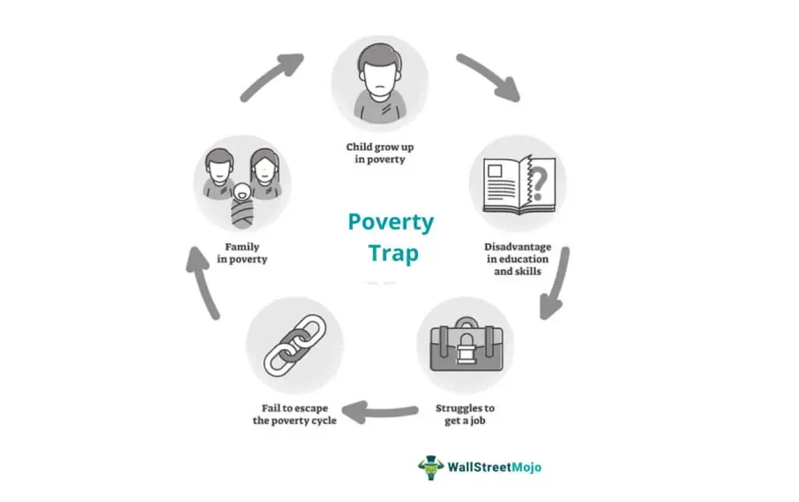

A poverty trap is a self-reinforcing mechanism that causes poverty to persist. This concept is significant in the global economy as it explains why some countries or populations fail to progress economically despite external aid or policy interventions. When individuals or communities are caught in a poverty trap, they lack the income necessary to invest in their futures, which perpetuates a cycle of poverty. These are often regions where access to fundamental resources such as education, healthcare, and infrastructure is severely limited. Understanding poverty traps is crucial because they present significant barriers to economic development and affect a substantial portion of the global population.

This article aims to explore the various causes of poverty traps and discuss potential solutions to overcome them. By examining economic, socio-political, and environmental factors, we strive to present a comprehensive overview of the mechanisms that perpetuate poverty. Moreover, the article emphasizes economic solutions like education, governance reforms, and financial inclusion initiatives to break these cycles.

In recent years, the emergence of algorithmic trading has shown potential in influencing economic systems. Algorithmic trading involves using computer programs to execute trades at high speed and volume, and it has become a dominant force in modern financial markets. Its relevance to poverty alleviation lies in its ability to foster economic growth and stability. By improving the efficiency of financial markets and enabling better resource allocation, algorithmic trading can play a role in supporting economic systems and potentially alleviating poverty.

Thus, this article also explores how integrating algorithmic trading with traditional economic solutions could offer innovative methods for addressing poverty traps. By leveraging technology and financial advancements, there is potential for policymakers and experts to develop holistic strategies focused on sustainable economic growth and poverty reduction. This combination of methodologies signifies a forward-thinking approach towards tackling one of the most persistent issues within the global economy.

## Table of Contents

## Understanding Poverty Traps

A poverty trap refers to a self-reinforcing mechanism that causes poverty to persist. It is characterized by a cycle in which low income leads to low savings and investments, resulting in limited capital accumulation. Consequently, individuals and communities are unable to improve their situation, maintaining a state of poverty over generations. The cyclical nature of poverty traps can be described using the following basic logic: $\text{low income} \rightarrow \text{low investment} \rightarrow \text{low productivity} \rightarrow \text{low income}$.

Various factors contribute to the persistence of poverty traps. Poor access to education is a significant contributor, as it deprives individuals of the skills and knowledge needed to increase productivity and income. Limited healthcare restricts people's ability to work and thrive, often causing income-generating activities to be interrupted due to illness or premature death. Moreover, a lack of infrastructure, such as roads, utilities, and communication systems, hinders economic activities and market accessibility, restricting opportunities for income generation and improvement in living standards.

Key theories related to poverty traps provide different lenses for understanding these dynamics. Jeffrey Sachs, a prominent economist, emphasizes the role of initial conditions and geographic challenges in the entrenchment of poverty. According to Sachs, adverse geographical conditions, such as harsh climates or landlocked locations, can severely limit economic opportunities, thus reinforcing poverty. Sachs argues for interventions that address these foundational issues, suggesting that changes in environmental and infrastructural factors are critical for escaping poverty traps.

In summary, poverty traps are sustained by a complex interplay of economic and structural factors that maintain low income levels across generations. Understanding these dynamics is essential for developing effective strategies to break these cycles and foster sustainable economic growth.

## Causes of Poverty Traps

Poverty traps are a persistent economic challenge characterized by self-reinforcing mechanisms that cause poverty to persist across generations. Understanding the causes of poverty traps is crucial for developing effective interventions. These causes can be broadly categorized into economic, socio-political, and environmental factors.

### Economic Factors

One of the primary economic factors contributing to poverty traps is limited access to capital and credit markets. The inability to obtain sufficient financial resources hinders individuals and communities from investing in productivity-enhancing activities such as education, entrepreneurial ventures, or agricultural improvements. This lack of investment perpetuates low income and economic stagnation. The absence of collateral and high transaction costs often exclude the poor from participating in formal credit systems, thus making it difficult for them to break out of poverty cycles.

### Socio-Political Factors

Socio-political factors such as corrupt governance and institutional weaknesses also play a significant role. Corruption can divert resources away from essential services like education and healthcare, reducing their accessibility and quality. When leaders prioritize personal gain over public welfare, it leads to inefficient resource allocation and reduced public investment in development projects. Weak institutions may fail to enforce contracts, protect property rights, or maintain a stable economic environment, further discouraging investment and innovation. This creates an unfavorable climate for economic growth, perpetuating poverty.

### Environmental Factors

Environmental causes, encompassing geographic isolation and resource depletion, significantly exacerbate poverty traps. Communities located in remote areas often lack access to markets, healthcare, and education, resulting in limited economic opportunities. Geographic isolation can also hinder infrastructure development such as roads, communication networks, and electricity, which are vital for economic integration and growth. Additionally, resource depletion, including deforestation, soil degradation, and water scarcity, can severely impact agricultural productivity and food security. This environmental degradation reduces income-generating capabilities, further entrenching communities in poverty.

In conclusion, the causes of poverty traps are multifaceted, involving interlinked economic, socio-political, and environmental factors. Addressing these challenges requires a comprehensive approach that enhances access to capital, strengthens governance and institutions, and mitigates environmental limitations. Robust strategies must focus on enabling sustainable economic opportunities and improving access to critical services, thereby facilitating pathways out of poverty.

## Economic Solutions to Overcome Poverty Traps

Addressing poverty traps necessitates a multifaceted approach that encompasses improvements in education, healthcare, infrastructure, governance, and financial inclusion. These elements are crucial in fostering an environment where individuals and communities can overcome the cyclical nature of poverty.

Education and healthcare play pivotal roles in breaking poverty cycles. Access to quality education equips individuals with skills and knowledge, enabling them to pursue better employment opportunities and improve their standard of living. Education is linked to higher income levels, reduced inequality, and improved social mobility, all of which are essential in mitigating poverty traps. Similarly, access to healthcare is critical as it ensures a healthy population capable of participating effectively in economic activities. A healthy workforce boosts productivity and economic growth while reducing vulnerabilities that can lead to poverty.

Infrastructure development is equally important. Adequate infrastructure, such as transportation, energy, and communication systems, facilitates trade, enhances access to markets, and promotes business development. Infrastructure projects can generate employment and stimulate local economies, making them vital in addressing poverty. Furthermore, governance reforms are essential to establish a transparent, efficient, and accountable system that fosters economic stability and equitable resource distribution. Effective governance attracts investment and ensures that public resources are utilized to benefit the broader society rather than a select few.

Financial inclusion initiatives are crucial for expanding access to credit and capital, which are often limited in poverty-stricken areas. These initiatives focus on providing financial services like savings accounts, credit, and insurance products to underserved populations, enabling them to invest in education, healthcare, and businesses. Microfinance institutions and mobile banking innovations have demonstrated success in reaching marginalized communities, offering them tools to improve their financial standing. By facilitating access to credit and capital, financial inclusion empowers individuals and small enterprises, fostering entrepreneurship and reducing dependency on informal and often exploitative lending sources.

In conclusion, economic solutions targeting education, healthcare, infrastructure, governance, and financial inclusion provide a comprehensive framework to break the persistent cycle of poverty traps. These solutions are interdependent, addressing various facets of poverty and laying the groundwork for sustainable development and prosperity.

## Algorithmic Trading and Economic Systems

Algorithmic trading, a method employed in modern financial markets, involves the use of computer algorithms to automate the process of buying and selling securities. This approach leverages complex mathematical models and high-speed data analysis to execute trades at a pace and precision beyond human capabilities. The adoption of [algorithmic trading](/wiki/algorithmic-trading) has surged in recent years, significantly transforming the dynamics of financial markets.

The primary impact of algorithmic trading on modern financial markets includes enhanced efficiency and [liquidity](/wiki/liquidity-risk-premium). By executing trades at exceptional speeds with minimized transaction costs, algorithmic trading contributes to a more fluid market environment. This heightened liquidity ensures that assets can be bought and sold with greater ease, reducing [volatility](/wiki/volatility-trading-strategies) and fostering a stable market setting. Moreover, algorithmic trading aids in narrowing the bid-ask spread, which is the difference between the prices quoted for an immediate sale (bid) and purchase (ask) of an asset, further promoting a more equitable trading landscape.

Despite these advantages, the influence of algorithmic trading on economic stability and resource allocation is multifaceted. On one hand, the rapid execution and [high frequency](/wiki/high-frequency-trading) of trades can exacerbate market instability. Notable instances, such as the "Flash Crash" of 2010, have highlighted how algorithmic trading can trigger dramatic fluctuations in market prices, leading to broader economic uncertainties. Consequently, the implementation of robust regulations and oversight mechanisms is crucial to mitigate potential risks associated with algorithmic trading.

Algorithmic trading's contribution to economic stability is intertwined with its ability to optimize resource allocation. By offering sophisticated analytical tools, algorithmic trading systems can identify market inefficiencies and capitalize on price disparities, thereby facilitating a more efficient allocation of financial resources. This improved allocation can lead to enhanced investment growth, which is fundamental to economic development and poverty alleviation.

Investment growth spurred by algorithmic trading holds the potential to address poverty alleviation by channeling resources towards sectors and regions that require development. For instance, investment in emerging markets can stimulate economic activities, creating jobs and fostering income growth for local populations. Furthermore, algorithmic trading can support financial inclusion by enabling more market participants, including those from underrepresented regions, to engage in financial markets.

While algorithmic trading presents opportunities for promoting economic growth and addressing poverty, its integration within economic systems demands careful consideration. Ensuring ethical practices in algorithmic trading is paramount, as is the development of frameworks that align trading activities with broader economic objectives. Through responsible application, algorithmic trading can serve as a powerful tool to bolster investment and facilitate sustainable economic development.

## Integrating Algo Trading in Poverty Reduction Strategies

Algorithmic trading, a technique that leverages advanced mathematical models and high-speed data processing to make trading decisions, has seen increasing adoption in both developed and developing economies. While initially concentrated in the world’s major financial centers, its influence is beginning to permeate emerging markets, where it can play a role in fostering economic growth and reducing poverty.

### Case Studies and Economic Impact

In some developing regions, algorithmic trading has been introduced as part of financial development initiatives. For example, in countries like Kenya and Ghana, financial technology companies have utilized algorithmic trading to optimize foreign exchange transactions. These optimizations reduce transaction costs and improve liquidity, critically benefiting small and medium enterprises (SMEs) that are typically underserved by traditional financial systems. Improved liquidity allows these enterprises to expand and can lead to job creation, driving economic growth.

Another case can be observed in Southeast Asia, where algorithmic trading platforms have facilitated investments in local infrastructure projects. By automating the trading of project-finance instruments, these platforms have attracted foreign investments and reduced the time taken to raise capital for development projects, thus accelerating regional growth.

### Ethical Considerations and Potential Pitfalls

However, the integration of algorithmic trading is not without challenges. One crucial pitfall is the potential for increased market volatility. Algorithmic models can exacerbate price fluctuations due to rapid trading based on programmed strategies, which could destabilize emerging markets. Additionally, there is a risk of wealth concentration, where the benefits of algorithmic trading are largely captured by those with access to technology and data, leaving disadvantaged populations behind.

Ethically, there is also concern about data privacy and the transparency of algorithmic decisions. Developing regions may lack robust regulatory frameworks to monitor and control the impact of these technologies adequately, resulting in exploitation and financial exclusion of vulnerable communities.

### Frameworks for Responsible Use

To leverage algorithmic trading responsibly in poverty reduction strategies, several frameworks can be proposed:

1. **Inclusive Access**: Developing infrastructure to ensure equal access to algorithmic trading technology. Initiatives could focus on training programs and partnerships with educational institutes to build local expertise in financial technology.

2. **Regulatory Oversight**: Establishing comprehensive regulations to oversee algorithmic trading practices. These should focus on ensuring transparency, fairness, and accountability, including mechanisms to monitor for market manipulation and protect consumer data.

3. **Shared Value Models**: Encouraging models where profits generated from algorithmic trading are reinvested into community development projects or micro-enterprises. For example, setting up community investment funds could distribute benefits more evenly among local populations.

4. **Ethical Algorithm Design**: Promoting the development of algorithms with built-in ethical guidelines. This could include constraints to prevent excessive risk-taking or mechanisms to prioritize trades that align with sustainable development goals.

Integrating algorithmic trading into poverty reduction strategies presents significant opportunities for economic growth but must be approached with careful consideration of potential risks and ethical implications. By establishing a balanced framework, it is possible to harness the power of this technology to create more inclusive and sustainable economic systems in developing regions.

## Conclusion

The article reviewed the concept of the poverty trap, essential elements influencing it, and strategies that can break these cycles. Poverty traps arise when impoverished communities find themselves in self-reinforcing conditions due to lack of resources. Factors contributing to these traps include economic limitations like scarce access to capital, socio-political issues such as governance deficiencies, and environmental challenges like geographic isolation. Addressing poverty effectively demands a multi-dimensional strategy.

Traditional remedies such as improved education, healthcare, and infrastructure development are pivotal in breaking the cycle of poverty. Simultaneously, the modern economy provides new tools, such as algorithmic trading, which could augment these efforts. Algorithmic trading offers potential advantages by enhancing resource allocation efficiency and providing new avenues for investment growth, thus potentially fostering economic stability in developing regions. However, careful integration is necessary to manage risks and ethical concerns.

This synthesis of conventional and advanced technological methods could redefine poverty alleviation strategies. Policymakers and financial experts are urged to employ a balanced approach, considering both traditional economic reforms and technological integration to break poverty cycles effectively. This holistic strategy offers a promising pathway to addressing the persistent challenge of poverty traps, potentially leading to sustainable economic growth and development.

## References & Further Reading

[1]: Sachs, J. D. (2005). ["The End of Poverty: Economic Possibilities for Our Time."](https://globaljournals.org/GJMBR_Volume14/8-Jeffrey-Sachs.pdf) Penguin Press.

[2]: Lopez de Prado, M. (2018). ["Advances in Financial Machine Learning."](https://www.amazon.com/Advances-Financial-Machine-Learning-Marcos/dp/1119482089) Wiley.

[3]: Banerjee, A. V., & Duflo, E. (2011). ["Poor Economics: A Radical Rethinking of the Way to Fight Global Poverty."](https://books.google.com/books/about/Poor_Economics.html?id=2dlnBoX4licC) PublicAffairs.

[4]: Bourguignon, F. (2006). ["From Income to Endowments: The Difficult Task of Expanding the Income Poverty Paradigm."](https://www.degruyter.com/document/doi/10.1515/9780804767590-005) In Understanding Poverty.

[5]: World Bank Group. (2015). ["World Development Report 2015: Mind, Society, and Behavior."](https://www.worldbank.org/en/publication/wdr2015) World Bank.

[6]: Stiglitz, J. E. (2012). ["The Price of Inequality: How Today's Divided Society Endangers Our Future."](https://business.columbia.edu/sites/default/files-efs/imce-uploads/Joseph_Stiglitz/Price%20of%20Inequality%20for%20Sustainable%20Humanity.pdf) W.W. Norton & Company.

[7]: Marr, B. (2018). ["Data-Driven Transformations: Businesses Adopting Machine Learning for Trading Decisions."](https://openlibrary.org/books/OL26964648M/Data-driven_HR) Forbes.

[8]: Goolsbee, A., & Levitt, S. (2006). ["Microeconomic Evidence on the Housing Wealth Effect."](https://archive.org/details/microeconomics0002gool) Quarterly Journal of Economics.