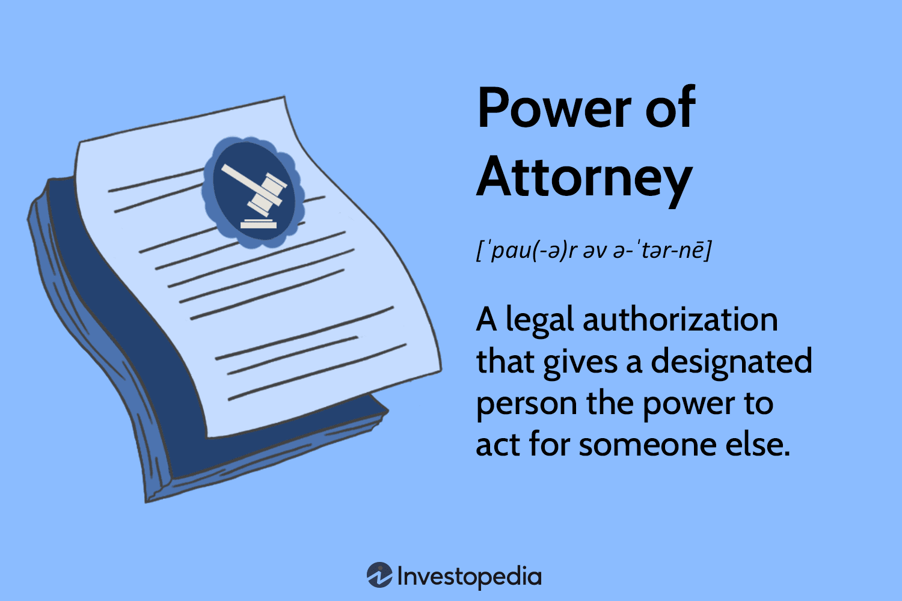

Property management is a multifaceted field that encompasses a wide range of responsibilities, from addressing routine maintenance issues to managing substantial financial transactions. A crucial component in navigating these complexities is the effective use of legal documents, particularly the Power of Attorney (POA). This legal instrument enables property owners to delegate decision-making authority to an appointed agent, thereby facilitating efficient management of assets when direct oversight is not possible. The significance of legal frameworks in property management cannot be overstated, as they provide the necessary structure for ensuring that property owners' interests are safeguarded.

Parallel to advancements in property management is the rise of algorithmic trading—a domain where modern technology triumphs in automating decision-making processes. Although algorithmic trading is traditionally associated with financial markets and differs from property management in its direct applications, it exemplifies the potential of leveraging technology for enhanced decision outcomes. Algorithmic trading relies on complex algorithms to execute trades at optimal times and prices, showcasing the broader trend of harnessing data and automation to improve asset management.



This article addresses the intersection of legal frameworks and technological innovations, underscoring their combined impact on asset management. Understanding how these elements interact highlights the evolving landscape of both property and financial asset management, emphasizing the need for a blend of traditional legal tools and cutting-edge technology to optimize asset control and protection.

## Table of Contents

## Understanding Power of Attorney in Property Management

A Power of Attorney (POA) is a vital legal instrument that allows an individual, referred to as the principal, to delegate authority to another person, known as the agent or attorney-in-fact, to make decisions on their behalf. This legal arrangement is particularly significant in property management, where the complexities of managing assets often necessitate the involvement of trusted representatives to handle decisions and transactions.

In property management, a POA ensures the protection and efficient management of the property owner's interests, especially when the owner is unable to oversee asset management directly due to circumstances such as absence, illness, or incapacity. The designated agent, empowered by the POA, assumes the responsibility to act in the best interest of the property owner, making necessary decisions regarding matters such as lease agreements, financial transactions, repairs, or any legal obligations related to the property.

There are several types of POA, each designed to serve specific purposes in asset management:

1. **General Power of Attorney**: This type authorizes the agent to perform almost any act as the principal, including buying or selling property, managing assets, and conducting financial transactions. It grants broad authority and is typically used when the principal wants to bestow wide-ranging powers on the agent.

2. **Limited Power of Attorney**: Also known as Special POA, it restricts the agent's authority to specific tasks or for a particular period. For example, a property owner might grant an agent the authority to manage rental agreements but not sell the property.

3. **Durable Power of Attorney**: Unlike a general POA, which is voided if the principal becomes incapacitated, a Durable POA remains effective even when the principal is unable to make their own decisions. This is crucial for ongoing property management and financial affairs, ensuring continuity and reducing disruption.

4. **Springing Power of Attorney**: This type becomes active only upon the occurrence of a specified event, such as the incapacitation of the principal. It allows the principal to maintain control over their affairs until they are unable to manage them independently.

The application and effectiveness of each POA type depend on the principal’s specific needs and circumstances. Proper drafting and understanding of the legal stipulations within a POA are essential, guaranteeing that the agent's authority aligns precisely with the principal’s objectives and legal protections. By utilizing the appropriate POA, property owners can ensure their assets are managed proficiently, securing their interests and objectives amidst varying personal circumstances.

## The Role of Legal Documents in Effective Property Management

Legal documents are fundamental to effective property management, providing the essential framework for administrating property and financial affairs. Among these, the Power of Attorney (POA) is a pivotal instrument, serving as a legal bridge that allows individuals to authorize an agent to act on their behalf. This authorization is particularly significant when property owners are unable or choosing not to manage their assets directly.

A POA not only delineates the scope of authority granted to an agent but also serves to define the responsibilities and limitations of property managers. This clarity is vital to maintaining transparency and ensuring that all actions remain within the legal bounds set by the property owner. For instance, a general POA might allow an agent to perform a wide range of activities, from handling financial transactions to managing rental agreements, while a limited POA would specify particular matters the agent can handle.

The importance of these legal documents extends beyond just clarifying roles; they are crucial for minimizing conflicts and misunderstandings. By providing a comprehensive outline of what an agent is authorized to do, a POA helps avoid disputes between property owners and their [agents](/wiki/agents). It ensures that all parties involved act in a manner that aligns with the best interests of the property owner, potentially saving time and costs associated with legal challenges or mismanagement.

Moreover, proper documentation through legal instruments like the POA underpins the legitimacy of the property manager's actions, reinforcing their legality and acceptance in transactions. Whether it's leasing agreements, maintenance contracts, or financial dealings, having precise, legally endorsed documentation affirms the integrity and transparency of these transactions.

In summary, legal documents, spearheaded by instruments like the Power of Attorney, are indispensable tools in effective property management. They set the legal stage for property and financial management, provide a clear demarcation of responsibilities, and safeguard against potential conflicts. Effective use of these documents ensures that the interests of property owners are upheld, paving the way for smooth and lawful management processes.

## Algorithmic Trading: A Technological Asset Management Tool

Algorithmic trading, often referred to as algo trading, involves the use of computer algorithms to manage trading decisions automatically. These algorithms can analyze massive datasets faster and more accurately than a human could, allowing for swift decision-making. The process includes determining the timing, price, and quantity of the trade and can execute trades at speeds and frequencies impossible for human traders.

The incorporation of [algorithmic trading](/wiki/algorithmic-trading) into financial management marks a significant transition towards automation and data-driven methodology. By harnessing historical data, [machine learning](/wiki/machine-learning) models, and statistical analysis, algorithms can predict market trends and optimize trading strategies to maximize returns while mitigating risks. For instance, statistical [arbitrage](/wiki/arbitrage) exploits pricing inefficiencies between securities to generate profit, a task particularly suited for algorithmic execution due to its complexity and need for speed.

Algorithmic trading showcases potential uses of data and automation in managing valuable assets, even though it fundamentally differs from property management. Property management, traditionally focused on physical asset oversight, typically involves an operational and interpersonal skillset. However, the benefits observed in algo trading, such as enhanced precision, efficiency, and scalability, suggest possible technological integrations within property management frameworks. This may include data analytics for market trend predictions or AI-driven tools for optimal asset utilization.

As financial markets grow more complex, the role of algorithmic trading continues to expand, offering innovation in asset management strategies. By leveraging sophisticated technologies, investors aim not only to enhance performance metrics but also to maintain a competitive edge in an increasingly data-centric financial landscape.

## Interplay Between Property Management and Algorithmic Trading

Property management and algorithmic trading, though distinct disciplines, share common ground in investment strategies and asset management. Both fields involve decision-making processes that can greatly benefit from advanced technology and data analytics.

In property management, the integration of advanced technology, such as real estate data analytics, can revolutionize decision-making and strategic planning. By leveraging large datasets, property managers can gain insights into market trends, tenant behaviors, and property valuations. This data-driven approach facilitates more informed decisions, optimizing investment outcomes and operational efficiency. For instance, predictive analytics can forecast property values and rental income potential, aiding in determining the best times to buy, sell, or lease properties.

On the other hand, algorithmic trading is a clear representation of how automation and data analysis transform asset management. Utilizing pre-programmed models, algorithmic trading systems can execute orders based on preset parameters without human intervention. This method enhances trading precision and speed, reducing costs and human error. Consider the function:

```python
def execute_trade(signal, threshold):
    if signal > threshold:
        # execute buy order
        return "Buy"
    elif signal < -threshold:
        # execute sell order
        return "Sell"
    else:
        return "Hold"
```

This Python function represents a simple decision-making model used in algorithmic trading, where a signal exceeding a given threshold triggers a buy or sell order.

Despite the differences in application, both property management and algorithmic trading benefit from integrating technology with traditional management practices. The intersection of these fields is characterized by an evolving approach to asset management—one that emphasizes the convergence of data analytics and technological tools with established management methodologies. This synthesis enhances the capacity to manage assets effectively, whether they manifest as real estate properties or financial instruments, ensuring that decisions are not only informed by traditional expertise but also by cutting-edge technological advancements.

## Legal and Technological Considerations

Understanding the legal requirements and technological tools is crucial for effective property and asset management. The intersection of legal proficiency and technological advancements creates a robust framework for managing complex assets. At the core of this framework is the Power of Attorney (POA), which is an essential legal instrument enabling property owners to delegate authority effectively. The precise drafting and understanding of such legal documents ensure that all actions taken on behalf of the property owner are sanctioned and within legal boundaries. This process negates potential legal disputes and safeguards the interests of the stakeholders.

Technological innovation, represented by algorithmic trading among other advancements, offers various tools that enhance the precision and efficiency of asset management. These technologies, while primarily used in the financial sectors, illustrate the potential for data-driven decisions in managing properties. The integration of technologies, such as data analytics and automated systems, requires a thorough understanding of both the technological landscape and the legal implications that accompany such tools.

Navigating these complexities necessitates expertise in various legal documents related to property management. This includes understanding not just the POA but also compliance with local and international regulations. For instance, regulations around data privacy and protection, such as the General Data Protection Regulation (GDPR) in the European Union, must be observed when employing technological solutions that handle sensitive information.

Equally important is the need for asset managers to stay abreast of changing laws and regulations that can impact the technologies they utilize. For property management professionals, maintaining compliance with these legal frameworks is not only a matter of adhering to the law but also of maintaining trust and transparency with clients.

In practical terms, this could involve the use of software systems designed to ensure compliance with local laws. Consider the following Python code snippet designed to check compliance of a property management operation with GDPR:

```python
def check_gdpr_compliance(client_data):
    """
    This function ensures that the client data processed complies with GDPR requirements,
    specifically handling of personal data.
    """
    try:
        if 'consent' in client_data and client_data['consent'] is True:
            # Process data as GDPR compliant
            return "Compliant"

        # Log non-compliance
        log_non_compliance(client_data)
        return "Non-Compliant"

    except KeyError as e:
        raise ValueError(f"Missing key: {e}")
```

This code exemplifies the necessity of embedding compliance checks into the fabric of technological tools used in asset management. Ensuring that technology aligns with existing legal structures is essential to mitigating risks and leveraging the full potential of modern asset management strategies.

In summary, effective property and asset management in today's landscape demands a harmonious balance between understanding legal frameworks and employing cutting-edge technology. Mastery of both areas is vital to not only protect the asset owner's interests but also to optimize the management process through compliant and innovative solutions.

## Conclusion

Effective property management hinges on robust legal frameworks, with the Power of Attorney (POA) being a key instrument that ensures the protection of stakeholders' interests. The POA allows property owners to delegate authority, safeguarding their assets even in their absence. Ensuring that these legal frameworks are in place is crucial for maintaining transparency, legality, and the smooth administration of property affairs.

On the other hand, embracing technological advancements such as algorithmic trading can significantly transform asset management by introducing efficiency and precision. Algorithmic trading exemplifies the capability of technology to automate complex tasks and make data-driven decisions, showcasing the benefits of incorporating similar technological solutions within property management strategies.

The synthesis of legal proficiency and technological awareness is essential for effectively navigating the modern landscape of property and financial asset management. Mastery of legal documentation and the integration of innovative technological tools can lead to enhanced strategic planning and asset management. By combining these elements, stakeholders can ensure comprehensive management practices that are both compliant and forward-thinking.

## References & Further Reading

[1]: Holden, A. C. (2009). ["The Power of Attorney in Real Estate Transactions."](https://richr.com/blog/the-significance-of-power-of-attorney-in-real-estate-transactions/) American Bar Association.

[2]: Vickery, A. (2018). ["Legal Considerations in Algorithmic Trading."](https://www.researchgate.net/publication/338632452_Ethical_and_legal_considerations_of_artificial_intelligence_and_algorithmic_decision-making_in_personalized_pricing) CFA Institute Research Foundation.

[3]: ["Algorithmic and High-Frequency Trading"](https://www.amazon.com/Algorithmic-High-Frequency-Trading-Mathematics-Finance/dp/1107091144) by Albert J. Menkveld, Charles-Albert Lehalle, and Kevin Sheppard

[4]: Cumming, D. J., & Johan, S. A. (2008). ["The Role of Power of Attorney in Financial Management."](https://www.sciencedirect.com/book/9780124095373/venture-capital-and-private-equity-contracting) European Financial Management, 14(4), 738-761.

[5]: Batsell, J. E. (2017). ["Governance and Regulatory Issues in Algorithmic Trading."](https://onlinelibrary.wiley.com/doi/10.1111/rego.12367) Financial Times.