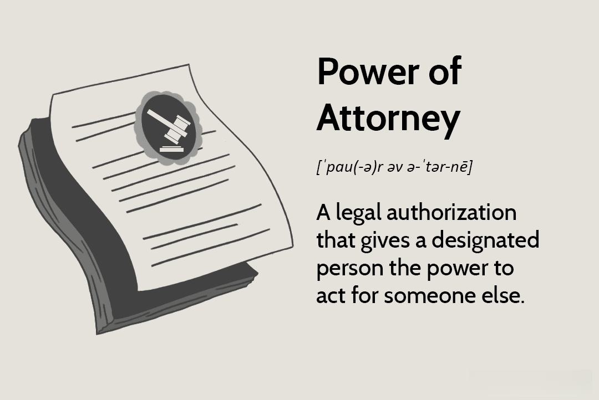

In the fast-paced world of financial technology, algorithmic trading has emerged as a pivotal component of global financial markets, drastically transforming how trades are executed. It leverages sophisticated computer algorithms to execute trading decisions at speeds and frequencies far surpassing human capabilities. This technological shift has introduced a myriad of complexities, particularly regarding authority, legal documentation, and representation within this domain.

For both trading institutions and individual traders, understanding the regulatory framework and legal prerequisites is fundamental. The landscape is heavily governed by stringent financial regulations designed to maintain market integrity and prevent any form of abuse. Effective navigation within this framework involves recognizing the significance of crucial legal conventions such as power of attorney and maintaining compliance with regulatory demands.



The power of attorney (POA) plays a crucial role in enabling authorized representatives to perform actions on behalf of traders or firms, which may include managing accounts, executing trades, and handling regulatory filings. This legal instrument is not only a safeguard for ensuring continuity in trading operations during periods of absence or incapacitation but also a means to preserve compliance and protect trader interests.

Furthermore, proper handling of authoritative documents is vital in algorithmic trading. Legal documentation needs to be accurate, valid, and compliant with regulatory standards to ensure enforceability and transparency in trading activities. This requires meticulous record-keeping and the foresight to engage legal experts to navigate complex issues related to risk management, compliance, and dispute resolution. As the domain of algorithmic trading continuously evolves, maintaining an up-to-date understanding of these legal aspects will remain crucial for leveraging opportunities while mitigating associated risks.

## Table of Contents

## Understanding Algorithmic Trading

Algorithmic trading, often referred to as algo trading, leverages advanced computer algorithms to undertake trading actions at velocities and frequencies that surpass human abilities. These algorithms analyze market data continuously, making split-second decisions to buy or sell financial instruments. Such trading is prevalent across various asset classes, including equities, bonds, currencies, and derivatives, enabling market participants to achieve enhanced pricing, execute larger orders efficiently, and minimize market impact.

### Mechanisms of Algorithmic Trading

Algorithms in trading employ a range of strategies, often involving statistical and mathematical models. They evaluate vast datasets to predict price movements, identify [arbitrage](/wiki/arbitrage) opportunities, and execute trades accordingly. For instance, a simple moving average strategy might involve buying a stock when its short-term moving average crosses above its long-term moving average and selling when the reverse occurs. More sophisticated strategies might use [machine learning](/wiki/machine-learning) techniques to enhance predictive accuracy.

Here's a basic Python example of a moving average crossover strategy:

```python
import pandas as pd

def moving_average_crossover(data, short_window, long_window):
    data['Short_MA'] = data['Close'].rolling(window=short_window).mean()
    data['Long_MA'] = data['Close'].rolling(window=long_window).mean()

    data['Signal'] = 0
    data['Signal'][short_window:] = \
        (data['Short_MA'][short_window:] > data['Long_MA'][short_window:]).astype(int)

    data['Position'] = data['Signal'].diff()
    return data

# Example usage with stock data
# data = pd.DataFrame(...)  # Load your market data with 'Close' prices
# result = moving_average_crossover(data, 40, 100)
```

### Advantages of Algorithmic Trading

Algo trading offers various benefits, notably the capacity to achieve superior pricing by exploiting market conditions rapidly. Automated systems can handle substantial volumes, execute numerous trades simultaneously, and do so at the most opportune times, reducing the opportunity for market slippage. Order efficiencies are enhanced due to the precise manner in which trades are executed based on pre-determined criteria. This, in turn, can lead to reduced transaction costs.

### Risks and Challenges

However, [algorithmic trading](/wiki/algorithmic-trading) also poses potential risks. Technical failures, such as system malfunctions or bugs in code, can result in substantial losses. Additionally, the high-frequency nature of such trades can contribute to increased market [volatility](/wiki/volatility-trading-strategies), as rapid buy and sell orders can exacerbate price swings in financial instruments. The infamous "Flash Crash" of May 2010, when the Dow Jones Industrial Average fell and rebounded dramatically in minutes, is a notable example of such volatility.

### Regulatory Oversight

Recognizing these risks, comprehensive regulations govern algorithmic trading to maintain market fairness and prevent abuse. Regulatory bodies worldwide, such as the U.S. Securities and Exchange Commission (SEC) and the European Securities and Markets Authority (ESMA), have established frameworks that mandate transparency and impose systematic risk controls. These regulations necessitate firms to adhere strictly to pre- and post-trade risk assessments, ensuring algorithmic trading is conducted within safe and ethical boundaries.

In conclusion, algorithmic trading represents a significant advancement in financial markets, offering advantages in speed and efficiency while demanding stringent compliance with regulatory measures to navigate its associated risks effectively.

## Legal Frameworks Governing Algorithmic Trading

Global regulatory bodies such as the United States Securities and Exchange Commission (SEC) and the European Securities and Markets Authority (ESMA) play pivotal roles in establishing frameworks that govern algorithmic trading. These frameworks are essential to maintaining market integrity, enhancing transparency, and safeguarding against potential market abuses.

In the European Union, the Markets in Financial Instruments Directive II (MiFID II), effective from January 2018, represents a comprehensive regulatory overhaul affecting algorithmic trading. MiFID II imposes stringent requirements to enhance market transparency and integrity. One significant aspect of MiFID II is its focus on pre- and post-trade risk controls, ensuring that trading systems are robust, controlled, and operating within the bounds of established financial regulations. These controls are critical for maintaining an orderly trading environment and include mechanisms for monitoring and managing individual trade orders to prevent practices such as market manipulation and excessive speculation.

Similarly, in the United States, the SEC's Regulation National Market System (Reg NMS) and other related regulations set standards for algorithmic trading activities. These regulations require market participants to implement adequate safeguards to manage risks effectively, aimed at ensuring systemic stability and protecting investor interests. For example, SEC rules mandate that firms involved in high-frequency trading ([HFT](/wiki/high-frequency-trading-strategies)) activities register as broker-dealers, thus adhering to a higher standard of regulatory scrutiny.

The frameworks set by such regulations are designed to manage the unique risks associated with algorithmic and high-frequency trading (HFT), including market volatility and operational failures. By requiring rigorous compliance with these standards, regulators aim to create a secure and reliable trading environment. Non-compliance can lead to significant penalties and severe reputational damage for trading firms.

Firms engaging in algorithmic trading are thus required to develop robust internal risk management strategies and systems capable of detecting and mitigating potential disruptions. They must also maintain comprehensive records of their trading algorithms and strategies, ensuring accountability and traceability. Legal compliance extends beyond mere adherence to regulations; it involves continuously evolving to meet new regulatory demands as the financial markets and technologies advance.

In summary, the legal frameworks governing algorithmic trading serve as vital mechanisms to ensure a level playing field in financial markets. By enforcing these regulations, global regulatory bodies strive to balance fostering innovation while protecting market integrity and investor confidence.

## Role of Authority and Power of Attorney in Trading

Power of Attorney (POA) is a fundamental tool in financial trading that permits designated representatives to act on behalf of a trader or financial firm. This legal authority is integral for seamless operations in trading environments where prompt and decisive actions are essential. A POA is particularly valuable in the complex world of financial trading for executing trades, managing accounts, and fulfilling regulatory requirements.

In practice, a POA allows representatives to execute trades swiftly, ensuring that investment strategies are effectively implemented without delay. This authority is pivotal when traders cannot personally attend to transactions due to incapacitation or other commitments, thus enabling continuity in trading operations. Moreover, the delegation of authority through a POA is crucial for regulatory filing where compliance with stringent regulatory standards is mandatory. An appointed representative can handle critical documentation, ensuring adherence to legal obligations and maintaining the firm’s credibility.

Selecting the right representative is critical for the efficient management of trading activities. Traders must choose a person or entity not only trustworthy but also possessing considerable expertise in legal and financial matters. This ensures that the representative can navigate the complexities of trading regulations while safeguarding the trader's interests. The representative’s ability to interpret and comply with evolving legal standards is essential in precluding regulatory lapses, thereby avoiding penalties and preserving the trader's or firm's reputation in the financial marketplace.

In conclusion, the utilization of a Power of Attorney in trading connects traders with an authoritative figure who guarantees compliance and operational efficiency. This legal mechanism is indispensable for addressing regulatory challenges and facilitating uninterrupted trading activities, especially in today's dynamic financial markets.

## Importance of Legal Documentation and Representation

Proper legal documentation is a foundational aspect of algorithmic trading, ensuring that transactions are valid, enforceable, and compliant with relevant regulations. Legal documentation serves multiple roles, from establishing the legality of transactions to mitigating risks associated with trading activities. One critical function of these documents is to provide transparency and clear terms for all parties involved, which reduces the potential for disputes and increases trust in trading operations.

Legal representatives play an essential role in navigating the intricate and often rapidly changing landscape of financial regulation. They offer guidance on complex issues such as risk management, compliance requirements, and dispute resolution. Risk management involves identifying, assessing, and prioritizing risks followed by the coordinated application of resources to minimize or control the probability of unforeseen events. Compliance mechanisms ensure that the trading practices adhere to applicable laws and regulations, thereby avoiding legal penalties and preserving business integrity.

The scope of documentation required in algorithmic trading is extensive. It includes but is not limited to contracts and agreements governing the terms of trade, compliance reports that ensure adherence to regulatory requirements, and records of proprietary algorithms that are fundamental to trading strategies. These documents not only fulfill legal obligations but also serve as a record for audit trails and strategic evaluations.

Record-keeping ensures traceability and accountability. This aspect is crucial because it allows for the backtracking of transactions and decisions, providing insights into the decision-making process and highlighting any deviations from regulatory expectations. Extensive and meticulous documentation supports the defense against potential regulatory breaches by providing evidence and justification of trading actions. 

Consulting with legal experts specializing in finance offers additional benefits. These professionals are adept at identifying regulatory pitfalls and help in planning strategic defenses. They interpret complex laws and regulations, thereby allowing firms to preemptively mitigate risks instead of reacting to issues post-occurrence. Their expertise can be crucial in crafting robust contracts and continuously updating documents in light of new regulations or changes in market conditions.

In summary, the importance of legal documentation and representation in algorithmic trading cannot be overstated. It is essential for ensuring that all trading activities are conducted within the legal framework, for securing the enforceability of contracts, and for managing potential risks associated with trading. By maintaining comprehensive and up-to-date documentation, traders and firms can significantly enhance their operational effectiveness and protect themselves from legal and financial liabilities.

## Conclusion

The complexity inherent in algorithmic trading necessitates a robust legal and regulatory framework to maintain the integrity of global financial markets. Ensuring compliance with these regulations, alongside maintaining thorough legal documentation, is crucial for achieving success in this sophisticated trading environment. Regulations such as MiFID II and guidance from organizations like the SEC emphasize transparency and fairness, serving as a vital foundation for sustainable trading practices.

For traders, both institutional and individual, informed legal representation is a key asset. It empowers them to concentrate on trading strategies and execution, knowing that regulatory obligations are met and their activities are defended against potential legal pitfalls. Moreover, possessing comprehensive documentation supports traceability and accountability, which are essential for upholding the validity and enforceability of trades.

Expert guidance is not only a shield against potential risks but also enhances trust and credibility with clients, stakeholders, and regulators. As algorithmic trading technologies and methodologies advance, the associated legal framework will continue to evolve. Staying ahead in this dynamic field calls for traders to constantly adapt to regulatory changes, ensuring both compliance and ethical trading standards. This ongoing interplay between innovation and regulation underscores the essential role of legal standards in the longevity and stability of algorithmic trading practices.

## References & Further Reading

[1]: Bergstra, J., Bardenet, R., Bengio, Y., & Kégl, B. (2011). ["Algorithms for Hyper-Parameter Optimization."](https://dl.acm.org/doi/10.5555/2986459.2986743) Advances in Neural Information Processing Systems 24.

[2]: ["Advances in Financial Machine Learning"](https://www.amazon.com/Advances-Financial-Machine-Learning-Marcos/dp/1119482089) by Marcos Lopez de Prado

[3]: ["Evidence-Based Technical Analysis: Applying the Scientific Method and Statistical Inference to Trading Signals"](https://www.amazon.com/Evidence-Based-Technical-Analysis-Scientific-Statistical/dp/0470008741) by David Aronson

[4]: ["Machine Learning for Algorithmic Trading"](https://github.com/PacktPublishing/Machine-Learning-for-Algorithmic-Trading-Second-Edition) by Stefan Jansen

[5]: ["Quantitative Trading: How to Build Your Own Algorithmic Trading Business"](https://github.com/LucindaYa/quant-resources/blob/master/Quantitative%20Trading%20How%20to%20Build%20Your%20Own%20Algorithmic%20Trading%20Business.pdf) by Ernest P. Chan