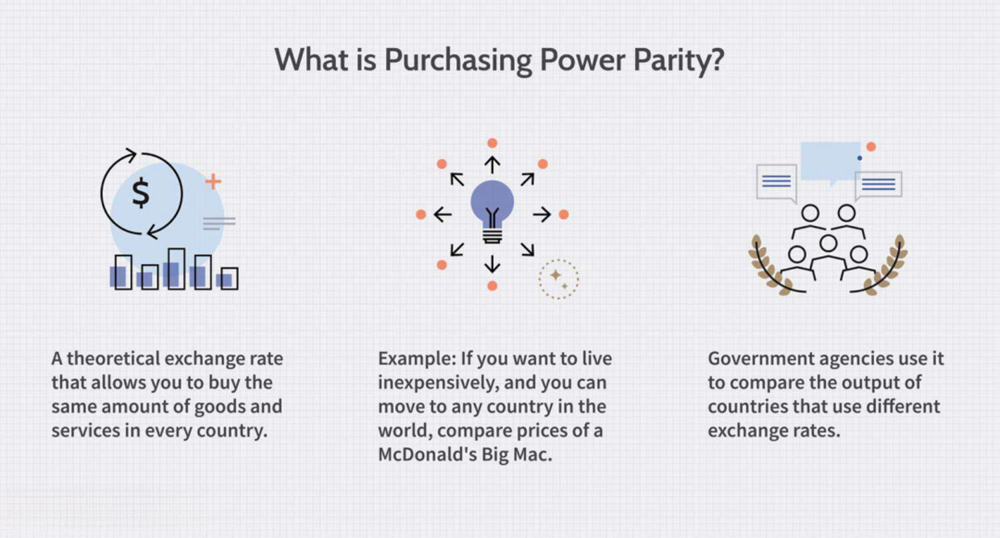

The utilities sector is undergoing significant transformation, driven by rapid technological advancements and evolving regulatory landscapes. These shifts are fundamentally altering the dynamics of how energy is generated, distributed, and consumed. Central to the stability of energy distribution are energy contracts, with Power Purchase Agreements (PPAs) playing an essential role. PPAs involve long-term agreements between energy producers and purchasers, ensuring a stable supply of electricity at predetermined prices. This contractual stability is vital for mitigating the price volatility often encountered in energy markets.

Additionally, algorithmic trading is revolutionizing the operational modalities of energy markets. By leveraging complex algorithms and real-time data processing, market participants can optimize trading strategies, potentially enhancing market efficiency and liquidity. However, these advancements also present considerable challenges, including increased price volatility and the need for market participants to rapidly adapt to technological changes. 



This article aims to explore the critical intersection of energy contracts, particularly PPAs, and the burgeoning role of algorithmic trading in reshaping the utilities sector. Through examining how these elements interact, we gain insight into both the opportunities for enhanced market stability and efficiency and the challenges that stakeholders must navigate in this evolving landscape.

## Table of Contents

## Understanding Power Purchase Agreements in the Utilities Sector

A Power Purchase Agreement (PPA) serves as a crucial contract in the utilities sector. It signifies a commitment between a private energy company and a government entity or utility to ensure the steady supply of electricity. Typically, these agreements are long-term, spanning from 15 to 25 years. Such duration provides stability for both parties involved, allowing energy producers to secure financing for their projects while offering energy purchasers consistent pricing terms.

One of the key advantages of PPAs is their ability to provide a fixed cost for energy, mitigating the risks associated with price volatility that can arise from fluctuating market conditions or resource availability. By locking in energy prices over the agreement's duration, both buyers and sellers can forecast and manage their financial obligations with more certainty. This is particularly beneficial in shielding consumers from potential price surges in wholesale energy markets.

However, PPAs are not without challenges. The long-term commitment required by these agreements can pose difficulties, especially if market conditions change or if either party needs to adapt to new regulatory or technological environments. This rigidity can become an issue during property sales where PPA arrangements are in place. New property owners may not always be amenable to inheriting these long-term agreements, particularly if they feel they are locked into non-competitive rates compared to newer market offerings.

Despite these challenges, the role of PPAs in facilitating the growth of renewable energy projects is noteworthy. As governments and private companies collaborate to achieve sustainability goals, PPAs continue to be pivotal in supporting the financial and operational structures necessary for large-scale energy projects.

## PPA Financing and Regulatory Framework

Power Purchase Agreements (PPAs) commonly involve third-party ownership structures, where investment entities provide capital in exchange for projected financial returns. These third-party investors often seek to capitalize on tax benefits, such as the Investment Tax Credit (ITC) and accelerated depreciation, to enhance returns on investment in PPA projects. The financial structuring of PPAs allows energy companies to leverage these benefits without depleting their own resources, fostering the growth of renewable energy projects by reducing the upfront capital burden typically associated with such projects.

Regulation of PPAs within the energy market is primarily overseen by the Federal Energy Regulatory Commission (FERC). This federal agency ensures that PPAs are executed in a fair, transparent, and competitive manner, thereby protecting the interests of both energy providers and consumers. FERC plays a critical role in maintaining market equilibrium, preventing anti-competitive practices, and enforcing compliance with energy market regulations.

The Energy Policy Act of 2005 significantly empowered FERC by expanding its regulatory jurisdiction across various segments of the energy industry, including natural gas, electricity, and oil pipelines. This legislation enhanced FERC's capabilities to manage burgeoning issues within the energy sector, foster competition, and ensure the reliability of energy supply across the nation. By reinforcing FERC's regulatory authority, the Act aimed to create a more robust and resilient energy infrastructure, better equipped to meet the evolving demands of energy consumption and resource management.

This regulatory framework provides the foundation necessary for the development and integration of PPAs, facilitating a secure investment environment and ensuring that both renewable energy projects and traditional energy resources are effectively governed. The strengthening of FERC's role through federal legislation underscores the importance of regulatory oversight in maintaining the integrity and stability of the energy markets.

## Algo Trading in the Energy Sector

Algorithmic trading, commonly known as algo trading, is increasingly significant in the energy markets, especially in Europe. This trading strategy leverages complex algorithms to execute trades at high speeds, capitalizing on market inefficiencies and patterns derived from historical and real-time data.

Algo trading enhances market efficiency by facilitating faster order execution and narrowing bid-ask spreads, thus reducing transaction costs for traders. This increased efficiency is particularly valuable in the energy markets, where the timely execution of trades can significantly impact pricing and supply dynamics. By utilizing vast datasets and predictive analytics, algorithmic systems can optimize trading strategies that human traders may find challenging to achieve manually.

However, the rapid execution capabilities of [algorithmic trading](/wiki/algorithmic-trading) can also contribute to heightened [volatility](/wiki/volatility-trading-strategies), particularly during energy crises or when unexpected geopolitical events affect market stability. The agility of algo traders allows them to enter and [exit](/wiki/exit-strategy) positions within milliseconds, potentially amplifying price swings in already volatile markets. This heightened volatility can lead to misalignments between market prices and underlying fundamentals, a concern for stakeholders who rely on stable pricing for operational planning.

Algo traders often rely on technical signals and observed trends, sometimes at the expense of fundamental data analysis. For instance, algorithms might prioritize short-term signals like moving averages or [momentum](/wiki/momentum) indicators, overlooking long-term market fundamentals such as supply-demand balances or geopolitical influences. This focus can lead to discrepancies where prices driven by algorithmic activity do not reflect the actual market conditions.

The integration of algorithmic trading into the energy sector necessitates that energy companies and market participants adapt to these evolving technologies. Understanding the dynamics of algo trading is critical for managing the potential impacts on energy pricing and market stability. As the sector continues to evolve, stakeholders must consider both the opportunities for enhanced efficiency and the risks associated with increased volatility.

## Impact of Algorithmic Trading on Energy Contracts

Algorithmic trading is significantly impacting the execution and management of energy contracts, including Power Purchase Agreements (PPAs). These agreements, traditionally stable and long-term contracts, are facing new complexities due to rapid and sophisticated trading methods.

Algorithmic trading, characterized by the use of complex algorithms to execute trades at sub-second levels, introduces considerable volatility into the energy markets. This rapid movement disrupts the traditional market dynamics, prompting energy companies to adopt new technologies and strategies. Given this landscape, these companies must implement systems that can respond at similar speeds to ensure they remain competitive and can effectively manage financial risks associated with such volatility.

One of the primary ways that algorithmic trading affects the energy sector is through its influence on renewable energy portfolio management. Algorithmic systems can analyze vast amounts of data, providing improved forecasts and real-time adjustments in energy supply and demand, particularly beneficial for renewable energy sources that are inherently variable and dependent on environmental conditions. For example, they can quickly adjust energy trading strategies in response to changes in weather patterns, optimizing the balance between generation and consumption.

In Python, a simple algorithm to analyze the impact of weather patterns on energy prices might look like this:

```python
import numpy as np
import pandas as pd
from sklearn.linear_model import LinearRegression

# Sample weather and energy pricing data
data = pd.DataFrame({
    'temperature': [15, 20, 22, 21, 19, 17, 25],
    'wind_speed': [5, 15, 12, 10, 14, 8, 20],
    'energy_price': [30, 25, 28, 26, 29, 27, 24]
})

# Train a linear regression model
X = data[['temperature', 'wind_speed']]
y = data['energy_price']
model = LinearRegression().fit(X, y)

# Predict energy prices based on new weather data
new_data = np.array([[18, 18], [21, 19], [23, 20]])
predicted_prices = model.predict(new_data)

print(predicted_prices)
```

Adapting to the rapid market movements introduced by algorithmic trading also necessitates enhanced risk management practices. Companies need to invest in sophisticated technology to monitor algorithm performance continuously and make swift changes if required. Moreover, the volatility brought by algorithmic trading requires energy companies to hedge their contracts more aggressively, using financial instruments to protect against adverse price movements.

In conclusion, algorithmic trading presents both challenges and opportunities to the execution and management of energy contracts like PPAs. The rapid departure from traditional market operation necessitates a strategic overhaul, integrating new technologies and adaptive management to effectively harness these advancements for operational stability and benefit.

## The Future of Energy Contracts and Algo Trading

As algorithmic trading gains traction in the energy sector, it presents both burgeoning opportunities and significant risks. The increasing integration of algorithmic trading tools necessitates that stakeholders in the energy market remain agile and proactive to leverage these advancements effectively.

One key opportunity lies in the potential entry of larger financial institutions into the energy trading domain. Such entities bring extensive resources and sophisticated financial instruments that could transform the trading landscape. Their participation might foster greater [liquidity](/wiki/liquidity-risk-premium), enhance market depth, and introduce more competitive pricing mechanisms. However, the downside is the potential for increased market volatility due to the speculative nature of some of these financial institutions' strategies.

To navigate this evolving environment, energy providers must pivot towards developing innovative strategies predicated on advanced analytics. The application of data science and [machine learning](/wiki/machine-learning) models can aid in forecasting energy demand, optimizing trading algorithms, and mitigating risks associated with price fluctuations. For instance, machine learning models can be used to forecast energy prices by identifying patterns in historical data and extrapolating these to predict future trends. Here's a basic example in Python using a linear regression model:

```python
import numpy as np
import pandas as pd
from sklearn.model_selection import train_test_split
from sklearn.linear_model import LinearRegression
from sklearn.metrics import mean_squared_error

# Sample data: historical energy prices
data = pd.DataFrame({
    'day': np.arange(1, 101),
    'price': np.random.normal(loc=50, scale=5, size=100)
})

# Features and target
X = data[['day']]
y = data['price']

# Split data
X_train, X_test, y_train, y_test = train_test_split(X, y, test_size=0.2, random_state=42)

# Train the model
model = LinearRegression()
model.fit(X_train, y_train)

# Predictions
predictions = model.predict(X_test)

# Evaluation
mse = mean_squared_error(y_test, predictions)
print("Mean Squared Error:", mse)
```

Energy firms must embrace such technologies to maintain a competitive edge. They may also explore the diversification of their portfolios to include a mix of traditional and renewable energy sources, facilitated by algorithmic strategies that can predict and balance supply-demand equations. This could involve dynamic pricing models that adjust in real-time based on algorithmic inputs and external market conditions.

In conclusion, as algorithmic trading becomes more embedded in the energy sector, its future will be shaped by how stakeholders harness these technologies to their advantage. The key to success will lie in striking a balance between leveraging algorithmic efficiencies and managing the inherent risks they introduce. This approach will necessitate collaboration across financial, technological, and regulatory spectrums to ensure a robust and resilient energy market for the future.

## Conclusion

The convergence of Power Purchase Agreements (PPAs) and algorithmic trading is catalyzing a transformative shift in the utilities sector. This fusion not only promises enhanced market efficiency but also presents new challenges, especially concerning volatility and evolving market dynamics. PPAs have traditionally provided stability through long-term pricing agreements, mitigating the risks of energy price fluctuations. However, the integration of algorithmic trading introduces a layer of complexity, enabled by automated processes that can rapidly respond to fluctuating market conditions.

These automated trading systems can significantly enhance liquidity in energy markets by enabling the quick execution of trades, thus ensuring more fluid market operations. Yet, the very speed and efficiency that define algorithmic trading also contribute to increased volatility. This volatility is particularly pronounced during periods of market stress or turbulence, where rapid algorithmic decisions can amplify price swings.

Therefore, stakeholders across the energy landscape must adapt to these evolving technologies to harness their full potential. This adaptation may involve embracing advanced analytics and machine learning tools, which can aid in predicting market trends and making informed decisions. Stakeholders must also develop strategies to mitigate risks associated with increased market volatility, perhaps through enhanced risk management frameworks and dynamic pricing models.

The potential for significant financial institutions to enter the market further underscores the need for adaptation. Their involvement could reshape the landscape, driving competition and innovation, but also necessitating a deeper understanding of the complexities introduced by algorithmic trading. Ultimately, the success of this convergence lies in the ability of energy market participants to navigate these challenges, capitalizing on increased efficiency while maintaining stability amidst the dynamic shifts in market behavior.

## References & Further Reading

[1]: Askeland, T. (2009). ["Power Purchase Agreements: Navigating the Energy Procurement Landscape"](https://betterbuildingssolutioncenter.energy.gov/sites/default/files/attachments/PowerPurchaseAgreements.pdf). Journal of Energy Law and Policy.

[2]: Burger, M., & Graeber, B. (2012). ["Managing Energy Risk: An Integrated View on Power and Other Energy Markets"](https://onlinelibrary.wiley.com/doi/book/10.1002/9781118618509). Wiley Finance. 

[3]: FERC. (2005). ["The Energy Policy Act of 2005: A Review of Key Provisions and Their Implications on the Regulation of Energy Markets"](https://www.energy.gov/downloads/energy-policy-act-2005).

[4]: Lopez de Prado, M. (2018). ["Advances in Financial Machine Learning"](https://www.amazon.com/Advances-Financial-Machine-Learning-Marcos/dp/1119482089). Wiley.

[5]: Jansen, S. (2020). ["Machine Learning for Algorithmic Trading"](https://github.com/stefan-jansen/machine-learning-for-trading). Packt Publishing.

[6]: Chan, E. P. (2009). ["Quantitative Trading: How to Build Your Own Algorithmic Trading Business"](https://github.com/ftvision/quant_trading_echan_book). Wiley.