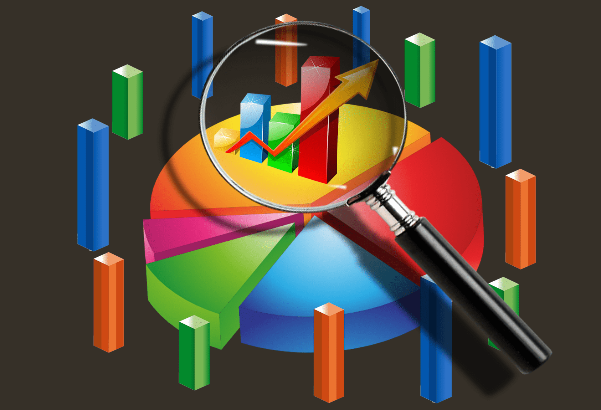

Algorithmic trading, commonly known as algo trading, has become a cornerstone of modern financial markets. It employs sophisticated algorithms and high-speed data processing to execute trades with enhanced precision and efficiency. This method allows traders to seize market opportunities that manual trading might overlook due to its capacity to process vast amounts of data in real-time.

A critical aspect of evaluating algorithmic trading performance is the power ratio. This concept measures the energy efficiency and effectiveness of trading activities by examining how well trading algorithms convert signals into profits. A higher power ratio indicates more efficient use of resources, resulting in better financial returns per unit of data processed. Understanding this interplay between power ratio and energy efficiency is pivotal for traders aiming to optimize their strategies, balancing execution speed with operational costs and sustainability. These elements significantly impact market dynamics, influencing both financial performance and the push towards more energy-conscious trading practices.



## Table of Contents

## Understanding Algorithmic Trading

Algorithmic trading utilizes computer algorithms to execute trades systematically based on predefined criteria such as timing, price, and volume. By leveraging these algorithms, traders can achieve increased efficiency and precision in executing trades, as the algorithms are capable of processing vast amounts of data in real-time. This capability allows traders to capitalize on market opportunities that might otherwise be missed through manual trading methods. 

Algorithmic trading systems operate based on various types of algorithms. Execution algorithms, for instance, are designed to minimize the market impact of large trades by breaking them into smaller, manageable parts. Popular execution algorithms include the Time-Weighted Average Price (TWAP) and Volume-Weighted Average Price (VWAP), which aim to execute trades close to the average price over a specified period or based on historical trading volumes, respectively. 

Signal generators are another type of algorithm used in trading. These algorithms analyze market data to generate buy or sell signals based on predefined criteria or models. For example, moving averages, relative strength index (RSI), and other technical indicators can be used as inputs to generate trading signals. In some cases, machine learning models are employed to identify patterns in data that may not be apparent through traditional analysis methods.

Lastly, trading algorithms integrate both execution and signal generation to automate the entire trading process. These algorithms continuously monitor market conditions, generate trading signals, and execute trades autonomously. High-frequency trading (HFT) strategies are a notable example, where algorithms execute trades within fractions of a second to exploit short-lived market inefficiencies.

Incorporating [algorithmic trading](/wiki/algorithmic-trading) into financial markets enhances trading efficiency, allowing market participants to respond swiftly to market changes and opportunities. The continuous evolution of technology and data processing capabilities ensures that algorithmic trading strategies remain a cornerstone of modern financial markets.

## What is Power Ratio?

Power ratio is a metric originally used in the broadcasting industry to assess how efficiently firms convert their audience share into revenue. Similarly, in algorithmic trading, the power ratio can be adapted to evaluate the efficiency of trading algorithms. It measures how effectively algorithms transform trading signals or opportunities into realized profits. A higher power ratio signifies a more efficient algorithm, indicating improved energy usage and financial return per unit of data processed.

In trading terms, the power ratio can be defined as:

$$
\text{Power Ratio} = \frac{\text{Net Profit}}{\text{Total Energy Consumption}}
$$

where:
- **Net Profit** is the realized gains after executing trades.
- **Total Energy Consumption** includes the computational power used in processing data and executing trades.

This metric is significant for evaluating algorithmic trading strategies in two main aspects:

1. **Energy Efficiency**: It provides insights into how well an algorithm uses computational resources to generate profit. With the high computational demands of modern trading, minimizing energy consumption while maintaining profitability is crucial.

2. **Financial Efficiency**: It emphasizes the effectiveness of the trading strategy itself. Algorithms with higher power ratios manage to extract more profit from the opportunities identified, reflecting the quality of the algorithm's trading signals and execution.

Developing strategies that optimize for a high power ratio allows traders to maximize their returns while curbing energy costs. Such optimization involves improving both the algorithm's predictive accuracy and minimizing the resource usage associated with trade execution.

## The Role of Energy Efficiency in Algo Trading

Energy efficiency in algorithmic trading centers on the capability of trading algorithms to perform transactions using minimal computational and electrical resources. This efficiency becomes crucial in the context of high-frequency trading ([HFT](/wiki/high-frequency-trading-strategies)), where millions of trades can be executed in a fraction of a second. High-frequency trading relies on speed and precision, but the vast computational power required can lead to substantial energy consumption and operational costs.

Improving energy efficiency in algo trading involves optimizing these algorithms to reduce the computational load and, consequently, power usage. By minimizing the electrical resources required per transaction, firms not only cut down on expenses but also adhere to sustainability goals that are becoming increasingly relevant in today's trading environments.

Energy efficiency in trading algorithms can be further enhanced by using more efficient hardware, optimizing code, and employing algorithms that adjust dynamically to market conditions, thus reducing unnecessary computational tasks. For instance, using parallel processing and efficient data structures can lead to reduced execution time and power consumption. Here is a simple example of reducing computational load using Python:

```python
def efficient_function(data):
    processed = set(data)  # Using set to eliminate duplicates
    result = []
    for item in processed:
        # Perform the necessary operations, optimized
        result.append(complex_operation(item))
    return result
```

In addition to these technical optimizations, energy-efficient trading also focuses on achieving the best possible balance between execution speed and resource usage, directly impacting profitability and environmental impact. By strategically selecting when and how to execute trades, algorithms can avoid unnecessary energy expenditure without sacrificing performance.

Overall, prioritizing energy efficiency not only enhances financial results by lowering costs but also aligns with broader corporate sustainability efforts, contributing positively to both the environment and the business's bottom line.

## Benefits of Analyzing Power Ratio for Algo Trading

Analyzing the power ratio in algorithmic trading provides substantial insights into the operational efficiency of trading strategies. The power ratio, in this context, is a pivotal metric that evaluates how well an algorithm exploits trading signals to generate profits relative to its energy consumption. This measure is crucial for optimizing performance and sustainability in trading systems.

Optimizing power ratios in algorithmic trading can achieve a balance between trade execution speed and energy consumption. As algorithmic trading often demands high computational resources, striking this balance leads to cost-effective and environmentally friendly operations. Reduced energy consumption not only lowers operational costs but also aligns with increasing regulatory and societal emphasis on sustainability.

Additionally, advanced metrics obtained from power ratio analysis contribute significantly to risk management. By evaluating the power ratio, traders can identify inefficient use of computational resources or over-leveraging in their strategies. For instance, if a trading algorithm shows a waning power ratio, it could signal overuse of energy resources without proportional financial returns, suggesting that the strategy might need recalibration.

Moreover, power ratio assessments afford traders the opportunity to refine their algorithms, making them more adaptable to market conditions while conserving energy. Here's a simple Python snippet illustrating a basic calculation of the power ratio, assuming `profit` represents the total profit generated and `energy_used` denotes the energy consumed:

```python
def calculate_power_ratio(profit, energy_used):
    if energy_used == 0:
        return float('inf')  # Avoid division by zero
    return profit / energy_used

# Example usage
profit = 10000  # Example profit in dollars
energy_used = 250  # Example energy used in kilowatt-hours

power_ratio = calculate_power_ratio(profit, energy_used)
print(f"The power ratio is: {power_ratio}")
```

Understanding and applying the power ratio allows traders to operate more effectively within their economic and environmental constraints, turning energy analysis into a strategic advantage. This continuous optimization fosters sustainable practices, keeping pace with technological advancements and regulatory standards aimed at reducing the carbon footprint of financial markets.

## Challenges in Achieving Energy Efficiency

Achieving energy efficiency in algorithmic trading is a complex challenge that hinges on a variety of technical and strategic factors. One of the primary obstacles is the substantial computational power required to execute high-frequency trading algorithms. These algorithms have to process vast amounts of data in real-time and make split-second decisions, all of which consume considerable computational resources. As the complexity of the algorithms increases, so does the demand for high-performance computing hardware, raising both the operational costs and energy consumption.

There are significant trade-offs involved between speed, accuracy, and power usage. For instance, optimizing for speed often means employing more powerful processors and memory architectures capable of handling large data sets quickly. However, this typically leads to higher energy consumption, which can conflict with goals of maintaining energy efficiency. Conversely, reducing power usage might mean compromising computational speed or accuracy, which could impede the ability to capitalize on fleeting market opportunities. 

Effective strategy design and testing become crucial in mitigating these trade-offs. Algorithm developers must employ sophisticated techniques to ensure optimal performance. This includes the use of energy-efficient coding practices, such as optimizing algorithms to reduce computational complexity, and leveraging parallel processing to distribute the computational load across multiple processors, thus lowering energy consumption per individual processor. Moreover, implementing [machine learning](/wiki/machine-learning) models that adapt to data patterns efficiently can enhance the trade-off balance by using predictive analytics to reduce unnecessary computations.

Balancing speed, accuracy, and power usage is key for optimizing algorithmic trading systems and improving power ratios. For instance, one approach to improve energy efficiency without sacrificing performance is to implement adaptive algorithms that scale computational resources according to the current market conditions, operating at full capacity only when necessary. This dynamic scaling can be supported by cloud-based infrastructures that offer flexibility in resource allocation.

Ultimately, achieving energy efficiency in algorithmic trading is not solely about reducing energy consumption but about optimizing the overall trading system to ensure that energy is used judiciously to maximize financial returns. The ability to resolve these challenges will allow traders to maintain their competitive edge while also contributing to more sustainable financial practices.

## Future Trends and Developments

As algorithmic trading continues to evolve, the emphasis on developing algorithms that are not only more effective but also energy-efficient is increasingly crucial. This dual focus will likely dictate the future landscape of algo trading, steering innovations and shaping strategies.

Advancements in machine learning and [artificial intelligence](/wiki/ai-artificial-intelligence) (AI) are expected to significantly transform algorithmic trading. These technologies enhance the adaptability and precision of trading algorithms, allowing them to process and respond to market data with greater accuracy while minimizing computational load. Machine learning techniques, such as [reinforcement learning](/wiki/reinforcement-learning) and neural networks, offer opportunities to develop algorithms that can learn from market conditions, adjusting their strategies dynamically without human intervention. This capability reduces unnecessary computational cycles, thus conserving energy and optimizing performance.

Here is a simple example of how reinforcement learning might be used in algorithmic trading:

```python
import numpy as np

class SimpleTradingAgent:
    def __init__(self, learning_rate=0.1, discount_factor=0.95):
        self.q_table = {}
        self.learning_rate = learning_rate
        self.discount_factor = discount_factor

    def get_action(self, state):
        if state not in self.q_table:
            self.q_table[state] = np.zeros(2)  # buy or sell
        return np.argmax(self.q_table[state])

    def update_q_value(self, state, action, reward, next_state):
        if next_state not in self.q_table:
            self.q_table[next_state] = np.zeros(2)
        best_next_action = np.argmax(self.q_table[next_state])
        td_target = reward + self.discount_factor * self.q_table[next_state][best_next_action]
        td_error = td_target - self.q_table[state][action]
        self.q_table[state][action] += self.learning_rate * td_error

# Example usage
agent = SimpleTradingAgent()
current_state = "market_condition_1"
action = agent.get_action(current_state)
# After receiving reward, update Q-value
agent.update_q_value(current_state, action, reward=1, next_state="market_condition_2")
```

Regulatory developments will also impact the push towards energy-efficient algorithmic designs. In recent years, financial regulators have become increasingly attentive to environmental sustainability, including the energy consumption of financial systems. Regulations might impose stricter guidelines on the energy efficiency of trading operations, encouraging the development of algorithms that prioritize low energy usage. Companies may need to report on the energy efficiency of their trading systems, driving further investment in energy-saving technologies and practices.

The anticipated integration of energy efficiency metrics in regular assessments of algorithmic trading systems reflects a broader trend within the financial industry towards sustainability. By aligning financial gain with environmental responsibility, the future of algorithmic trading aims to foster innovation that benefits both market participants and the ecosystem.

Continued research and collaboration across technological, financial, and regulatory sectors will be essential in promoting the development of trading algorithms that align efficiency with effectiveness, thus charting a sustainable path for the future of algorithmic trading.

## Conclusion

Power ratio and energy efficiency are fundamental aspects of algorithmic trading, significantly influencing financial performance and sustainability. Trading algorithms that maximize power ratio effectively leverage computational resources, converting trading opportunities into profits without unnecessary energy expenditure. This optimization not only enhances profitability but also minimizes operational costs associated with high energy consumption, thus fostering more sustainable trading practices.

Focusing on these metrics allows traders to gain a competitive edge. By optimizing power ratios, traders ensure that their trading systems are operating at maximum efficiency, balancing execution speed and resource utilization. This optimization leads to cost-effective trading operations, enabling firms to maintain competitiveness in fast-paced markets.

The continuous evolution of technology and regulation is anticipated to reshape how power ratio analysis and energy efficiency are integrated into trading strategies. Emerging technologies such as machine learning and artificial intelligence hold promise for refining algorithmic trading systems, making them more responsive and less resource-intensive. These advancements could lead to more precise trading algorithms that achieve higher power ratios and energy efficiencies.

Moreover, regulatory implications around energy consumption in financial markets are likely to drive the development of more efficient algorithms. As sustainability becomes a critical focus globally, trading firms that align their practices with these principles may benefit from regulatory incentives and increased investor interest.

In conclusion, prioritizing power ratio and energy efficiency positions traders not only for financial success but also for leadership in sustainable trading practices, marking a significant shift in the algorithmic trading landscape.

## References & Further Reading

[1]: Bergstra, J., Bardenet, R., Bengio, Y., & Kégl, B. (2011). ["Algorithms for Hyper-Parameter Optimization."](https://dl.acm.org/doi/10.5555/2986459.2986743) Advances in Neural Information Processing Systems 24.

[2]: ["Advances in Financial Machine Learning"](https://www.amazon.com/Advances-Financial-Machine-Learning-Marcos/dp/1119482089) by Marcos Lopez de Prado

[3]: ["Evidence-Based Technical Analysis: Applying the Scientific Method and Statistical Inference to Trading Signals"](https://www.amazon.com/Evidence-Based-Technical-Analysis-Scientific-Statistical/dp/0470008741) by David Aronson

[4]: ["Machine Learning for Algorithmic Trading"](https://github.com/stefan-jansen/machine-learning-for-trading) by Stefan Jansen

[5]: ["Quantitative Trading: How to Build Your Own Algorithmic Trading Business"](https://www.amazon.com/Quantitative-Trading-Build-Algorithmic-Business/dp/1119800064) by Ernest P. Chan