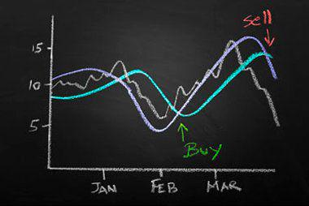

Investment funds have experienced a profound transformation over the years, with significant innovations reshaping the landscape of financial markets. Exchange-traded funds (ETFs), in particular, have emerged as a pivotal tool for investors seeking diversified and efficient investment opportunities. ETFs are investment funds traded on stock exchanges, and they have become popular due to their versatility, transparency, and cost-effective nature. Among these, the PowerShares brand, initially an innovator in the sector, has played a notable role.

The PowerShares brand, which eventually evolved into Invesco ETFs, has been instrumental in popularizing ETFs with unique strategies. PowerShares introduced a suite of innovative products that expanded investor access to various market segments and strategies. Over time, with Invesco's acquisition and rebranding, this suite of ETFs has continued to grow, offering a broad range of investment options that cater to diverse investor needs, from traditional market-cap-weighted indices to smart beta strategies.



In recent years, algorithmic trading has also become a crucial component in the evolution of investment strategies. Utilizing sophisticated algorithms to execute trades at speeds and efficiencies unattainable by human traders, algorithmic trading has transformed how transactions occur in financial markets. These algorithms analyze vast datasets and make instantaneous decisions based on predefined criteria, enhancing market liquidity and reducing transaction costs. In doing so, algorithmic trading supports fund managers in managing large orders more effectively while mitigating risks associated with market volatility.

This article aims to provide a comprehensive overview of how ETFs, particularly the PowerShares brand, and algorithmic trading integrate to create optimized investment strategies. By examining the history of PowerShares and its transformation into Invesco ETFs, we will elucidate how these funds function in contemporary financial markets. Additionally, the role of algorithmic trading in bolstering trading efficiency and risk management will be discussed. Through this exploration, investors can gain insights into how these innovations combine to offer a blend of diversification, efficiency, and precision in investment opportunities.

## Table of Contents

## Understanding Exchange-Traded Funds (ETFs)

Exchange-Traded Funds (ETFs) are a type of investment fund that is traded on stock exchanges in a manner similar to individual stocks. They offer investors the advantage of accessing a diversified portfolio of assets without having to purchase each one individually. This diversification allows investors to spread their risk across various market sectors and asset classes, thus providing a buffer against the volatility associated with individual stocks.

One of the primary benefits of ETFs is their tax efficiency. Unlike mutual funds, which may trigger capital gains taxes when the fund manager buys or sells assets within the portfolio, ETFs are structured in a way that minimizes such taxable events. This is largely due to the "in-kind" creation and redemption process, which allows ETFs to avoid selling shares in the open market to meet investor redemptions. 

ETFs are also lauded for their flexibility. Investors can trade [ETF](/wiki/etf-trading-strategies) shares throughout the trading day at market-determined prices, similar to how stocks are traded. This intraday trading capability provides [liquidity](/wiki/liquidity-risk-premium) and the ability to respond to market changes in real-time. Additionally, ETFs generally have lower expense ratios compared to traditional mutual funds, making them a cost-effective solution for many investors.

PowerShares, which has since been rebranded as Invesco ETFs, is a prominent name in the ETF market. Established as a pioneer in the industry, PowerShares became well-known for its innovation, particularly in developing strategies such as smart beta ETFs. These funds utilize alternative index construction rules rather than the conventional market-capitalization approach, aiming to enhance returns and reduce risk.

One of PowerShares’ most significant contributions to the ETF market is the PowerShares QQQ, commonly known simply as QQQs. This ETF tracks the performance of the Nasdaq-100 Index and includes 100 of the largest non-financial companies listed on the Nasdaq stock exchange. The QQQs have provided investors with broad exposure to technology and innovation-led industries, making it one of the most traded ETFs globally. 

In conclusion, ETFs like those offered by Invesco provide investors with diversified, flexible, and tax-efficient investment opportunities. Their evolution and innovation, as illustrated by products like the QQQs, demonstrate the pivotal role ETFs play in modern investment strategies, offering a viable alternative to traditional mutual funds while catering to the dynamic needs of contemporary investors.

## The Evolution of PowerShares

PowerShares was established in 2003, quickly gaining recognition for its focus on developing innovative "next generation" exchange-traded funds (ETFs). The company’s core strategy centered around offering smart beta and actively managed ETF products, which cater to investors seeking intelligent and strategic investment solutions. Smart beta ETFs aim to enhance returns, improve diversification, and reduce risk compared to traditional market-cap-weighted indices by following alternative weighting strategies.

The acquisition of PowerShares by Invesco in 2006 marked a significant transition, as integrating PowerShares' technology and expertise into Invesco's broader investment capabilities initiated a rebranding to Invesco ETFs. This transformation signified the beginning of a new era for the company, allowing it to leverage its expanded resources and distribution channels.

Invesco's strategic expansion continued through acquisitions, notably including Guggenheim Investments' ETF business in 2018. This acquisition significantly bolstered Invesco's presence in the ETF marketplace, adding more diverse offerings to its product line, which catered to a wider spectrum of investors. With these expansions, Invesco solidified its market position and broadened its ETF product suite to include both traditional market-cap-weighted ETFs and more complex smart beta options.

Today, Invesco ETFs continue to reflect the innovative spirit initiated by PowerShares, offering a comprehensive range of investment products. This includes traditional ETFs, which track well-known indices like the S&P 500, as well as a suite of smart beta ETFs designed to capture specific factors such as low [volatility](/wiki/volatility-trading-strategies), [momentum](/wiki/momentum), and quality. The continued evolution and diversification of Invesco's offerings underscore its commitment to providing versatile and efficient investment tools to meet the diverse needs of today's investors.

## Algorithmic Trading: Enhancing Investment Strategies

Algorithmic trading utilizes advanced software systems to execute trades based on predefined criteria, allowing for increased speed and efficiency. This approach has gained significant traction in modern financial markets, especially among large institutional firms seeking to manage their extensive portfolios efficiently. By automating the trading process, [algorithmic trading](/wiki/algorithmic-trading) enables institutions to handle large volumes of orders with reduced trading costs and improved execution precision.

The prevalence of algorithmic trading is particularly evident in markets where speed is crucial. According to a study by the Bank for International Settlements, it is estimated that as much as 80% of trading on some stock exchanges may be attributed to algorithmic trading. This technology allows for real-time data analysis and decision-making, which is essential in the rapidly changing market environment.

One of the primary benefits of algorithmic trading is its ability to support investment funds by effectively managing large orders. Traditional trading methods can lead to significant market impact costs when large orders are executed. However, algorithms can break down these large orders into smaller trades, executing them at optimal times to minimize market disruption and reduce transaction costs.

Moreover, algorithmic trading plays a pivotal role in influencing market volatility and liquidity. While there is ongoing debate about its impact, algorithms can contribute to market liquidity by continuously providing buy and sell orders, narrowing spreads, and enhancing price discovery processes. However, the rapid execution capability of algorithms has also raised concerns about increased volatility, particularly during events like the Flash Crash of 2010. Despite these concerns, many studies suggest that algorithmic trading enhances market stability by quickly equilibrating supply and demand.

The consistency and precision offered by algorithmic trading often surpass that of human decision-making in trade execution. Unlike human traders, algorithms are not subject to emotions, fatigue, or cognitive biases, which can impair decision-making. Instead, they strictly adhere to their programmed strategies, executing trades with speed and precision. 

The following is a simplistic example in Python that demonstrates how an algorithmic trader might use predefined criteria (e.g., moving average crossover) to execute trades:

```python
import pandas as pd

# Sample moving average crossover strategy
def moving_average_crossover(prices, short_window, long_window):
    # Calculate short and long moving averages
    short_ma = prices.rolling(window=short_window).mean()
    long_ma = prices.rolling(window=long_window).mean()

    # Generate trading signals: 1 for 'buy', -1 for 'sell'
    signals = pd.Series(index=prices.index)
    signals[short_ma > long_ma] = 1
    signals[short_ma < long_ma] = -1

    return signals

# Example data: closing prices
data = pd.Series([100, 101, 102, 103, 104, 105, 98, 97, 99, 101, 102])

# Apply strategy
signals = moving_average_crossover(data, short_window=3, long_window=5)
print(signals)
```

This example illustrates a simple rule-based strategy, which can be made significantly more complex by incorporating various data inputs and statistical models, showcasing the adaptability of algorithmic trading. Despite its sophistication, it is crucial for market participants to carefully design and monitor these trading systems to mitigate any inadvertent market disturbances. As such, algorithmic trading not only enhances trading efficiency but also shapes investment strategies in contemporary financial markets.

## The Impact of Smart Beta and Algo Trading on ETFs

Smart beta ETFs represent an innovative fusion of active and passive investment strategies. They use rules-based, systematic methods to select investments, challenging traditional market cap-weighted indices by emphasizing factors like value, momentum, volatility, and dividend yield. This approach allows investors to capture alpha while maintaining a passive framework, potentially enhancing returns and minimizing risks.

Invesco plays a pivotal role in the smart beta ETF landscape, holding a significant position as a leader in providing these sophisticated investment vehicles. With its acquisition of PowerShares, Invesco expanded its footprint in the ETF domain, offering a broad spectrum of smart beta products designed to meet varying investor needs. The firm's commitment to innovation is exemplified by its ETF offerings, which frequently adapt to market trends and investor demand through [factor](/wiki/factor-investing)-based strategies.

The integration of algorithmic trading with smart beta strategies further enhances the adaptability and responsiveness of ETFs to market changes. Algorithmic trading, driven by advanced computing technologies, analyzes vast datasets in real-time, optimizing trade execution and rebalancing portfolios according to pre-defined rules. This process ensures that smart beta ETFs remain aligned with their strategic objectives, maximizing efficiency in capturing investment opportunities while minimizing transaction costs and market impact.

Despite the many advantages, smart beta strategies are not without their challenges. Tracking errors are a notable risk, arising when fund performance deviates from the underlying index due to factors such as the rebalancing process or transaction costs. Additionally, smart beta ETFs often incur higher management fees compared to traditional passive funds due to the complexity of their strategies and the resources required to maintain them.

The synergy between smart beta ETFs and algorithmic trading aligns with the overarching goal of delivering value-added investment products. This combination provides investors with an opportunity to gain exposure to carefully selected factors, benefitting from enhanced returns and risk management. As markets continue to evolve and technological advancements progress, the refinement and expansion of smart beta and algorithmic trading strategies are expected to further transform the ETF landscape, offering increasingly sophisticated options for investors.

## Conclusion

The convergence of exchange-traded funds (ETFs) from Invesco and algorithmic trading signifies a noteworthy progression in the investment domain. This intersection of technology and finance has introduced mechanisms that serve the needs of both institutional and retail investors, providing a unique mix of diversification, efficiency, and accuracy. ETFs have democratized access to a diversified portfolio, offering an efficient option for investors to gain exposure to varied market sectors. Through PowerShares’ transformation into Invesco ETFs, investment strategies have been further refined to meet evolving market dynamics.

The integration of algorithmic trading has transformed the execution of trades by leveraging automated, software-driven strategies that adhere to predefined criteria. This advancement has not only increased trade execution speed and reduced costs but has also minimized human error, thus enhancing precision and consistency. As a result, algorithmic trading plays a crucial role in handling the complex order flows and ensuring liquidity within the financial markets.

Investors who grasp the functional intricacies of PowerShares' ETFs and the methodologies of algorithmic trading are better equipped to make informed decisions. As financial markets continuously evolve with technological advancements, understanding these mechanisms becomes vital. The adoption of smart beta strategies and the synergy with algorithmic trading facilitate a responsive and flexible approach that actively adapts to market changes.

The prominence of technology in shaping future investment strategies is undeniable. Active engagement and comprehension of these developments enable investors to effectively harness the benefits presented by modern investment approaches. Staying abreast of such trends is paramount for leveraging the efficiencies and precision these innovative strategies offer, ensuring competitiveness in an increasingly complex financial landscape.

## References & Further Reading

[1]: Agapova, A. (2011). ["Conventional mutual index funds versus exchange-traded funds."](https://www.sciencedirect.com/science/article/pii/S138641811000042X) Journal of Banking & Finance, 35(9), 2143-2160.

[2]: Arnott, R. D., Hsu, J., & West, J. (2008). ["The Fundamental Index: A Better Way to Invest."](https://www.amazon.com/Fundamental-Index-Better-Way-Invest/dp/047027784X) Wiley.

[3]: Aldridge, I. (2013). ["High-Frequency Trading: A Practical Guide to Algorithmic Strategies and Trading Systems."](https://www.amazon.com/High-Frequency-Trading-Practical-Algorithmic-Strategies/dp/1118343506) Wiley.

[4]: Poterba, J. M., & Shoven, J. B. (2002). ["Exchange-Traded Funds: A New Investment Option for Taxable Investors."](https://www.nber.org/papers/w8781) American Economic Review, 92(2), 422-427.

[5]: ["Invesco QQQ ETF Fact Sheet."](https://www.invesco.com/us/financial-products/etfs/product-detail?productId=QQQ&ticker=QQQ&audienceType=investors) Invesco.

[6]: French, K. R. (2008). ["The Cost of Active Investing."](https://papers.ssrn.com/sol3/papers.cfm?abstract_id=1105775) The Journal of Finance, 63(4), 1537-1573.