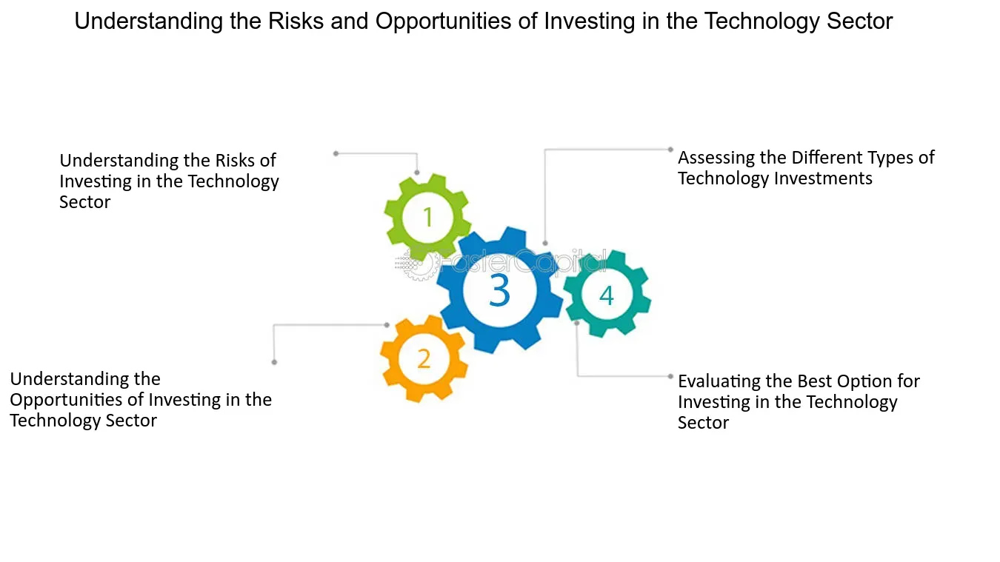

## Table of Contents

## What is Powershares and what do they offer?

Powershares is a brand name used by Invesco, a big investment company. They make and manage exchange-traded funds (ETFs). ETFs are like baskets of investments that you can buy and sell on the stock market. Powershares ETFs let people invest in different things, like stocks, bonds, and other assets, without having to buy each one separately.

Powershares offers many different ETFs for people with different investment goals. Some ETFs focus on certain industries, like technology or health care. Others might focus on specific countries or regions. This variety helps investors build a diverse portfolio, which can lower risk. Powershares also has ETFs that follow certain investment strategies, like trying to get more income or focusing on sustainable companies.

## How does Powershares differ from traditional investment options?

Powershares, now part of Invesco, offers exchange-traded funds (ETFs) which are different from traditional investment options like individual stocks or mutual funds. With ETFs, you can buy a whole bunch of different investments all at once, like a basket. This is easier than buying each stock or bond by itself. ETFs also trade on the stock market, so you can buy and sell them anytime during the trading day, just like stocks. Traditional mutual funds, on the other hand, only let you buy or sell at the end of the day.

Another big difference is that Powershares ETFs often focus on specific themes or strategies. For example, you can find ETFs that only invest in tech companies, or ones that focus on getting more income, or even ones that care about the environment. This makes it easier for people to invest in what they care about or what fits their goals. Traditional investments might not offer this kind of focus, so you'd have to pick and choose individual stocks or bonds to match your interests or strategy.

## What are the main types of Powershares products available to investors?

Powershares, now part of Invesco, offers many different types of ETFs for investors. One main type is equity ETFs, which focus on stocks. These can be broad, covering a lot of different companies, or they can be more specific, like only investing in tech or health care companies. Another type is fixed income ETFs, which focus on bonds. These can help investors get regular income and can be less risky than stocks.

Powershares also has ETFs that follow certain strategies or themes. For example, some ETFs aim to give investors more income, while others focus on sustainable or environmentally friendly companies. There are also ETFs that invest in specific countries or regions, like emerging markets. This variety helps investors build a portfolio that matches their goals and what they care about.

Overall, Powershares ETFs give investors a lot of choices. Whether you want to invest in stocks, bonds, or follow a special strategy, there's likely an ETF that fits your needs. This makes it easier to build a diverse investment portfolio without having to pick each stock or bond by yourself.

## How can someone start investing in Powershares?

To start investing in Powershares, you first need to open a brokerage account. A brokerage account is like a special bank account where you can buy and sell investments. You can open one at many different places, like big banks or online investment companies. Once your account is set up, you'll need to add money to it. This money is what you'll use to buy Powershares ETFs.

After you have your account ready and funded, you can start looking for Powershares ETFs. You can find them by searching for the specific ETF you want on your brokerage's website or app. Each ETF has a special name and a ticker symbol, which is like a short code that helps you find it. Once you find the ETF you want, you can place an order to buy it. Just enter how many shares you want and hit the buy button. After that, the ETF will be part of your investment portfolio, and you can watch it grow over time.

## What are the potential benefits of investing in Powershares?

Investing in Powershares can be a good idea because it lets you buy a bunch of different investments all at once. Instead of picking each stock or bond by yourself, you can just buy one Powershares ETF. This makes it easier to have a diverse portfolio, which means your money is spread out over many different things. This can help lower your risk because if one investment does badly, the others might do well and balance it out.

Another benefit is that Powershares ETFs come in many different types. You can find ETFs that focus on certain industries, like technology or health care, or ones that invest in specific countries or regions. There are also ETFs that follow special strategies, like trying to get more income or focusing on sustainable companies. This variety makes it easier to find investments that match what you care about or what you're trying to achieve with your money.

## What are the general risks associated with Powershares investments?

Investing in Powershares ETFs, like any investment, comes with risks. One big risk is that the value of the ETF can go up and down. This means you could lose money if the stocks or bonds inside the ETF don't do well. Since ETFs hold a bunch of different investments, if a lot of them go down at the same time, the whole ETF can lose value. Also, some ETFs focus on specific industries or regions, so if something bad happens in that area, like a big company going bankrupt or a country having economic problems, the ETF can be hit hard.

Another risk is that ETFs trade on the stock market, so their price can change throughout the day. This is different from mutual funds, which only change price at the end of the day. If you need to sell your ETF quickly, you might not get the price you were hoping for. Also, some ETFs use special strategies that can be riskier, like trying to get more income or focusing on new and untested companies. These strategies can lead to bigger gains, but they can also lead to bigger losses if things don't go as planned.

## How do market conditions affect Powershares performance?

Market conditions can really change how well Powershares ETFs do. If the stock market is doing great, the ETFs that invest in stocks will likely go up in value. But if the market is doing badly, those ETFs can lose value. The same goes for ETFs that invest in bonds or other things. If interest rates go up, bond ETFs might not do as well because new bonds will pay more interest. And if there's a big event, like a country having economic problems, ETFs that focus on that country can be hit hard.

Some Powershares ETFs focus on specific industries or themes, so they can be even more affected by what's happening in those areas. For example, if there's a new technology that everyone wants, tech ETFs might do really well. But if there's a problem in the health care industry, like a big company getting in trouble, health care ETFs could lose value. It's important to keep an eye on what's happening in the market and in the areas where your ETFs invest, because these things can make a big difference in how your investments perform.

## What are the tax implications of investing in Powershares?

When you invest in Powershares ETFs, you need to think about taxes. If you sell your ETF for more money than you paid for it, you might have to pay capital gains tax. This tax depends on how long you held the ETF. If you held it for more than a year, it's called a long-term capital gain, and the tax rate is usually lower. If you held it for less than a year, it's a short-term capital gain, and you'll pay your regular income tax rate on it.

Another thing to know is that some Powershares ETFs might give you dividends or interest. These payments can also be taxed. Dividends from stocks are usually taxed at a special rate, which can be lower than your regular income tax rate. Interest from bonds is usually taxed as regular income. It's a good idea to talk to a tax advisor to understand how these taxes will affect your investments and to plan the best way to manage them.

## How does liquidity impact Powershares investments?

Liquidity is how easy it is to buy or sell something without changing its price too much. For Powershares ETFs, liquidity is important because it affects how quickly you can get your money out if you need to. If an ETF is very liquid, you can sell it fast and at a price close to what you see on the market. But if it's not very liquid, it might take longer to sell, and you might not get the price you want. This can be a problem if you need your money right away or if the market is moving a lot.

The liquidity of Powershares ETFs can change based on how popular they are and how much people are trading them. ETFs that focus on big, well-known companies or industries usually have more liquidity because more people want to buy and sell them. On the other hand, ETFs that focus on smaller or less popular areas might not be as liquid. It's a good idea to check how liquid an ETF is before you invest, especially if you think you might need to sell it quickly in the future.

## What advanced strategies can be used to optimize Powershares investments?

One advanced strategy to optimize Powershares investments is called asset allocation. This means spreading your money across different types of ETFs, like some in stocks, some in bonds, and maybe some in other things like commodities. By doing this, you can balance out the risk and reward of your investments. For example, if the stock market goes down, your bond ETFs might help cushion the fall. You can also change your asset allocation over time based on what's happening in the market or as you get closer to needing your money, like for retirement.

Another strategy is called rebalancing. This means checking your portfolio every so often and making sure it still matches your goals. If one type of ETF has done really well and now makes up a bigger part of your portfolio than you want, you can sell some of it and buy more of the other ETFs to get back to your original plan. Rebalancing helps keep your risk level steady and can even help you buy low and sell high. It's like keeping your investment garden tidy so everything grows the way you want it to.

## How do regulatory changes potentially impact Powershares?

Regulatory changes can have a big effect on Powershares ETFs. If the government makes new rules about how investments can be made or what kinds of things ETFs can invest in, it can change how Powershares ETFs work. For example, if new rules make it harder for ETFs to invest in certain stocks or bonds, the ETFs might have to change what they hold. This can make the ETFs perform differently than before, and it might even make some ETFs less popular or harder to buy and sell.

Another way regulatory changes can impact Powershares is through taxes. If the government changes the tax rules for ETFs, it can change how much money investors keep after taxes. For example, if the tax on dividends goes up, investors might get less money from their ETFs. This can make people less interested in buying certain ETFs, which can affect how well the ETFs do in the market. Keeping an eye on regulatory changes is important for anyone investing in Powershares ETFs.

## What are the long-term performance trends of specific Powershares products?

Powershares, now part of Invesco, has a variety of ETFs with different long-term performance trends. For example, the Powershares QQQ Trust (QQQ), which focuses on technology and internet companies, has generally done well over the long term. Over the past 10 years, it has grown a lot because technology has become a big part of our lives. But, like all investments, it can go up and down a lot, so it's not always a smooth ride.

Another ETF, the Powershares S&P 500 Low Volatility Portfolio (SPLV), tries to be less risky by investing in companies that don't move as much in price. Over the long term, it has been more steady than the overall stock market. This can be good for people who want to avoid big ups and downs but still want to grow their money over time. However, it might not grow as fast as some other ETFs when the market is doing really well.

## References & Further Reading

[1]: Agapova, A. (2011). ["Conventional mutual index funds versus exchange-traded funds."](https://www.sciencedirect.com/science/article/pii/S138641811000042X) Journal of Banking & Finance, 35(9), 2143-2160.

[2]: Arnott, R. D., Hsu, J., & West, J. (2008). ["The Fundamental Index: A Better Way to Invest."](https://www.amazon.com/Fundamental-Index-Better-Way-Invest/dp/047027784X) Wiley.

[3]: Aldridge, I. (2013). ["High-Frequency Trading: A Practical Guide to Algorithmic Strategies and Trading Systems."](https://www.amazon.com/High-Frequency-Trading-Practical-Algorithmic-Strategies/dp/1118343506) Wiley.

[4]: Poterba, J. M., & Shoven, J. B. (2002). ["Exchange-Traded Funds: A New Investment Option for Taxable Investors."](https://www.nber.org/papers/w8781) American Economic Review, 92(2), 422-427.

[5]: ["Invesco QQQ ETF Fact Sheet."](https://www.invesco.com/us/financial-products/etfs/product-detail?productId=QQQ&ticker=QQQ&audienceType=investors) Invesco.

[6]: French, K. R. (2008). ["The Cost of Active Investing."](https://papers.ssrn.com/sol3/papers.cfm?abstract_id=1105775) The Journal of Finance, 63(4), 1537-1573.