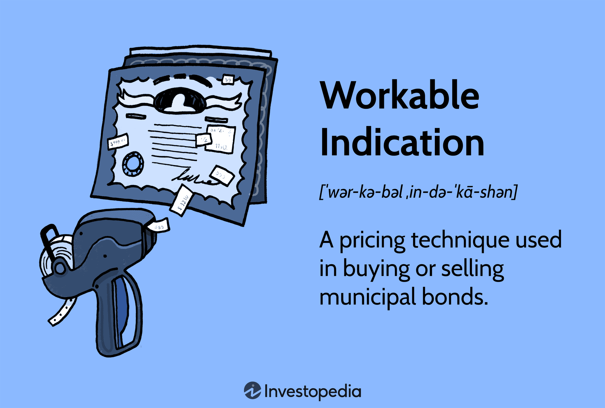

Algorithmic trading, also known as algo trading, has become a significant facet of modern financial markets. This trading method involves the use of predefined sets of rules, known as algorithms, to automate the execution of trades. By employing these algorithms, traders can process vast amounts of data rapidly and make trading decisions with greater speed and accuracy than manual systems.

The advent of technology in financial markets has introduced a suite of tools and indicators designed to enhance trading strategies. These innovations have transformed how trades are performed, allowing for the analysis of complex market data and the identification of trading opportunities that may not be discernible to the human eye. Algorithms can be programmed to execute trades at optimal times and conditions, thereby maximizing potential profits and minimizing risks.



This article aims to clarify key definitions within the scope of algorithmic trading, indicate its practical uses, and detail some popular indicators that contribute to effective algo trading strategies. By understanding these components, traders can leverage algorithmic trading to improve efficiency, reduce emotional bias, and gain competitive advantages in today’s fast-paced financial markets.

## Table of Contents

## Definition of Algorithmic Trading

Algorithmic trading is a method of executing orders using automated pre-programmed trading instructions that account for variables such as time, price, and volume. Developed to leverage the computational power of machines, algorithmic trading aims to make trading decisions with enhanced speed and precision. 

These systems utilize complex algorithms designed to parse vast amounts of market data, seeking patterns or signals that indicate potential trading opportunities. Upon identifying such opportunities, the algorithm proceeds to execute trades according to its predefined criteria without direct human intervention. The automation inherent in these systems allows traders to process large datasets rapidly, far exceeding human capabilities.

An algorithm, in this context, is essentially a set of instructions or rules coded into a computer program. These rules are based on predefined strategies that can be either statistical, mathematical, or based on other logical conditions. For example, an algo trader may use a strategy that buys stocks when they fall below a certain moving average, signaling a potential buying opportunity.

The mechanics behind [algorithmic trading](/wiki/algorithmic-trading) can be conceptualized through a simplified process flow: 

1. **Market Data Collection**: Continuously acquire real-time and historical data.
2. **Analysis**: Use the algorithm to analyze data, often using technical indicators or other analytical tools to discern trading signals.
3. **Signal Generation**: Determine buy, sell, or hold signals based on the algorithm's criteria.
4. **Execution**: Automatically place trades through direct market access to exchanges.
5. **Monitoring**: Continuously monitor trades to ensure compliance with the strategy and adjust if necessary.

This approach can involve trading across various asset classes, including stocks, options, futures, currencies, and cryptocurrencies. By exploiting the speed and logic of algorithms, traders can capitalize on even the most fleeting market opportunities, often executing trades in milliseconds.

Algorithmic trading not only enhances the efficiency and reliability of trade execution but also minimizes human emotional interference, such as fear or greed, which can impair trading decisions. As such, it has become a cornerstone of modern financial markets, employed by institutional investors and increasingly by individual traders seeking to optimize their trading strategies.

## Clarification of Key Terms

In the context of financial trading, it is essential to differentiate between the terms 'algo trading', 'high-frequency trading', and '[machine learning](/wiki/machine-learning) algorithms', as these concepts often intertwine yet bear distinct characteristics.

Algorithmic trading, frequently termed as 'algo trading', refers to the use of computer algorithms to execute trading decisions. These algorithms are designed to analyze market conditions, necessitating an understanding of vast data sets to identify and capitalize on trading opportunities. Algo trading systems are pre-programmed with a set of rules to automatically manage trading instructions, which optimizes the speed and efficiency of trade execution compared to manual trading.

High-frequency trading ([HFT](/wiki/high-frequency-trading-strategies)) is a subset of algorithmic trading characterized by the rapid execution of numerous trades in fractions of a second. HFT leverages sophisticated algorithms to analyze multiple markets and execute large orders at incredibly fast speeds. The core advantage of HFT is its ability to take advantage of small price differentials and market inefficiencies, which requires a high-speed data transmission infrastructure.

Machine learning algorithms, when employed in trading, form a specialized domain where systems learn from historical data patterns to improve decision-making processes autonomously. Unlike traditional algorithms that follow specific rules, machine learning models adapt and evolve by learning from new data inputs. These systems can uncover complex, non-linear relationships within market data, providing insights that static models might overlook. A typical use case of machine learning in trading is the prediction of stock price movements or asset [volatility](/wiki/volatility-trading-strategies) using historical dataset patterns.

Understanding these distinct yet interconnected terms—algo trading, high-frequency trading, and machine learning algorithms—is crucial for traders aiming to leverage technological advancements in financial markets. While algo and high-frequency trading focus on speed and efficiency, machine learning emphasizes adaptability and pattern recognition, each playing a unique role in refining trading strategies.

## Uses of Algorithmic Trading

Algorithmic trading, commonly referred to as algo trading, is a pivotal component in modern financial markets, notable for its speed, efficiency, and ability to process vast amounts of data. This technology-driven method is employed extensively across various asset classes, including stocks, [forex](/wiki/forex-system), and cryptocurrencies, allowing traders to implement complex strategies that can adapt to different market conditions.

One of the primary uses of algorithmic trading is in the application of different trading strategies designed to exploit specific market conditions. Key strategies include trend-following, mean reversion, and statistical [arbitrage](/wiki/arbitrage).

**Trend-Following Strategies** utilize algorithms that strive to capitalize on market momentum. By employing indicators like Moving Averages or the Moving Average Convergence Divergence (MACD), these algorithms detect and follow existing market trends. The key advantage of trend-following strategies is their ability to remain invested as long as the trend persists, capturing substantial moves in the market.

**Mean Reversion Strategies** are based on the assumption that prices and returns will revert to their long-term averages or means. These algorithms seek to identify assets that have deviated significantly from their average price and predict that they will return to these levels. This strategy often utilizes statistical models and indicators such as the Relative Strength Index (RSI) to identify overbought or oversold conditions.

**Statistical Arbitrage** involves the use of quantitative models to exploit price inefficiencies between related financial instruments. By modeling the statistical relationship between asset prices, algorithms can identify and capitalize on temporary mispricings. This strategy relies heavily on statistical and mathematical techniques, such as regression analysis, and is typically executed at high speeds in order to profit from small price discrepancies before they disappear.

These algorithmic trading strategies are implemented using advanced mathematical models and rely on extensive historical data to predict price movements. They are executed at speeds that surpass human capabilities, often involving milliseconds or even microseconds. This rapid execution speeds up the decision-making process and eliminates emotional biases, which can hinder performance in manual trading.

In conclusion, the use of algorithmic trading spans a range of sophisticated strategies that are pivotal to navigating today's fast-paced financial markets. The ability to process large data sets quickly enhances trading decision accuracy, making algo trading an invaluable tool for both institutional and individual traders.

## Practical Indicators in Algo Trading

Indicators play a critical role in algorithmic trading by helping traders identify market trends and make informed trading decisions. These mathematical calculations are based on the price, [volume](/wiki/volume-trading-strategy), or open interest of a security. Traders leverage these indicators to automate trading strategies, which helps to mitigate emotional biases, improve decision-making, and enhance efficiency.

**1. Moving Averages:**
Moving averages are widely used in trading. They smooth out price data to identify the direction of the trend. The two most common types are the Simple Moving Average (SMA) and the Exponential Moving Average (EMA). While SMA calculates the average price over a specific period, EMA gives more weight to recent prices, making it more reactive to new information.

Python example for calculating SMA:
```python
def simple_moving_average(prices, window):
    return sum(prices[-window:]) / window  # prices: list of closing prices, window: period length

sma = simple_moving_average([150, 152, 153, 151, 149], 3)
```

**2. Relative Strength Index (RSI):**
RSI is a [momentum](/wiki/momentum) oscillator that measures the speed and change of price movements. It ranges from 0 to 100 and is typically used to identify overbought or oversold conditions. An RSI above 70 may indicate that a security is overbought, while an RSI below 30 suggests it might be oversold.

Formula for RSI:
$$
\text{RSI} = 100 - \left( \frac{100}{1 + \frac{\text{Average Gain}}{\text{Average Loss}}} \right)
$$

**3. Moving Average Convergence Divergence (MACD):**
MACD is a trend-following momentum indicator that shows the relationship between two moving averages of a security’s price. The MACD line is typically the difference between the 26-day EMA and the 12-day EMA, while the signal line is a 9-day EMA of the MACD line. Traders often look for crossovers between the MACD and signal line as potential buy/sell signals.

**4. Bollinger Bands:**
Bollinger Bands consist of a middle band (SMA) and two outer bands (standard deviations away from the SMA). These bands expand and contract based on market volatility. Securities are considered overbought when prices touch the upper band and oversold when they touch the lower band.

Python example for calculating Bollinger Bands:
```python
def bollinger_bands(prices, window=20, num_sd=2):
    sma = simple_moving_average(prices, window)
    std = np.std(prices[-window:])
    upper_band = sma + (std * num_sd)
    lower_band = sma - (std * num_sd)
    return upper_band, lower_band

upper, lower = bollinger_bands([150, 152, 153, 155, 157, 159, 150, 148, 149, 151])
```

**5. Stochastic Oscillator:**
The Stochastic Oscillator is a momentum indicator comparing a particular closing price of a security to a range of its prices over a certain period. Its sensitivity to market movements can be reduced by adjusting the period or taking a moving average of the result. Values above 80 indicate that an asset might be overbought, while values below 20 suggest it might be oversold.

Incorporating these indicators into algorithmic trading systems can help automate strategies that react quickly to market changes, minimizing emotional decision-making and improving the potential for profitable trades. These tools are integral for analyzing market conditions and are favorably used by both novice and experienced traders in enhancing trading strategies' efficacy and robustness.

## Practical Indications for Beginners

For beginners venturing into algorithmic trading, understanding foundational indicators is essential. Two widely acknowledged indicators suitable for novices are the Moving Averages and the Relative Strength Index (RSI).

Moving Averages are statistical metrics that smooth out price data by creating a constantly updated average price. This indicator is crucial for identifying trends and potential reversals in the market. The Simple Moving Average (SMA) is calculated by summing the closing prices over a specific period and then dividing by the number of periods. The formula is as follows:

$$
\text{SMA} = \frac{P_1 + P_2 + \ldots + P_n}{n}
$$

where $P$ represents the price at different times, and $n$ is the number of observations.

Another variant, the Exponential Moving Average (EMA), gives more weight to recent prices, making it more responsive to new information. The EMA is often computed as:

$$
\text{EMA}_{\text{today}} = \left(\frac{2}{n+1}\right) \times (\text{Price}_{\text{today}} - \text{EMA}_{\text{yesterday}}) + \text{EMA}_{\text{yesterday}}
$$

The Relative Strength Index (RSI) is another useful indicator for beginners. RSI measures the velocity and change of price movements, indicating overbought or oversold conditions. It is calculated using the formula:

$$
\text{RSI} = 100 - \frac{100}{1 + \frac{\text{Average Gain}}{\text{Average Loss}}}
$$

Typically, an RSI above 70 suggests that a market is overbought, while an RSI below 30 indicates that a market is oversold.

Platforms such as MetaTrader and TradeStation offer user-friendly environments where these indicators can be applied, analyzed, and tested. These platforms provide robust tools for developing and testing various algo-trading strategies in real-time or with historical data, known as [backtesting](/wiki/backtesting). Backtesting allows traders to simulate how a strategy might have performed in the past, providing valuable insights and forecasts for how strategies might behave in live markets.

For beginners, it's crucial to start with these well-established indicators to cultivate a fundamental understanding. Progressing from the use of these indicators, traders can incrementally refine and adapt their strategies through continuous backtesting and iteration. By gradually enhancing their algorithmic models and incorporating additional indicators or complex functions, beginners can build robust trading systems tailored to specific market conditions.

## Conclusion

Algorithmic trading stands at the forefront of modern financial markets, offering significant advantages to traders through its capability to execute strategies with unprecedented speed and efficiency. By automating the decision-making process, algo trading eliminates the emotional biases often associated with manual trading, providing a more reliable and objective approach to executing trades.

Harnessing the power of algorithmic trading tools involves understanding the core components—definitions, uses, and indicators—that form the foundation of this advanced trading method. Recognizing how these elements interact allows traders to develop strategies that are not only faster but also more efficient and systematic compared to traditional methods. For instance, algo trading systems can process immense volumes of market data almost instantaneously, leading to more informed and timely trades.

Moreover, algorithmic trading is not just a tool for seasoned traders; it is an invaluable resource for those new to the market as well. By employing sophisticated algorithms, even beginners can enhance their trading strategies, making informed decisions without succumbing to the psychological pressures of the market. The focus on specific indicators, such as Moving Averages and RSI, provides a practical entry point for developing robust trading strategies.

For traders aiming to maintain a competitive edge in today's fast-paced financial markets, embracing algorithmic trading tools offers a significant advantage. By integrating these advanced systems, traders can ensure more resilient and adaptive strategies, capable of withstanding the rapid fluctuations of modern trading environments. Thus, understanding and leveraging the capacities of algorithmic trading is not just beneficial but integral to succeeding in the contemporary financial landscape.

## References & Further Reading

[1]: Bergstra, J., Bardenet, R., Bengio, Y., & Kégl, B. (2011). ["Algorithms for Hyper-Parameter Optimization."](https://dl.acm.org/doi/10.5555/2986459.2986743) Advances in Neural Information Processing Systems 24.

[2]: ["Advances in Financial Machine Learning"](https://www.amazon.com/Advances-Financial-Machine-Learning-Marcos/dp/1119482089) by Marcos Lopez de Prado

[3]: ["Evidence-Based Technical Analysis: Applying the Scientific Method and Statistical Inference to Trading Signals"](https://www.amazon.com/Evidence-Based-Technical-Analysis-Scientific-Statistical/dp/0470008741) by David Aronson

[4]: ["Machine Learning for Algorithmic Trading"](https://github.com/stefan-jansen/machine-learning-for-trading) by Stefan Jansen

[5]: ["Quantitative Trading: How to Build Your Own Algorithmic Trading Business"](https://github.com/LucindaYa/quant-resources/blob/master/Quantitative%20Trading%20How%20to%20Build%20Your%20Own%20Algorithmic%20Trading%20Business.pdf) by Ernest P. Chan