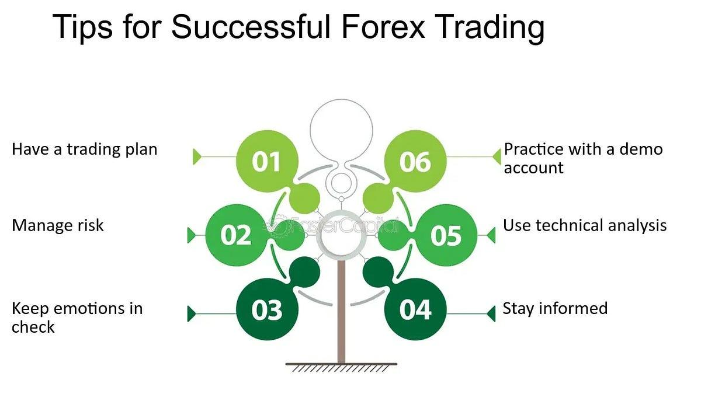

Forex trading, formally known as foreign exchange trading, has witnessed exponential growth worldwide, becoming one of the most actively traded markets globally. The forex market's allure stems from its potential for substantial profit, driven by the sheer volume of daily transactions which exceed $6 trillion. This immense liquidity offers traders opportunities for considerable returns, both for individual traders and financial institutions. Factors such as the accessibility of online trading platforms and the market's 24-hour nature have further spurred forex trading's popularity among retail investors.

Parallel to the rise of forex trading is the ascent of algorithmic trading (algo trading), which plays an increasingly significant role in modern financial markets, including forex. Algo trading involves the use of computer algorithms to manage trading orders at speeds and frequencies beyond human capabilities. Leveraging the power of algorithms, traders can execute complex trading strategies quickly, taking advantage of even the smallest price discrepancies with precision and efficiency. This technological evolution not only enhances trading capabilities but also democratizes access for traders who can now employ sophisticated strategies that were once the domain of large institutional players.



Understanding trading strategies is critical to achieving success in forex and algo trading. In the fast-paced and ever-evolving forex market, traders who possess a comprehensive understanding of effective strategies stand a better chance of realizing sustained profitability. Whether employing technical analysis, fundamental analysis, or a combination of both, having a solid strategy underpins successful trading. Similarly, in algo trading, the development and implementation of robust algorithmic strategies are vital to optimize trading performance and manage risks effectively.

The objective of this article is to explore the effective trading strategies employed by successful traders in both forex and algo trading. This comprehensive guide aims to provide insights into key strategies, risk management techniques, and the integration of technology in trading, addressing the needs of traders across all experience levels. Whether you are a beginner setting foot into the forex world, an intermediate trader seeking to improve your approach, or an experienced trader looking to refine your strategies, this resource offers valuable perspectives to support and enhance your trading journey.

This article invites readers to deepen their understanding, adapt their practices, and take advantage of the potential benefits that mastering both forex and algo trading strategies can offer.

## Table of Contents

## Understanding Forex Trading

Forex trading, also known as foreign exchange or [FX](/wiki/fx-anomaly) trading, involves the buying and selling of currencies on a decentralized global market. This market, the largest and most liquid in the financial sector, accommodates a daily trading volume exceeding $6 trillion. Unlike other financial markets, forex trading does not have a centralized location but operates through an electronic network of banks, brokers, financial institutions, and individual traders.

Major players in the [forex](/wiki/forex-system) market include central and commercial banks, multinational corporations, hedge funds, and individual retail traders. Central banks, such as the Federal Reserve or the European Central Bank, significantly impact currency movements by setting monetary policies and interest rates. For instance, central banks may intervene in the forex market to stabilize or increase their currency's value by buying or selling currency reserves. Commercial banks facilitate large volumes of currency transactions on behalf of their clients, influencing market [liquidity](/wiki/liquidity-risk-premium) and currency demand.

Several factors influence forex trading, including economic indicators, political events, and market sentiment. Economic indicators such as GDP growth rates, employment figures, and inflation rates provide insights into a country's economic health, affecting investor confidence and currency value. Political stability and international relations can also lead to currency fluctuations. For example, political unrest or elections may lead to volatile currency movements. Market sentiment, driven by trader perceptions and reactions to global financial news, can further influence currency prices.

Forex trading differs from other trading forms, such as stocks and commodities, primarily on market operations and the nature of the traded assets. Stock trading involves purchasing ownership shares in companies, while commodity trading focuses on physical goods like gold or oil. Unlike these markets, the forex market operates 24 hours a day, five days a week, offering greater flexibility and more continuous opportunities. Additionally, the forex market's liquidity often results in lower transaction costs and tighter spreads than equities or commodities.

Several myths persist regarding forex trading. A common misconception is that it guarantees quick profits; in reality, successful forex trading requires knowledge, experience, and strategic planning. Another myth is that forex trading is purely speculative and lacks the analysis foundation. On the contrary, comprehensive analysis, both technical and fundamental, underlies trading decisions, similar to other financial markets.

In summary, understanding forex trading involves grasping the market's structure, key players, influencing factors, and distinguishing its operations from other trading forms. Debunking myths and recognizing the intricacies of currency trading can prepare traders for navigating the complexities of the forex market effectively.

 to Algo Trading

Algorithmic trading, often referred to as algo trading, is the process of using computer programs to execute trading orders automatically with pre-set instructions. These instructions are based on various parameters such as timing, price, and [volume](/wiki/volume-trading-strategy). The central components of [algorithmic trading](/wiki/algorithmic-trading) include algorithms, which are sets of rules or calculations that the software follows, and technology which comprises the hardware and infrastructure necessary to execute these strategies efficiently.

The evolution of algorithmic trading can be traced back to the early 1980s when program trading was first introduced on stock exchanges like the New York Stock Exchange. Since then, the adoption of algo trading has increased significantly across various financial markets, including equities, commodities, and forex. The integration of advanced technologies and computational power has facilitated the expansion of algo trading, making it an essential component in trading strategies today.

One of the primary advantages of algo trading is speed. Algorithms can process and execute trades much faster than human traders. This speed is crucial in markets where small price changes can lead to significant profit opportunities. Additionally, algorithmic trading offers precision, as it eliminates the influence of human emotions and biases in trading decisions. Furthermore, algo trading enables extensive [backtesting](/wiki/backtesting); traders can use historical data to test the effectiveness of their algorithms before deploying them in live markets. This backtesting helps in refining strategies and improving their potential for profitability.

Despite these advantages, algorithmic trading also presents certain challenges and limitations. Market [volatility](/wiki/volatility-trading-strategies) can pose risks to algorithms that are not adaptable to rapidly changing conditions. Additionally, technical failures, such as software bugs or system crashes, could result in significant financial losses. Ensuring robust technological infrastructure and regular system audits can help mitigate these risks.

There are several commonly used algorithms in trading. Trend-following algorithms are among the most popular and are designed to place trades based on the identification of trends in market data. Market-making algorithms, on the other hand, focus on providing liquidity by simultaneously placing buy and sell orders to profit from the bid-ask spread. Other algorithms include statistical [arbitrage](/wiki/arbitrage), which exploits price inefficiencies, and mean reversion, which is based on the assumption that prices will revert to their long-term mean.

With its blend of technology and finance, algorithmic trading continues to transform the landscape of trading by enhancing efficiency, and precision. However, traders must be mindful of the inherent challenges and strive to create robust, adaptable systems that can withstand market volatility and technical failures.

## Strategies of Successful Forex Traders

Forex trading involves various strategies employed by traders to optimize their profits. Effective strategies demand understanding distinct trading styles and their implementation.

Day trading is a strategy where positions are opened and closed within the same trading day. Day traders focus on small price movements and leverage high volumes to maximize potential gains. This approach requires a keen sense of timing and market understanding. Scalping is a subset of [day trading](/wiki/day-trading-spy), concentrating on executing a multitude of small trades to accumulate profits over time, often within seconds or minutes. Successful scalpers prioritize speed and precise decision-making.

Swing trading spans a longer timeframe, typically from a few days to several weeks. The objective is to capitalize on expected upward or downward market swings. Swing traders analyze price charts to determine trends and potential reversals. By holding positions longer than day traders, swing traders are less impacted by short-term volatility.

Risk management is critical for forex trading success. A vital risk management technique is the use of stop-loss orders, a preset level that triggers the automatic sale of a position to limit potential losses. Correct position sizing, determining the number of units to trade based on account size and risk tolerance, is essential. Traders often follow the 1% rule, risking no more than 1% of their trading capital on a single trade.

Technical analysis, the study of past price movements to predict future behavior, plays an integral role in forex strategy development. Traders use a variety of chart patterns—such as head and shoulders, triangles, and double bottoms—to identify potential entry and [exit](/wiki/exit-strategy) points. Technical indicators, including moving averages, relative strength index (RSI), and Bollinger Bands, assist traders in making informed decisions.

Fundamental analysis is equally important, encompassing the assessment of economic indicators and political events that influence currency values. Reports on employment numbers, [interest rate](/wiki/interest-rate-trading-strategies) decisions, and gross domestic product (GDP) figures can substantially impact currency markets. For instance, a stronger-than-expected employment report in the U.S. could lead to an appreciation of the U.S. dollar against other currencies.

Case studies of successful traders demonstrate the application of these strategies. George Soros, one of the most renowned forex traders, significantly profited by speculating against the British pound in 1992, leveraging macroeconomic analysis. Similarly, Stanley Druckenmiller has attributed his success to a combination of strategic foresight and adapting to market conditions, exemplifying the importance of integrating both technical and fundamental insights.

Incorporating these strategies requires diligence, practice, and continuous learning. Traders must enhance their analytical abilities and refine their approaches based on evolving market dynamics. The convergence of calculated strategy execution and sound risk management significantly increases the probability of sustained success in forex trading.

## Algo Trading Strategies for Success

Algorithmic trading, or algo trading, leverages computer programs to execute deals at optimal prices based on pre-determined strategies. Among the various strategies employed, arbitrage, [momentum](/wiki/momentum) trading, and mean reversion are some of the most popular due to their effectiveness and efficiency in different market scenarios. 

Arbitrage aims to exploit price discrepancies between different markets or instruments, thus capitalizing on short-term opportunities for profit. It relies heavily on speed and precision since such discrepancies are often fleeting. Momentum trading, on the other hand, capitalizes on the continuation of existing trends, attempting to buy high and sell higher or sell low and buy lower in market movements. Mean reversion is based on the principle that asset prices tend to revert to their historical averages over time, making it effective in identifying potential reversals and corrections.

Successful implementation of these strategies necessitates robust coding skills and a deep understanding of data. Algorithm developers need to write efficient code that can process vast amounts of data quickly. A typical approach involves using Python due to its rich ecosystem of libraries suited for data analysis and algorithm development. For instance, a basic momentum strategy might utilize the pandas and numpy libraries to calculate moving averages and identify trending signals:

```python
import pandas as pd
import numpy as np

def calculate_momentum(prices, window):
    return prices.rolling(window=window).mean()

prices = pd.Series([100, 102, 105, 103, 104, 108, 110])
momentum = calculate_momentum(prices, window=3)
print(momentum)
```

Machine learning (ML) and [artificial intelligence](/wiki/ai-artificial-intelligence) (AI) have begun to significantly enhance algo trading strategies by introducing predictive modeling capabilities. These technologies can analyze non-linear relationships in data, adapt to changing market dynamics, and provide more accurate forecasts. Algorithms powered by ML can optimize trade executions, adjust to market conditions, and identify new trading opportunities more efficiently than traditional methods.

The effectiveness of algorithmic strategies hinges on rigorous backtesting and optimization. Backtesting involves simulating a strategy against historical data to evaluate its potential success and identify any weaknesses. This process is critical in fine-tuning algorithms to adapt to realistic market conditions and mitigate risks.

Additionally, ethical considerations and regulatory compliance are paramount in algorithmic trading. Algo traders must ensure their strategies do not manipulate market conditions or engage in deceptive practices, aligning with regulatory standards such as those enforced by financial authorities like the Securities and Exchange Commission (SEC) or Commodity Futures Trading Commission (CFTC). Compliance with these regulations helps maintain market integrity and protects traders from potential legal ramifications. 

Overall, the integration of sophisticated algorithms, sound technical skills, and adherence to ethical standards can significantly enhance the prospects of success in algo trading.

## Combining Forex and Algo Trading Strategies

Integrating forex trading and algorithmic strategies can create robust trading systems that leverage the strengths of both approaches. By combining the nuanced understanding of forex market dynamics with the precision and speed of algorithmic trading, traders can enhance their decision-making processes and improve profitability.

One effective method for integrating these strategies is through the use of hybrid systems that utilize both technical and [fundamental analysis](/wiki/fundamental-analysis). Algorithms can be designed to incorporate technical indicators, such as moving averages or the Relative Strength Index (RSI), alongside fundamental data like economic indicators or geopolitical events. This amalgamation allows the algorithm to generate more comprehensive trading signals. For instance, a moving average crossover strategy can be programmed to validate signals against macroeconomic news releases, thus avoiding trades during high-volatility periods typically seen around major announcements.

When building and modifying algorithmic systems to adapt to different forex market conditions, flexibility is crucial. Dynamic algorithms that can adjust parameters based on market conditions are advantageous. This can be achieved through [machine learning](/wiki/machine-learning) models that learn from historical data to predict and adapt to market changes. For example, adaptive algorithms might alter their risk management rules in response to changing volatility patterns, ensuring they remain effective in varying market environments.

Seasoned traders successfully merge forex and algo tactics by applying a strategy known as algo-assisted discretionary trading. This involves using algorithms to handle routine analysis and signal generation while the trader retains control over final trade decisions. Such a strategy allows for the automation of tedious tasks while ensuring that human intuition and expertise are still employed in critical decision moments. For example, an algorithm could continuously scan the market for arbitrage opportunities, while the trader evaluates the macroeconomic landscape to decide the extent of exposure.

However, combining different trading strategies is not without challenges. One potential pitfall is over-reliance on algorithmic predictions, which can be particularly risky during unexpected market disruptions or 'black swan' events that the algorithms have not been trained to handle. Ensuring robust backtesting and stress-testing of algorithms against historical data helps mitigate this risk. Additionally, continually monitoring algorithm performance and incorporating human oversight are essential steps in avoiding algorithmic failures.

Furthermore, integration might be hampered by the 'data curve-fitting' issue, where a model is excessively tailored to past data, thus losing generalization for future market conditions. To avoid this, it's vital to employ out-of-sample testing and use k-fold cross-validation during the development phase to ensure that models can handle unseen data effectively.

In conclusion, integrating forex trading with algorithmic strategies demands a careful design that balances automated precision with human insight. By addressing the potential pitfalls and leveraging the strengths of both domains, traders can construct systems that are not only robust but also adaptive to the ever-changing forex landscape.

## Tools and Platforms for Forex and Algo Trading

When trading in the forex and algorithmic markets, selecting the right platforms is crucial to implementing effective strategies. Popular trading platforms that cater to both forex and algorithmic trading include MetaTrader 4 (MT4), MetaTrader 5 (MT5), TradeStation, and NinjaTrader. These platforms provide the necessary infrastructure for executing trades and developing custom algorithms.

**Key Features to Look For:**

1. **User-Friendliness:** Platforms should offer an intuitive interface, enabling traders to navigate easily and execute trades efficiently. A clean design and accessible features can significantly reduce the learning curve for new users.

2. **Data Availability:** Access to comprehensive market data is essential. This encompasses historical and real-time price data, economic indicators, and news feeds, which are vital for making informed trading decisions.

3. **Customization:** The ability to customize strategies and develop bespoke trading algorithms is critical. Platforms should support scripting languages such as MQL4/MQL5 for MetaTrader or C# for NinjaTrader, allowing traders to tailor tools to their specific needs.

**Tools and Software for Algo Development:**

Software like MATLAB, Python with libraries such as Pandas and NumPy, and R are widely used for developing and testing trading algorithms. These tools offer robust data analysis capabilities and can be integrated into trading platforms via APIs. Backtesting frameworks, such as QuantConnect or Zipline, enable traders to evaluate their strategies against historical data, ensuring robustness before live deployment.

**Importance of Reliable Data Feeds and Analytics:**

Reliable data feeds are the backbone of successful algorithmic trading. They provide the real-time and accurate information needed to trigger trades. Platforms often partner with established data providers to ensure high-quality data. Analytics tools that offer visualizations and statistical analysis further enhance a trader’s ability to interpret data and refine strategies.

**Resources for Further Learning:**

To further develop skills in forex and algo trading, traders can access online courses offered by educational platforms like Coursera, Udemy, and Khan Academy. Books such as "Algorithmic Trading" by Ernie Chan and "Forex Trading: The Basics Explained in Simple Terms" by Jim Brown provide in-depth insights into trading strategies and market analysis. Engaging in trading communities and forums, such as the TradingView community, can also provide valuable insights and support.

## Conclusion

The preceding exploration of forex and algorithmic trading strategies highlights the critical significance of strategic planning for trading success. To navigate the complex and dynamic forex market effectively, traders must develop a robust understanding of both the fundamental and technical aspects of trading. Strategic planning involves selecting appropriate trading strategies, managing risks wisely, and continuously refining one's approach based on market conditions.

In today's fast-paced trading environment, the ability to adapt and learn is essential. The forex market is ever-evolving, influenced by a myriad of factors such as economic indicators, geopolitical events, and technological advancements. Consequently, traders must remain vigilant, staying abreast of market trends and innovation. This adaptability is especially pertinent in algorithmic trading, where the integration of machine learning and artificial intelligence is becoming increasingly prevalent.

Mastering both forex and algo trading strategies offers substantial potential benefits. The combination of these two approaches allows traders to build more sophisticated and resilient trading systems, optimizing performance through the use of advanced algorithms and data analysis techniques. By harnessing the power of technology, traders can achieve greater precision, speed, and efficiency in their trades.

As you embark on or enhance your trading journey, consider the insights shared in this article. Whether you are a beginner seeking foundational knowledge or an experienced trader looking to refine your strategies, continuous learning and adaptation are key. Embracing a structured approach to strategy development and testing can significantly elevate your trading success.

For further enhancement of your trading skills and strategies, explore the resources and platforms mentioned within the content. These tools can provide valuable support in developing and implementing effective trading strategies. Engage with the vast array of educational materials and communities available to traders, and take proactive steps to expand your understanding and capabilities in the dynamic world of forex and algo trading.

## References & Further Reading

[1]: Bergstra, J., Bardenet, R., Bengio, Y., & Kégl, B. (2011). ["Algorithms for Hyper-Parameter Optimization."](https://papers.nips.cc/paper/4443-algorithms-for-hyper-parameter-optimization) Advances in Neural Information Processing Systems 24.

[2]: ["Advances in Financial Machine Learning"](https://www.amazon.com/Advances-Financial-Machine-Learning-Marcos/dp/1119482089) by Marcos Lopez de Prado

[3]: ["Evidence-Based Technical Analysis: Applying the Scientific Method and Statistical Inference to Trading Signals"](https://www.amazon.com/Evidence-Based-Technical-Analysis-Scientific-Statistical/dp/0470008741) by David Aronson

[4]: ["Machine Learning for Algorithmic Trading"](https://github.com/PacktPublishing/Machine-Learning-for-Algorithmic-Trading-Second-Edition) by Stefan Jansen

[5]: ["Quantitative Trading: How to Build Your Own Algorithmic Trading Business"](https://www.amazon.com/Quantitative-Trading-Build-Algorithmic-Business/dp/0470284889) by Ernest P. Chan