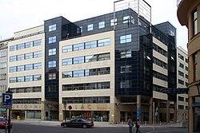

The Prague Stock Exchange (PSE) stands as a historic pillar in the Czech Republic's financial landscape, being the country's oldest and most prominent stock exchange. Established in 1871 during the Austro-Hungarian Empire, the exchange's origins lie in its initial role as a commodities market, particularly pivotal in the sugar trade. Over the years, the PSE has transformed and expanded its scope, evolving into a major platform for Czech companies to list and trade their shares.

Founded in an era of burgeoning industrial growth, the PSE has continually adapted to serve as a critical facilitator of capital for the Czech Republic's financial ecosystem. This adaptability is seen in its transition from a regional commodities exchange to a key player in the country's economic development. Following a period of inactivity during the communist regime that ended in 1989, the PSE resumed operations in 1993. It played a crucial role in the privatization wave, aiding in the transformation of over 1,000 state-owned enterprises into publicly traded companies.



The significance of the PSE extends beyond its historical roots, as it currently embodies a crucial instrument in the modern economy's functionality. It provides industries — such as automotive, pharmaceuticals, high-tech engineering, and steel production — with a platform to gain access to substantial financial resources necessary for growth and innovation. The PSE supports a diverse range of enterprises through its varied market segments, including Prime, Standard, and Free Markets, catering to both domestic and international companies.

In recent years, the dynamics of the PSE have been greatly influenced by the advent of algorithmic trading, which employs sophisticated computer algorithms to automate trading strategies and execute trades swiftly. Algorithmic trading has transformed trading patterns, introducing higher efficiency and liquidity while minimizing human errors. The PSE has embraced this technology, aligning itself with global market practices to enhance trading efficiency, thus benefiting both institutional and individual investors.

The Prague Stock Exchange's commitment to integrating technological advancements underscores its pivotal role in the financial sector, as it continually modernizes to remain competitive and relevant in a rapidly changing global market landscape. This article will explore the history, evolution, and current role of the PSE, with a particular focus on the surge of algorithmic trading and its implications for market dynamics. Through examining these facets, the discussion aims to convey the PSE's enduring significance and its progressive adaptation to new trading technologies.

## Table of Contents

## History of the Prague Stock Exchange

The Prague Stock Exchange (PSE) was established in 1871 during the Austro-Hungarian Empire. Initially, the exchange played a key role in the sugar trade, a significant economic activity at the time. The PSE contributed to the structured and regulated environment necessary for commodities trading, laying the groundwork for future financial activities in the region.

The PSE operated successfully until 1948, a period marked by significant historical events, including World War I and the Great Depression. Despite these challenges, the exchange remained active in facilitating trade and investment. However, its operations were abruptly halted in 1948 due to the political shifts brought about by the establishment of the communist regime in Czechoslovakia. This change in governance led to the nationalization of industries and the closure of the stock exchange, reflecting the broader economic consolidation and a move away from market-oriented policies.

The exchange remained closed until the early 1990s, a period marked by the fall of communism across Eastern Europe. In 1993, the Prague Stock Exchange was reopened, coinciding with the dissolution of Czechoslovakia and the establishment of the Czech Republic as an independent nation. The reopening of the PSE played a crucial role in the country's economic restructuring efforts, particularly in the privatization of state-owned enterprises. Over 1,000 firms underwent privatization, and the PSE provided a platform for these newly restructured companies to access capital markets.

Today, the PSE is a significant component of the Czech Republic’s financial infrastructure. It lists hundreds of major Czech companies and serves as a vital conduit for investment and economic growth. The exchange supports a wide range of industries, providing them with avenues to raise the capital necessary for expansion and innovation. This ongoing evolution underscores the PSE's adaptability and its role as a cornerstone of the country's financial landscape.

## Role of the PSE in the Modern Economy

The Prague Stock Exchange (PSE) plays a pivotal role in the modern economy of the Czech Republic, serving as a crucial platform for securing capital required by various industries. Notably, sectors such as automotive, high-tech engineering, steel production, and pharmaceuticals benefit significantly from the PSE's offerings. Capital-intensive industries, characterized by substantial upfront investments and ongoing funding needs, leverage the stock exchange to access essential financial resources. By facilitating public listings, the PSE enables companies to attract investments from a wide pool of investors, thereby fueling business expansion and innovation.

The PSE supports a diverse range of enterprises through its structured market tiers—Prime, Standard, and Free Markets. The Prime Market caters to large, well-established companies that meet stringent regulatory requirements and transparency standards. These listings typically provide investors with a stable and reliable opportunity, contributing to a secure investment environment. Meanwhile, the Standard Market offers a platform for medium-sized companies, balancing regulatory compliance with growth potential. This tier serves as an accessible entry point for firms aspiring to elevate their market presence and financial capabilities.

Moreover, the Free Market accommodates smaller enterprises or those in nascent stages of development, offering them flexibility in meeting fewer regulatory prerequisites while still securing access to capital. This diversity in market tiers underscores the PSE's comprehensive approach to supporting a wide array of local and foreign entities, enhancing its attractiveness as a global investment destination.

In conclusion, the Prague Stock Exchange remains a cornerstone of the Czech Republic's financial infrastructure, facilitating the flow of capital critical to advancing key economic sectors. Its tiered market structure efficiently addresses the varied needs of different companies, ensuring a robust and dynamic marketplace that sustains national and international economic growth.

## Understanding Algorithmic Trading

Algorithmic trading, also referred to as algo trading, is the process of using computer algorithms to automate the execution of trading strategies. These algorithms are pre-programmed with specific rules for making trade decisions, such as timing, price, or quantity, based on statistical and mathematical models.

The primary advantage of [algorithmic trading](/wiki/algorithmic-trading) lies in its ability to enhance market efficiency. By enabling rapid analysis and processing of market data, algo trading significantly reduces the time between identifying a trading opportunity and executing a trade. This increase in speed allows traders to capitalize on short-lived market inefficiencies that might be missed by human traders.

Moreover, algorithmic trading contributes to increased market [liquidity](/wiki/liquidity-risk-premium). Automated systems are capable of handling large volumes of trades within extremely short time frames, which helps to maintain a continuous flow of transactions. This liquidity ensures that market participants can buy or sell assets more readily, often resulting in tighter bid-ask spreads and reduced transaction costs.

Another major benefit is the reduction of human errors in trading. Manual trading often involves emotional and cognitive biases, which can lead to costly mistakes. Automated systems, in contrast, strictly adhere to their predefined rules, minimizing the influence of emotion on trading decisions. Furthermore, these systems are capable of [backtesting](/wiki/backtesting) trading strategies against historical data, allowing traders to assess the viability and risk associated with their strategies before actual implementation.

Algorithmic trading is increasingly seen as a cornerstone of modern exchanges, capable of handling immense volumes of trading data. As markets grow in complexity, the need to process and analyze vast amounts of information swiftly becomes even more critical. Algo trading systems are not only designed to execute trades but also to assimilate and react to massive data streams in real time, using sophisticated analytical techniques.

In conclusion, algorithmic trading sets the stage for a more efficient, liquid, and error-resistant trading environment. Its growing prevalence underscores its importance in modern financial markets, where handling large datasets quickly and accurately can be pivotal to success.

## Algorithmic Trading on the Prague Stock Exchange

The Prague Stock Exchange (PSE) has increasingly integrated algorithmic trading within its operations, mirroring a trend seen across global financial markets. The adoption of algorithmic trading at the PSE is acknowledged as a pivotal development in enhancing trading efficiency and accuracy. This transformation is primarily driven by automated trading systems that utilize complex algorithms to execute trades within fractions of a second, thereby minimizing the delay and potential errors associated with manual trading processes.

These algorithms leverage various data points to make informed trading decisions, enhancing both the speed and precision of trade executions. For example, commonly used strategies in algorithmic trading include [market making](/wiki/market-making), statistical [arbitrage](/wiki/arbitrage), and [trend following](/wiki/trend-following). Market making algorithms, for instance, continuously provide buy and sell quotes for financial instruments and profit from the bid-ask spread. Meanwhile, [statistical arbitrage](/wiki/statistical-arbitrage) strategies utilize mathematical models to identify and capitalize on price discrepancies in the market.

The advanced trading systems at the PSE enable market participants, from institutional investors to individual traders, to optimize their trading strategies by reducing transaction costs and improving order execution. Algorithmic trading contributes to increased liquidity and market depth, making it easier to enter and [exit](/wiki/exit-strategy) large positions without causing significant price shifts. As a result, the overall market becomes more efficient, benefiting all participants through tighter spreads and more competitive pricing.

To illustrate the impact of algorithmic trading, consider a simple Python implementation of a moving average crossover strategy, which is a common model used to automate trading decisions:

```python
def moving_average(data, window_size):
    return data.rolling(window=window_size).mean()

def trading_strategy(prices):
    short_window = 40
    long_window = 100

    signals = pd.DataFrame(index=prices.index)
    signals['signal'] = 0.0

    signals['short_mavg'] = moving_average(prices, short_window)
    signals['long_mavg'] = moving_average(prices, long_window)

    signals['signal'][short_window:] = np.where(signals['short_mavg'][short_window:] > signals['long_mavg'][short_window:], 1.0, 0.0)
    signals['positions'] = signals['signal'].diff()
    return signals

# Example usage with a DataFrame `prices` containing historical stock prices.
signals = trading_strategy(prices)
```

This code demonstrates how a trader might use historical price data to develop a simple strategy to buy when the short-term moving average crosses above the long-term moving average and sell when it crosses below. Such strategies, when combined with high-speed data processing and execution capabilities, exemplify the sophistication and efficiency that algorithmic trading brings to the PSE.

The integration of algorithmic trading at the Prague Stock Exchange not only aligns it with modern financial standards but also provides crucial tools for traders seeking a competitive advantage in a rapidly evolving market environment.

## Future Trends and Challenges

As algorithmic trading continues to expand, the Prague Stock Exchange (PSE) is expected to incorporate more advanced data analytics and [machine learning](/wiki/machine-learning) techniques into its trading infrastructure. These technologies allow for the analysis of large volumes of data to identify trading patterns and predict market movements with greater accuracy. For instance, machine learning algorithms can be trained to recognize complex patterns that are not easily discernible through conventional analysis, potentially enabling traders to create more sophisticated trading strategies.

However, with these advancements come significant challenges, particularly in the area of regulatory compliance. The rapid evolution of algorithmic trading raises concerns about maintaining equitable market access and preventing market manipulation. Regulatory bodies are tasked with developing frameworks that ensure that trading remains fair and transparent, requiring exchanges like the PSE to adapt continuously to comply with both domestic and international regulations. This necessity for compliance places a burden on the PSE to invest in monitoring and reporting systems capable of keeping pace with regulatory demands.

Ensuring market stability is another critical challenge faced by the PSE in the dynamic trading environment. Algorithmic trading, although capable of increasing market liquidity, can also contribute to market [volatility](/wiki/volatility-trading-strategies) if not properly managed. Unforeseen technical glitches or poorly designed algorithms can lead to unintended consequences, such as flash crashes. Therefore, robust risk management protocols and real-time monitoring solutions are essential to mitigate such risks and ensure a stable trading environment.

To maintain its competitive edge, the PSE must prioritize the continuous enhancement of its technological infrastructure. This includes upgrading hardware and software to handle increasing trading volumes and incorporating the latest advancements in information technology. Leveraging cloud computing and blockchain technologies might also offer opportunities for improved efficiency and security. As trading continues to become more automated, the PSE's commitment to technological innovation will be pivotal in attracting both domestic and international investors and maintaining its standing in the global financial marketplace.

## Conclusion

The Prague Stock Exchange (PSE) continues to be an essential pillar in the Czech Republic's economic framework. Its adoption of modern trading strategies, particularly algorithmic trading, showcases its commitment to innovation and competitiveness. By integrating advanced trading technologies, the PSE offers enhanced market efficiency, a feature crucial not only for local economic stability but also for its stature in the global financial arena.

The historical journey from a commodities exchange in 1871 to a flourishing modern stock exchange exemplifies the PSE's resilience and adaptability. Today, it serves as a testament to the evolving trading landscape, ensuring that Czech companies have access to crucial capital resources. Algorithmic trading, a formidable modern tool now embraced by the exchange, streamlines the trading process and enhances market liquidity, setting the stage for its participants to implement sophisticated trading strategies more effectively.

Looking forward, the PSE's role in nurturing new technological advancements in financial trading is crucial. Its efforts in modernizing trading practices not only benefit the local market but also carve a space for the Czech Republic in the global financial market. As the exchange pushes the boundaries of trading technology, its continued evolution will play a significant role in fostering innovation and growth in financial technologies, ensuring that the PSE remains at the forefront of economic development.

## References & Further Reading

[1]: Muller, M. (2009). ["Prague Stock Exchange: History and Development"](https://www.msn.com/en-us/news/crime/gone-girl-kidnapper-matthew-muller-charged-in-2009-mountain-view-palo-alto-home-invasions/ar-AA1wINRA). Institute of Economic Sciences, Czech Republic.

[2]: Lopez de Prado, M. (2018). ["Advances in Financial Machine Learning"](https://www.amazon.com/Advances-Financial-Machine-Learning-Marcos/dp/1119482089). Wiley.

[3]: Aronson, D. R. (2006). ["Evidence-Based Technical Analysis: Applying the Scientific Method and Statistical Inference to Trading Signals"](https://www.amazon.com/Evidence-Based-Technical-Analysis-Scientific-Statistical/dp/0470008741). Wiley.

[4]: Jansen, S. (2020). ["Machine Learning for Algorithmic Trading: Predictive Models to Extract Signals from Market and Alternative Data for Systematic Trading Strategies with Python"](https://github.com/stefan-jansen/machine-learning-for-trading). Packt Publishing.

[5]: Chan, E. P. (2009). ["Quantitative Trading: How to Build Your Own Algorithmic Trading Business"](https://github.com/ftvision/quant_trading_echan_book). Wiley.