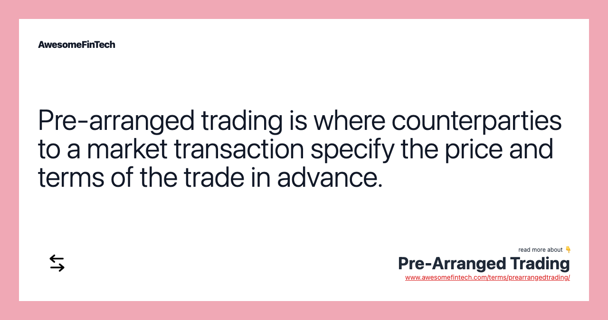

## Table of Contents

## What is pre-arranged trading?

Pre-arranged trading is when two or more people agree to buy and sell something at a set price before they actually do the trade. This is often done in financial markets, where traders might agree on the price of stocks, commodities, or other assets before the official trade happens. The goal can be to make sure the trade happens at a certain price, which can be useful for both the buyer and the seller.

However, pre-arranged trading can be a problem because it might not be fair to other people in the market. If traders are making deals in secret, it can affect the prices that everyone else sees and trades at. Because of this, many places have rules against pre-arranged trading to keep the market fair for everyone.

## How does pre-arranged trading differ from regular trading?

Pre-arranged trading is different from regular trading because in regular trading, people buy and sell things on the open market without making deals beforehand. In regular trading, the price can change all the time based on what everyone is doing. But in pre-arranged trading, people agree on the price before they trade. This means they know exactly what they will pay or get, no matter what happens in the market after they make their deal.

This difference can be important because pre-arranged trading can make the market less fair. When people make secret deals, it can change the prices that everyone else sees. Regular trading is more open and fair because everyone can see what is happening and trade at the current market price. Because of this, many places have rules to stop pre-arranged trading and keep the market fair for everyone.

## What are the basic mechanisms involved in pre-arranged trading?

Pre-arranged trading happens when two or more people talk and agree on a price for something before they actually trade it. They might do this in private, away from the main market where everyone else is trading. For example, they could agree to buy and sell a certain stock at a set price, no matter what the market price is when they finally make the trade. This can be useful for them because they know exactly what they will pay or get, which can help them plan better.

However, pre-arranged trading can cause problems because it's not open and fair to everyone. When people make secret deals, it can change the prices that everyone else sees and trades at. This can make the market less fair because some people might not get the same chances as others. That's why many places have rules against pre-arranged trading, to make sure everyone can trade on a level playing field.

## Who typically engages in pre-arranged trading?

People who usually do pre-arranged trading are often traders or investors who want to make sure they can buy or sell something at a certain price. They might be working for big companies, like banks or investment firms, or they might be trading on their own. These people might want to avoid the ups and downs of the regular market, so they make deals with each other to set the price before they trade.

Sometimes, people who know each other well, like friends or business partners, might also do pre-arranged trading. They trust each other and want to make sure their trades happen at the price they agreed on. But, because pre-arranged trading can be unfair to others in the market, it's often against the rules in many places. So, people who do it need to be careful and make sure they're following the law.

## What are the benefits of pre-arranged trading for participants?

Pre-arranged trading can help people who want to buy or sell something at a certain price. When they make a deal before the trade, they know exactly what they will pay or get. This can be good for them because they don't have to worry about the price changing in the market. It can help them plan better and feel more sure about their trades.

But, pre-arranged trading can also be risky. If people find out about the secret deals, it can make the market unfair. Some people might not get the same chances as others. That's why many places have rules against it, to keep the market fair for everyone. So, people who do pre-arranged trading need to be careful and make sure they're following the law.

## What are the potential risks associated with pre-arranged trading?

Pre-arranged trading can be risky because it can make the market unfair. When people make secret deals, it can change the prices that everyone else sees and trades at. This means some people might not get the same chances as others. If everyone knew about these deals, it could make the market less fair and cause problems for other traders who don't know about them.

Also, pre-arranged trading can be against the rules in many places. If people get caught doing it, they might get in trouble with the law. This could mean fines or other punishments. So, people who do pre-arranged trading need to be very careful and make sure they're following the rules to avoid getting into trouble.

## How is pre-arranged trading regulated?

Pre-arranged trading is often against the rules in many places because it can make the market unfair. People who watch over the markets, like the Securities and Exchange Commission (SEC) in the United States, have rules to stop this kind of trading. They want to make sure everyone has the same chance to trade at the current market price. If someone is caught doing pre-arranged trading, they might get in trouble with the law. This could mean they have to pay a fine or face other punishments.

To keep the market fair, these rules are checked and enforced all the time. People who work in the markets have to follow these rules or they could get caught. The people who watch over the markets use different ways to find out if anyone is doing pre-arranged trading. They might look at trading records or listen to what people are saying about their trades. By doing this, they try to make sure everyone plays by the same rules and the market stays fair for everyone.

## Can you explain the process of setting up a pre-arranged trade?

Setting up a pre-arranged trade starts with two or more people talking to each other. They might be friends, business partners, or traders who know each other well. They agree on what they want to trade, like stocks or commodities, and they decide on a price they both like. They make this deal in private, away from the main market where everyone else is trading. This way, they know exactly what they will pay or get when they finally make the trade, no matter what the market price is at that time.

Once they have agreed on the price and what they will trade, they wait for the right time to make the trade happen. They might set a specific time or wait for certain market conditions. When the time comes, they go ahead and do the trade at the price they agreed on. But they have to be careful because pre-arranged trading can be against the rules in many places. If they get caught, they might have to pay a fine or face other punishments. So, they need to make sure they are following the law and not making the market unfair for others.

## What are some common strategies used in pre-arranged trading?

People who do pre-arranged trading often use a few common strategies. One strategy is to agree on a price that is different from the current market price. They might do this because they think the market price will change soon, and they want to make sure they get a better deal. Another strategy is to set up the trade at a specific time. They might wait for a certain time of day or for certain market conditions to happen before they make the trade. This can help them avoid big changes in the market that could affect their deal.

Another common strategy is to use trusted contacts. People who do pre-arranged trading often work with friends or business partners they know well. They trust each other to keep the deal secret and to follow through on what they agreed. This can make the trade easier and less risky for them. But they have to be careful because pre-arranged trading can be against the rules in many places. If they get caught, they might have to pay a fine or face other punishments.

## How does pre-arranged trading impact market liquidity?

Pre-arranged trading can make the market less liquid. Liquidity means how easy it is to buy or sell something without changing its price too much. When people do pre-arranged trades, they are not trading on the open market where everyone can see. This means there are fewer trades happening in the open market, which can make it harder for other people to buy or sell at the current market price. If lots of people start doing pre-arranged trades, it can make the market less active and less liquid.

But, pre-arranged trading can also have a small positive effect on liquidity in some cases. If the people doing the pre-arranged trade are big traders or companies, their trade might still show up in the market data. This can make it look like there is more trading happening, which might encourage other people to trade too. However, this positive effect is usually small compared to the negative effect of making the market less liquid overall.

## What are the ethical considerations in pre-arranged trading?

Pre-arranged trading raises big ethical questions because it can make the market unfair. When people make secret deals, they might get a better price than others who don't know about the deal. This can hurt other traders who are trying to buy or sell at the current market price. It goes against the idea that everyone should have the same chance to trade fairly. If pre-arranged trading becomes common, it can make people lose trust in the market, which is bad for everyone.

On the other hand, some people might argue that pre-arranged trading can be okay if it's done in a way that doesn't hurt others. For example, if two friends make a deal and it doesn't affect the market prices that everyone else sees, they might think it's not a big problem. But even then, it's hard to know for sure if their deal is really fair to everyone else. That's why many places have strict rules against pre-arranged trading, to make sure the market stays fair and everyone has the same chance to trade.

## How do advanced technologies influence pre-arranged trading practices?

Advanced technologies have made pre-arranged trading easier and more common. With tools like instant messaging and encrypted communication, traders can talk to each other quickly and privately. They can agree on prices and set up trades without anyone else knowing. Also, technology like blockchain and smart contracts can help them make sure their deals happen exactly as they planned. These technologies make it easier for traders to do pre-arranged trading without getting caught.

But, these same technologies also make it harder for people who watch over the markets to stop pre-arranged trading. They have to use new tools and methods to find out if anyone is making secret deals. For example, they might use special software to look at trading patterns and see if anything looks strange. Even though technology can help traders do pre-arranged trading, it also helps the people who are trying to keep the market fair. So, it's a big challenge for everyone involved.

## References & Further Reading

[1]: Bergstra, J., Bardenet, R., Bengio, Y., & Kégl, B. (2011). ["Algorithms for Hyper-Parameter Optimization."](https://proceedings.neurips.cc/paper/2011/file/86e8f7ab32cfd12577bc2619bc635690-Paper.pdf) Advances in Neural Information Processing Systems 24.

[2]: ["Advances in Financial Machine Learning"](https://www.amazon.com/Advances-Financial-Machine-Learning-Marcos/dp/1119482089) by Marcos Lopez de Prado

[3]: ["Evidence-Based Technical Analysis: Applying the Scientific Method and Statistical Inference to Trading Signals"](https://www.amazon.com/Evidence-Based-Technical-Analysis-Scientific-Statistical/dp/0470008741) by David Aronson

[4]: ["Machine Learning for Algorithmic Trading"](https://github.com/stefan-jansen/machine-learning-for-trading) by Stefan Jansen

[5]: ["Quantitative Trading: How to Build Your Own Algorithmic Trading Business"](https://www.amazon.com/Quantitative-Trading-Build-Algorithmic-Business/dp/1119800064) by Ernest P. Chan