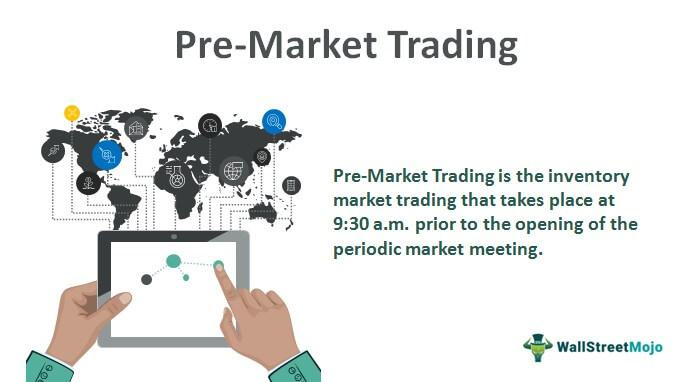

The intricate world of financial markets is constantly evolving, with complex mechanisms dictating how trading occurs. These markets are platforms where financial instruments, including stocks, bonds, commodities, and derivatives, are bought and sold. Financial markets play a crucial role in the allocation of resources, risk management, and the facilitation of trade. As these markets evolve, new trading mechanisms emerge, transforming how market participants engage in trading activities.

Among these mechanisms, pre-arranged trading and algorithmic trading have become prominent. Pre-arranged trading involves agreements between parties to execute trades of specific financial instruments at predetermined prices. Such trades are often employed by entities to efficiently transact large volumes of financial instruments in a manner that mitigates market impact.

On the other hand, algorithmic trading, often referred to as algo trading, utilizes automated systems to execute trades based on pre-defined criteria. This approach enables traders to capitalize on market opportunities with precision and speed, capabilities that exceed human limitations. Through the integration of complex algorithms, data analysis, and automated trading systems, algorithmic trading has significantly altered the landscape of financial markets, introducing new dynamics.

The implications of these mechanisms for market participants are profound. Pre-arranged and algorithmic trading offer numerous advantages, including enhanced liquidity and reduced transaction costs. However, they also pose challenges, particularly concerning legal compliance and ethical considerations. The regulatory frameworks governing these trading activities must be carefully navigated to ensure adherence to laws designed to prevent market manipulation and ensure fair trading practices.

Technological advancements play a pivotal role in facilitating these modern trading mechanisms. High-speed execution platforms, real-time data analytics, and sophisticated algorithms are some of the innovations driving the evolution of trading systems. As technology continues to advance, it is anticipated that the line between pre-arranged and algorithmic trading will become increasingly indistinct, presenting both opportunities and challenges for traders.

Understanding these trading mechanisms is crucial for market participants who wish to leverage opportunities within the financial markets while effectively managing associated risks. By comprehending the intricacies of pre-arranged trading and algorithmic systems, traders can better navigate the complexities of today's fast-paced financial environment and adapt strategies to remain competitive.

In conclusion, this article aims to provide insights into the dynamics of pre-arranged and algorithmic trading, including their functionality and significance in financial markets. As we explore the legal and technological landscapes shaping these mechanisms, market participants can gain a deeper understanding of the forces transforming financial markets today.

## Table of Contents

## What is Pre-Arranged Trading?

Pre-arranged trading refers to the practice where parties reach agreements to trade financial instruments at predetermined prices before their execution in open markets. This method is commonly employed in over-the-counter (OTC) markets, facilitating efficient transactions involving large quantities of financial instruments. The goal is to minimize market impact and ensure anonymity for the involved parties, making it essential for entities dealing with substantial asset volumes.

Pre-arranged trades help manage [liquidity](/wiki/liquidity-risk-premium) needs by securing transaction terms ahead of execution. This provides price certainty and reduces the risk posed by market [volatility](/wiki/volatility-trading-strategies). However, this trading form is governed by stringent legal regulations to deter market manipulation and ensure fair market practices. For instance, regulations enforced by bodies like the U.S. Securities and Exchange Commission (SEC) and the Commodity Futures Trading Commission (CFTC) set clear boundaries for permissible trading practices to maintain market integrity.

Legal frameworks mandate that pre-arranged transactions should not result in artificial price movements or create misleading impressions of market activity. Violations can attract severe penalties, including fines and legal sanctions against the entities involved. Hence, understanding these regulatory requirements is paramount for market participants to align their strategies with legal stipulations.

Case studies illustrate how businesses utilize pre-arranged trading strategically. For instance, companies aiming to optimize market entry or [exit](/wiki/exit-strategy) strategies often resort to pre-arranged trades. By doing so, they manage to lock in favorable terms without disclosing their immediate market intentions, ensuring compliance and operational effectiveness. This strategic use allows entities to navigate the complexities of large-[volume](/wiki/volume-trading-strategy) trades while adhering to regulatory frameworks.

## Algorithmic Trading: Revolutionizing Markets

Algorithmic trading, often referred to as algo trading, employs advanced technology to automate the execution of trades in financial markets based on pre-defined criteria. This modern approach allows for high-speed execution of trades at a volume that surpasses human capability, fundamentally transforming trading dynamics.

The core process of [algorithmic trading](/wiki/algorithmic-trading) integrates three primary components: data input, algorithmic analysis, and trade execution. Initially, data from various market sources is gathered and fed into the system. The algorithm then analyzes this data based on established rules and criteria. This analysis dictates the execution of trades, ensuring optimal decisions are made without human intervention. Such automation is crucial for high-frequency trading ([HFT](/wiki/high-frequency-trading-strategies)) scenarios, where even microsecond delays can impact profitability.

Several algorithmic trading strategies are prevalent among market participants. These include:

1. **Trend-Following**: This strategy involves algorithms that identify and capitalize on market trends. By analyzing historical price data, algorithms predict the continuation of existing trends, allowing traders to buy or sell accordingly.

2. **Mean Reversion**: Here, algorithms assume that asset prices will revert to their mean over time. This strategy involves identifying overbought or oversold conditions and executing trades that profit from prices moving back towards their historical average.

3. **Statistical Arbitrage**: This sophisticated strategy employs statistical models to identify price inefficiencies between related financial instruments. Algorithms make simultaneous trades in under- and overpriced securities to lock in profits as these price discrepancies resolve.

The benefits of algorithmic trading extend beyond the mere execution of trades:

- **Speed**: Algorithms process vast amounts of data at lightning speed, executing trades in fractions of a second, far swifter than human traders.

- **Precision**: With pre-defined criteria, algo trading minimizes human errors in trade execution, ensuring precise adherence to trading strategies.

- **Emotion-Free Decision-Making**: By eliminating human emotion from trading decisions, algorithms enable consistent application of strategies based purely on data-driven analysis.

Furthermore, algorithmic trading enhances market liquidity by increasing trade volumes and reducing bid-ask spreads. This intensification of activity can lead to lower trading costs for all market participants, creating a more efficient trading environment.

In summary, algorithmic trading plays a pivotal role in modern markets, offering key advantages that enhance the speed and efficiency of trade executions. As technology evolves, the capacity for more sophisticated algorithmic strategies continues to grow, offering traders numerous pathways to optimize their market strategies.

## The Intersection of Pre-Arranged and Algo Trading

While distinct in their operations, pre-arranged and algorithmic trading share the primary objective of seeking advantages through predetermined conditions. Their intersection is most evident in scenarios like block trades. Block trades involve large volumes of securities and often require precise execution to minimize market impact and achieve favorable pricing. Here, algorithmic trading systems are employed to rapidly execute the trades, adhering to pre-arranged conditions set forth by the involved parties. These automated systems leverage sophisticated algorithms to parse vast datasets, strategizing optimal execution paths that comply with the terms agreed upon beforehand.

**Examples of Intersection**

In practice, this intersection manifests through mechanisms where large transactions are subject to pre-arranged agreements, then executed via high-frequency trading algorithms. For instance, a mutual fund might engage in a pre-arranged agreement to purchase a significant quantity of stocks at a designated price from an investment bank. The investment bank, utilizing its algorithmic trading framework, will execute the trade quickly and efficiently—often within microseconds—to reduce market disruption and slippage, thereby adhering to the pre-determined conditions.

**Legal and Ethical Considerations**

The convergence of pre-arranged and algo trading poses unique legal and ethical challenges. Regulatory frameworks necessitate strict adherence to fair trading practices to dodge accusations of market manipulation. It's pivotal for entities engaging in such trading activities to ensure compliance with laws such as the Commodity Exchange Act and regulations set by the Securities and Exchange Commission (SEC). Failure to navigate these complexities can result in severe penalties and damage to reputation. Ethical considerations also emerge when traders are required to ensure these automated systems do not inadvertently manipulate the market in ways that could be deemed unfair or deceptive.

**Technological Advancements**

Recent advancements in high-speed execution engines and data processing technologies further cement the integration of pre-arranged and algorithmic trading. Sophisticated trading platforms now offer real-time data streams and customizable algorithmic strategies tailored for various market conditions. Machine learning and [artificial intelligence](/wiki/ai-artificial-intelligence) advancements are continually refining these algorithms, enhancing their ability to predict and react to market movements with greater accuracy, thereby optimizing trade execution.

These technological innovations indicate a future landscape where the boundaries between pre-arranged trading and algorithmic execution continue to blur, offering new opportunities and challenges for traders. As these methods become more sophisticated, the ability to harness their full potential while ensuring regulatory compliance will be crucial for market participants.

## Legal and Regulatory Considerations

The legal and regulatory landscape governing pre-arranged and algorithmic trading activities is intricate and vital for ensuring compliant executions within financial markets. A significant framework governing these activities is the Commodity Exchange Act (CEA), which seeks to prohibit any manipulative or deceptive trading practices, including pre-arranged trades that might disrupt market integrity. The Act mandates that trading activities must occur openly and competitively to prevent any undue influence on market prices.

The Securities and Exchange Commission (SEC) also enforces rules impacting pre-arranged trade legality, including Regulation NMS, which aims to improve the fairness and orderliness of securities trading. Another critical regulation is the SEC's Rule 10b-5, which targets fraud and manipulation in the trading of securities. It establishes that parties involved in pre-arranged trading must ensure their transactions are transparent and do not mislead other market participants.

Violations of these regulations can lead to severe consequences, including charges of market manipulation. Entities found guilty of engaging in illegal trading practices may face substantial penalties, such as fines, sanctions, or even suspension of trading activities. These penalties serve to protect market participants and maintain trust in the financial market system.

Algorithmic trading, meanwhile, falls under scrutiny for its potential to exacerbate market volatility and facilitate manipulative strategies. Regulatory bodies emphasize the importance of having robust risk management systems to mitigate the risks posed by high-frequency trading (HFT) algorithms. For instance, the Markets in Financial Instruments Directive II (MiFID II) in the European Union imposes strict requirements for algorithmic trading, necessitating proper oversight mechanisms and circuit breakers to avoid market disruption.

Both pre-arranged and algorithmic trading require adherence to these sophisticated regulatory frameworks to foster an environment of trust and efficiency. Market participants must remain vigilant, ensuring that their practices align with legal standards to mitigate any risks of regulatory breaches.

## Technological Advancements in Trading Mechanisms

The evolution of technology has significantly transformed trading mechanisms, with advanced tools and systems revolutionizing both pre-arranged and algorithmic trading strategies. A key component of this transformation is the development of high-speed execution engines, which enable traders to execute orders in microseconds. This speed is essential in a competitive market where latency can be the difference between profit and loss. High-speed engines utilize cutting-edge hardware and specialized software to reduce delays in processing trades, ensuring rapid execution.

Real-time data streams have become indispensable, providing traders with the most current market information to make informed decisions. These data streams, often derived from multiple sources, include stock quotes, trade volumes, and economic indicators. The integration of such data into trading algorithms allows for dynamic adjustment of trading strategies based on live market conditions, thus enhancing the accuracy and effectiveness of trades.

Sophisticated algorithms, the backbone of algorithmic trading, are designed to interpret complex datasets and execute trades based on predefined criteria. These algorithms deploy various strategies, such as trend-following and statistical [arbitrage](/wiki/arbitrage), and are vital in managing high-frequency trading environments where human decision-making is impractical. The implementation of [machine learning](/wiki/machine-learning) and artificial intelligence in these algorithms is further advancing their capability to adapt to market changes autonomously.

Prominent trading platforms have embraced these technological advancements, offering features that cater to diverse market conditions and the specific needs of traders. These platforms provide customizable algorithmic strategies, enabling traders to tailor their approaches while incorporating advanced analytics and risk management tools. Examples of such platforms include MetaTrader, which supports various trading features and allows algorithmic trading through Expert Advisors (EAs), and NinjaTrader, known for its comprehensive charting and [backtesting](/wiki/backtesting) capabilities.

In conclusion, the technological advancements in trading mechanisms play a crucial role in optimizing both pre-arranged and algorithmic trading. High-speed execution, real-time data integration, and sophisticated algorithms work in concert to enhance trading efficiency and accuracy, paving the way for innovations that continue to reshape financial markets.

## Conclusion

Financial markets are in a state of continual change, shaped by the interplay between traditional trading practices and cutting-edge technological innovations. Grasping the complex nature of pre-arranged trading and algorithmic systems is essential for those involved in these markets. Pre-arranged trading offers the potential for strategic market entry and exit, especially useful for managing sizable transactions efficiently. However, navigating these trades demands a thorough understanding of their legal frameworks to prevent regulatory pitfalls such as market manipulation.

Algorithmic trading has revolutionized market operations, providing rapid execution and precision while eliminating emotional decision-making from trading processes. Despite their benefits, both these trading mechanisms present risks that require astute management of execution strategies and compliance with legal standards. As technology continues to advance, the distinctions between pre-arranged and algorithmic trading are increasingly becoming intertwined, fueled by high-speed execution engines, real-time data, and sophisticated algorithms.

The fast-paced nature of these developments creates both opportunities and challenges for traders worldwide. To maintain a competitive edge, staying informed about regulatory changes, technological advancements, and innovative trading strategies is crucial. By leveraging the capabilities of both pre-arranged and algorithmic trading, market participants can enhance their trading performance and adapt to the dynamic landscape of global financial markets.

## References & Further Reading

[1]: Bergstra, J., Bardenet, R., Bengio, Y., & Kégl, B. (2011). ["Algorithms for Hyper-Parameter Optimization."](https://proceedings.neurips.cc/paper/2011/file/86e8f7ab32cfd12577bc2619bc635690-Paper.pdf) Advances in Neural Information Processing Systems 24.

[2]: ["Advances in Financial Machine Learning"](https://www.amazon.com/Advances-Financial-Machine-Learning-Marcos/dp/1119482089) by Marcos Lopez de Prado

[3]: ["Evidence-Based Technical Analysis: Applying the Scientific Method and Statistical Inference to Trading Signals"](https://www.amazon.com/Evidence-Based-Technical-Analysis-Scientific-Statistical/dp/0470008741) by David Aronson

[4]: ["Machine Learning for Algorithmic Trading"](https://github.com/stefan-jansen/machine-learning-for-trading) by Stefan Jansen

[5]: ["Quantitative Trading: How to Build Your Own Algorithmic Trading Business"](https://www.amazon.com/Quantitative-Trading-Build-Algorithmic-Business/dp/1119800064) by Ernest P. Chan