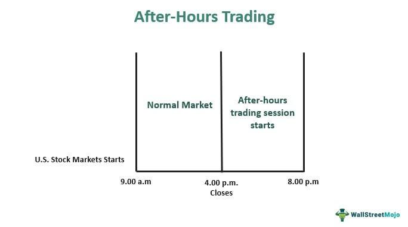

The stock market traditionally operates within specific hours, standardized as the regular trading session from 9:30 AM to 4:00 PM Eastern Time for major exchanges like the New York Stock Exchange (NYSE) and NASDAQ. However, trading activity is not confined to these hours alone. After-hours and pre-market trading sessions extend the possibilities for market participation beyond conventional timings. These extended hours allow for additional trading opportunities that can influence stock prices and investor decisions.

After-hours trading occurs post the regular market closure and is significant for several reasons. It offers traders and investors the ability to react to news releases, earnings reports, and other unforeseen events affecting the financial markets. Similarly, pre-market trading occurs before the regular market opens and is pivotal in setting the market tone for the day. Early morning news releases or events unfolding overnight can create significant movements in stock prices before the opening bell, providing a preview of potential market trends.

Algorithmic trading, which employs mathematical models and complex algorithms to execute trades with speed and precision, has gained traction in extended trading hours. This is due to its ability to efficiently navigate the low liquidity and volatility often encountered during these periods. Comprehending the dynamics of algorithmic trading in after-hours and pre-market sessions is crucial for investors who seek to leverage these timeframes effectively. As algorithmic trading becomes more advanced and widespread, understanding its impact becomes increasingly important.

This article aims to provide comprehensive insights into the various aspects of after-hours and pre-market trading combined with the influence of algorithmic trading. It explores the benefits and inherent risks associated with trading outside regular hours, with special attention to algorithmic strategies that are proving to be instrumental in these extended trading periods. By understanding these elements, investors can better assess the potential advantages and challenges, potentially gaining a competitive edge in the fast-evolving landscape of stock trading.

## Table of Contents

## What is After-Hours Trading?

After-hours trading refers to the buying and selling of securities outside the standard trading hours of major stock exchanges, such as the New York Stock Exchange (NYSE) and the NASDAQ. Standard trading hours typically run from 9:30 AM to 4:00 PM Eastern Time on regular weekdays. After-hours trading, however, commences after the markets close, generally from 4:00 PM to 8:00 PM Eastern Time. This extended period allows investors to react to news events and financial reports released after the traditional market close, offering a strategic avenue for market participants to adjust their portfolios.

Various electronic communication networks (ECNs) facilitate after-hours trading, providing platforms where buyers and sellers can match their orders in real-time. Prominent brokers like Charles Schwab, TD Ameritrade, and Fidelity offer services to access these ECNs, providing individual and institutional investors the ability to trade during these times. The participation in after-hours trading is typically diverse, including individual investors looking to capitalize on news, institutional investors aiming to manage large orders without significantly impacting prices, and professional traders seeking to exploit price movements during lower liquidity periods.

Participants in after-hours trading are often motivated by the opportunity to respond to corporate announcements, such as earnings reports, mergers, or other significant news that could cause substantial price movements. While this can provide a strategic advantage, traders must also navigate the unique risks presented by after-hours trading. Foremost among these risks is reduced [liquidity](/wiki/liquidity-risk-premium), as fewer buyers and sellers lead to wider bid-ask spreads and more pronounced price swings. This reduced liquidity can also result in increased [volatility](/wiki/volatility-trading-strategies), making it possible for prices to experience larger fluctuations compared to regular trading hours. 

Another critical consideration is the potential for pricing discrepancies between after-hours and regular trading sessions. Prices determined in after-hours trading may not necessarily reflect the opening prices of the next regular session, leading to potential misalignment with broader market trends. Investment decisions based on after-hours price movements should be made with caution and informed by an understanding of these risks.

In summary, after-hours trading offers both opportunities and challenges. While it can provide a strategic advantage through timely responses to news and economic events, it also requires careful consideration of associated risks, such as decreased liquidity and higher volatility. Investors engaging in after-hours trading must weigh these factors when developing their trading strategies.

## Understanding Pre-Market Trading

Pre-market trading refers to the buying and selling of securities before the standard market session opens, generally between 4:00 a.m. and 9:30 a.m. Eastern Time (ET) in the United States. This period allows traders to act on new information, such as overnight news and global economic events, that might affect stock prices. By reacting to such developments, pre-market trading can set the tone for the day’s market activities, indicating potential trends and investor sentiment as the regular trading session begins.

**Role in Reacting to Overnight News and Events**

Pre-market trading provides an opportunity for investors to respond to information released outside regular market hours. Events such as earnings reports, geopolitical developments, and macroeconomic announcements can influence investor perspectives, prompting pre-market trades to capitalize on expected shifts in market conditions. As a result, this trading period often experiences heightened activity following significant news, as traders seek early market positions or adjust their portfolios accordingly.

**Impact on Stock Prices When Regular Market Opens**

The activities during pre-market trading can significantly affect stock prices once the regular market opens at 9:30 a.m. ET. Price movements in this period serve as preliminary indicators of how securities might perform, reflecting the collective response to overnight developments. When the regular session begins, stocks can either continue in the direction established during pre-market hours or exhibit volatility as broader market participation occurs, reconciling the pre-market trades with the larger [volume](/wiki/volume-trading-strategy) and liquidity of the regular session.

**Typical Participants and Timing**

Pre-market trading typically involves institutional investors, such as hedge funds, mutual funds, and investment banks, who have the resources and information to analyze and react swiftly to overnight news. Additionally, sophisticated retail investors, equipped with the necessary trading platforms, also participate. Trading usually commences as early as 4:00 a.m. ET, with activity intensifying as the official opening time approaches and more participants engage.

**Advantages and Challenges**

Engaging in pre-market trading offers distinct advantages, including the potential to capitalize on information before the broader market response, providing speculative opportunities or hedging existing positions. This early trading capability can enhance portfolio management by allowing timely adjustments based on new developments.

However, pre-market trading also presents challenges. The reduced liquidity compared to regular trading hours can lead to wider bid-ask spreads, making it more difficult to execute trades at desired prices. Furthermore, the limited participation and heightened volatility during this time can result in price discrepancies and rapid fluctuations, increasing the potential for losses. Hence, participants must carefully weigh these factors when deciding to engage in pre-market trading, ensuring they have the knowledge and tools to navigate this unique trading environment effectively.

## The Role of Algorithmic Trading in Extended Hours

Algorithmic trading has revolutionized the stock market by utilizing computer algorithms to execute trades based on predefined criteria. This approach leverages mathematical models and statistical analysis to make decisions more effectively and at speeds impossible for human traders. Algorithms can assess such factors as timing, price, and quantity, and they often exploit computational power to maximize trade profitability or mitigate risks.

During after-hours and pre-market sessions, the utilization of [algorithmic trading](/wiki/algorithmic-trading) dramatically shifts due to distinct market conditions. These periods often present lower liquidity compared to standard trading hours. Liquidity, defined as the availability of buyers and sellers in the market, affects the ease with which trades can be executed without impacting the asset's price. Algorithms are crucial in such environments as they can execute trades rapidly, taking advantage of fleeting opportunities or avoiding adverse price movements.

The primary advantage of algorithmic trading in these extended sessions is its ability to handle increased volatility. Volatility, a measure of price movement, tends to be higher during these times. Algorithms are particularly adept at capitalizing on short-term price movements, allowing traders to potentially secure more favorable prices.

Popular strategies in algorithmic trading during extended hours include market-making, statistical [arbitrage](/wiki/arbitrage), and trend-following. Market-making involves simultaneously buying and selling to profit from the bid-ask spread, a strategy that thrives on volatility. Statistical arbitrage exploits price discrepancies across correlated assets, while trend-following algorithms benefit from sustained price movements. These strategies are particularly effective as they can operate continuously, reacting instantaneously to market changes.

However, algorithmic trading during after-hours and pre-market sessions is not without challenges. One significant issue is the potential for increased "slippage," where the executed trade price deviates from its intended price due to reduced liquidity. Additionally, algorithmic systems must be robust to handle technical failures or unexpected market developments, which can be exacerbated during thin trading hours when price gaps may be more pronounced.

A critical concern is the dependency on accurate data; algorithms require real-time and historical data processed with precision. Any inaccuracy in data can lead to erroneous trading decisions. Furthermore, regulatory guidelines must be adhered to, especially since algorithmic trading can affect market stability. Ensuring compliance and understanding evolving market regulations is vital for traders employing these strategies outside regular hours.

In summary, algorithmic trading provides significant benefits for navigating the complexities of after-hours and pre-market trading, offering potential profitability through increased efficiency and adaptability to volatile and low-liquidity environments. However, traders must be acutely aware of the potential pitfalls and maintain a vigilant approach to data accuracy, system robustness, and regulatory compliance to optimize their strategies effectively.

## Benefits of After-Hours and Pre-Market Trading

Trading beyond conventional market hours—during after-hours and pre-market sessions—offers strategic advantages for investors seeking to optimize their market activities. These extended hours provide the flexibility to respond promptly to breaking news and economic updates, which can influence market behaviour significantly. When significant geopolitical events or financial reports are released outside standard trading times, investors who participate in after-hours or pre-market trading can act on this information before the regular trading session day begins, potentially capitalizing on anticipated market movements.

Extended trading hours also enhance portfolio diversification opportunities. Investors are not limited to reacting within a narrow window of time, which can sometimes force hasty decisions. Instead, they have additional time to analyze news events, examine macroeconomic reports, and adjust their portfolios strategically, potentially balancing risk across different asset classes or geographies.

Institutional and retail investors approach these sessions differently. Institutions often have more sophisticated trading tools and resources to operate efficiently during these hours, leveraging large orders that reflect adjusted market strategies. Retail investors, although more constrained, can still benefit from the potential price discrepancies and volatility, offering them unique entry points that might not occur during regular hours.

There is also the prospect of gaining an edge through participation in these non-traditional trading times. For example, a sharp investor might identify a gap between the closing price and anticipated opening value due to overnight developments, thus executing trades that exploit these discrepancies for potential gains. After-hours and pre-market trading can thus serve as a strategic mechanism, offering the attentive investor the ability to react nimbly to new information and adapt to shifting market conditions in ways that are not as easily feasible within the confines of regular trading hours.

## Risks and Challenges

Trading during after-hours and pre-market sessions presents various risks and challenges that can significantly impact investors' decisions and outcomes. One of the most prominent risks is decreased liquidity. Liquidity refers to the ease with which an asset can be bought or sold in the market without affecting its price. During extended trading hours, the number of market participants is lower than during regular trading sessions, resulting in reduced liquidity. This can lead to wider bid-ask spreads, making it more costly for traders to execute transactions efficiently.

Increased volatility and pricing discrepancies are also commonplace during after-hours and pre-market trading sessions. These periods often react to news events and economic reports released outside of standard market hours. The limited number of participants and orders can lead to significant price swings and less price stability. Consequently, traders may encounter situations where the price at which they intended to buy or sell varies substantially from the expected price, known as slippage.

Regulatory issues are another concern for extended hours trading. Different regulatory bodies may impose varying rules and requirements on after-hours and pre-market trading activities. These can include restrictions on certain types of orders or limitations on the amount of leverage permitted. Furthermore, there might be discrepancies in the information available to different participants, potentially leading to informed trading and market manipulation.

Technical challenges also pose significant risks during extended trading sessions. Robust trading platforms are essential to navigate the complexities of after-hours and pre-market trading. The volatility and rapid price movements require systems that can manage large volumes of data and execute orders promptly. Any failure in the trading platform or network infrastructure could lead to missed trading opportunities or unintended trades.

To mitigate these risks, investors should employ strategies that prioritize capital preservation and risk management. Utilizing limit orders instead of market orders can help manage price risks by ensuring transactions are executed only at desired price levels. Diversification across different asset classes can also reduce the impact of volatility and liquidity challenges. Additionally, staying informed about regulatory developments and choosing reliable trading platforms with strong technical support can assist in mitigating potential technical and regulatory challenges.

Overall, while after-hours and pre-market trading offer opportunities, they require careful consideration of the associated risks and challenges. By employing strategic measures and leveraging robust trading infrastructure, investors can better navigate these non-traditional trading times.

## Conclusion

After-hours and pre-market trading are critical components of the contemporary stock market landscape. These extended trading sessions provide investors with the opportunity to respond to market developments beyond regular hours, reflecting a dynamic nature that mirrors the increasingly interconnected world economy. Understanding these trading periods is strategically beneficial for both new and seasoned investors, as they can offer unique opportunities for capitalizing on news and events that occur outside standard trading hours.

Investors must carefully assess the potential rewards and risks associated with after-hours and pre-market trading. While these sessions might offer strategic advantages such as responding promptly to breaking news or earnings reports, they also come with challenges such as reduced liquidity and increased volatility. The absence of high trading volumes can lead to significant price fluctuations, making it imperative for investors to approach these trades with a considered strategy.

Algorithmic trading has transformed the landscape of after-hours and pre-market sessions, offering sophisticated tools to navigate these volatile periods. With the integration of advanced algorithms, traders can execute complex strategies with precision and speed. These algorithms can efficiently process large volumes of data, enabling traders to make informed decisions quickly, which is crucial during these time-sensitive trading periods. The ongoing development of algorithmic trading strategies continues to enhance their effectiveness, allowing traders to adapt to market changes efficiently.

In conclusion, after-hours and pre-market trading sessions, coupled with the integration of algorithmic strategies, present investors with distinctive opportunities and challenges. Grasping the intricacies of these extended hours empowers investors to potentially gain a competitive edge. However, it remains essential for traders to weigh the benefits against inherent risks and tailor their strategies accordingly. As algorithmic trading evolves, it will likely continue to play a pivotal role in shaping the future dynamics of stock trading, providing tactical advantages in the fast-paced financial markets.

## References & Further Reading

[1]: Conrad, J., Wahal, S., & Xiang, J. (2015). ["High-Frequency Trading and Price Discovery."](https://www.sciencedirect.com/science/article/pii/S0304405X15000240) Journal of Financial Economics, 116(2), 271-292.

[2]: Lou, D., Polk, C., & Skouras, S. (2018). ["A Tug of War: Overnight Versus Intraday Expected Returns."](https://www.sciencedirect.com/science/article/pii/S0304405X19300650) The Review of Financial Studies, 31(12), 4818–4853.

[3]: Hendershott, T., & Riordan, R. (2013). ["Algorithmic Trading and the Market for Liquidity."](https://www.cambridge.org/core/journals/journal-of-financial-and-quantitative-analysis/article/abs/algorithmic-trading-and-the-market-for-liquidity/C1A34D3767436529EA4F23DB1780273C) The Review of Financial Studies, 26(3), 547-587.

[4]: Brooks, C., & Kim, D. (2020). ["The Informational Role of Algorithmic Trading in Fragmented Markets."](https://www.sec.gov/files/Algo_Trading_Report_2020.pdf) Quantitative Finance, 20(3), 451-470.

[5]: Frazzini, A., Israel, R., & Moskowitz, T. J. (2012). ["Trading Costs of Asset Pricing Anomalies."](https://papers.ssrn.com/sol3/papers.cfm?abstract_id=2294498) The Review of Financial Studies, 25(3), 103-147.