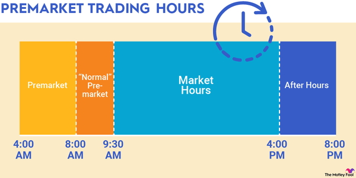

## Table of Contents

## What is pre-market trading?

Pre-market trading is when people buy and sell stocks before the regular market opens. The regular market usually opens at 9:30 AM Eastern Time, but pre-market trading can start as early as 4:00 AM. This early trading lets investors react to news or events that happen overnight or before the market opens. It's a way for them to get a head start on their trading day.

Not everyone can do pre-market trading. You need to have a special type of account, usually called a margin account, and your broker has to allow it. Also, pre-market trading can be riskier because there are fewer people trading, so prices can move a lot more than during regular hours. But for some investors, the chance to act on new information quickly is worth the risk.

## What is after-hours trading?

After-hours trading is when people buy and sell stocks after the regular market closes. The regular market usually closes at 4:00 PM Eastern Time, but after-hours trading can go until 8:00 PM. This lets investors keep trading even after the main market hours are over. They can react to news or events that happen after the market closes, like company earnings reports or big announcements.

Not all investors can do after-hours trading. You need a special type of account, often called a margin account, and your broker has to allow it. After-hours trading can be riskier because there are fewer people trading, so the prices can change a lot more than during regular hours. But for some investors, being able to act on new information right away is worth the risk.

## Why do investors participate in pre-market and after-hours trading?

Investors participate in pre-market and after-hours trading because they want to act on new information as soon as it comes out. Sometimes, important news or events happen before the market opens or after it closes. By trading during these times, investors can buy or sell stocks right away, instead of waiting for the regular market to open. This can be a big advantage if they think the news will affect the stock price a lot.

Another reason is that pre-market and after-hours trading can help investors get a better price for their stocks. If they think a stock's price will go up or down a lot when the market opens, they might want to trade before everyone else does. This way, they can buy the stock at a lower price or sell it at a higher price than they would during regular hours. But, it's important to remember that trading outside regular hours can be riskier because fewer people are trading, so prices can change a lot more.

## What are the typical hours for pre-market and after-hours trading?

Pre-market trading usually starts at 4:00 AM Eastern Time and goes until the regular market opens at 9:30 AM. This early trading lets people buy and sell stocks before the main market opens. It's a way for investors to react to news or events that happen overnight or early in the morning.

After-hours trading starts right after the regular market closes at 4:00 PM Eastern Time and can go until 8:00 PM. This lets people keep trading even after the main market hours are over. They can respond to news or events that happen after the market closes, like company earnings reports or big announcements.

## How can one access pre-market and after-hours trading?

To access pre-market and after-hours trading, you need to have a special type of account called a margin account. Not all brokers allow this kind of trading, so you need to check with your broker to see if they offer it. If they do, you can usually turn on pre-market and after-hours trading through your account settings or by calling your broker.

Once you have the right account and your broker allows it, you can start trading outside regular hours. You'll use the same trading platform you use during the day, but you'll see that it's open earlier in the morning and later in the evening. Remember, trading during these times can be riskier because there are fewer people trading, so the prices can change a lot more than during regular hours.

## What are the risks associated with trading outside regular market hours?

Trading outside regular market hours can be riskier because fewer people are trading. When fewer people are buying and selling, the prices can move a lot more than they do during the day. This means if you want to buy a stock, you might end up paying more than you expected. And if you want to sell, you might get less money than you hoped for. It's like trying to buy or sell something at a store when it's almost closing time – there are fewer people around, so the prices can change a lot.

Another risk is that there might be less information available during these times. During the regular market hours, there are lots of news and updates that help you make good choices. But before the market opens or after it closes, you might not have all the information you need. This can make it harder to decide if you should buy or sell a stock. So, while trading outside regular hours can give you a head start on new news, it also means you have to be careful and ready for bigger price changes and less information.

## How does liquidity affect pre-market and after-hours trading?

Liquidity is about how easy it is to buy or sell something without changing its price too much. During pre-market and after-hours trading, there are fewer people trading, so there's less [liquidity](/wiki/liquidity-risk-premium). This means if you want to buy or sell a stock, it might be harder to find someone to trade with. Because of this, the price of the stock can change a lot more than it would during the regular market hours when more people are trading.

When there's less liquidity, it can be riskier to trade. If you want to buy a stock, you might have to pay more than you expected because there aren't many sellers. And if you want to sell, you might get less money than you hoped for because there aren't many buyers. So, while trading outside regular hours can let you act on new news quickly, you have to be ready for bigger price swings and the chance that it might be harder to make the trade you want.

## What types of orders can be used during pre-market and after-hours sessions?

During pre-market and after-hours trading, you can use different types of orders to buy or sell stocks. The most common type is a market order, which means you want to buy or sell the stock right away at the best price available. But because there are fewer people trading during these times, the price can change a lot more than during the day. So, if you use a market order, you might end up paying more or getting less money than you expected.

Another type of order you can use is a limit order. With a limit order, you set a specific price at which you want to buy or sell the stock. This can help you control the price you pay or get, but there's a catch. If the stock price doesn't reach your limit during the pre-market or after-hours session, your order won't go through. So, you might miss out on trading if the price doesn't hit your limit. Using limit orders can be a good way to manage risk during these times, but you have to be okay with the chance that your order might not be filled.

## How do news and events impact pre-market and after-hours trading?

News and events can have a big impact on pre-market and after-hours trading. When important news comes out before the market opens or after it closes, like a company's earnings report or a big announcement, investors want to act on it right away. They might think the news will make the stock's price go up or down a lot, so they trade during these times to get a head start. For example, if a company reports better earnings than expected after the market closes, investors might start buying the stock in after-hours trading, hoping to buy it at a lower price before everyone else does during the regular market hours.

Because fewer people are trading during pre-market and after-hours sessions, the news can cause the stock's price to move even more than it would during the day. If a lot of people want to buy or sell the stock because of the news, and there aren't many people on the other side of the trade, the price can change a lot. This can be good for investors who guess right about how the news will affect the stock, but it can also be risky. If the price moves a lot and they can't find someone to trade with at the price they want, they might end up paying more or getting less money than they expected.

## What are the differences in volatility between regular trading hours and extended hours?

During regular trading hours, the stock market is usually more stable because a lot of people are buying and selling. This means there are more people to trade with, so the prices don't change as much. It's like being at a busy store where lots of people are shopping, so the prices stay pretty steady. If you want to buy or sell a stock, you can usually do it at a price that's close to what you expect.

In extended hours, like pre-market and after-hours trading, there are fewer people trading. This can make the stock prices move a lot more because there aren't as many buyers and sellers. It's like trying to shop at a store when it's almost closing time – there are fewer people around, so the prices can change a lot. If you want to buy or sell a stock during these times, you might end up paying more or getting less money than you planned because the prices can be more unpredictable.

## How do regulations affect pre-market and after-hours trading?

Regulations play a big role in pre-market and after-hours trading. Not everyone can trade during these times. You need a special type of account, usually called a margin account, and your broker has to allow it. This means that only certain investors can take part in trading outside regular hours. Also, the rules about what types of orders you can use might be different. For example, some brokers might not let you use stop orders during extended hours because the prices can change a lot more.

These rules are in place to protect investors. Because there are fewer people trading during pre-market and after-hours sessions, the prices can be more unpredictable. This can make it riskier to trade. The regulations help make sure that people know what they're getting into and that they have the right tools and information to make smart choices. By setting these rules, regulators try to keep the market fair and safe for everyone, even when trading happens outside the regular hours.

## What advanced strategies can traders use during pre-market and after-hours sessions?

Traders can use a strategy called "gap trading" during pre-market and after-hours sessions. This means they look for stocks that have a big difference between their closing price and their opening price the next day. If a company announces good news after the market closes, the stock price might go up a lot in after-hours trading. Traders can buy the stock during these times, hoping to sell it for a profit when the regular market opens. But it's risky because the price can change a lot, and they might lose money if the price goes down instead.

Another strategy is to use limit orders to control the price they pay or get for a stock. During extended hours, the prices can move a lot, so traders set a specific price they're willing to buy or sell at. This can help them avoid paying too much or selling for too little. But they have to be okay with the chance that their order might not go through if the stock price doesn't reach their limit. Using these strategies can help traders take advantage of the opportunities in pre-market and after-hours trading, but they need to be careful because it can be riskier than trading during regular hours.

## References & Further Reading

[1]: Conrad, J., Wahal, S., & Xiang, J. (2015). ["High-Frequency Trading and Price Discovery."](https://www.sciencedirect.com/science/article/pii/S0304405X15000240) Journal of Financial Economics, 116(2), 271-292.

[2]: Lou, D., Polk, C., & Skouras, S. (2018). ["A Tug of War: Overnight Versus Intraday Expected Returns."](https://www.sciencedirect.com/science/article/pii/S0304405X19300650) The Review of Financial Studies, 31(12), 4818–4853.

[3]: Hendershott, T., & Riordan, R. (2013). ["Algorithmic Trading and the Market for Liquidity."](https://www.cambridge.org/core/journals/journal-of-financial-and-quantitative-analysis/article/abs/algorithmic-trading-and-the-market-for-liquidity/C1A34D3767436529EA4F23DB1780273C) The Review of Financial Studies, 26(3), 547-587.

[4]: Brooks, C., & Kim, D. (2020). ["The Informational Role of Algorithmic Trading in Fragmented Markets."](https://www.sec.gov/files/Algo_Trading_Report_2020.pdf) Quantitative Finance, 20(3), 451-470.

[5]: Frazzini, A., Israel, R., & Moskowitz, T. J. (2012). ["Trading Costs of Asset Pricing Anomalies."](https://papers.ssrn.com/sol3/papers.cfm?abstract_id=2294498) The Review of Financial Studies, 25(3), 103-147.