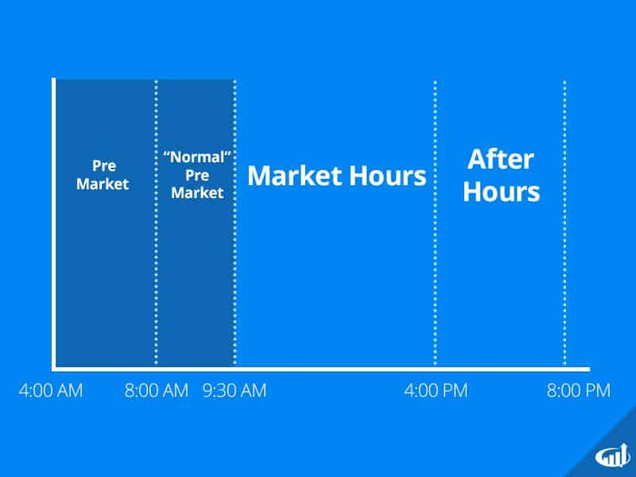

## Table of Contents

## What is pre-market trading?

Pre-market trading is when people buy and sell stocks before the regular market opens. The regular market usually opens at 9:30 AM Eastern Time, but pre-market trading can start as early as 4:00 AM. This early trading lets investors react to news or events that happen overnight or before the market opens. It's a way for them to get a head start on the day's trading.

Not everyone can do pre-market trading. You need to have a special type of account, like a margin account, and your broker has to allow it. Also, pre-market trading can be riskier because there are fewer people trading, so prices can change a lot more than during regular hours. But for some investors, the chance to act on new information quickly makes it worth the risk.

## What is post-market trading?

Post-market trading is when people buy and sell stocks after the regular market closes. The regular market usually closes at 4:00 PM Eastern Time, but post-market trading can go on until 8:00 PM. This lets investors keep trading even after the main market is done for the day. It's useful if something important happens late in the day and you want to act on it right away.

Like pre-market trading, not everyone can do post-market trading. You need a special account, like a margin account, and your broker has to allow it. Post-market trading can be riskier because fewer people are trading, so prices can move a lot more than during regular hours. But for some investors, the chance to react quickly to new information makes it worth the risk.

## How do pre-market and post-market trading differ from regular trading hours?

Pre-market and post-market trading happen before and after the regular trading hours. Regular trading hours are from 9:30 AM to 4:00 PM Eastern Time. Pre-market trading can start as early as 4:00 AM and goes until the regular market opens. Post-market trading starts when the regular market closes and can go until 8:00 PM. These times let people trade outside of the normal hours, which can be useful if something important happens outside of the regular trading day.

The main difference is that fewer people trade during pre-market and post-market hours. This means the prices can change a lot more than during regular hours. It can be riskier, but it also gives people a chance to act on new information quickly. Not everyone can do pre-market and post-market trading. You need a special type of account, like a margin account, and your broker has to allow it.

## What are the typical hours for pre-market and post-market trading?

Pre-market trading happens before the regular market opens. It starts as early as 4:00 AM Eastern Time and goes until 9:30 AM when the regular market begins. This time lets people buy and sell stocks early in the morning, which can be helpful if something important happens overnight.

Post-market trading happens after the regular market closes. It starts at 4:00 PM Eastern Time and can go until 8:00 PM. This time lets people keep trading even after the regular market is done for the day, which can be useful if something important happens late in the day.

## Who can participate in pre-market and post-market trading?

Not everyone can do pre-market and post-market trading. You need a special type of account, like a margin account, to be able to trade during these times. Also, your broker has to allow pre-market and post-market trading. If your broker doesn't offer it, you won't be able to trade outside of regular hours.

These special trading times are for people who want to act on news or events that happen outside of the regular market hours. It's a way for them to buy or sell stocks before or after the main market is open. But it can be riskier because fewer people are trading, so prices can change a lot more than during regular hours.

## What types of orders can be placed during pre-market and post-market sessions?

During pre-market and post-market sessions, you can place different types of orders, just like during regular trading hours. The most common types are market orders and limit orders. A market order means you want to buy or sell a stock at the best available price right away. A limit order lets you set a specific price at which you want to buy or sell. If the stock reaches that price, the order will go through.

Some brokers might also let you use other types of orders during these times, like stop orders or stop-limit orders. A stop order turns into a market order when the stock reaches a certain price, which can help limit losses or protect gains. A stop-limit order is similar, but it turns into a limit order instead, so you can control the price even more. It's important to check with your broker to see what types of orders they allow during pre-market and post-market trading.

## What are the advantages of trading during pre-market and post-market sessions?

Trading during pre-market and post-market sessions lets you react to news or events that happen outside of regular trading hours. If something important happens overnight or after the market closes, you can buy or sell stocks right away. This can be a big advantage because you don't have to wait until the next day to act on new information. It's like getting a head start on the day's trading or keeping the trading going even after the main market is closed.

Another advantage is that you can sometimes get better prices during these times. Because fewer people are trading, there might be less competition for the stocks you want to buy or sell. This can lead to better deals if you know what you're doing. But remember, trading during these times can also be riskier because prices can change a lot more than during regular hours. So, it's important to be careful and know what you're getting into.

## What are the risks associated with pre-market and post-market trading?

Trading during pre-market and post-market sessions can be riskier than trading during regular hours. One big risk is that fewer people are trading at these times. This means the prices can change a lot more because there's less trading happening. If you place a market order, you might end up buying or selling at a price that's very different from what you expected. This can lead to bigger losses if the price moves against you.

Another risk is that there's less information available during these times. The regular market has more people and more news coming out, which helps keep prices stable. But in pre-market and post-market sessions, you might not have all the information you need to make a good decision. This can make it harder to know if you're making a smart trade. So, it's important to be careful and think about these risks before you start trading outside of regular hours.

## How does liquidity affect trading during these sessions?

Liquidity is about how easy it is to buy or sell something without changing its price too much. During pre-market and post-market sessions, there are fewer people trading. This means there's less [liquidity](/wiki/liquidity-risk-premium). When there's less liquidity, it can be harder to buy or sell stocks at the price you want. If you want to buy a stock, there might not be many people selling it at that time. So, you might have to pay more than you expected. If you want to sell, you might have to accept a lower price because there aren't many buyers.

Because of this lower liquidity, prices can change a lot more during these times. If you place a market order, you might end up buying or selling at a price that's very different from what you thought it would be. This can lead to bigger losses if the price moves against you. So, it's important to be careful and think about how liquidity can affect your trades during pre-market and post-market sessions.

## What impact can news and events have on pre-market and post-market trading?

News and events can have a big impact on pre-market and post-market trading. If something important happens overnight or after the market closes, like a company announcing good or bad news, people can start trading right away. This means they don't have to wait until the next day to buy or sell stocks. For example, if a company reports better earnings than expected, the stock price might go up during pre-market trading because people want to buy it before the regular market opens.

Because fewer people are trading during these times, the news can make prices change a lot more than during regular hours. If a lot of people want to buy or sell a stock because of the news, there might not be enough people on the other side of the trade. This can make the price move quickly. So, if you're trading during pre-market or post-market sessions, it's important to keep an eye on the news and be ready for big price changes.

## How do different brokers handle pre-market and post-market trading?

Different brokers have different rules for pre-market and post-market trading. Some brokers let you trade during these times, but you need a special type of account, like a margin account. Other brokers might not let you trade at all during these times. It's important to check with your broker to see what they allow. Some brokers might also have different hours for pre-market and post-market trading, so it's good to know their specific times.

Brokers also have different rules about what types of orders you can use during these times. Most brokers let you use market orders and limit orders, but some might also let you use stop orders or stop-limit orders. These orders can help you control the price you buy or sell at, which can be important because prices can change a lot more during pre-market and post-market sessions. Always make sure you understand your broker's rules before you start trading outside of regular hours.

## What advanced strategies can be employed during pre-market and post-market trading?

During pre-market and post-market trading, one advanced strategy is to use limit orders to get better prices. Because there are fewer people trading, you might be able to buy or sell stocks at prices that are better than during regular hours. For example, if you want to buy a stock, you can set a limit order at a lower price than the last trade. If the stock reaches that price during these times, your order will go through, and you'll get a better deal. This strategy needs patience because your order might not get filled if the stock doesn't reach your price.

Another strategy is to react quickly to news or events. If a company announces something important, like good earnings or a new product, you can buy or sell the stock right away during pre-market or post-market sessions. This can give you an advantage because you don't have to wait until the next day. But it's risky because prices can change a lot more during these times. So, you need to be ready for big price swings and have a plan for what to do if the price moves against you.

## References & Further Reading

[1]: Popper, N. (2015). ["The New Yorker: Algorithms Take Control of Wall Street."](https://www.newyorker.com/magazine/2024/04/01/has-capitalism-been-replaced-by-technofeudalism)

[2]: Harris, L. (2003). ["Trading and Exchanges: Market Microstructure for Practitioners"](https://www.amazon.com/Trading-Exchanges-Market-Microstructure-Practitioners/dp/0195144708). Oxford University Press.

[3]: Aldridge, I. (2013). ["High-Frequency Trading: A Practical Guide to Algorithmic Strategies and Trading Systems"](https://onlinelibrary.wiley.com/doi/pdf/10.1002/9781119203803.fmatter). Wiley.

[4]: Cartea, Á., Jaimungal, S., & Penalva, J. (2015). ["Algorithmic and High-Frequency Trading"](https://assets.cambridge.org/97811070/91146/frontmatter/9781107091146_frontmatter.pdf). Cambridge University Press.

[5]: Spulber, D. F. (1999). ["Market Microstructure: Intermediaries and the Theory of the Firm"](https://www.semanticscholar.org/paper/Market-Microstructure%3A-Intermediaries-and-the-of-Spulber/885817816a708304e1305a5d35ba3ce69a135165). Cambridge University Press.