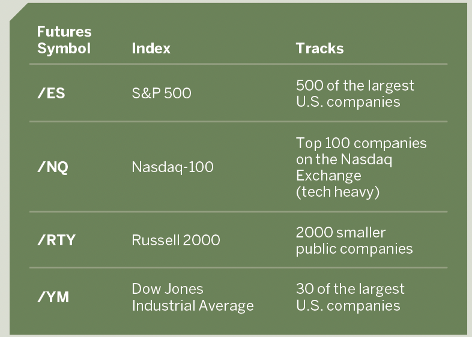

## Table of Contents

## What is a pre-market routine and why is it important for traders?

A pre-market routine is a set of actions that traders do before the market opens. This routine helps them get ready for the trading day. It usually includes things like checking the news, looking at what happened in other markets around the world, and reviewing their trading plans. By doing these things, traders can make better decisions and be more prepared when the market starts.

Having a pre-market routine is important because it helps traders stay organized and focused. When traders follow a routine, they are less likely to make quick, emotional decisions. Instead, they can start the day with a clear plan. This can lead to better trading results over time. A good routine also helps traders feel more confident and in control, which is important in the fast-paced world of trading.

## How can a beginner trader start developing a pre-market routine?

A beginner trader can start developing a pre-market routine by first figuring out what information is most important to them. They should think about what news or data affects the markets they are interested in. For example, if they trade stocks, they might want to check the latest economic reports or company earnings. Once they know what to look for, they can set a specific time each morning to go through this information. This could be as simple as setting an alarm and spending 30 minutes reading the news and checking market updates before the market opens.

After gathering the necessary information, the next step is to review and adjust their trading plan. This means looking at any trades they planned the day before and deciding if they still make sense with the new information. They should also set clear goals for the day, like how much they want to risk or what profits they are aiming for. It's helpful to write these things down in a trading journal. By doing this every morning, a beginner trader can build a routine that helps them feel prepared and confident when the market opens.

## What are the essential elements that should be included in a pre-market routine?

A pre-market routine should include checking the news to see what has happened overnight that might affect the markets. This means looking at economic reports, company earnings, and any big news stories. It's also important to check what other markets around the world did while the local market was closed. This can give a good idea of how the day might start. By doing this, a trader can understand the current situation and make better decisions.

Another essential part of a pre-market routine is reviewing and adjusting the trading plan. This means looking at any trades planned the day before and deciding if they still make sense with the new information. Traders should also set clear goals for the day, like how much they want to risk or what profits they are aiming for. Writing these things down in a trading journal can help keep everything organized. By following these steps every morning, a trader can start the day feeling prepared and in control.

## How can a trader use pre-market data to inform their trading decisions?

A trader can use pre-market data to get a good idea of how the market might open. By looking at the news and what other markets did overnight, a trader can see if there are any big events that might affect their trades. For example, if there was a big economic report released overnight, it could make the market go up or down when it opens. By knowing this, a trader can decide if they want to change their trading plan or wait to see how the market reacts.

Another way to use pre-market data is to check the prices of stocks or other things they want to trade. Some markets have pre-market trading, where people can buy and sell before the official market opens. By looking at these prices, a trader can see if there is a lot of interest in a certain stock or if the price is moving a lot. This can help them decide if they want to buy or sell when the market opens. Using pre-market data like this can help a trader make smarter decisions and be ready for the trading day.

## What are some common mistakes traders make during their pre-market routine?

One common mistake traders make during their pre-market routine is not giving themselves enough time. They might rush through checking the news and planning their trades, which can lead to missing important information or making quick decisions without thinking them through. It's important to set aside enough time each morning to go through everything carefully.

Another mistake is not sticking to a routine. Some traders might skip parts of their routine or change it every day, which can make them feel less prepared and more likely to make emotional decisions. Having a consistent routine helps traders stay organized and focused, so it's important to follow it every day.

Lastly, some traders might focus too much on one piece of information and ignore other important data. For example, they might see a big news story and forget to check how other markets are doing or what economic reports came out. It's important to look at all the relevant information to get a full picture of what's happening before making any trading decisions.

## How can a trader adjust their pre-market routine based on different market conditions?

A trader can change their pre-market routine depending on what the market is doing. For example, if the market is very busy and moving a lot, the trader might want to spend more time looking at the news and checking prices before the market opens. They might also want to look at more economic reports and see what other markets around the world are doing. This helps them understand why the market is moving so much and decide if they need to change their trading plan.

On the other hand, if the market is quiet and not moving much, the trader might not need to spend as much time on their routine. They can still check the news and look at prices, but they might not need to look at as many reports or spend as much time planning. This way, they can keep their routine simple and focus on the most important information. By adjusting their routine like this, a trader can be ready for whatever the market does.

## What tools and resources are most effective for conducting a pre-market analysis?

Some of the best tools for doing a pre-market analysis are financial news websites and apps. Websites like Bloomberg, Reuters, and CNBC give you the latest news and economic reports that can affect the market. They also have tools that show you what prices are doing before the market opens. Apps like these are easy to use on your phone, so you can check them quickly in the morning. Another good tool is a trading platform that shows pre-market data. Platforms like Thinkorswim or TradingView let you see what prices are doing and how much people are buying and selling before the market opens.

Other useful resources include economic calendars and market analysis reports. An economic calendar, like the one on Forex Factory, tells you when important reports are coming out and what they might mean for the market. This helps you plan your trades better. Market analysis reports from places like Morningstar or Zacks can give you ideas about which stocks might do well and why. These reports often have a lot of information, but they can help you understand what's happening in the market and make smarter trading decisions. By using these tools and resources, you can get a good picture of what's going on before the market opens and be ready for the trading day.

## How can experienced traders optimize their pre-market routine for better performance?

Experienced traders can optimize their pre-market routine by focusing on the most important information and cutting out anything that doesn't help them make better decisions. They should look at the news and economic reports that matter most to their trading strategy. For example, if they trade stocks, they might want to check company earnings and big economic news. By using tools like financial news apps and trading platforms, they can quickly see what's happening and how prices are moving before the market opens. This helps them understand the market better and make smarter trades.

Another way experienced traders can improve their routine is by being flexible and adjusting it based on what the market is doing. If the market is moving a lot, they might need to spend more time looking at data and planning their trades. On the other hand, if the market is quiet, they can keep their routine simple and focus on the most important information. By keeping a trading journal and reviewing it regularly, they can see what parts of their routine work well and what needs to change. This helps them stay organized and make better decisions every day.

## What role does psychological preparation play in a pre-market routine?

Psychological preparation is a big part of a pre-market routine. It helps traders get ready for the day and stay calm when the market opens. Traders can do things like deep breathing or meditation to clear their minds and feel more focused. This helps them avoid making quick, emotional decisions when they see the market moving. By starting the day with a clear head, traders can stick to their plan and make better choices.

Another way psychological preparation helps is by building confidence. When traders have a routine they follow every day, they feel more in control. They know they have looked at all the important information and made a plan. This makes them feel ready to handle whatever the market does. Over time, this confidence can lead to better trading results and help traders stay calm even when the market is moving a lot.

## How can traders incorporate global economic news into their pre-market routine?

Traders can include global economic news in their pre-market routine by checking news websites and apps that cover international markets. Websites like Bloomberg and Reuters have sections that focus on what's happening in different countries. Traders should look at economic reports from places like the U.S., Europe, and Asia because these can affect their local market. For example, if there's a big report from China, it might change how the stock market opens in the U.S. By knowing what's happening around the world, traders can make better decisions and be ready for the trading day.

Another way to use global economic news is to look at an economic calendar. These calendars show when important reports are coming out and what they might mean for the market. Traders can check the calendar every morning to see if there are any big events that day. This helps them plan their trades better and understand why the market might move. By including global economic news in their routine, traders can get a full picture of what's happening and make smarter trading choices.

## What advanced techniques can expert traders use during their pre-market routine to gain an edge?

Expert traders can use advanced techniques like algorithmic analysis to gain an edge during their pre-market routine. They might use computer programs to look at a lot of data quickly and find patterns that other people might miss. These programs can check prices from other markets around the world and see how they might affect the local market. By using algorithms, expert traders can make better guesses about what might happen when the market opens and plan their trades accordingly.

Another technique is to use sentiment analysis. This means looking at what people are saying on social media and news websites to see how they feel about the market. If a lot of people are talking positively about a certain stock, it might go up when the market opens. Expert traders can use special tools to quickly see what the general mood is and use this information to decide if they want to buy or sell. By combining these advanced techniques with their regular routine, expert traders can get a better understanding of the market and make smarter trading decisions.

## How should a trader evaluate and refine their pre-market routine over time?

A trader should evaluate and refine their pre-market routine by keeping a trading journal. Every day, they should write down what they did during their routine and how their trades went. Over time, they can look back at their journal to see what parts of their routine helped them make good decisions and what parts didn't work so well. If they notice they often miss important news or make quick decisions, they can change their routine to spend more time on those areas. By doing this regularly, traders can make their routine better and more effective.

Another way to refine a pre-market routine is to talk to other traders and learn from them. By sharing experiences and tips, traders can find new ideas to try in their own routine. They might learn about new tools or ways to look at the market that they hadn't thought of before. It's also helpful to stay open to new information and be willing to change the routine if the market changes. By always trying to improve and adapt, traders can keep their pre-market routine working well and stay ahead in the market.

## References & Further Reading

[1]: Bergstra, J., Bardenet, R., Bengio, Y., & Kégl, B. (2011). ["Algorithms for Hyper-Parameter Optimization."](https://dl.acm.org/doi/10.5555/2986459.2986743) Advances in Neural Information Processing Systems 24.

[2]: ["Advances in Financial Machine Learning"](https://www.amazon.com/Advances-Financial-Machine-Learning-Marcos/dp/1119482089) by Marcos Lopez de Prado

[3]: ["Evidence-Based Technical Analysis: Applying the Scientific Method and Statistical Inference to Trading Signals"](https://www.amazon.com/Evidence-Based-Technical-Analysis-Scientific-Statistical/dp/0470008741) by David Aronson

[4]: ["Machine Learning for Algorithmic Trading"](https://github.com/stefan-jansen/machine-learning-for-trading) by Stefan Jansen

[5]: ["Quantitative Trading: How to Build Your Own Algorithmic Trading Business"](https://www.amazon.com/Quantitative-Trading-Build-Algorithmic-Business/dp/1119800064) by Ernest P. Chan