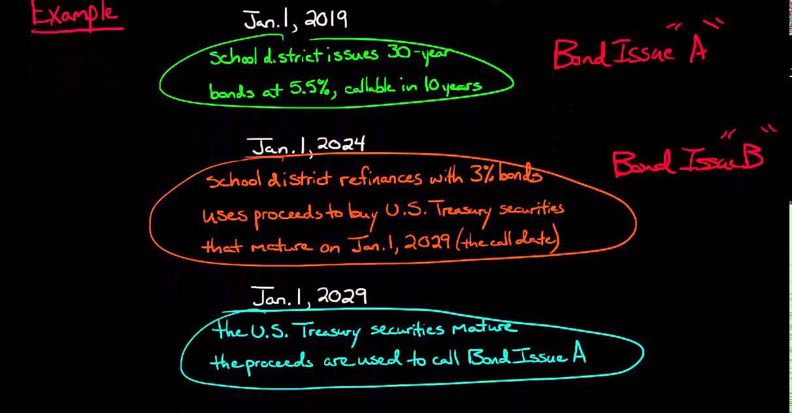

## Table of Contents

## What are pre-refunding bonds?

Pre-refunding bonds are a type of bond where the issuer sets aside money to pay off an old bond before it matures. This is done by issuing new bonds, and the money from these new bonds is used to buy safe investments like government securities. The earnings from these investments are then used to pay off the old bond when it comes due.

This method is often used by governments or big organizations to save money on interest or to get rid of old debts. It's like refinancing a loan but for bonds. By doing this, the issuer can take advantage of lower interest rates and make their future payments more manageable.

## How do pre-refunding bonds work?

Pre-refunding bonds work by letting the issuer pay off an old bond early. The issuer does this by selling new bonds. The money they get from selling these new bonds is not used right away to pay off the old bond. Instead, they use it to buy safe investments, like government securities. These investments will earn some money over time.

The earnings from these safe investments are then used to pay off the old bond when it comes due. This way, the issuer can take advantage of lower interest rates. It's like getting a new loan with a lower [interest rate](/wiki/interest-rate-trading-strategies) to pay off an old loan. This can save the issuer money and make their future payments easier to handle.

## What is the purpose of issuing pre-refunding bonds?

The main purpose of issuing pre-refunding bonds is to save money on interest payments. When interest rates drop, an issuer can issue new bonds at a lower rate and use the money to pay off older bonds that have higher interest rates. This is similar to refinancing a home mortgage to take advantage of lower rates. By doing this, the issuer can reduce the amount of money they have to pay over time.

Another purpose is to manage debt more effectively. By pre-refunding bonds, issuers can smooth out their future payment schedules and make their financial planning easier. This can be especially helpful for governments or large organizations that need to manage big debts over many years. Pre-refunding helps them to avoid large payments all at once and spread out the costs more evenly.

## What are the benefits of pre-refunding bonds for issuers?

Pre-refunding bonds help issuers save money. When interest rates go down, issuers can sell new bonds at a lower rate. They use the money from these new bonds to pay off old bonds that have higher interest rates. This is like getting a new loan with a lower interest rate to pay off an old loan. By doing this, issuers can pay less money over time.

Pre-refunding bonds also help issuers manage their debt better. When issuers pre-refund bonds, they can make their future payments easier to handle. Instead of having to pay a lot of money all at once, they can spread out the costs over time. This is good for governments or big organizations that need to plan their finances carefully over many years.

## What are the potential risks associated with pre-refunding bonds?

One risk of pre-refunding bonds is that the investments used to pay off the old bonds might not perform as expected. If the government securities or other safe investments don't earn enough money, the issuer might not have enough to pay off the old bond when it comes due. This can cause financial problems for the issuer and make it harder to manage their debt.

Another risk is that interest rates might change in unexpected ways. If interest rates go up after the issuer has sold the new bonds, they might end up paying more in the long run. This is because they locked in the lower rate with the new bonds, but if rates go up, they could have saved more money by waiting. This can make pre-refunding a risky move if the interest rate environment is unpredictable.

Lastly, there are costs involved in issuing new bonds and managing the pre-refunding process. These costs can add up and might outweigh the savings from lower interest rates. If the savings are not enough to cover these costs, the issuer might not benefit from pre-refunding and could even end up in a worse financial position.

## How do pre-refunding bonds affect bondholders?

When a bond is pre-refunded, it can change things for the people who own the bond. If you own a bond and it gets pre-refunded, it means the issuer is going to pay you back early using money from new bonds. This can be good if you get your money back sooner than you expected. But it can also be bad if the new bonds have a lower interest rate than your old bond. You might end up with less money over time because the interest you earn will be smaller.

Another thing to think about is what happens to the old bond after it's pre-refunded. Usually, the old bond becomes safer because it's backed by safe investments like government securities. This can make the bond less risky, but it might also make it less exciting for investors who like taking chances. If you were hoping to make a lot of money from your bond, you might be disappointed because the returns could be lower after pre-refunding.

## What is the difference between pre-refunding and refunding bonds?

Pre-refunding and refunding bonds are both ways for issuers to pay off old bonds early, but they work a bit differently. When a bond is refunded, the issuer uses the money from new bonds to pay off the old bond right away. This means the old bond is gone, and the issuer only has to deal with the new bond. It's like paying off an old loan with a new one, but you do it all at once.

Pre-refunding is different because the issuer doesn't pay off the old bond right away. Instead, they use the money from the new bonds to buy safe investments, like government securities. The earnings from these investments are then used to pay off the old bond when it comes due. This way, the old bond stays around until its original due date, but it's backed by safer investments. It's like setting aside money now to pay off a loan later, but using that money to earn more money in the meantime.

## Can you provide an example of a pre-refunding bond issuance?

Imagine a city that issued bonds a few years ago to build a new school. These bonds have a high interest rate because when they were issued, interest rates were high. Now, interest rates have gone down, so the city wants to save money. They decide to issue new bonds at the lower interest rate. Instead of using this money to pay off the old bonds right away, the city uses it to buy safe investments like government securities. The money earned from these investments will be used to pay off the old bonds when they come due.

This is an example of pre-refunding. The old bonds are not paid off immediately, but they are backed by the safe investments. This makes the old bonds safer for the people who own them. The city benefits because they can save money on interest payments over time. If the investments do well, the city can pay off the old bonds without any problems. But if the investments don't do as well as expected, the city might face some financial challenges.

## What are the key considerations for investors when evaluating pre-refunding bonds?

When investors look at pre-refunding bonds, they need to think about how safe their money will be. Pre-refunding makes the old bond safer because it's backed by safe investments like government securities. This means there's less chance the issuer won't be able to pay back the bond. But investors should also check if the new bonds have a lower interest rate than the old ones. If they do, the investor might end up with less money over time because the interest they earn will be smaller.

Investors should also think about what they want from their investment. If they want a safe place to keep their money, pre-refunding can be good because it makes the bond less risky. But if they want to make a lot of money, they might be disappointed. Pre-refunded bonds usually have lower returns because they're safer. So, investors need to decide if they want safety or if they're okay with taking more risk for a chance at higher returns.

## How do changes in interest rates impact pre-refunding bond strategies?

Changes in interest rates can really affect how issuers use pre-refunding bond strategies. When interest rates go down, it's a good time for issuers to issue new bonds at a lower rate. They can use the money from these new bonds to buy safe investments, like government securities. The earnings from these investments will then be used to pay off the old bonds when they come due. This way, issuers can save money because they're paying less interest over time. But if interest rates go up after they've issued the new bonds, they might end up paying more in the long run because they locked in the lower rate.

Investors also need to think about how interest rates might change when they're looking at pre-refunded bonds. If interest rates drop, the new bonds might have a lower interest rate than the old ones. This means investors might get less money over time because the interest they earn will be smaller. On the other hand, if interest rates go up, the old bonds become more valuable because they have a higher interest rate than new bonds. So, investors need to decide if they want to keep their money in a safer, but lower-[earning](/wiki/earning-announcement) bond, or if they want to take a chance on a new bond with a higher interest rate.

## What are the accounting and tax implications of pre-refunding bonds?

When a bond is pre-refunded, it can change how the issuer handles their accounting. The issuer has to keep track of the new bonds they issued and the safe investments they bought with the money from those bonds. They need to make sure the earnings from these investments are enough to pay off the old bond when it comes due. This can make their financial statements more complicated because they have to show both the old and new bonds, as well as the investments. It's important for the issuer to do this right so they can show that they're managing their debt well.

There are also tax implications to think about. For the issuer, the interest they pay on the new bonds might be tax-deductible, just like the interest on the old bonds. But they need to be careful because the rules can be different depending on where they are and what kind of bonds they're dealing with. For investors, the interest they earn from the old bond might still be taxable, even after it's pre-refunded. But if the new bonds have a lower interest rate, the investor might end up paying less in taxes because they're earning less money. It's a good idea for both issuers and investors to talk to a tax expert to make sure they understand all the tax rules.

## How have regulatory changes influenced the use of pre-refunding bonds?

Regulatory changes can make a big difference in how often issuers use pre-refunding bonds. Sometimes, new rules can make it easier for issuers to pre-refund their bonds. For example, if the government changes the rules to make it simpler to issue new bonds or invest the money in safe ways, more issuers might decide to pre-refund their old bonds. But other times, new rules can make it harder. If the government puts in place strict rules about how issuers can use the money from new bonds, or if they change the tax rules, issuers might think twice before pre-refunding.

These changes can also affect how investors feel about pre-refunded bonds. If new rules make pre-refunded bonds safer or more profitable, more investors might want to buy them. But if the rules make pre-refunded bonds riskier or less profitable, investors might look for other places to put their money. So, both issuers and investors need to keep an eye on regulatory changes to decide if pre-refunding bonds is a good idea for them.

## References & Further Reading

[1]: "Fixed Income Analysis" by Frank J. Fabozzi - A comprehensive guide to understanding fixed-income securities, including municipal bonds.

[2]: Lopez de Prado, M. (2018). ["Advances in Financial Machine Learning"](https://www.amazon.com/Advances-Financial-Machine-Learning-Marcos/dp/1119482089) - Explores the application of machine learning techniques, including algorithmic trading in financial markets.

[3]: Municipal Securities Rulemaking Board. ["An Investor’s Guide to Municipal Bonds"](https://www.msrb.org/sites/default/files/2023-11/Municipal-Bond-Basics.pdf) - An informative guide detailing the intricacies of municipal bonds, including investment considerations and regulatory aspects.

[4]: Schwert, G. W. (1990). "Stock Returns and Real Activity: A Century of Evidence." The Journal of Finance, 45(4), 1237-1257 - Studying the impact of algorithmic trading on liquidity and market efficiency, which can be extrapolated to the bond market.

[5]: Bokhari, I., & Ferrell, M. (2017). ["Tax-Exempt Bonds: Compliance Guide"](https://ietresearch.onlinelibrary.wiley.com/doi/abs/10.1049/iet-rpg.2016.0589) - A guide from the IRS on maintaining the tax-exempt status of municipal bonds, highlighting tax implications and legal considerations.