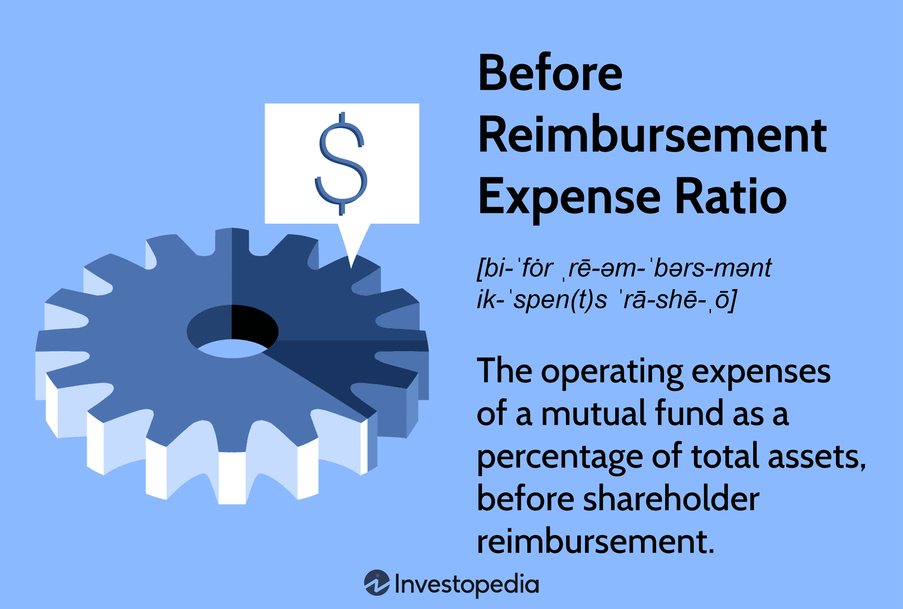

## Table of Contents

## What is a Pre-Reimbursement Expense Ratio?

A Pre-Reimbursement Expense Ratio is a way to measure how much it costs to manage a mutual fund or an exchange-traded fund (ETF) before any fee waivers or reimbursements are applied. This ratio shows the total expenses as a percentage of the fund's average net assets. It includes costs like management fees, administrative fees, and other operational expenses. By looking at this ratio, investors can get an idea of the fund's cost before any adjustments are made by the fund company.

Sometimes, a fund company might decide to temporarily lower the fees to attract more investors. They do this by waiving or reimbursing some of the expenses. After these adjustments, the ratio becomes the Post-Reimbursement Expense Ratio, which is usually lower. Comparing the Pre-Reimbursement and Post-Reimbursement Expense Ratios can help investors understand the full impact of the fund's costs and how much the fund company is doing to keep expenses down.

## Why is the Pre-Reimbursement Expense Ratio important for investors?

The Pre-Reimbursement Expense Ratio is important for investors because it shows the true cost of managing a mutual fund or ETF before any temporary discounts are applied. This helps investors see the full picture of what they are paying for the fund's management, including fees for running the fund and other expenses. By knowing this ratio, investors can compare different funds more accurately and make better choices about where to put their money.

Understanding the difference between the Pre-Reimbursement and Post-Reimbursement Expense Ratios also helps investors see how much the fund company is willing to lower costs to attract them. If a fund has a high Pre-Reimbursement Expense Ratio but a much lower Post-Reimbursement Expense Ratio, it means the fund company is currently offering a discount. This can be good in the short term, but investors should think about what will happen when the discount ends. Knowing the Pre-Reimbursement Expense Ratio helps investors plan for the long term and choose funds that are more cost-effective over time.

## How is the Pre-Reimbursement Expense Ratio calculated?

The Pre-Reimbursement Expense Ratio is calculated by taking the total expenses of a mutual fund or [ETF](/wiki/etf-trading-strategies) before any fee waivers or reimbursements and dividing them by the fund's average net assets. The total expenses include costs like management fees, administrative fees, and other operational expenses that the fund incurs. The average net assets are the average value of the fund's assets over a certain period, usually a year. The result of this division is then multiplied by 100 to turn it into a percentage.

For example, if a fund has total expenses of $1 million and average net assets of $100 million, the Pre-Reimbursement Expense Ratio would be calculated as follows: $1 million divided by $100 million equals 0.01. When you multiply 0.01 by 100, you get a Pre-Reimbursement Expense Ratio of 1%. This means that before any fee waivers or reimbursements, the fund's expenses are 1% of its average net assets.

## Can you explain the difference between Pre-Reimbursement and Post-Reimbursement Expense Ratios?

The Pre-Reimbursement Expense Ratio and the Post-Reimbursement Expense Ratio are two ways to look at the costs of managing a mutual fund or ETF. The Pre-Reimbursement Expense Ratio shows the total expenses as a percentage of the fund's average net assets before any fee waivers or reimbursements are applied. This ratio gives investors an idea of the full cost of running the fund, including management fees, administrative fees, and other operational expenses. It's important because it shows the true cost that investors might face if there were no discounts.

The Post-Reimbursement Expense Ratio, on the other hand, is the expense ratio after the fund company has applied any fee waivers or reimbursements. This means it's usually lower than the Pre-Reimbursement Expense Ratio because the fund company is temporarily reducing the costs to make the fund more attractive to investors. By comparing the two ratios, investors can see how much the fund company is doing to lower the expenses and what the costs might be in the future if the waivers or reimbursements end.

## What types of fees are typically included in the Pre-Reimbursement Expense Ratio?

The Pre-Reimbursement Expense Ratio includes different kinds of fees that a mutual fund or ETF has to pay. These fees can be things like management fees, which are what the fund pays to the company that runs it, and administrative fees, which cover the costs of keeping the fund going. There are also other operational expenses, like the costs of buying and selling the investments in the fund or paying for audits and legal work.

All these fees together make up the total expenses of the fund before any discounts. When you see the Pre-Reimbursement Expense Ratio, it shows you what the fund would cost if there were no fee waivers or reimbursements. This helps investors understand the full price they might have to pay for the fund's management.

## How does the Pre-Reimbursement Expense Ratio affect the overall return on investment?

The Pre-Reimbursement Expense Ratio can have a big impact on the overall return on investment. This ratio shows how much it costs to run the fund before any discounts. When the expenses are high, it means less money is left over to grow and make profits for the investors. So, a high Pre-Reimbursement Expense Ratio can make the returns lower because more of the fund's money goes towards paying for the costs instead of being invested.

It's important for investors to look at the Pre-Reimbursement Expense Ratio to understand what they might really earn from their investment. If a fund has a high Pre-Reimbursement Expense Ratio but a lower Post-Reimbursement Expense Ratio, it means the fund company is giving a temporary discount. Investors need to think about what will happen when the discount ends. A fund with a lower Pre-Reimbursement Expense Ratio might be a better choice in the long run because it could lead to higher returns over time.

## What are some common strategies for managing a high Pre-Reimbursement Expense Ratio?

When a mutual fund or ETF has a high Pre-Reimbursement Expense Ratio, there are several things the fund company can do to manage it. One way is to look at all the costs and see if they can be cut down. This might mean finding cheaper ways to do things like managing the fund or handling the paperwork. Another strategy is to grow the size of the fund. When more people invest, the costs are spread out over more money, which can lower the expense ratio. Fund companies might also choose to merge smaller funds into bigger ones to save on costs.

Another approach is to offer fee waivers or reimbursements to lower the costs for investors, at least for a while. This can make the fund more attractive and bring in more investors. But, it's important for the fund company to be clear about how long these discounts will last. Investors need to know what the costs will be after the discounts end. By managing the Pre-Reimbursement Expense Ratio well, fund companies can make their funds more appealing and help investors get better returns over time.

## How can investors compare Pre-Reimbursement Expense Ratios across different funds?

Investors can compare Pre-Reimbursement Expense Ratios across different funds by looking at the fund's prospectus or financial statements. These documents will show the total expenses before any fee waivers or reimbursements. By comparing these numbers, investors can see which funds have higher costs and which ones are more affordable. It's important to compare funds that are similar in what they invest in, like stocks or bonds, because different types of funds can have different expense ratios.

When comparing Pre-Reimbursement Expense Ratios, investors should also think about how the high or low costs might affect their returns. A fund with a high Pre-Reimbursement Expense Ratio might take away more money from the returns, making it less attractive over time. On the other hand, a fund with a lower Pre-Reimbursement Expense Ratio might leave more money to grow and could be a better choice for the long term. By understanding these ratios, investors can make smarter choices about where to put their money.

## What regulatory guidelines govern the disclosure of Pre-Reimbursement Expense Ratios?

The disclosure of Pre-Reimbursement Expense Ratios is governed by rules from the U.S. Securities and Exchange Commission (SEC). The SEC requires mutual funds and ETFs to be clear about their fees and expenses. This includes showing the Pre-Reimbursement Expense Ratio in the fund's prospectus and annual report. The idea is to help investors understand the full costs of investing in a fund before any discounts are applied. By following these rules, fund companies have to be honest and open about what they charge.

These regulations help make sure that investors can compare different funds easily. The SEC wants investors to have all the information they need to make good choices. So, the Pre-Reimbursement Expense Ratio must be shown clearly, without hiding any details. This way, investors can see the true cost of a fund and decide if it's worth their money.

## How do changes in fund management or investment strategies impact the Pre-Reimbursement Expense Ratio?

Changes in fund management can affect the Pre-Reimbursement Expense Ratio. If a fund hires new managers or changes how it's run, the costs might go up or down. For example, if a new manager comes in and they charge more for their services, the management fees could go up. This would make the Pre-Reimbursement Expense Ratio higher. On the other hand, if the fund finds ways to run things more cheaply, like using technology to cut down on paperwork, the expenses could go down, making the ratio lower.

Changes in investment strategies can also impact the Pre-Reimbursement Expense Ratio. If a fund decides to invest in different kinds of assets, like switching from stocks to bonds, the costs of buying and selling those assets might change. Some types of investments can be more expensive to trade than others. For instance, if a fund starts investing in more complicated things like derivatives, the costs might go up because these investments need more work to manage. This would make the Pre-Reimbursement Expense Ratio higher. But if the fund simplifies its strategy and sticks to easier, cheaper investments, the costs could go down, leading to a lower Pre-Reimbursement Expense Ratio.

## Can you discuss any case studies where the Pre-Reimbursement Expense Ratio significantly influenced fund performance?

One case study that shows how the Pre-Reimbursement Expense Ratio can affect fund performance is the Vanguard Total Stock Market Index Fund. This fund is known for having a very low Pre-Reimbursement Expense Ratio. Because the costs are so low, more of the money stays in the fund to grow and earn returns. Over time, this has helped the fund perform well compared to other funds with higher costs. Investors who put their money in this fund have seen good returns because the low expenses let their investments grow more.

Another example is the American Funds Growth Fund of America. This fund once had a high Pre-Reimbursement Expense Ratio. The high costs meant that a bigger part of the fund's money went to paying for running the fund instead of being used to invest and grow. This made the fund's performance worse than it could have been with lower costs. After the fund company decided to lower the expenses by offering fee waivers, the Post-Reimbursement Expense Ratio went down, and the fund started to do better. This shows how important it is for investors to look at the Pre-Reimbursement Expense Ratio when choosing where to put their money.

## What advanced analytical techniques can be used to forecast future trends in Pre-Reimbursement Expense Ratios?

To forecast future trends in Pre-Reimbursement Expense Ratios, analysts can use regression analysis. This technique looks at how the expense ratios have changed over time and uses that information to predict what might happen next. By studying past data, analysts can see if the costs are going up or down and what might be causing these changes. They can then make educated guesses about what the future might hold. For example, if a fund's expenses have been growing because of higher management fees, regression analysis can help predict if this trend will keep going or if something might change it.

Another useful technique is time series analysis. This method looks at how the Pre-Reimbursement Expense Ratios change over time and tries to find patterns. By understanding these patterns, analysts can make forecasts about what the expense ratios might be in the future. Time series analysis can help spot things like seasonal changes or long-term trends that might affect the costs. For instance, if a fund's expenses go up every year around the same time because of certain costs, time series analysis can help predict when this might happen again. Both regression and time series analysis help investors and fund managers plan better by giving them a clearer picture of what the future might bring.

## What is the understanding of expense ratios?

An expense ratio is a fundamental financial metric that plays a crucial role in evaluating the costs associated with managing an investment fund. It is essentially a measure of the percentage of a fund's assets that are used for administrative and other operating expenses. These fees are essential for the day-to-day management and logistical support of the fund and are factored into the fund's overall performance.

### Components of Expense Ratios

Expense ratios are composed of several key elements:

1. **Management Fees**: These are typically the most significant portion of the expense ratio and compensate the fund manager for their expertise and services. This fee covers investment research, portfolio management, and other associated tasks.

2. **Administrative Fees**: This component covers the routine operational aspects of managing the fund. It includes costs related to record-keeping, customer service, regulatory compliance, and other administrative activities.

3. **Other Operational Costs**: These may include distribution fees, marketing costs, and other miscellaneous expenses necessary to operate the fund efficiently.

### Calculation of the Expense Ratio

The expense ratio is calculated using the following formula:

$$
\text{Expense Ratio} = \left( \frac{\text{Total Fund Expenses}}{\text{Total Assets Under Management}} \right) \times 100
$$

This formula represents the cost incurred by the investor for every dollar invested in the fund, expressed as a percentage. The numerator includes all aforementioned costs, while the denominator is the total assets managed by the fund.

### Impact of High Expense Ratios on Investment Returns

Funds with high expense ratios can significantly erode investment returns over time. A higher proportion of a fund's assets is directed towards covering its operational costs, leaving less available for reinvestment and growth. Consequently, the net returns to investors diminish, affecting long-term wealth accumulation.

### Importance of Low Expense Ratios for Investor Profitability

Conversely, low expense ratios are generally more favorable for investors. These indicate that a smaller fraction of the fund's assets is consumed by operational expenses, maximizing the potential for higher net returns. Investors often seek funds with low expense ratios, as they are likely to yield better results by minimizing costs and maximizing the portion of investment earnings that are retained in the portfolio. 

In summary, understanding expense ratios and their components is vital for investors aiming to optimize their investment returns. Lower expense ratios can be a strong indicator of a fund's cost-efficiency and potential profitability, making them a critical [factor](/wiki/factor-investing) in fund selection and investment decisions.

## What is Expense Ratio Reimbursement?

Expense ratio reimbursement is a financial mechanism employed by fund managers to curtail the operational costs of investment funds, thereby influencing the net expense ratio investors are obligated to pay. This reimbursement occurs when fund managers absorb a portion of the fund's expenses to render the fund more appealing through a competitive expense ratio. The net expense ratio, therefore, represents the actual cost investors incur after accounting for such reimbursements. It can be expressed mathematically as:

$$
\text{Net Expense Ratio} = \text{Gross Expense Ratio} - \text{Reimbursements}
$$

Fund managers often initiate reimbursements in an effort to sustain or improve fund attractiveness amidst competition. By reducing the effective expense ratio, they may enhance fund performance metrics relative to competitors, potentially attracting more investors. Such strategies are particularly evident when a fund initially incurs heavy operational expenses that could deter investor participation.

The financial ramifications of reimbursements are nuanced. For investors, a lower net expense ratio signifies reduced costs, potentially amplifying net returns. When reinvested, these savings can lead to compounded growth, especially significant over extended investment horizons. However, it's crucial for investors to discern whether these reimbursements are temporary promotional strategies or enduring elements of the fund's financial structure to make informed investment decisions.

Several funds known for offering reimbursements include new or niche market funds that aim to build investor trust and an established performance history. For instance, some exchange-traded funds (ETFs) and mutual funds during their inception phase might adopt reimbursement strategies as part of their marketing pitch to lure early investors by promising them an advantageous cost structure compared to similar products.

In conclusion, while reimbursement in expense ratios can be advantageous to investors by lowering direct investment costs, it is essential to critically evaluate the permanence and strategic intent behind such reimbursements. This evaluation allows investors to align their choices with long-term financial goals and risk tolerance levels.

## What are Financial Metrics in Algorithmic Trading?

Algorithmic trading, or algo trading, utilizes complex algorithms to automate trading decisions, relying heavily on financial metrics to determine the most profitable opportunities. Among these metrics, expense ratios play a vital role in assessing the cost structure of investment funds, thereby influencing algorithmic strategies. Algorithms scrutinize these financial metrics to optimize trading decisions, focusing on metrics that indicate profitability and risk.

Several critical financial metrics are fundamental to [algorithmic trading](/wiki/algorithmic-trading):

1. **Return on Investment (ROI)**: ROI is a crucial metric that measures the profitability of an investment, calculated as:
$$
   \text{ROI} = \frac{\text{Net Profit}}{\text{Cost of Investment}} \times 100

$$
   Algorithms use ROI to evaluate past performance and predict the potential success of future investments, thereby aiding in selecting high-return trades.

2. **Sharpe Ratio**: This ratio assesses the risk-adjusted return of an investment, helping algorithms incorporate risk into their trading decisions. It is calculated as:
$$
   \text{Sharpe Ratio} = \frac{E[R] - R_f}{\sigma}

$$
   where $E[R]$ is the expected return, $R_f$ is the risk-free rate, and $\sigma$ is the standard deviation of returns. A higher Sharpe Ratio indicates a more attractive risk-adjusted return, guiding algorithms in selecting such investments.

3. **Alpha**: Alpha represents the excess return of an investment relative to a benchmark index. In formulaic terms:
$$
   \alpha = R - (R_f + \beta \times (R_m - R_f))

$$
   where $R$ is the return of the investment, $\beta$ is the beta of the investment, and $R_m$ is the market return. Algorithms that focus on generating alpha aim to outperform market benchmarks, ensuring that trades are strategically aligned to yield superior returns.

4. **Beta**: Beta measures the volatility of an investment compared to the market. With a formula given by:
$$
   \beta = \frac{\text{Cov}(R_i, R_m)}{\text{Var}(R_m)}

$$
   where $\text{Cov}(R_i, R_m)$ is the covariance between the investment return and market return, and $\text{Var}(R_m)$ is the variance of the market return. Beta informs algorithms about the extent to which investment is exposed to systematic risk, aiding in risk management strategy formulation.

Cost-efficiency is paramount in algorithmic trading, where even small cost disparities can lead to significant differences in profitability, particularly in high-frequency trading environments. Low expense ratios are ideal, allowing for greater net returns, which algorithms endeavor to maximize through careful selection of cost-effective investment funds.

The integration of these financial metrics into algorithmic trading directly impacts trading profitability. Algorithms can process vast arrays of data with high accuracy and speed, enabling them to make informed, profitable trading decisions while minimizing risk. High Sharpe Ratios, positive Alpha, and appropriate Beta levels, coupled with low expense ratios, are critical in crafting robust trading strategies that deliver consistent returns. Consequently, understanding and applying these financial metrics effectively can lead to more strategic decision-making and enhanced trading outcomes.

## References & Further Reading

[1]: Bergstra, J., Bardenet, R., Bengio, Y., & Kégl, B. (2011). ["Algorithms for Hyper-Parameter Optimization."](https://dl.acm.org/doi/10.5555/2986459.2986743) Advances in Neural Information Processing Systems 24.

[2]: ["Advances in Financial Machine Learning"](https://www.amazon.com/Advances-Financial-Machine-Learning-Marcos/dp/1119482089) by Marcos Lopez de Prado

[3]: ["Evidence-Based Technical Analysis: Applying the Scientific Method and Statistical Inference to Trading Signals"](https://www.amazon.com/Evidence-Based-Technical-Analysis-Scientific-Statistical/dp/0470008741) by David Aronson

[4]: ["Machine Learning for Algorithmic Trading"](https://github.com/stefan-jansen/machine-learning-for-trading) by Stefan Jansen

[5]: ["Quantitative Trading: How to Build Your Own Algorithmic Trading Business"](https://www.amazon.com/Quantitative-Trading-Build-Algorithmic-Business/dp/1119800064) by Ernest P. Chan