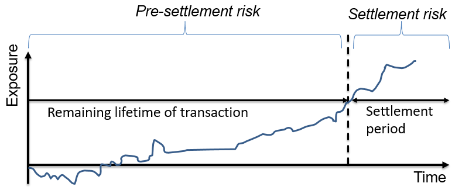

## Table of Contents

## What is pre-settlement risk?

Pre-settlement risk is the danger that one party in a financial deal might not fulfill their part of the agreement before the deal is finalized. Imagine you agree to buy something, but before you pay and get the item, the seller disappears. That's pre-settlement risk - the chance that something goes wrong before the transaction is complete.

This type of risk is common in markets where trades take time to settle, like in foreign exchange or derivatives markets. It's a worry because if one side fails to deliver, the other side could lose money. To manage this risk, people often use tools like margin requirements or credit limits to make sure both parties can meet their obligations.

## How does pre-settlement risk differ from settlement risk?

Pre-settlement risk and settlement risk are two different dangers in financial deals. Pre-settlement risk is the worry that happens before the deal is done. It's the chance that one person in the deal might not be able to do what they promised before the final step. For example, if you agree to buy something but the seller disappears before you pay and get the item, that's pre-settlement risk. It's about the time between making the deal and finishing it.

Settlement risk, on the other hand, is the risk that happens at the very moment the deal is supposed to be finished. It's the danger that one side will do their part, like sending money, but the other side won't do theirs, like delivering the goods. A common example is when you send payment but don't receive what you bought. Settlement risk is shorter and happens right at the end of the deal, while pre-settlement risk can last the whole time before the deal is settled.

## What are the common causes of pre-settlement risk in financial transactions?

Pre-settlement risk in financial transactions can happen for many reasons. One big reason is when one side in the deal faces financial trouble before the deal is done. This could be because of bad business choices, economic downturns, or unexpected events like a company going bankrupt. If this happens, they might not be able to keep their promise in the deal, leaving the other side at risk.

Another cause is when there's a big change in the market or in the value of what's being traded. For example, if you agree to buy something at a set price but the price drops a lot before the deal is settled, the seller might not want to sell at the old price anymore. This can lead to them backing out of the deal, causing pre-settlement risk. Also, if the deal involves different currencies, changes in exchange rates can make it hard for one side to meet their part of the deal.

Operational issues can also lead to pre-settlement risk. Mistakes in how the deal is handled, like errors in paperwork or delays in processing, can cause problems. If these issues stop the deal from being completed on time, it can increase the risk that one side won't be able to fulfill their obligations. Keeping good records and having clear communication can help lower this risk.

## Can you explain the basic mechanisms used to mitigate pre-settlement risk?

To reduce pre-settlement risk, people use several tools and strategies. One common way is to use something called a margin. This means that both sides in the deal have to put up some money or assets as a kind of promise that they will do what they agreed to do. If one side can't meet their part of the deal, the other side can use the margin to cover their losses. Another tool is setting credit limits, which means deciding how much risk you're willing to take with a certain person or company. If they want to do a deal that's too big, you can say no to keep the risk low.

Another way to manage pre-settlement risk is by using something called netting. This means that if you have several deals going with the same person, you can add up all the money you owe each other and just pay the difference. It makes things simpler and reduces the risk that one big deal will go wrong. Also, keeping a close eye on the other side's financial health through regular checks and reports helps. If you see signs that they might be in trouble, you can take steps to protect yourself, like asking for more margin or reducing the size of your deals with them.

## What role do financial institutions play in managing pre-settlement risk?

Financial institutions play a big role in managing pre-settlement risk by setting up rules and using tools to make sure deals are safer. They use things like margin requirements, where both sides in a deal have to put up money or assets as a promise. This way, if one side can't do what they agreed to do, the other side can use the margin to cover their losses. Banks and other financial institutions also set credit limits. This means they decide how much risk they're willing to take with a certain person or company. If someone wants to do a deal that's too big, the bank might say no to keep the risk low.

Another thing financial institutions do is keep a close watch on the financial health of the people they do business with. They do regular checks and look at reports to see if there are any signs that someone might be in trouble. If they see warning signs, they can take steps to protect themselves, like asking for more margin or reducing the size of their deals. They also use a method called netting, where if you have several deals going with the same person, you can add up all the money you owe each other and just pay the difference. This makes things simpler and reduces the risk that one big deal will go wrong.

## How is pre-settlement risk measured and quantified?

Pre-settlement risk is measured and quantified by looking at how much money could be lost if one side of a deal can't do what they promised before the deal is finished. Financial experts use something called the "potential future exposure" to figure this out. They look at how much the value of the deal could change over time until it's settled. This involves using math and computer models to predict different scenarios and see how bad things could get if the other side doesn't come through. The more the value might change, the higher the pre-settlement risk is considered to be.

To make this more accurate, they also consider the creditworthiness of the person or company they're dealing with. This means they check if the other side is likely to be able to meet their part of the deal. They use credit ratings and financial reports to help with this. By combining the potential future exposure with the creditworthiness, they get a better picture of the pre-settlement risk. This helps them decide how much risk they're willing to take and what steps they need to take to protect themselves.

## What are some real-world examples of pre-settlement risk affecting businesses?

One real-world example of pre-settlement risk affecting businesses happened during the 2008 financial crisis. Many banks and financial institutions had deals with each other that involved complex financial products like derivatives. Before these deals could be settled, some big banks like Lehman Brothers went bankrupt. This meant that the other banks that had deals with Lehman Brothers couldn't get what they were supposed to get, leading to huge losses. The pre-settlement risk was very high because the value of these financial products could change a lot before the deals were settled, and when Lehman Brothers failed, it caused a big problem for the whole financial system.

Another example is in the foreign exchange market. Imagine a company in the U.S. agrees to buy goods from a company in Europe, and they agree to pay in euros. The U.S. company sends the money, but before the European company delivers the goods, the value of the euro drops a lot. The European company might then decide not to sell at the old price, leaving the U.S. company at risk of losing money. This pre-settlement risk comes from the time it takes to settle the deal and the changes in currency values that can happen during that time. It shows how important it is for businesses to manage this risk carefully.

## What advanced strategies can be employed to minimize pre-settlement risk?

One advanced strategy to minimize pre-settlement risk is using real-time monitoring and analytics. This means keeping a close eye on the market and the financial health of the other side in the deal all the time. With the help of computers and software, businesses can quickly see if something is going wrong and take action right away. For example, if the value of what's being traded changes a lot or if the other company starts to have money problems, the business can ask for more margin or even cancel the deal before it's too late. This real-time approach helps to catch problems early and reduce the risk of big losses.

Another strategy is using advanced risk models and stress testing. These are fancy ways to predict what could go wrong and how bad it could be. By running different scenarios through these models, businesses can see how much they might lose if the other side can't meet their part of the deal. Stress testing means putting these models through tough situations to see if the business can handle them. If the models show that the risk is too high, the business can change the terms of the deal, ask for more protection, or decide not to go through with it. This helps to make sure that the business is ready for anything that might happen before the deal is settled.

## How do regulatory frameworks influence the management of pre-settlement risk?

Regulatory frameworks play a big role in how businesses manage pre-settlement risk. These rules are made by governments and financial watchdogs to make sure that the markets are safe and fair. They set standards that businesses have to follow, like how much money they need to keep as a safety net, called capital requirements. They also make rules about how much risk businesses can take when dealing with others, known as exposure limits. By following these rules, businesses can lower the chance of big losses if something goes wrong before a deal is finished.

These regulations also push businesses to use certain tools and methods to manage pre-settlement risk. For example, they might need to use something called central clearing, where a special company steps in to make sure both sides in a deal do what they promised. This helps to make deals safer. Also, regulators often check that businesses are keeping a close eye on their risks and have good plans in place to handle them. By making sure everyone follows these rules, regulatory frameworks help to keep the financial system stable and protect businesses from the dangers of pre-settlement risk.

## What are the latest technological tools used for monitoring and managing pre-settlement risk?

The latest technological tools for monitoring and managing pre-settlement risk include advanced software that uses [artificial intelligence](/wiki/ai-artificial-intelligence) (AI) and [machine learning](/wiki/machine-learning). These tools can look at lots of data very quickly to see if there are any signs of trouble. For example, they can watch how the market is changing and how well the other side in a deal is doing financially. If something looks risky, the software can send a warning so the business can take action right away, like asking for more money as a safety net or changing the terms of the deal. This helps to catch problems early and keep the risk low.

Another important tool is blockchain technology. Blockchain can make deals safer by keeping a clear record of everything that happens. It's hard to change or cheat with this record, which helps to make sure both sides do what they promised. Blockchain can also speed up the process of settling deals, which means less time for things to go wrong before the deal is finished. By using these new tools, businesses can better manage pre-settlement risk and protect themselves from big losses.

## How does pre-settlement risk impact different financial markets, such as forex, equities, and commodities?

Pre-settlement risk affects different financial markets in unique ways. In the [forex](/wiki/forex-system) market, where currencies are traded, pre-settlement risk is high because exchange rates can change a lot before deals are settled. If you agree to buy a currency but its value drops before you get it, the other side might not want to sell at the old price anymore. This can leave you at risk of losing money. Also, since forex trades often happen between banks in different countries, there's a bigger chance that one side might face financial trouble before the deal is done, making the risk even higher.

In the equities market, where stocks are traded, pre-settlement risk is also a concern. When you buy a stock, it takes a few days for the trade to be settled. During this time, the price of the stock can change, and if the seller goes bankrupt before the deal is finished, you might not get the stock you paid for. To manage this risk, stock exchanges often use something called a clearinghouse to make sure deals are safe. The clearinghouse steps in to make sure both sides do what they promised, reducing the chance of big losses.

In the commodities market, where things like oil, gold, and wheat are traded, pre-settlement risk can be high because the value of these goods can change a lot due to things like weather, politics, and supply and demand. If you agree to buy a commodity but its price goes down a lot before the deal is settled, the seller might not want to sell at the old price. Also, if the seller can't deliver the commodity because of a problem like a factory shutting down, you could lose money. To manage this risk, businesses often use tools like margin requirements and futures contracts to protect themselves.

## What are the future trends and potential developments in managing pre-settlement risk?

In the future, managing pre-settlement risk will likely see more use of smart technology like artificial intelligence and machine learning. These tools can look at lots of data very quickly and find patterns that might mean trouble is coming. By using AI, businesses can get warnings early and take steps to protect themselves, like asking for more money as a safety net or changing the terms of a deal. This can help lower the chance of big losses before a deal is finished. Also, blockchain technology might become more common. It can make deals safer by keeping a clear record of everything that happens, which is hard to change or cheat with. This can help make sure both sides do what they promised and speed up the process of settling deals, reducing the time for things to go wrong.

Another trend might be more use of real-time monitoring and analytics. This means watching the market and the financial health of the other side in a deal all the time. With computers and software, businesses can see if something is going wrong and act quickly. This can help catch problems early and reduce the risk of big losses. Also, regulators might make new rules to help manage pre-settlement risk better. These rules could make businesses use certain tools and methods to keep deals safer. By following these rules, businesses can lower the chance of big losses if something goes wrong before a deal is finished.

## What is Pre-Settlement Risk?

Pre-settlement risk, often called counterparty credit risk, arises when there is uncertainty whether a counterparty will fulfill its contractual obligations prior to the settlement date. This risk is particularly significant in financial instruments that entail delayed delivery or payment, such as forward contracts, swaps, and other derivatives.

In financial markets, contracts often involve commitments to exchange cash flows or securities at a future date. However, fluctuations in market conditions, creditworthiness issues, or operational hurdles can result in scenarios where one party defaults on their obligations. Such a default can result in financial loss for the counterparty, especially if the subsequent replacement cost of the contract is higher due to adverse market movements.

Consider a forward contract where two parties agree to exchange an underlying asset at a predetermined price on a future date. If one party defaults due to credit insolvency before the contract demands execution, the other party might face financial loss if the current market price is less favorable than the contract price. 

To evaluate pre-settlement risk, financial institutions often rely on various metrics and models that consider the probability of default (PD) and the potential loss given default (LGD). These models help in pricing the risk and setting appropriate collateral and margin requirements. For instance, the Expected Positive Exposure (EPE) is a commonly used metric, calculated to estimate the expected credit exposure over the life of the contract. 

$$
\text{EPE} = \frac{1}{T} \sum_{t=1}^{T} \text{E}[ \text{max}(P(t), 0)]
$$

where $P(t)$ is the potential exposure at time $t$ and $T$ is the maturity of the contract.

Incorporating pre-settlement risk into the pricing and risk management strategies is essential. Institutions often adjust contract terms, demand additional collateral, or employ hedging techniques to manage these risks effectively. Robust regulatory frameworks also require financial entities to maintain capital reserves proportional to the level of risk undertaken.

Overall, pre-settlement risk recognition, assessment, and mitigation are pivotal for maintaining stability and confidence within the financial trading environment. Understanding this risk helps traders and institutions not only in protecting their financial interests but also in contributing to the overall integrity of the financial system.

## References & Further Reading

[1]: Pirrong, C. (2011). ["The Economics of Central Clearing: Theory and Practice."](https://www.isda.org/attachment/MzE0NA==/ISDAdiscussion_CCP_Pirrong.pdf) Bank of England Financial Stability Paper.

[2]: Gregory, J. (2011). ["Counterparty Credit Risk and Credit Value Adjustment: A Continuing Challenge for Global Financial Markets."](https://onlinelibrary.wiley.com/doi/book/10.1002/9781118673638) Wiley Finance.

[3]: Hull, J. C. (2008). ["Options, Futures, and Other Derivatives."](https://www.semanticscholar.org/paper/Options%2C-Futures%2C-and-Other-Derivatives-Hull/89bdee500c8623864fc9eb7a471546aa713acc44) Pearson.

[4]: Hasbrouck, J. (2007). ["Empirical Market Microstructure: The Institutions, Economics, and Econometrics of Securities Trading."](https://academic.oup.com/book/52241) Oxford University Press.

[5]: Aldridge, I. (2013). ["High-Frequency Trading: A Practical Guide to Algorithmic Strategies and Trading Systems."](https://books.google.com/books/about/High_Frequency_Trading.html?id=8QpIsVUMhmEC) Wiley Trading.