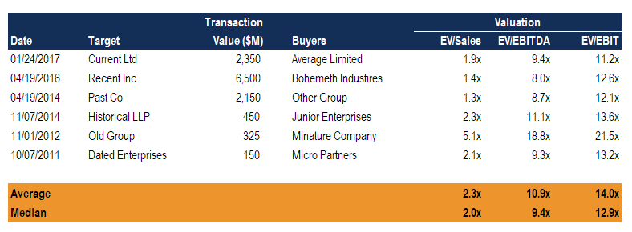

## Table of Contents

## What is Precedent Transaction Analysis?

Precedent Transaction Analysis is a method used in finance to figure out how much a company might be worth. It involves looking at past deals where similar companies were bought or sold. By studying these past transactions, analysts can see the prices paid for those companies and use that information to guess the value of the company they are looking at now.

This method is helpful because it shows real prices from actual deals, not just guesses or predictions. However, it can be tricky because no two companies are exactly the same, and the market conditions might have changed since those past deals happened. Still, it's a popular tool for people in finance because it gives them a solid starting point to understand what a company might be worth in today's market.

## Why is Precedent Transaction Analysis important in finance?

Precedent Transaction Analysis is important in finance because it helps people figure out how much a company is worth by looking at what similar companies sold for in the past. This method gives a real-world view of what buyers were willing to pay for companies like the one being valued. It's like checking the price of similar houses in a neighborhood to guess the value of a house you want to sell. This makes it easier for investors and companies to make smart decisions about buying, selling, or merging with other companies.

Another reason it's important is that it shows what the market thinks a company is worth at a specific time. This can be really helpful when trying to understand current market trends and how they might affect the value of a company. However, it's not perfect because every company is different, and market conditions change. Still, it's a key tool that gives a solid starting point for valuing a company, helping everyone from small investors to big corporations make better financial choices.

## How does Precedent Transaction Analysis differ from other valuation methods?

Precedent Transaction Analysis differs from other valuation methods because it looks at real past deals to guess a company's value. Other methods, like the Discounted Cash Flow (DCF) analysis, predict a company's future cash flows and discount them back to today's value. This means DCF relies on future guesses, while Precedent Transaction Analysis uses actual prices from the past. Another method, the Comparable Company Analysis, looks at similar companies that are still trading in the market, not ones that have been bought or sold. So, Precedent Transaction Analysis gives a more direct view of what buyers were willing to pay for similar companies.

Another key difference is that Precedent Transaction Analysis captures the market's view at a specific time, showing what buyers were willing to pay during those past deals. This can be very useful for understanding market trends and how they might affect a company's value. On the other hand, methods like DCF and Comparable Company Analysis might not capture these market dynamics as directly because they rely more on current data or future predictions. While Precedent Transaction Analysis has its limits, like not accounting for changes in market conditions since the past deals, it provides a solid, real-world benchmark for valuing a company.

## What types of data are required to conduct a Precedent Transaction Analysis?

To conduct a Precedent Transaction Analysis, you need information about past deals where companies similar to the one you're looking at were bought or sold. This includes knowing the price paid for those companies, which is called the transaction value. You also need to know details like the date of the transaction, because market conditions can change over time. Other important data includes the size of the companies involved, measured by things like their revenue or earnings, and any special terms of the deal, like if it was a friendly or hostile takeover.

Besides the basic transaction details, you need to gather information about the companies themselves. This means understanding their business, like what products they make or services they offer, and where they operate. You also need to know their financial health, which includes looking at their financial statements to see their profits, debts, and growth over time. All this data helps you compare the company you're valuing to the ones from the past deals, so you can make a good guess about what it might be worth today.

## How do you select comparable transactions for analysis?

To select comparable transactions for analysis, you first need to find past deals where companies similar to the one you're looking at were bought or sold. Start by looking at companies in the same industry or ones that do similar things. For example, if you're valuing a tech company, you'd look at other tech company deals. It's also important to consider the size of the companies, so you might compare based on things like revenue or earnings. The timing of the deals matters too, because market conditions can change, so try to pick transactions that happened recently.

Once you have a list of potential transactions, you need to dig deeper into the details. Look at the specifics of each deal, like the price paid, any special terms, and whether it was a friendly or hostile takeover. You should also check the financial health of the companies involved, looking at their profits, debts, and how they've grown over time. This helps you see if the companies are really similar to the one you're valuing. By carefully choosing transactions that match your company in industry, size, and financial condition, you can make a better guess about what your company might be worth.

## What are the steps involved in performing a Precedent Transaction Analysis?

To perform a Precedent Transaction Analysis, you start by finding past deals where companies similar to the one you're looking at were bought or sold. This means looking for companies in the same industry or that do similar things. You also need to consider the size of these companies, so you might compare them based on things like their revenue or earnings. It's important to pick transactions that happened recently because market conditions can change over time. Once you have a list of potential transactions, you need to look at the details of each deal, like the price paid, any special terms, and whether it was a friendly or hostile takeover. You should also check the financial health of the companies involved, looking at their profits, debts, and how they've grown over time.

After you've selected the right transactions, you analyze them to figure out what they tell you about the value of the company you're looking at. You do this by calculating different ratios, like the price paid divided by the company's earnings or revenue. These ratios help you see what buyers were willing to pay for similar companies in the past. Once you have these ratios, you can apply them to the company you're valuing to get an idea of what it might be worth today. It's important to remember that no two companies are exactly the same, and market conditions might have changed since those past deals happened. So, while Precedent Transaction Analysis gives you a solid starting point, you might need to adjust your guess based on other factors.

## How do you adjust for differences between transactions in Precedent Transaction Analysis?

When you do a Precedent Transaction Analysis, you often find that the companies you're comparing aren't exactly the same. They might be in slightly different businesses, have different sizes, or the deals might have happened at different times when the market was different. To adjust for these differences, you need to look closely at each company and deal. For example, if one company is much bigger than the one you're valuing, you might need to adjust the price you're using from that deal to make it more fair. You can also look at how the market has changed since the deal happened and adjust your numbers to match today's conditions.

Another way to adjust for differences is by using ratios. You can calculate things like the price paid divided by the company's earnings or revenue. These ratios help you see what buyers were willing to pay for similar companies in the past. If one company had a lot more debt than the one you're looking at, you might need to adjust the ratio to account for that. It's all about making the numbers as similar as possible so your guess about the company's value is as accurate as it can be. Even with these adjustments, remember that no two companies are exactly the same, so you might need to use other methods too to get a full picture of what the company might be worth.

## What are common pitfalls to avoid when conducting Precedent Transaction Analysis?

One common pitfall when doing Precedent Transaction Analysis is [picking](/wiki/asset-class-picking) the wrong transactions to compare. If the companies in the past deals are too different from the one you're looking at now, your guess about its value won't be very accurate. For example, if you're valuing a small tech startup but you look at deals for big, established tech companies, the numbers won't match up well. You also need to be careful about the timing of the deals. If the market was very different back then, those old prices might not tell you much about what the company is worth today. So, make sure to choose transactions that are as similar as possible in industry, size, and timing.

Another pitfall is not adjusting for differences between the transactions. Even if you pick good deals to compare, the companies and market conditions might not be exactly the same. If you don't adjust for things like size, debt levels, or changes in the market, your analysis won't be very helpful. For instance, if one company had a lot of debt and another didn't, you need to adjust the numbers to make them fair to compare. Using ratios can help, but you still need to think carefully about how to make the numbers fit better. Remember, no two companies are exactly the same, so always try to make your adjustments as accurate as possible.

## How can Precedent Transaction Analysis be used in merger and acquisition scenarios?

Precedent Transaction Analysis is really helpful when companies want to merge or when one company wants to buy another. It helps them figure out how much the company they want to buy might be worth. By looking at past deals where similar companies were bought or sold, they can see what buyers were willing to pay for those companies. This gives them a good idea of what a fair price might be for the company they're interested in. It's like looking at what similar houses sold for in a neighborhood to guess the value of a house you want to buy.

In merger and acquisition scenarios, this analysis can also help companies decide if a deal makes sense. If the price they're thinking about paying is a lot higher than what was paid in past deals, they might decide it's too expensive. On the other hand, if the price is in line with past deals, it might seem like a good deal. However, they have to remember that no two companies are exactly the same, and market conditions can change. So, while Precedent Transaction Analysis gives them a solid starting point, they need to think about other things too, like the company's future growth and any special terms of the deal.

## What advanced techniques can enhance the accuracy of Precedent Transaction Analysis?

To make Precedent Transaction Analysis more accurate, you can use a method called regression analysis. This is a fancy way of looking at a bunch of past deals and figuring out which things, like the company's size or how fast it's growing, really affect the price. By using this method, you can see patterns that help you guess the value of the company you're looking at now more precisely. It's like using a more detailed map to find your way instead of just a simple one.

Another advanced technique is to adjust for control premiums and synergies. When one company buys another, they might pay more because they think they can make the company more valuable by combining it with their own. By figuring out how much extra they might pay for this, you can make your analysis more accurate. It's important to look at these things carefully because they can make a big difference in what the company is really worth.

## How does market condition affect the results of Precedent Transaction Analysis?

Market conditions can really change the results of Precedent Transaction Analysis. When you look at past deals to guess what a company might be worth now, you need to think about what the market was like back then. If the market was booming and everyone was buying companies at high prices, those old deals might make you think the company you're looking at now is worth more than it really is. On the other hand, if the market was in a slump and prices were low, using those deals might make you think the company is worth less than it is today. So, it's important to adjust for how the market has changed since those past deals happened.

To make your analysis more accurate, you can look at things like interest rates, how the economy is doing, and what's happening in the industry of the company you're valuing. If interest rates are low now but were high during the past deals, companies might be worth more today because borrowing money is cheaper. Or if the industry is growing fast now but was slow back then, the company might be worth more than the old deals suggest. By thinking about these market conditions and adjusting your numbers, you can get a better idea of what the company might be worth in today's market.

## Can you discuss a case study where Precedent Transaction Analysis significantly influenced a business decision?

In 2016, when Microsoft decided to buy LinkedIn, they used Precedent Transaction Analysis to help figure out how much to pay. They looked at past deals where companies like LinkedIn, which are all about connecting people for work, were bought or sold. One important deal they looked at was when Monster Worldwide was bought by Randstad Holding for about $429 million. By comparing LinkedIn to Monster Worldwide and seeing what price was paid for Monster, Microsoft got a good idea of what a fair price for LinkedIn might be. They ended up paying $26.2 billion for LinkedIn, which was a lot more than Monster's price, but it was in line with what similar big deals were worth at the time.

This analysis helped Microsoft make sure they were paying a fair price for LinkedIn. They knew that LinkedIn was a bigger and more successful company than Monster Worldwide, so they expected to pay more. But by looking at past deals, they could see if the price they were thinking about was way off or if it made sense. In the end, the Precedent Transaction Analysis gave Microsoft confidence that their $26.2 billion offer was a good deal, and it helped them decide to go ahead with the purchase. This shows how looking at past deals can really help companies make big decisions about buying other companies.

## What is Understanding Precedent Transaction Analysis?

Precedent transaction analysis is a crucial valuation method in financial analysis, primarily used to estimate the market value of a company by examining past transactions of similar entities. This approach is widely utilized during mergers and acquisitions to provide a benchmark for assessing the value of a target company.

The core principle of precedent transaction analysis lies in identifying and analyzing historical transactions that involve companies with similar characteristics. These characteristics often include size, industry sector, geographic location, and prevailing market conditions at the time of the transactions. By focusing on these factors, analysts can draw parallels between the past and present market environments, making informed assessments of a company's worth.

A key component of this valuation method is the use of valuation multiples, such as the Price-to-Earnings (P/E) ratio, Enterprise Value to EBITDA (EV/EBITDA), and others. These multiples allow for standardized comparisons of transaction values across different companies and industries. For example, if a comparable company was acquired at an EV/EBITDA multiple of 8x, and the target company's EBITDA is $10 million, the target company's estimated enterprise value could be $80 million.

Mathematically, this can be expressed as follows:

$$
\text{Estimated Enterprise Value} = \text{Comparable EV/EBITDA Multiple} \times \text{Target EBITDA}
$$

To perform precedent transaction analysis effectively, it is critical to compile a comprehensive database of past transactions. This database should include various transaction details such as transaction dates, payment terms—cash or stock, for example—motives, and the strategic rationale behind the transactions. Additionally, adjustments may be necessary to account for any differences in market conditions over time to ensure a fair comparison.

Analysts must exercise caution in selecting transactions that are truly comparable to the target entity. Differences in economic conditions, regulatory environments, and competitive landscapes can significantly impact the applicability of past transaction data. Despite these challenges, when executed with precision and care, precedent transaction analysis remains a powerful tool for valuing companies in dynamic industries.

## What are Other Key Valuation Methods?

Valuation is a cornerstone of financial analysis, and several key methods are utilized to estimate the worth of a company or asset. Three widely used approaches are Discounted Cash Flow (DCF) analysis, Comparable Company Analysis (CCA), and the Asset-Based Approach, each with distinct methodologies and applications.

### Discounted Cash Flow (DCF) Analysis

DCF analysis is a robust valuation method that involves estimating the future cash flows a company is expected to generate and discounting them to their present value. This technique is particularly effective for companies with predictable cash flow patterns. The formula for calculating the present value of future cash flows is:

$$

PV = \sum_{t=1}^{N} \frac{CF_t}{(1 + r)^t} 
$$

where:
- $PV$ is the present value of future cash flows.
- $CF_t$ is the cash flow at time $t$.
- $r$ is the discount rate, often the company's weighted average cost of capital (WACC).
- $N$ is the number of time periods.

DCF provides a comprehensive view of a company's potential by focusing on intrinsic value, making it highly suitable for businesses with stable revenue forecasts and minimal economic disruption.

### Comparable Company Analysis (CCA)

CCA, often referred to as "trading multiples," evaluates a company's valuation relative to similar firms in the industry. It involves examining key metrics such as the price-to-earnings (P/E) ratio, enterprise value-to-EBITDA (EV/EBITDA), and others to gauge how a target company's value stacks up. The basic premise is to use these multiples to estimate what investors are willing to pay for comparable companies, thus deriving insights into the relative market value of the target firm.

The primary challenge in CCA lies in accurately selecting truly comparable firms, ensuring that industry, market conditions, and company size align closely to the target company.

### Asset-Based Approach

The Asset-Based Approach focuses on calculating the total value of a company’s tangible and intangible assets, subtracting liabilities to derive net asset value (NAV). This method is often applied in scenarios where a company is asset-heavy or during liquidation scenarios. The formula is straightforward:

$$

NAV = \text{Total Assets} - \text{Total Liabilities}
$$

While useful, this approach may overlook potential earnings capabilities and future growth, focusing instead on static asset values. It is most applicable when the asset base represents a significant proportion of the company's overall value, such as in manufacturing, real estate, or during asset liquidations.

Each of these valuation methods serves a specific purpose and provides distinct insights, and selecting the appropriate methodology depends on the nature of the business and the context of the valuation. By combining these approaches, financial analysts can derive a comprehensive perspective on a company's worth.

## References & Further Reading

[1]: Rosenbaum, J., & Pearl, J. (2013). ["Investment Banking: Valuation, Leveraged Buyouts, and Mergers and Acquisitions."](https://www.amazon.com/Investment-Banking-Valuation-Leveraged-Acquisitions/dp/1118656210) Wiley Finance.

[2]: Damodaran, A. (2012). ["Investment Valuation: Tools and Techniques for Determining the Value of Any Asset."](https://books.google.com/books/about/Investment_Valuation.html?id=5SRHAAAAQBAJ) Wiley.

[3]: Katz, J. O., & McCormick, D. L. (2000). ["The Encyclopedia Of Trading Strategies."](https://www.amazon.com/Encyclopedia-Trading-Strategies-Jeffrey-Ph-D/dp/0070580995) McGraw-Hill.

[4]: Fabozzi, F. J. (2016). ["Handbook of Exchange Rates."](https://www.amazon.com/Handbook-Handbooks-Financial-Engineering-Econometrics-ebook/dp/B00DF32B1K) Wiley.

[5]: Lopez de Prado, M. (2018). ["Advances in Financial Machine Learning."](https://www.amazon.com/Advances-Financial-Machine-Learning-Marcos/dp/1119482089) Wiley.