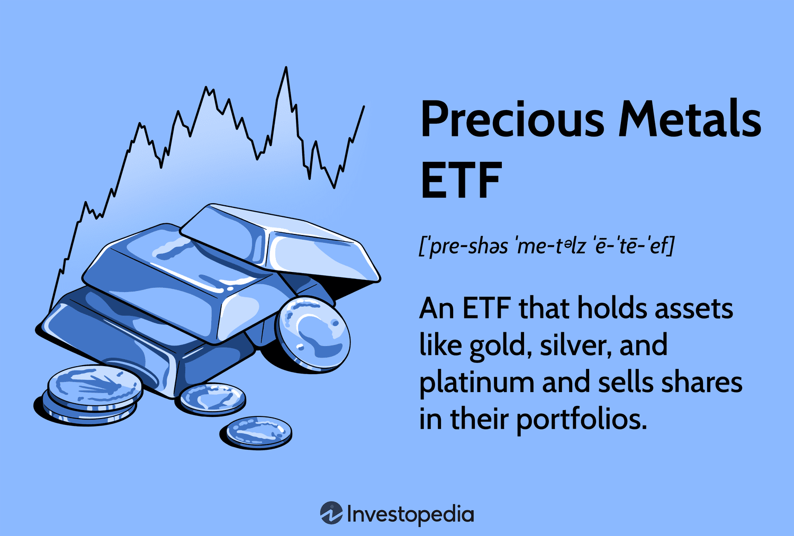

## Table of Contents

## What are Precious Metals ETFs?

Precious Metals ETFs are a type of investment fund that focuses on metals like gold, silver, platinum, and palladium. These ETFs allow investors to buy and sell shares that represent a portion of the metal held by the fund, without needing to own the physical metal themselves. This makes it easier for people to invest in precious metals because they don't have to worry about storing or insuring the metal.

There are different types of Precious Metals ETFs. Some ETFs directly hold the physical metal in secure vaults, while others might invest in companies that mine these metals or in futures contracts related to the metals. This variety allows investors to choose the type of exposure they want to the precious metals market. For example, if someone believes the price of gold will go up, they can invest in a gold ETF to potentially profit from that increase.

## How do Precious Metals ETFs work?

Precious Metals ETFs work by pooling money from many investors to buy precious metals like gold, silver, platinum, or palladium. When you buy shares of a Precious Metals ETF, you're not buying the actual metal, but you're buying a share in the fund that owns the metal. The price of the ETF share goes up and down based on the price of the metal it holds. For example, if the price of gold goes up, the price of a gold ETF will usually go up too.

Some Precious Metals ETFs hold the actual metal in secure vaults. They have to show that they really own the metal by doing regular checks. Other ETFs might not hold the metal itself but instead invest in companies that mine the metal or in contracts that promise to buy or sell the metal in the future. This gives investors different ways to invest in precious metals, depending on what they think will happen to the metal prices or the companies that work with these metals.

## What types of precious metals are typically included in these ETFs?

Precious Metals ETFs usually include gold, silver, platinum, and palladium. These are the most common metals you'll find in these funds. Gold is the most popular because a lot of people see it as a safe place to put their money when things are uncertain. Silver is also popular, but it's often used more in industry than gold. Platinum and palladium are less common but still important, especially in things like car parts and jewelry.

Some ETFs focus on just one type of metal, like a gold ETF or a silver ETF. Others might include a mix of different metals. This gives investors choices depending on what they want to invest in. For example, if you think the price of silver will go up, you might choose a silver ETF. If you want to spread your investment across different metals, you might pick an ETF that includes gold, silver, and platinum.

## What are the benefits of investing in Precious Metals ETFs?

Investing in Precious Metals ETFs has many good points. One big benefit is that it's easy to buy and sell them. You don't need to worry about storing or insuring the actual metal, which can be a hassle and expensive. Also, Precious Metals ETFs let you spread your money across different metals or even different types of investments related to those metals. This can help lower your risk because if one metal goes down in price, another might go up.

Another advantage is that Precious Metals ETFs can help protect your money during tough economic times. Many people see gold and other precious metals as safe places to put their money when things are uncertain. If the stock market goes down, the price of precious metals might go up, which can help balance out your losses. Plus, these ETFs are clear about what they own, so you can trust that your investment is backed by real metal.

## What are the risks associated with Precious Metals ETFs?

Investing in Precious Metals ETFs comes with some risks. One risk is that the price of the metals can go up and down a lot. This means if you need to sell your ETF shares when the price of the metal is low, you could lose money. Also, some ETFs invest in futures contracts or mining companies instead of holding the actual metal. This can be riskier because these investments can be affected by things other than the price of the metal, like company problems or changes in the futures market.

Another risk is that ETFs have fees. These fees can eat into your profits over time, especially if the price of the metal doesn't go up much. It's important to look at the fees before you invest. Also, some ETFs might not always be able to buy or sell the metal at the best price, which can affect how much you make or lose. So, while Precious Metals ETFs can be a good way to invest, it's important to understand these risks before you put your money in.

## How do Precious Metals ETFs differ from investing in physical precious metals?

Precious Metals ETFs and investing in physical precious metals are different in a few ways. When you invest in an ETF, you're buying shares in a fund that holds the metal, not the metal itself. This means you don't have to worry about storing or insuring the metal, which can be a big hassle and cost a lot of money. ETFs are also easy to buy and sell, just like stocks, so you can quickly change your investment if you need to. On the other hand, if you buy physical metal, you have to find a safe place to keep it and make sure it's insured, which can be a lot of work.

Another difference is how you can use these investments. With ETFs, you can spread your money across different metals or even invest in companies that mine the metals or futures contracts. This can help lower your risk because if one metal goes down in price, another might go up. But if you buy physical metal, you're usually sticking with one type of metal, like gold or silver. Also, ETFs have fees that can eat into your profits, while physical metal doesn't have these fees, but you might have to pay for storage and insurance instead.

## What are the costs involved in investing in Precious Metals ETFs?

When you invest in Precious Metals ETFs, you need to think about the costs. One main cost is the expense ratio, which is a yearly fee that the ETF charges to cover its operating costs. This fee is a percentage of your investment, so if the expense ratio is 0.5%, you'll pay $5 every year for every $1,000 you have in the ETF. Some ETFs might have higher expense ratios than others, so it's good to check this before you invest.

Another cost to think about is the bid-ask spread. This is the difference between the price you pay to buy the ETF and the price you get when you sell it. The bid-ask spread can be small or big, and it can affect how much money you make or lose. If you're buying and selling a lot, these costs can add up. Also, if you use a broker to buy and sell the ETF, they might charge you a commission, which is another cost to consider.

## How can one start investing in Precious Metals ETFs?

To start investing in Precious Metals ETFs, you first need to open a brokerage account if you don't already have one. You can do this online with many different brokers. Once your account is set up, you can search for the Precious Metals ETF you want to invest in. There are many ETFs to choose from, so you might want to look at ones that focus on gold, silver, platinum, or a mix of metals. Make sure to check the expense ratio and other costs before you decide.

After you've picked an ETF, you can buy shares of it through your brokerage account. Just enter the number of shares you want to buy and place the order. The price of the ETF will change based on the price of the metal it holds, so keep an eye on that. If you ever want to sell your shares, you can do that through your brokerage account too. Remember, investing in ETFs can be a good way to get into precious metals without having to store the metal yourself.

## What are some popular Precious Metals ETFs available in the market?

Some popular Precious Metals ETFs include the SPDR Gold Shares (GLD), which is one of the biggest and most well-known gold ETFs. It holds physical gold in vaults and aims to match the price of gold. Another popular one is the iShares Silver Trust (SLV), which works the same way but with silver. These ETFs are easy to buy and sell, and they're a good way to invest in gold and silver without having to store the metal yourself.

There are also ETFs that focus on other precious metals. The Aberdeen Standard Physical Platinum Shares ETF (PPLT) and the Aberdeen Standard Physical Palladium Shares ETF (PALL) are popular choices for investors interested in platinum and palladium. These ETFs hold the actual metal in secure vaults, just like GLD and SLV. For people who want to invest in a mix of metals, the iShares MSCI Global Gold Miners ETF (RING) invests in companies that mine gold and other precious metals, which can be a different way to get exposure to the precious metals market.

## How do Precious Metals ETFs perform compared to other investment options?

Precious Metals ETFs can be a good choice for investors who want to add something different to their investments. These ETFs often do well when the economy is not doing great, because people see gold and other precious metals as safe places to put their money. This means that if the stock market goes down, the price of precious metals might go up, which can help balance out your losses. But, they don't always do better than other investments like stocks or bonds. It depends a lot on what's happening in the world and the economy.

Over the long term, Precious Metals ETFs might not grow as much as stocks. Stocks can go up a lot over many years, while the price of gold and other metals can stay the same or even go down. But, Precious Metals ETFs can help protect your money during tough times, which is something stocks and bonds might not do as well. So, it's good to think about what you want from your investments and how much risk you're okay with when deciding if Precious Metals ETFs are right for you.

## What factors should be considered when choosing a Precious Metals ETF?

When choosing a Precious Metals ETF, you should first think about what kind of metal you want to invest in. Some ETFs focus on just one metal, like gold or silver, while others might include a mix of different metals like platinum and palladium. If you think the price of one metal will go up more than others, you might want to pick an ETF that focuses on that metal. Also, consider if you want an ETF that holds the actual metal in vaults or one that invests in mining companies or futures contracts. Each type has different risks and rewards, so it's important to pick one that fits your investment goals.

Another thing to think about is the costs. ETFs have an expense ratio, which is a yearly fee that can eat into your profits. Some ETFs have higher fees than others, so it's good to compare them before you decide. Also, look at the bid-ask spread, which is the difference between the price you pay to buy the ETF and the price you get when you sell it. A smaller spread can save you money, especially if you're buying and selling a lot. By considering these factors, you can choose a Precious Metals ETF that's right for you.

## How do macroeconomic factors influence the performance of Precious Metals ETFs?

Macroeconomic factors can have a big impact on how Precious Metals ETFs do. When the economy is not doing well, like during a recession, people often see gold and other precious metals as safe places to put their money. This can make the price of these metals go up, which is good for Precious Metals ETFs. Also, when inflation is high, the value of money goes down, but the value of gold and other metals might stay the same or go up. This can make Precious Metals ETFs a good way to protect your money from losing value.

On the other hand, when the economy is doing well, people might put their money into things like stocks instead of precious metals. This can make the price of metals go down, which is not good for Precious Metals ETFs. Interest rates can also affect these ETFs. When interest rates go up, it can make other investments more attractive than precious metals, which can lower the price of metals. So, it's important to keep an eye on what's happening in the economy when you're thinking about investing in Precious Metals ETFs.

## References & Further Reading

[1]: Bergstra, J., Bardenet, R., Bengio, Y., & Kégl, B. (2011). ["Algorithms for Hyper-Parameter Optimization."](https://papers.nips.cc/paper/4443-algorithms-for-hyper-parameter-optimization) Advances in Neural Information Processing Systems 24.

[2]: ["Advances in Financial Machine Learning"](https://www.amazon.com/Advances-Financial-Machine-Learning-Marcos/dp/1119482089) by Marcos Lopez de Prado

[3]: ["Evidence-Based Technical Analysis: Applying the Scientific Method and Statistical Inference to Trading Signals"](https://www.amazon.com/Evidence-Based-Technical-Analysis-Scientific-Statistical/dp/0470008741) by David Aronson

[4]: ["Machine Learning for Algorithmic Trading"](https://github.com/stefan-jansen/machine-learning-for-trading) by Stefan Jansen

[5]: ["Quantitative Trading: How to Build Your Own Algorithmic Trading Business"](https://www.amazon.com/Quantitative-Trading-Build-Algorithmic-Business/dp/1119800064) by Ernest P. Chan