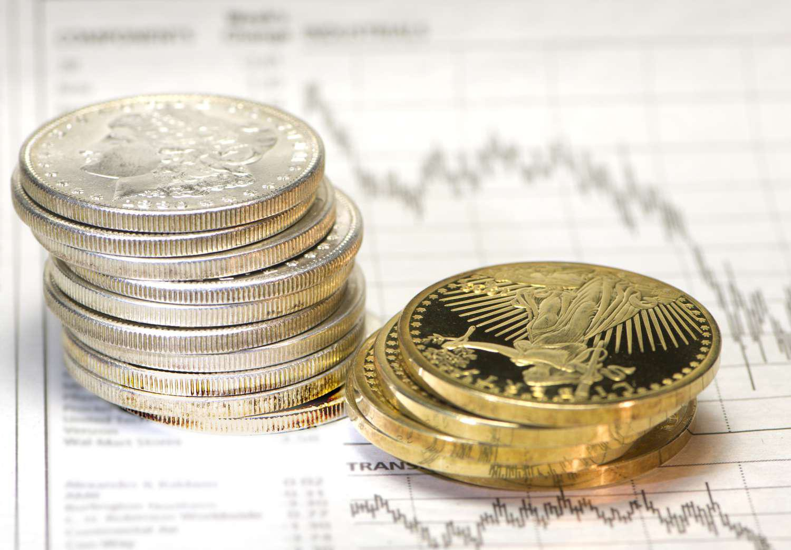

## Table of Contents

## What are precious metals and why are they considered valuable?

Precious metals are special kinds of metals that people have valued for a long time. The most common ones are gold, silver, platinum, and palladium. These metals are rare, which means they are hard to find and mine from the earth. Because they are rare, not everyone can have them, which makes them special and valuable.

People consider precious metals valuable for many reasons. One big reason is that they look beautiful and shiny, so they are often used to make jewelry and other pretty things. Another reason is that they can be used in important technology, like in computers and cars. Also, many people believe that precious metals are a good way to keep their money safe because their value usually stays strong even when other things, like paper money, might lose value.

## What are the most common types of precious metals used for investment?

The most common types of precious metals used for investment are gold and silver. Gold is very popular because it has been seen as a safe place to keep money for a long time. People buy gold coins, bars, or even gold-backed exchange-traded funds (ETFs). Gold is easy to buy and sell, and many people trust it to keep its value over time. Silver is also popular, but it is usually less expensive than gold. People invest in silver through coins, bars, or ETFs too. Silver can be a good choice because it is more affordable, but it can also be more unpredictable in price.

Another precious metal used for investment is platinum. Platinum is rarer than gold and silver, which can make it more valuable. People invest in platinum through bars, coins, or ETFs. Platinum is often used in industries like car manufacturing, so its price can be affected by what is happening in those industries. Palladium is another metal that some people invest in. It is also used in car manufacturing, especially in catalytic converters. Palladium can be very valuable because it is rare, but its price can go up and down a lot because of changes in the car industry.

Overall, gold, silver, platinum, and palladium are the main precious metals people use for investment. Each one has its own reasons for being valuable, and people choose them based on what they think will happen to their prices in the future.

## How can beginners start investing in precious metals?

If you're new to investing in precious metals, a good way to start is by buying gold or silver. These are the most common and easiest to understand. You can buy gold and silver in the form of coins or bars. Coins are often easier to buy and sell because they come in smaller sizes and are more common. You can find them at banks, coin shops, or online. Bars are bigger and might be better if you want to invest a lot of money at once. Make sure to buy from trusted sellers so you don't get tricked with fake metals.

Another way to invest in precious metals is through exchange-traded funds (ETFs). ETFs are like buying a little piece of a big pile of gold or silver without having to store it yourself. You can buy and sell ETFs through a regular investment account, just like you would with stocks. This can be easier and less risky than buying physical metal. If you want to try platinum or palladium, you can also find ETFs for these metals. Just remember to do your research and maybe talk to a financial advisor to make sure you understand what you're doing.

Starting small is a good idea. You don't need to spend a lot of money right away. Try buying a few coins or a small amount of an [ETF](/wiki/etf-trading-strategies) to see how it goes. Over time, as you learn more, you can decide if you want to invest more. The key is to take your time and learn as you go. Precious metals can be a good way to keep your money safe, but like any investment, they come with risks.

## What are the benefits of investing in precious metals?

Investing in precious metals like gold, silver, platinum, and palladium can help protect your money. These metals are rare and hard to find, so they usually keep their value even when other things like stocks or paper money go down. This makes them a good choice if you want to keep your money safe during tough times. For example, if the economy is not doing well, people often buy more gold because they trust it to stay valuable.

Another benefit is that precious metals are easy to buy and sell. You can get them in the form of coins, bars, or even through ETFs, which are like buying a small piece of a big pile of metal without having to store it yourself. This makes it simple to turn your investment into cash if you need to. Plus, precious metals can be a good way to spread out your investments. Instead of putting all your money in one place, like stocks, you can put some in metals to balance things out and maybe lower your risk.

## What are the risks associated with investing in precious metals?

Investing in precious metals can be risky because their prices can go up and down a lot. Sometimes, the price of gold or silver might change a lot in just a short time. This can be hard if you need to sell your metals quickly and the price is low. Also, if you buy physical metals like coins or bars, you have to think about how to keep them safe. If you don't store them properly, they could get stolen or damaged, which means you could lose your investment.

Another risk is that precious metals might not give you any extra money while you own them. Unlike stocks or bonds, which can pay you dividends or interest, metals just sit there. You have to hope their price goes up to make money. Also, if you buy ETFs, you might have to pay fees, which can eat into your profits. So, while precious metals can be a good way to keep your money safe, they come with their own set of problems that you need to think about before you invest.

## How do economic conditions affect the price of precious metals?

Economic conditions can really change the price of precious metals like gold, silver, platinum, and palladium. When the economy is not doing well, people often get scared and want to keep their money safe. They might think that precious metals are a good place to put their money because these metals usually keep their value even when other things like stocks or paper money go down. So, when the economy is bad, more people buy precious metals, and this can make their prices go up.

On the other hand, when the economy is doing well, people might feel more confident and want to invest in things like stocks or real estate instead of precious metals. This can make fewer people want to buy gold or silver, and their prices might go down. Also, things like inflation, interest rates, and what's happening in other countries can affect the price of precious metals. For example, if the value of the dollar goes down because of inflation, gold might become more valuable because it's seen as a safe place to keep money.

## What are the different ways to invest in precious metals (e.g., physical, ETFs, stocks)?

There are several ways to invest in precious metals, and one common way is to buy them in their physical form. This means buying gold, silver, platinum, or palladium as coins or bars. You can find these at banks, coin shops, or online. Physical metals are good because you can hold them in your hand, but you need to think about how to keep them safe. If you don't store them properly, they could get stolen or damaged.

Another way to invest is through exchange-traded funds (ETFs). ETFs are like buying a small piece of a big pile of metal without having to store it yourself. You can buy and sell ETFs through a regular investment account, just like you would with stocks. This can be easier and less risky than buying physical metal because you don't have to worry about storing it. ETFs can also be a good way to invest in platinum or palladium if you don't want to buy the physical metal.

A third way to invest in precious metals is through stocks. This means buying shares in companies that mine or work with precious metals. These companies can be affected by the price of the metals they deal with, so if the price of gold goes up, the stock price of a gold mining company might go up too. Investing in stocks can be riskier than buying physical metal or ETFs, but it can also be a way to make more money if the company does well.

## How should one diversify a portfolio with precious metals?

Adding precious metals to your investment mix can help spread out your risk. Instead of putting all your money in one place, like stocks or real estate, you can put some in gold, silver, platinum, or palladium. This way, if one part of your investments goes down, the precious metals might stay strong and help balance things out. A good rule is to keep about 5% to 10% of your money in precious metals. This amount is enough to help protect your money but not so much that it takes over your whole investment plan.

You can choose to invest in precious metals in different ways to fit your needs. If you like the idea of holding something real, you can buy physical gold or silver coins or bars. This gives you something you can touch and feel, but you need to think about how to keep it safe. If you want something easier, you can buy ETFs, which are like buying a small piece of a big pile of metal without having to store it yourself. You can also invest in stocks of companies that mine or work with precious metals. This can be riskier but might give you a chance to make more money if the company does well. By mixing these different ways of investing in precious metals, you can make your investment plan stronger and more balanced.

## What are some advanced strategies for trading precious metals?

One advanced strategy for trading precious metals is using futures contracts. Futures contracts let you agree to buy or sell a certain amount of metal at a set price on a future date. This can be good if you think the price of the metal will go up or down a lot. You can make money if you guess right, but it's risky because you could lose money if the price goes the other way. Another strategy is called options trading. Options give you the right, but not the obligation, to buy or sell metal at a certain price before a certain time. This can be less risky than futures because you don't have to go through with the deal if it's not good for you, but it can still be complicated and needs a lot of learning.

Another strategy is to use technical analysis. This means looking at charts and patterns to try to guess where the price of the metal will go next. Traders who use technical analysis look for things like support and resistance levels, moving averages, and other signs that can help them decide when to buy or sell. It's not perfect, but it can help you make better guesses. You can also use [fundamental analysis](/wiki/fundamental-analysis), which means looking at things like the economy, inflation, and what's happening in the world to decide if the price of the metal will go up or down. By mixing these strategies, you can make smarter trades and maybe make more money, but remember, trading precious metals is always risky and you need to be careful.

## How can investors use precious metals to hedge against inflation?

Investors can use precious metals like gold and silver to protect their money from inflation. Inflation means that the value of money goes down over time, so things cost more. Precious metals are good for this because they usually keep their value even when inflation is high. When the price of everything else goes up, people often buy more gold and silver because they trust these metals to stay valuable. By putting some of their money into precious metals, investors can make sure that part of their savings stays strong even if the value of the dollar goes down.

One way to use precious metals to hedge against inflation is by buying physical gold or silver coins or bars. This gives you something real that you can hold onto, and it's easy to sell if you need to. Another way is to invest in gold or silver ETFs, which are like buying a small piece of a big pile of metal without having to store it yourself. Both ways can help protect your money from inflation, but you need to think about how much to invest. A good rule is to keep about 5% to 10% of your money in precious metals. This amount is enough to help protect your money but not so much that it takes over your whole investment plan.

## What are the tax implications of investing in precious metals?

When you invest in precious metals like gold, silver, platinum, or palladium, you need to think about taxes. If you buy and sell physical metals, like coins or bars, you might have to pay capital gains tax. This means if you sell your metals for more money than you paid for them, you have to pay tax on the extra money you made. The tax rate can be different depending on how long you held onto the metals. If you held them for less than a year, it's called a short-term capital gain, and you pay a higher tax rate. If you held them for more than a year, it's a long-term capital gain, and the tax rate is usually lower.

If you invest in precious metals through ETFs or stocks, the tax rules can be a bit different. With ETFs, you might have to pay capital gains tax when you sell them, just like with physical metals. But if the ETF pays out dividends, you might also have to pay tax on those. With stocks of companies that mine or work with precious metals, you pay capital gains tax when you sell the stocks, and you might also have to pay tax on any dividends the company pays out. It's a good idea to talk to a tax advisor to make sure you understand all the tax rules and how they affect your investments in precious metals.

## How do global political events influence the precious metals market?

Global political events can really shake up the precious metals market. When there's a lot of uncertainty or trouble in the world, like wars or big changes in government, people often get scared about their money. They might think that things like stocks or paper money could lose value, so they turn to precious metals like gold and silver. These metals are seen as safe places to keep money because they usually keep their value even when other things go down. So, when there's political trouble, more people buy precious metals, and this can make their prices go up.

For example, if there's a war or a big political change in a country that produces a lot of gold or silver, it can affect how much of these metals are available. If it's harder to get the metals because of the political situation, the price might go up because there's less to go around. Also, if countries put new rules or taxes on mining or trading precious metals, it can change how much people want to buy or sell them. All these things can make the prices of precious metals move around a lot, so it's important for investors to keep an eye on what's happening in the world.

## References & Further Reading

[1]: Dempster, M. A. H., & Leemans, V. (2006). "An automated FX trading system using adaptive reinforcement learning." Expert Systems with Applications, 30(3), 543-552. [Link](https://www.sciencedirect.com/science/article/pii/S0957417405003015)

[2]: Baur, D. G., & Lucey, B. M. (2010). "Is gold a hedge or a safe haven? An analysis of stocks, bonds and gold." Financial Review, 45(2), 217-229. [Link](https://onlinelibrary.wiley.com/doi/10.1111/j.1540-6288.2010.00244.x)

[3]: Ciner, C., Gurdgiev, C., & Lucey, B. M. (2013). "Hedges and safe havens: An examination of stocks, bonds, gold, oil and exchange rates." International Review of Financial Analysis, 29, 202-211. [Link](https://www.sciencedirect.com/science/article/pii/S1057521912001226)

[4]: Varadi, D., Kappler, M., Lee, C., & Chan, E. (2019). ["Quantitative Momentum: A Practitioner's Guide to Building a Momentum-Based Stock Selection System."](https://pubmed.ncbi.nlm.nih.gov/31141585/).

[5]: Hull, J. (2019). ["Options, Futures, and Other Derivatives"](https://www.semanticscholar.org/paper/Options%2C-Futures%2C-and-Other-Derivatives-Hull/89bdee500c8623864fc9eb7a471546aa713acc44). Pearson.