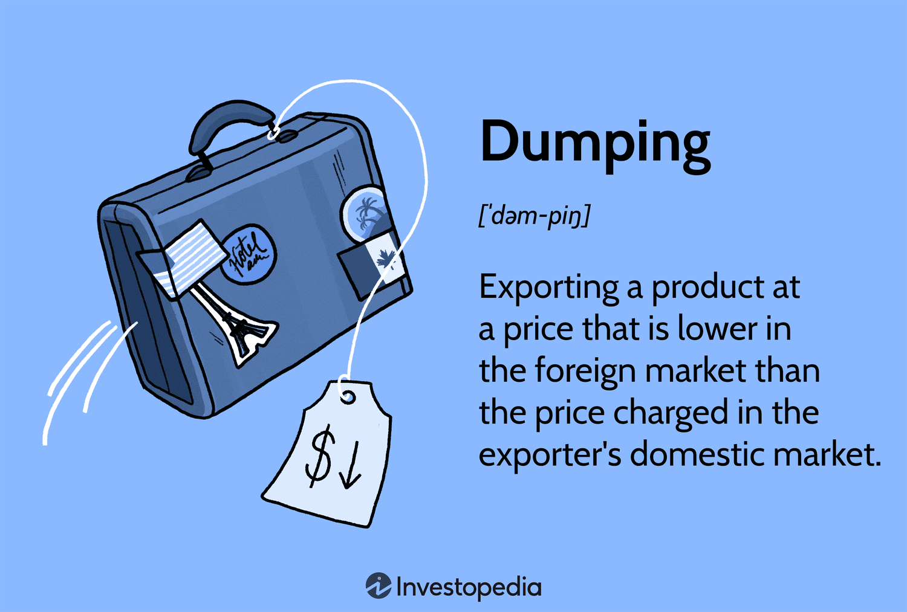

In the globalized economy, trade practices such as international trade, predatory dumping, and algorithmic trading are integral to the operation and development of markets. International trade has historically facilitated the exchange of goods and services across borders, substantially contributing to economic growth and the establishment of global relationships. Such trade is instrumental in determining market access and influences tariffs alongside the flow of capital and goods. These interactions are mediated by national policies and international agreements, setting the stage for complex economic activities.

Predatory dumping emerges as a controversial strategy where companies sell products in a foreign market at prices significantly lower than their typical market value. The intent behind this practice is to outmaneuver and potentially eliminate competition, thus paving the way to monopolize the market. The repercussions of predatory dumping can be significant, as they often disrupt domestic markets, strain local industries, and potentially lead to economic instability.

Algorithmic trading, which involves using complex algorithms to automate trading activities, is increasingly influential in modern trade. It enhances efficiency and liquidity in markets, aiding price discovery and reducing transaction costs. However, it can also introduce risks, including increased market volatility.

This article addresses the intersection of these pivotal elements in contemporary trade, paying particular attention to the economic ramifications of predatory dumping and the transformative impact of algorithmic trading on market dynamics. The interplay of these factors underscores the critical need for balanced trade policies that foster fair competition and the strategic incorporation of technological innovations to ensure economic stability and prosperity on a global scale.

## Table of Contents

## Understanding International Trade

International trade is a cornerstone of the global economy, involving the exchange of goods, services, and capital across international borders. It contributes significantly to economic growth, creating jobs, and enhancing consumer choice by allowing countries to specialize in producing goods where they have a comparative advantage. This specialization leads to more efficient resource allocation and increased productivity.

Key to international trade are elements such as market access, tariffs, and the flow of capital and goods. Market access refers to the ability of a company or country to sell goods and services across borders. It is often governed by trade agreements that define the terms, such as the North American Free Trade Agreement (NAFTA) or the European Union’s single market regulations. Effective market access is crucial for maximizing the benefits of international trade.

Tariffs are taxes imposed on imported goods and have historically been used to protect domestic industries from foreign competition and generate revenue for governments. They can lead to higher prices for consumers and may provoke retaliatory measures from trading partners. The World Trade Organization (WTO) plays a critical role in facilitating negotiations to reduce tariff barriers and settle trade disputes.

The flow of capital and goods is another essential aspect, encompassing both the movement of physical goods across borders and the financial transactions that support these trades. Capital flows include foreign direct investment (FDI) and portfolio investment, which are influenced by national policies and international agreements. These flows are vital for funding new investments, fostering innovation, and sustainably facilitating economic growth.

Overall, international trade is shaped by a complex interplay of policies, regulations, and agreements at both national and international levels. This dynamic environment requires ongoing negotiation and collaboration to ensure that trade remains a positive force for global economic development.

## Predatory Dumping: Definition and Types

Predatory dumping is characterized by a company's strategic action of selling its goods in a foreign market at prices significantly below their market value. The core objective of this practice is to undermine local competitors, thereby securing a monopolistic stance in that market. By offering artificially low prices, the dumping company seeks to drive out competitors, create entry barriers for new firms, and eventually assert dominance, potentially enabling it to raise prices once competition has been weakened or eliminated.

There are several forms of dumping, distinctly categorized based on their methodology and impact. 

1. **Persistent Dumping**: This form is a continuous effort where a company persistently sells at lower prices in the export market compared to its domestic market. The strategy is aimed at gaining a stronghold in the foreign market over a long period. This form may not always involve selling below cost, but the sustained lower pricing undermines local companies that cannot compete on price over the long term.

2. **Sporadic Dumping**: Occurring less frequently, sporadic dumping is characterized by occasional drops in prices to offload excess inventory in foreign markets. Companies engage in this practice to manage temporary surplus production without disrupting the price structure in their domestic market. While not intentionally malicious, it can still harm the domestic industries of the importing country if such practices become common.

3. **Predatory Dumping**: The most aggressive form, predatory dumping involves pricing goods so low that it constitutes a form of price warfare. Here, the prices might even drop below cost, ensuring that local competitors are squeezed out of the market due to unsustainable competition. The eventual aim is to monopolize the market, allowing the predatory company to recoup losses through price increases once dominance is achieved.

The strategies employed in predatory dumping can lead to significant market distortions, creating monopolistic markets that challenge both local businesses and regulatory frameworks. By evaluating these types, policymakers can better develop tools and strategies to mitigate adverse impacts and promote fair trading practices.

## Impact of Predatory Dumping on Domestic Markets

Predatory dumping, the practice of selling goods in foreign markets at prices lower than native market values, can have profound negative effects on domestic industries. This practice can lead to significant job losses and a diminished competitive stance for local businesses, primarily because domestic companies are unable to match the dumped prices driven by subsidies or strategic pricing by foreign entities.

The introduction of products at artificially low prices disrupts the natural pricing mechanisms of host markets. Local industries, which incur higher production costs, find it challenging to sustain operations, leading to market distortions. As a consequence, many domestic industries may shut down, resulting in job losses and reduced industrial output. Furthermore, this can induce a dependency on imported goods, undermining the foundational structure of domestic economies.

Predatory dumping can create a scenario where local markets see an initial reduction in consumer prices, but this benefit is often short-lived. Once predatory companies gain substantial market control and any local competition is driven out, prices may increase, negating earlier benefits. This cycle not only threatens current economic stability but also endangers future innovation and capacity development within industries due to lack of competition.

Market distortions caused by predatory dumping can lead to potential long-term economic instability. The erosion of local industries can have a cascading effect, impacting ancillary industries and leading to a broader economic malaise. This environment may deter investment and reduce public and private sector revenues, which are critical for economic growth and development.

Policymakers often face challenges in discerning between legitimate competitive pricing and predatory practices, which complicates efforts to impose protective measures. However, the negative impact on domestic labor markets and economic stability highlights the necessity for robust regulatory mechanisms that distinguish and address these predatory strategies effectively. This can involve introducing anti-dumping duties and other trade remedies to maintain a level playing field for domestic industries.

## Role of Governments in Combating Dumping

Governments play a vital role in addressing the challenges posed by dumping, particularly predatory dumping, which can severely impact domestic industries. To combat these issues, governments utilize various tools and strategies to safeguard their economies and ensure fair competition.

One of the primary mechanisms employed by governments is the imposition of anti-dumping duties. These are tariffs levied on foreign imports that are priced below fair market value, aimed at bringing the price of imported goods closer to the domestic market price. The goal is to level the playing field for domestic producers and prevent foreign companies from establishing monopolies through unfair pricing strategies. According to the World Trade Organization (WTO) guidelines, anti-dumping duties are calculated based on the margin of dumping, which is the difference between the export price and the normal value of the product in the domestic market of the exporting country.

In addition to anti-dumping duties, governments also use trade remedies, which include countervailing duties and safeguard measures. Countervailing duties are imposed to counteract subsidies provided by foreign governments to their exporters, which can distort market prices. Safeguard measures, on the other hand, are temporary restrictions on imports aimed at preventing or remedying serious injury to domestic industries caused by a sudden surge in imports.

Diplomatic negotiations play a crucial role in resolving dumping disputes. Through bilateral and multilateral engagements, countries work towards reaching agreements that address trade imbalances and promote fair trading practices. These negotiations often involve discussions on tariffs, subsidies, and other trade barriers, with the aim of creating mutually beneficial outcomes for the parties involved.

International organizations, particularly the World Trade Organization, provide a framework for resolving trade disputes, including those related to dumping. The WTO's Dispute Settlement Body offers a structured process for handling trade disagreements, which includes consultations, panels, and appellate reviews. This system ensures that disputes are resolved in a manner that is consistent with international trade rules and helps maintain stability in global markets.

The effectiveness of governmental measures in combating dumping depends on a variety of factors, including the robustness of domestic legal frameworks, the capacity to conduct thorough investigations, and the ability to enforce duties and remedies. Coordinated efforts at both national and international levels are essential to ensure that trade practices remain fair and competitive, safeguarding the interests of domestic industries and promoting global economic stability.

## Algorithmic Trading in International Markets

Algorithmic trading, a transformative force in international markets, employs sophisticated algorithms to automate trading activities, resulting in enhanced efficiency and [liquidity](/wiki/liquidity-risk-premium). By using mathematical models and statistical analyses, traders can execute orders at speeds and frequencies unattainable by human traders, facilitating the rapid movement of capital across global markets. These algorithms assess and respond to market conditions in real time, making informed decisions on buying or selling securities.

One primary benefit of [algorithmic trading](/wiki/algorithmic-trading) is its ability to enhance price discovery. By analyzing large volumes of data instantaneously, algorithms can identify and act upon subtle price movements and discrepancies, thus contributing to a more accurate reflection of supply and demand dynamics in asset prices. This improved price discovery is crucial for international trade, where currency and commodity prices have significant ripple effects across global economies.

Furthermore, algorithmic trading greatly reduces transaction costs. Automated systems minimize the need for human intervention, leading to lower fees and commissions. They optimize trade execution by splitting large orders into smaller, more manageable transactions, thereby reducing market impact and obtaining more favorable pricing.

However, algorithmic trading is not without its risks. It can introduce market [volatility](/wiki/volatility-trading-strategies), particularly through high-frequency trading ([HFT](/wiki/high-frequency-trading-strategies)). HFT strategies often involve executing a large number of orders at extremely fast speeds, which can exacerbate price fluctuations, especially in less liquid markets. Events such as the "Flash Crash" of 2010 highlight how algorithmic missteps can lead to dramatic and rapid market movements, underscoring the need for stringent regulatory measures.

To balance the benefits and risks, effective regulation and oversight are critical. Regulatory frameworks must evolve to address the complexities and speed of algorithmic trading, ensuring market integrity and transparency. Additionally, the development of robust risk management systems within trading firms can mitigate potential downsides, protecting both the firms and the broader financial ecosystem.

In summary, while algorithmic trading brings significant efficiencies and cost reductions to international markets, it also necessitates careful consideration of its potential to increase volatility. The future of algorithmic trading will likely involve a continued refinement of strategies and technologies to harness its advantages responsibly, promoting stable and efficient international trade systems.

## Case Studies: Impact of Algorithmic Trading and Predatory Dumping

Examining real-world scenarios offers valuable insights into the profound impacts of predatory dumping and algorithmic trading on international market dynamics. Predatory dumping, characterized by the sale of goods in foreign markets at prices below production cost to undermine local industries, has historically disrupted domestic economies and created significant challenges. Similarly, algorithmic trading, which uses computational algorithms to make high-speed trading decisions, has reshaped how markets operate, affecting liquidity, volatility, and the overall efficiency of trade.

### Case Study 1: Predatory Dumping in the Steel Industry

A prominent example of predatory dumping can be observed in the global steel industry. In the early 2000s, several countries accused China of exporting steel at unfairly low prices, undercutting domestic producers in various markets, including the United States and the European Union. This practice led to significant disruptions in the local steel industries, causing job losses and factory closures. For instance, U.S. steel producers faced severe price competition, leading to calls for government intervention through anti-dumping measures.

Governments responded by imposing anti-dumping duties on Chinese steel imports to protect their domestic industries. These duties are calculated based on the difference between the market value and the dumped price, addressing the price distortion caused by dumping. Such measures highlight the necessity of regulatory frameworks and international cooperation in maintaining fair trade practices.

### Case Study 2: Algorithmic Trading during the 2010 Flash Crash

The 2010 Flash Crash provides a critical case study of algorithmic trading's potential risks. On May 6, 2010, U.S. financial markets experienced an unprecedented and rapid decline in a matter of minutes, with the Dow Jones Industrial Average plummeting nearly 1,000 points before recovering just as quickly. Investigations revealed that algorithmic trading played a substantial role in this volatility. The rapid execution of trades by algorithms, especially those responding to price movements without human intervention, contributed to the crash's severity and speed.

This event underscored the importance of regulatory oversight in algorithmic trading. It prompted the implementation of circuit breakers and other regulatory measures designed to temporarily halt trading during extreme volatility, providing markets time to stabilize. Such policy measures demonstrate the necessity of balancing technological advancements in trading with safeguards to preserve market integrity.

### Insights and Implications

These case studies emphasize the critical role of effective policy measures and regulatory oversight in both addressing predatory dumping and managing the complexities introduced by algorithmic trading. While predatory dumping requires vigilant monitoring and responsive trade policies to protect domestic industries, algorithmic trading mandates continuous evaluation of technological impacts on market stability.

The broader implications of these issues necessitate international dialogue and cooperation to develop coherent strategies that ensure fair competition and stability. As markets continue to evolve with technological advancements, the interplay between regulatory frameworks and market dynamics will remain a pivotal area for policymakers and industry participants.

## Future of Trade Practices

The evolution of trade practices is profoundly influenced by technological advancements and shifts in the global economy. As international markets become increasingly complex and intertwined, there is a pressing need for enhanced transparency, improved regulatory frameworks, and sustainable trade practices.

Technological advancements have enabled more efficient and faster trade processes, largely through the automation and digitization of transactions. Innovations such as blockchain technology offer secure, transparent, and immutable records of transactions, which help reduce fraud and enhance trust among trading partners. For instance, blockchain can streamline supply chains by providing real-time tracking of goods, reducing delays, and minimizing costs.

Algorithmic trading has also emerged as a significant force in modern trade, providing greater liquidity and facilitating rapid transactions. However, to mitigate the risks of market volatility and ensure stability, there is a need to develop and implement robust regulatory frameworks. These frameworks should aim to harness the benefits of algorithmic trading, while protecting markets from potential disruptive practices like flash crashes.

Moreover, global economic shifts, such as rising protectionism and changing trade balances, necessitate reforms that promote equitable and sustainable trade practices. This includes reassessing tariffs, non-tariff barriers, and preferential trade agreements to ensure fair competition and protect vulnerable economies from exploitation.

The future of trade also calls for fostering sustainable trade practices that consider environmental and social impacts. As stakeholders increasingly prioritize sustainability, there is a move towards adopting practices that reduce carbon footprints, support fair labor conditions, and conserve resources. Companies and governments alike are exploring ways to integrate sustainability into trade policies, aligning with international commitments like the Paris Agreement on climate change.

To effectively navigate the future landscape of trade, international cooperation and collaboration are crucial. Multilateral institutions such as the World Trade Organization (WTO) play a vital role in mediating trade disputes, establishing guidelines, and fostering dialogue among nations to address common challenges. As trade practices continue to evolve, it is essential to strike a balance between leveraging technological advancements and promoting fair, transparent, and sustainable trade systems that contribute to global economic stability and growth.

## Conclusion

In today's increasingly interconnected global economy, crafting balanced trade policies is essential for ensuring both equitable competition and the fruitful integration of technological advancements. Predatory dumping and algorithmic trading are two facets of modern trade that demand careful regulation and oversight to maintain economic stability and foster growth.

Predatory dumping, with its potential to destabilize domestic industries by flooding markets with products at unreasonably low prices, challenges the integrity of fair competition. To address this, countries must enhance collaborative efforts at both bilateral and multilateral levels. The implementation of anti-dumping measures, aligned with international standards such as those outlined by the World Trade Organization (WTO), is crucial in safeguarding domestic industries from predatory pricing tactics. These measures not only provide immediate relief to affected markets but also act as deterrents against unfair trade practices.

Simultaneously, the rise of algorithmic trading presents both opportunities and challenges in the landscape of international markets. The efficiency and liquidity brought about by algorithmic strategies are undeniable, yet they introduce risks such as increased market volatility and systemic disruptions. To harness the benefits while mitigating the downsides, refined regulatory frameworks are necessary. These should aim to ensure transparency in trading activities, establish safeguards against excessive volatility, and promote responsible use of trading technologies.

With ongoing advancements in technology and shifts in global economic dynamics, trade policies must evolve to reflect new realities. A commitment to fostering sustainable trade practices is paramount. By promoting transparency and improving regulatory oversight, governments can strike a balance that leverages technological innovations like algorithmic trading for positive economic outcomes while curbing the detrimental effects of practices like predatory dumping.

In summary, the path towards economic stability and growth in the context of global trade involves a multifaceted approach. This includes formulating policies that promote fair competition, encouraging international cooperation to tackle issues such as dumping, and strategically utilizing algorithmic trading to benefit all stakeholders in the global economy. Such balanced policies are vital for a resilient and sustainable future in international trade.

## References & Further Reading

[1]: Krugman, P. (1991). ["The Move Toward Free Trade Zones."](https://www.kansascityfed.org/documents/3748/1991-S91KRUGM.pdf) Economic Review, 76, 5-25.

[2]: Bhagwati, J., Panagariya, A., & Srinivasan, T. N. (1998). ["Lectures on International Trade."](https://mitpress.mit.edu/9780262522472/lectures-on-international-trade/) MIT Press.

[3]: Irwin, D. A. (1998). ["Against the Tide: An Intellectual History of Free Trade."](https://www.jstor.org/stable/1061223) Princeton University Press.

[4]: Destler, I. M. (2005). ["American Trade Politics."](https://cup.columbia.edu/book/american-trade-politics/9780881323825) Institute for International Economics.

[5]: Gaughan, P. A. (2015). ["Mergers, Acquisitions, and Corporate Restructurings."](https://onlinelibrary.wiley.com/doi/book/10.1002/9781119380771) John Wiley & Sons.

[6]: Johnson, J. P. (2017). ["Algorithmic Trading & DMA: An Introduction to Direct Access Trading Strategies."](https://www.semanticscholar.org/paper/Algorithmic-trading-%26-DMA-%3A-an-introduction-to-Johnson/aa5de1ab883d5e23b6651faa7c1807586d688e4b) 4Myeloma Press.

[7]: Securities and Exchange Commission. (2010). ["Findings Regarding the Market Events of May 6, 2010."](https://www.sec.gov/about/reports-publications/newsstudies2010marketevents-reportpdf)