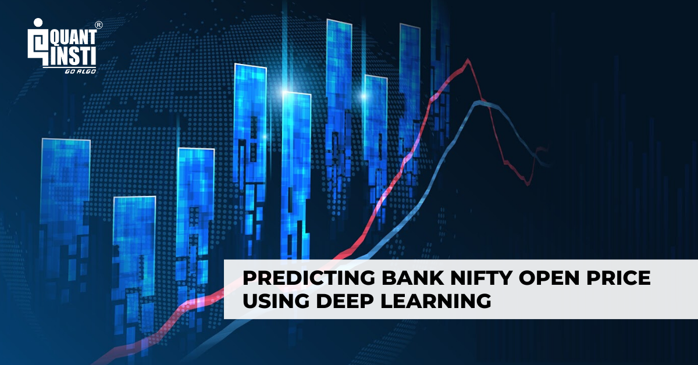

Understanding and predicting the movement of the Bank Nifty index is crucial for traders, especially those involved in options and futures trading. As a prominent index representing the performance of leading banking stocks on the National Stock Exchange (NSE) of India, Bank Nifty provides insights into the financial health and sentiment of the banking sector. This makes it an attractive candidate for traders aiming for strategic gains through astute market analysis.

Several intricacies come into play when trading financial indices such as Bank Nifty. These indices are subject to a multitude of influencing factors including economic indicators, market sentiment, and individual stock performances. As a result, traders require advanced tools and theories to analyze and predict movements accurately. This complexity warrants a systematic approach to decode and anticipate market trends.



Algorithmic trading has emerged as a powerful tool in predicting index movements, leveraging the prowess of technology to process and analyze large volumes of data efficiently. Techniques like machine learning and deep learning enable the creation of predictive models that learn from historical data and identify potential patterns or signals. These methodologies not only enhance predictive accuracy but also allow for the incorporation of real-time data, facilitating prompt decision-making.

This article aims to provide insights into how algorithms can be utilized to predict Bank Nifty movements. By employing strategies such as technical and fundamental analysis, traders can gauge market trends and sentiments. Technical analysis involves the examination of price charts and trading volumes to identify potential entry and exit points, while fundamental analysis focuses on economic indicators, financial health, and other macroeconomic factors influencing the market. In conjunction with these traditional methods, advanced machine learning techniques can offer a more robust framework for prediction, enhancing the trader's ability to make informed decisions in a dynamic market environment.

Through the exploration of these strategies, we seek to equip traders with the knowledge required to navigate the complex landscape of the Bank Nifty index effectively.

## Table of Contents

## Understanding Bank Nifty

Bank Nifty, officially known as the Nifty Bank Index, is a key financial instrument on the National Stock Exchange (NSE) of India. It represents a consortium of the top 12 banking stocks in the Indian stock market. The indices that make up Bank Nifty include some of the most significant financial institutions in India, accounting for a considerable portion of the market's banking sector.[^1]

The Bank Nifty index is a weighted average of these stocks, calculated using a free-float market capitalization method. This means that only the shares freely available to the public and not owned by promoters are considered in the calculation of the index. The weights of the individual bank stocks in the index are proportional to their free-float market capitalization, ensuring that larger banks have a more significant impact on the index movements. Here is the basic principle of the free-float market capitalization index calculation:

$$
\text{Index Value} = \frac{\sum(\text{Free-float market capitalization of each component})}{\text{Index divisor}}
$$

The [liquidity](/wiki/liquidity-risk-premium) and [volatility](/wiki/volatility-trading-strategies) of Bank Nifty make it one of the most traded indices on the NSE. With high volumes in both futures and options trading, Bank Nifty provides a lucrative proposition for traders and investors, offering numerous [arbitrage](/wiki/arbitrage) and hedging opportunities. The index's volatility stems from underlying market dynamics, economic conditions, and the inherent characteristics of the banking sector[^2].

Understanding the behavior and composition of the Bank Nifty is essential for traders and analysts. Each bank's performance within the index can be influenced by various factors, including economic policies, governmental regulations, and individual bank news such as earnings reports or changes in leadership. This creates a multi-layered analysis scenario where both macro and microeconomic indicators play a role.

To predict the movement of the Bank Nifty, one must consider the contribution of individual banks within the index. Banks with larger market caps like HDFC Bank, ICICI Bank, and State Bank of India generally have a more pronounced impact on the index. An analysis of their stock performance, market conditions, and financial health provides insights into potential index movements.

A thorough understanding of Bank Nifty's structure and constituent behavior is crucial for making informed decisions in options and futures trading. It not only aids in predicting possible trend shifts but also in strategizing entry and [exit](/wiki/exit-strategy) points in the market.

[^1]: NSE India, "Nifty Bank Index FAQs"
[^2]: "Volatility and Liquidity of Nifty Indices," Journal of Financial Markets Research

## Technical Analysis for Predicting Bank Nifty

Technical analysis is a cornerstone method for predicting the movements of the Bank Nifty index, offering traders strategies to anticipate future price directions based on historical data. The primary tools of technical analysis involve trend, [momentum](/wiki/momentum), and volatility indicators. Moving averages (MA) are widely employed to smooth out price data and identify direction. There are various forms, including simple moving averages (SMA) and exponential moving averages (EMA), which give more weight to recent prices. The mathematical representation of a simple moving average over $n$ periods is:

$$
\text{SMA} = \frac{P_1 + P_2 + \ldots + P_n}{n}
$$

where $P$ represents the closing prices over $n$ days.

Momentum indicators such as the Relative Strength Index (RSI) provide signals of potential overbought or oversold conditions by measuring the speed and change of price movements. RSI is typically calculated over a 14-day period and is expressed as:

$$
\text{RSI} = 100 - \frac{100}{1 + \frac{\text{average gain}}{\text{average loss}}}
$$

The Moving Average Convergence Divergence (MACD) indicator, a momentum and trend-following tool, is calculated by subtracting the 26-period EMA from the 12-period EMA. A signal line, often the 9-period EMA of the MACD, is plotted on top of the MACD, which can function as a trigger for buy and sell signals.

Volatility can be assessed using Bollinger Bands, which consist of a middle band being an $n$-period SMA, an upper band (SMA plus $k \times \text{standard deviation}$), and a lower band (SMA minus $k \times \text{standard deviation}$). Typically, $n$ is 20 and $k$ is 2.

Analyzing support and resistance levels is pivotal in understanding potential reversals or continuations. Support is a price level where a downtrend can be expected to pause due to a concentration of demand, whereas resistance is a level where an uptrend meets a supply barrier.

Candlestick patterns are integral, providing visual signals about potential market movements. Patterns such as the doji, hammer, and engulfing provide insights. A doji, for example, suggests market indecision and potential reversal when it occurs after a long bullish or bearish trend. A hammer, appearing after a downtrend, indicates a potential reversal upward if the candle has a long lower shadow. In contrast, an engulfing pattern, where a smaller candle is followed by a larger candle of opposite color, suggests a strong potential reversal in market direction.

These tools and techniques collectively furnish traders with insights into potential price movements, enabling them to make more informed trading decisions in the Bank Nifty index. While each tool has its strengths, the integration of multiple indicators provides a more robust analytical framework.

## Fundamental Analysis of Bank Nifty

Fundamental analysis of Bank Nifty necessitates a thorough examination of various economic indicators, financial reports, and monetary policy announcements. Understanding these elements is crucial for determining how they might influence the index's movements.

**Economic Indicators**

Key economic indicators such as Gross Domestic Product (GDP) growth, inflation rates, and interest rates are pivotal in shaping market sentiment. GDP growth reflects the overall economic health, with a growing GDP often correlating with robust banking activities. The Reserve Bank of India's monetary policy decisions, which are heavily influenced by inflation and [interest rate](/wiki/interest-rate-trading-strategies) trends, also shape the economic environment in which banks operate. An inflation rate that exceeds targeted ranges might prompt the RBI to adjust interest rates, impacting borrowing costs, loan demand, and ultimately, banking profitability.

**Financial Statements of Key Banks**

Monitoring the financial health of banks included in the Bank Nifty index is critical. This involves scrutinizing their financial statements for indicators such as net interest income (NII), which highlights the difference between the income generated from interest-bearing assets and the expenses associated with paying interest on obligations. A significant measure is also provided by non-performing assets (NPAs), which represent loans and advances for which the bank is not receiving principal and interest payments. An increase in NPAs can signal deteriorating asset quality and consequently, affect the bank's stock performance. These metrics, among others, contribute significantly to assessing market health and potential index movement.

**Monetary Policy Decisions**

Monetary policy plays a decisive role in the banking sector's performance, consequently influencing Bank Nifty. The Reserve Bank of India's policies can have direct implications on liquidity, capital costs, and growth prospects for banks. Rate changes, open market operations, and statutory liquidity ratio (SLR) adjustments are some of the tools used by the RBI to maintain economic stability. Traders and analysts closely observe RBI's announcements to anticipate changes in lending rates, which can affect the banking sector's profitability and can lead to fluctuations in Bank Nifty.

In summary, understanding these fundamental aspects enables traders to make informed predictions about Bank Nifty's movements, providing a comprehensive view of potential changes in market health.

## Sentiment and Options Data Analysis

Market sentiment significantly influences trading behavior, as it reflects the collective attitude of investors towards a particular asset or market, such as the Bank Nifty index. This sentiment is often guided by various drivers, including financial news, social media, and general trader sentiment indicators. Understanding and analyzing market sentiment allows traders to anticipate market movement patterns and make informed decisions.

Options data play a pivotal role in understanding market expectations. Key aspects to consider are open interest and implied volatility. Open interest refers to the total number of outstanding options contracts that have not been settled. A rising open interest often indicates that new capital is flowing into the market, suggesting strong market trends, whereas a declining open interest may signal a trend reversal or profit taking.

Implied volatility is a measure that reflects the market's expectation of an asset's future price swings. Higher implied volatility suggests greater expected price movement, thus indicating heightened uncertainty or potential for significant price changes. 

The put-call ratio is another vital tool in sentiment analysis. This ratio is calculated by dividing the number of traded put options by the number of traded call options. A high put-call ratio indicates a bearish sentiment, as more traders are purchasing puts, while a low ratio suggests a bullish sentiment. The put-call ratio can be expressed mathematically as:

$$
\text{Put-Call Ratio} = \frac{\text{Volume of Put Options}}{\text{Volume of Call Options}}
$$

Tracking changes in options prices and open interest can provide insights into shifts in sentiment. For instance, an increase in a particular strike price's open interest accompanied by a rise in options price usually signals strong underlying sentiment for that strike.

### Methods for Analyzing Sentiment

1. **Social Media and News Analytics**: Using Natural Language Processing (NLP) techniques to parse sentiment from news articles, analyst reports, and social media platforms can offer insights into general market mood. Tools like sentiment analysis libraries in Python, such as `TextBlob` or `VADER`, can automate this process.

2. **Options Data Analysis with Python**:
```python
import numpy as np
import pandas as pd

# Assuming options data is in a pandas DataFrame
# Columns: 'strike_price', 'open_interest', 'calls_traded', 'puts_traded'

# Calculate put-call ratio
df['put_call_ratio'] = df['puts_traded'] / df['calls_traded']

# Calculate open interest change
df['oi_change'] = df['open_interest'].diff()

# Analyze sentiment
df['sentiment'] = np.where(df['put_call_ratio'] > 1, 'Bearish', 'Bullish')
```

By integrating these methods, traders can identify prevailing market sentiments and adjust their strategies accordingly. A comprehensive analysis that combines options data with sentiment indicators often enhances trading decisions, providing a more complete picture of market dynamics.

## Machine Learning and AI in Predicting Bank Nifty

Machine learning provides a significant edge in predicting market movements by leveraging extensive historical data. The models predominantly employed for this task include decision trees, random forests, and neural networks, all of which excel in identifying complex patterns and relationships within data sets.

### Decision Trees and Random Forests

Decision trees are a form of supervised learning approach that divides data into subsets based on the value of input features. A simple structure allows decision trees to be easily interpreted; however, they can be prone to overfitting with complex datasets. Random forests mitigate this issue by constructing multiple decision trees and aggregating their predictions, which enhances robustness and accuracy. The algorithm introduces randomness in both feature selection and data sampling, boosting the model’s ability to generalize on unseen data.

```python
from sklearn.ensemble import RandomForestClassifier

# Example of a Random Forest for predicting Bank Nifty directions
# Assuming X_train and y_train contain the historical data features and targets respectively
model = RandomForestClassifier(n_estimators=100, max_depth=5, random_state=0)
model.fit(X_train, y_train)
predictions = model.predict(X_test)
```

### Neural Networks

Neural networks have gained prominence because of their ability to model non-linear relationships. They consist of layers of interconnected nodes, or neurons, where each connection is characterized by a weight. A standard [neural network](/wiki/neural-network) model for stock prediction is the multi-layer perceptron (MLP), which consists of an input layer, one or more hidden layers, and an output layer. The deeper layers in neural networks enable them to capture intricate market patterns by adjusting their weights through backpropagation during training.

```python
from keras.models import Sequential
from keras.layers import Dense

# Simple MLP for predicting Bank Nifty
model = Sequential()
model.add(Dense(64, input_dim=X_train.shape[1], activation='relu'))
model.add(Dense(32, activation='relu'))
model.add(Dense(1, activation='sigmoid'))

model.compile(loss='binary_crossentropy', optimizer='adam', metrics=['accuracy'])
model.fit(X_train, y_train, epochs=50, batch_size=10)
```

### Process Overview

The journey to employing [machine learning](/wiki/machine-learning) for predicting Bank Nifty involves several critical stages:

1. **Data Collection**: Gathering comprehensive historical data is vital. This data could include past indices, trading volumes, macroeconomic indicators, and relevant financial news.

2. **Feature Engineering**: Crafting relevant features from raw data is crucial. This step may involve the transformation of data into features that can effectively capture the market’s nuances, such as moving averages, price momentum indicators, or macroeconomic changes.

3. **Training and Model Selection**: Here, models learn the patterns present in the training data. Various algorithms may be evaluated to identify which yields the highest performance based on cross-validation results.

4. **Backtesting**: This stage entails testing the algorithm on historical data to gauge its predictive accuracy and feasibility. Effective backtesting will simulate how the model would have performed in past market conditions.

5. **Optimization**: Fine-tuning hyperparameters and using techniques like grid search to optimize model performance. Model evaluation metrics such as accuracy, precision, recall, and F1-score play a part in this step.

### Backtesting’s Role

Backtesting offers the crucial feedback loop necessary for improving model robustness. By simulating trading strategies over historical data, traders can gain insights into potential future performance. Systematically adjusting model parameters based on [backtesting](/wiki/backtesting) results helps ensure that predictive models are not only accurate but also economically viable. Careful consideration of transaction costs and risk factors will refine the strategy further, leading to practical applications in live trading scenarios.

In summary, machine learning models such as random forests and neural networks offer powerful methods for predicting market movements like Bank Nifty. Through a structured approach that includes data preparation, model training, and backtesting, these models can translate vast amounts of data into actionable trading insights.

## Implementing a Prediction Model

Implementing a comprehensive prediction model for Bank Nifty involves synthesizing insights from technical, fundamental, and sentiment analyses. This comprehensive approach leverages the power of machine learning to forecast market movements more accurately. Here is a step-by-step guide on setting up a prediction model using Python and its associated libraries.

### Step 1: Data Collection and Preparation

Begin by collecting historical data on Bank Nifty from reliable data sources such as Yahoo Finance or Alpha Vantage. This should include data on price, [volume](/wiki/volume-trading-strategy), and any relevant economic indicators. Additionally, acquire sentiment data from social media and news sources to capture market sentiment. The data preprocessing phase involves cleaning the dataset to handle missing values or anomalies and structuring it in a format suitable for analysis.

```python
import pandas as pd
from alpha_vantage.timeseries import TimeSeries

ts = TimeSeries(key='YOUR_API_KEY', output_format='pandas')
data, meta_data = ts.get_intraday(symbol='BANKNIFTY', interval='5min', outputsize='full')

# Basic preprocessing
data = data.dropna()
data['Returns'] = data['4. close'].pct_change()
```

### Step 2: Feature Engineering

Develop features by analyzing technical indicators such as Moving Averages, RSI (Relative Strength Index), and Bollinger Bands. Integrate sentiment scores derived from textual analysis of news and social media. Employ methods like Natural Language Processing (NLP) to quantify sentiment.

```python
import talib

data['SMA'] = talib.SMA(data['4. close'], timeperiod=15)
data['RSI'] = talib.RSI(data['4. close'], timeperiod=14)
# Add sentiment scores
# data['Sentiment'] = sentiment_analysis_function(data['news_headlines'])
```

### Step 3: Model Training and Selection

Utilize machine learning algorithms from libraries such as Tensorflow, Keras, and Sklearn. Models like Random Forests, Neural Networks, and Support Vector Machines (SVM) are suitable for such predictions. Train these models on historical data, ensuring to split the dataset into training and test sets for validation.

```python
from sklearn.model_selection import train_test_split
from sklearn.ensemble import RandomForestClassifier

# Assuming features are stored in an array 'X' and target variable in 'y'
X = data[['SMA', 'RSI']]  # plus any additional features
y = data['Label']  # binary/continuous label indicating price direction/level

X_train, X_test, y_train, y_test = train_test_split(X, y, test_size=0.2, random_state=42)

model = RandomForestClassifier()
model.fit(X_train, y_train)
```

### Step 4: Model Evaluation and Optimization

Evaluate the model's predictive power using metrics such as accuracy, precision, recall, and the F1-score. Backtesting with a historical dataset allows for further assessment and refinement. Utilize hyperparameter tuning methods like GridSearchCV to optimize model parameters.

```python
from sklearn.metrics import accuracy_score, classification_report

predictions = model.predict(X_test)
print(accuracy_score(y_test, predictions))
print(classification_report(y_test, predictions))
```

### Step 5: Deployment

Integrate the prediction model into a live trading system. This typically involves setting up an API or system for real-time data processing and signal generation. Continuous monitoring and recalibration are essential to adapt to changing market conditions.

By following these steps, traders can leverage machine learning models to forecast Bank Nifty movements, thereby enhancing their trading strategies. The integration of various data-driven insights turns these models into powerful tools for decision-making.

## Conclusion

Predicting Bank Nifty movements demands a sophisticated approach that integrates technical, fundamental, and analytical techniques. These strategies, when combined synergistically, offer a better understanding of the market dynamics, thereby enhancing the decision-making process for traders. However, it is crucial to acknowledge that the inherent volatility of financial markets implies that no method guarantees flawless predictions. The very nature of markets is complex and influenced by numerous variables, which often manifest unpredictably.

A multidisciplinary strategy amplifies a trader's ability to make informed decisions. Technical analysis, with its focus on historical price patterns, provides insights into potential market trends and reversals. Fundamental analysis complements this by considering broader economic indicators and financial health of the key players in the Bank Nifty index. Sentiment analysis adds another layer by gauging market mood and behavioral tendencies, which often precede significant price movements.

The incorporation of machine learning models in [algorithmic trading](/wiki/algorithmic-trading) represents a significant advancement, yet it remains an evolving field. As computational power and data processing techniques continue to improve, the precision and reliability of these models are expected to enhance. Machine learning models provide the capability to process and learn from vast data sets, identifying complex patterns that might elude traditional analysis methods. However, these models necessitate continual refinement through processes like backtesting and feature engineering to remain relevant and effective.

Traders are advised to continuously update their analytical frameworks to reflect the dynamic nature of financial markets. This involves not just adopting new technologies but also understanding their strengths and limitations. Risk management remains a cornerstone of successful trading strategies. By maintaining a disciplined approach to risk, traders can mitigate potential losses resulting from unpredictable market events.

In essence, predicting Bank Nifty is not just about selecting the right set of tools but about integrating these tools within a flexible and adaptive trading framework. As markets and technologies evolve, so too must the strategies employed by traders. By embracing a comprehensive approach and remaining agile in the face of change, traders can enhance their potential for success in the financial markets.

## References & Further Reading

[1]: Bergstra, J., Bardenet, R., Bengio, Y., & Kégl, B. (2011). ["Algorithms for Hyper-Parameter Optimization."](https://proceedings.neurips.cc/paper/2011/file/86e8f7ab32cfd12577bc2619bc635690-Paper.pdf) Advances in Neural Information Processing Systems 24.

[2]: ["Advances in Financial Machine Learning"](https://www.amazon.com/Advances-Financial-Machine-Learning-Marcos/dp/1119482089) by Marcos Lopez de Prado

[3]: ["Evidence-Based Technical Analysis: Applying the Scientific Method and Statistical Inference to Trading Signals"](https://www.amazon.com/Evidence-Based-Technical-Analysis-Scientific-Statistical/dp/0470008741) by David Aronson

[4]: ["Machine Learning for Algorithmic Trading"](https://github.com/stefan-jansen/machine-learning-for-trading) by Stefan Jansen

[5]: ["Quantitative Trading: How to Build Your Own Algorithmic Trading Business"](https://books.google.com/books/about/Quantitative_Trading.html?id=j70yEAAAQBAJ) by Ernest P. Chan