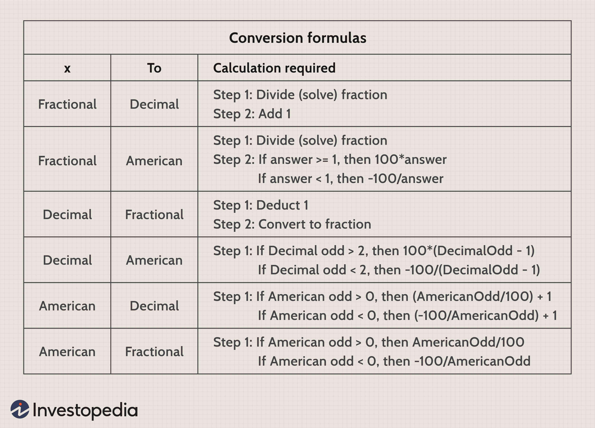

## Table of Contents

## What are predicted probabilities in the context of betting?

Predicted probabilities in betting are estimates of how likely it is that a certain outcome will happen in a sports event or a game. Bookmakers use math and data to figure out these probabilities. They look at things like how teams or players have done in the past, how they are doing now, and other important information. These probabilities help set the odds, which tell bettors how much they might win if they bet on a certain outcome.

When you see odds like 2 to 1, it means the bookmaker thinks there's a certain chance the event will happen. If the odds are 2 to 1, the bookmaker believes the event is less likely to happen than if the odds were 1 to 1. Bettors use these predicted probabilities to make choices about where to put their money. They might look for bets where they think the bookmaker's probability is wrong, hoping to win more money if they are right.

## How do predicted probabilities influence bet sizing?

Predicted probabilities help bettors decide how much money to bet. If a bettor thinks a team has a high chance of winning, they might bet more money on that team. For example, if the predicted probability says a team has an 80% chance of winning, a bettor might feel confident and bet a larger amount. On the other hand, if the probability is low, like 20%, the bettor might bet less money because they think the team is less likely to win.

Bet sizing also depends on how much a bettor wants to risk and how much they could win. If the odds are good and the predicted probability is high, a bettor might decide to bet more to try to win a bigger amount. But if the odds are not so good and the probability is low, they might bet smaller amounts to limit their losses. This way, predicted probabilities guide bettors in making smart choices about how much to bet.

## What is the basic formula for calculating predicted probabilities?

Predicted probabilities are often calculated using a simple formula that looks at the odds given by bookmakers. The basic idea is to turn the odds into a percentage that shows how likely something is to happen. For example, if the odds are 2 to 1, you can find the predicted probability by using the formula: Probability = 1 / (Odds + 1). So, for 2 to 1 odds, the probability would be 1 / (2 + 1) = 1/3, or about 33%.

This formula works for different types of odds, like decimal or fractional odds. If you have decimal odds, like 3.00, the formula changes a bit: Probability = 1 / Decimal Odds. So, for 3.00 odds, the probability would be 1 / 3.00, which is about 33% again. These calculations help bettors understand how likely an event is to happen based on the odds, and they can use this information to make better betting decisions.

## Can you explain how odds relate to predicted probabilities?

Odds and predicted probabilities are closely connected. Odds show how much you could win if you bet on something, but they also tell you how likely that thing is to happen. If the odds are high, like 10 to 1, it means the event is not very likely to happen. If the odds are low, like 1 to 1, it means the event is more likely. Bookmakers use math to turn these odds into predicted probabilities, which are just percentages that show how likely something is to happen.

To understand this better, you can use a simple formula to change odds into probabilities. For example, if the odds are 2 to 1, you can find the predicted probability by doing 1 divided by (2 + 1), which equals 1/3 or about 33%. This means there's a 33% chance that the event will happen. So, when you see odds, you can use them to figure out the predicted probability and decide if it's a good bet or not.

## What role do statistical models play in determining predicted probabilities?

Statistical models help figure out predicted probabilities by looking at lots of data. They use past information like how teams or players have done before, and current information like injuries or weather. These models use math to find patterns and make guesses about what might happen in the future. For example, if a team usually wins at home, the model might say they have a higher chance of winning their next home game.

These models are important because they give bookmakers a way to set odds that are more accurate. When the odds are set right, it helps the bookmaker make money and helps bettors make smart choices. Bettors can look at the predicted probabilities from these models to decide if the odds are a good bet. If the model says a team has a 70% chance of winning but the odds suggest a 60% chance, a bettor might think it's a good bet to take.

## How can a beginner use predicted probabilities to improve their betting strategy?

A beginner can use predicted probabilities to make smarter bets by looking at the chances of different outcomes. If a bookmaker gives odds that suggest a team has a 60% chance of winning, but a beginner thinks the team is actually better and might have a 70% chance, they could bet on that team. By comparing their own guesses with the bookmaker's probabilities, beginners can find bets where they think the odds are wrong. This can help them win more money if they are right about the team's chances.

Another way to use predicted probabilities is by deciding how much to bet. If a beginner sees a high predicted probability for an outcome, like 80%, they might feel more confident and bet more money. But if the probability is low, like 20%, they might bet less to keep their risk small. By using these probabilities, beginners can manage their money better and make more thoughtful bets. Over time, this can help them improve their betting strategy and maybe win more often.

## What are common mistakes to avoid when using predicted probabilities for bet sizing?

One common mistake beginners make is betting too much on a single bet just because the predicted probability is high. Just because a team has an 80% chance of winning doesn't mean you should bet all your money on them. It's important to think about how much you can afford to lose and not to bet more than that, even if the odds seem good.

Another mistake is not paying attention to how the odds and probabilities change. Sometimes, the odds can shift a lot before a game starts, and if you don't check them, you might miss out on a better bet. Always keep an eye on the latest odds and adjust your bets based on the most up-to-date predicted probabilities.

## How do advanced bettors incorporate predicted probabilities into their bankroll management?

Advanced bettors use predicted probabilities to manage their bankroll carefully. They look at the chances of winning and losing for each bet and decide how much money to bet based on those chances. If a bet has a high predicted probability of winning, they might bet a bigger amount, but they still keep it within a small part of their total bankroll. This way, they can keep betting even if they lose a few times. They also think about how much they can afford to lose and make sure they don't bet more than that, no matter how good the odds look.

These bettors also use predicted probabilities to spread their bets across different events. They might bet on several games with different probabilities, balancing their bets so that they don't risk too much on any one bet. By doing this, they can take advantage of good odds without putting all their money on the line. Over time, this careful management helps them to keep their bankroll stable and grow it slowly, even if they don't win every bet.

## What are the differences between using predicted probabilities in sports betting versus poker?

In sports betting, predicted probabilities help bettors figure out how likely a team or player is to win. Bookmakers use a lot of data and stats to guess these probabilities, and bettors can use them to find good bets. If a bettor thinks a team has a higher chance of winning than the odds suggest, they might bet more money on that team. This can help them make smarter choices about which games to bet on and how much to bet. But sports betting can be tricky because so many things can change, like injuries or weather, which can mess up the predicted probabilities.

In poker, predicted probabilities are used a bit differently. Players use them to guess how likely they are to win a hand based on their cards and what they think other players have. These probabilities help players decide whether to bet, fold, or call. For example, if a player thinks they have a 70% chance of winning the hand, they might bet more to try to win a bigger pot. But poker also involves a lot of psychology and bluffing, so players have to think about what other players might do, not just the math. This makes using predicted probabilities in poker a bit more complicated than in sports betting.

## How can machine learning enhance the accuracy of predicted probabilities?

Machine learning can make predicted probabilities more accurate by looking at a lot of data and finding patterns that people might miss. In sports betting, machine learning models can use past games, player stats, and even things like weather or injuries to guess how likely a team is to win. These models can learn from new data all the time, so their guesses get better as they see more games. This means the probabilities they predict can be more reliable than just using simple math or guesses from bookmakers.

In poker, machine learning can help too. It can look at how players have bet in the past and use that to guess what they might do next. By understanding these patterns, the model can give better predicted probabilities for winning a hand. This can help players make smarter choices about when to bet or fold. Since machine learning can handle a lot of data and keep learning, it can give more accurate probabilities than just using basic odds or simple strategies.

## What are some advanced techniques for adjusting bet sizes based on predicted probabilities?

Advanced bettors use something called the Kelly Criterion to decide how much to bet based on predicted probabilities. The Kelly Criterion is a math formula that helps you figure out the best amount to bet to grow your bankroll the fastest. It looks at the odds and the probability of winning, and tells you to bet a certain part of your money. If the predicted probability of winning is high, the Kelly Criterion might say to bet more, but it always keeps the bet size small compared to your total money. This way, you can keep betting even if you lose sometimes, and over time, you can make more money.

Another technique is called portfolio betting, where bettors spread their money across different bets. They use predicted probabilities to decide how much to bet on each one, making sure they don't put too much money on any single bet. If one bet has a high predicted probability, they might bet a bit more on it, but they still keep the bet small. By doing this, they can take advantage of good odds without risking too much. Over time, this careful balancing can help them keep their bankroll safe and grow it slowly, even if they don't win every bet.

## How do professional bettors evaluate the performance of their predicted probability models?

Professional bettors check how well their predicted probability models work by looking at how often their guesses are right. They keep track of all their bets and see if the teams or players they thought would win actually did win. If their model says a team has a 70% chance of winning and that team wins 70 out of 100 times, then the model is doing a good job. But if the team only wins 50 out of 100 times, the model might need to be fixed. They also look at how much money they make or lose from their bets to see if the model is helping them win more than they lose.

Another way they check their models is by comparing them to other models or to the odds from bookmakers. If their model's predicted probabilities are better than the bookmaker's odds, they might make more money. They also use something called [backtesting](/wiki/backtesting), where they use old data to see how their model would have done in the past. If the model would have made good guesses with old data, it's more likely to work well in the future. By doing all these checks, professional bettors can make sure their models are as accurate as possible and keep improving them over time.

## How can you determine Bet Sizing from Predicted Probabilities?

In [algorithmic trading](/wiki/algorithmic-trading), the application of predicted probabilities for bet sizing is a strategic element aimed at optimizing trade outcomes. This method centers on using the predicted likelihood of trade success as a tool for deciding how much capital to allocate to a given position. The use of [machine learning](/wiki/machine-learning) algorithms is essential in providing these predictions. These algorithms analyze historical trading data and other market factors to estimate the probability of achieving a favorable trade outcome.

The core principle of bet sizing from predicted probabilities involves aligning the capital allocation proportionately with the probability of success. Quantitatively, the betting size $S$ can be modeled as a function of the predicted probability $P$ and potential payoff ratios. An example model might be:

$$
S = f(P, R)
$$

where $R$ represents the risk-reward ratio, and $f$ is a function that may incorporate these parameters in a manner suited to the trader's risk tolerance and strategy.

Machine learning enhances the precision of probability predictions by leveraging large datasets and complex models like neural networks or ensemble methods. This computational approach allows for adaptive bet sizing, where the outcomes of predictions dynamically alter the allocation strategy over time based on updated data inputs.

Bet sizing founded on predicted probabilities offers improved optimization of the risk-reward ratio. By quantifying trade likelihoods, traders can reduce unnecessary exposure and allocate funds where the projected payoff justifies the risk involved. Consequently, such flexibility in decision-making enhances profitability while curtailing potential losses.

Notable examples illustrate how traders successfully incorporate probability predictions in their strategies. For instance, consider a trader using a random forest classifier to predict the direction of stock movements. By analyzing numerous predictors, including price trends and macroeconomic indicators, the model outputs a probability of price increase. The trader then adjusts the bet size in proportion to this probability, potentially scheduling larger bets for higher probabilities. 

Case studies have demonstrated the practical benefits of this approach. For example, in a backtested strategy employing a gradient boosting model, trades with a probability score exceeding 70% recorded a significantly higher success rate, validating the efficacy of probability-based betting.

Such methodologies underscore the importance of integrating probability predictions in trading strategies, offering a structured avenue to address uncertainty through informed bet sizing. As algorithmic trading continues to evolve, the role of machine learning in refining these predictions and further enhancing trading efficiency is anticipated to grow.

## What are Dynamic Bet Sizes?

Dynamic bet sizing involves adjusting the size of trades in real-time, taking into account evolving market conditions and algorithm-based predictions. This approach enables traders to adapt their strategies dynamically, responding effectively to market [volatility](/wiki/volatility-trading-strategies) and uncertainty. By incorporating expected price movements into bet sizing calculations, traders aim to optimize returns across different market scenarios.

A fundamental aspect of dynamic bet sizing is its focus on flexibility. Unlike static sizing strategies that maintain a fixed trade size regardless of market changes, dynamic sizing adjusts the investment based on real-time data. This adaptability can be crucial for maximizing returns, especially in volatile markets where rapid changes in price can significantly impact the outcome of trades.

One of the main benefits of dynamic bet sizing is its ability to manage risk more efficiently. Static bet sizing may expose traders to increased risk during periods of high market volatility, as it lacks the flexibility to scale down positions when necessary. Dynamic bet sizing, on the other hand, allows traders to decrease or increase their positions based on the probability of favorable market movements, effectively mitigating potential losses.

In practical terms, dynamic bet sizing can be implemented using algorithmic trading platforms that integrate real-time data analysis. These platforms use machine learning models to predict price movements and adjust trade sizes accordingly. For example, traders might employ a Python-based system using libraries such as NumPy or Pandas to track market trends and update bet sizes in response to new data inputs.

The formula for adjusting bet size in a dynamic framework can vary, but it often relates to the Kelly Criterion, which guides on optimizing bet size considering the edge and variance of the predicted outcome:

$$
\text{Bet Size} = \frac{bp - q}{b}
$$

Where:
- $b$ is the return of the bet (odds)
- $p$ is the predicted probability of winning
- $q$ is the probability of losing (1 - $p$)

This formula ensures bet sizes are proportional to the calculated advantage, thereby increasing the stake when favorable outcomes are predicted with high confidence and decreasing it when predicted probabilities are less certain.

Dynamic bet sizing is regularly used by traders seeking to enhance their algo trading strategies. It provides significant advantages in trade management by allowing for real-time adjustments based on continuous market assessment, thus aligning risk and return more closely with the current market environment. As financial markets continue to evolve, dynamic bet sizing strategies are expected to become increasingly sophisticated, leveraging advancements in machine learning and data analytics to further improve trading outcomes.

## References & Further Reading

[1]: Bergstra, J., Bardenet, R., Bengio, Y., & Kégl, B. (2011). ["Algorithms for Hyper-Parameter Optimization."](https://papers.nips.cc/paper/4443-algorithms-for-hyper-parameter-optimization) Advances in Neural Information Processing Systems 24.

[2]: ["Advances in Financial Machine Learning"](https://www.amazon.com/Advances-Financial-Machine-Learning-Marcos/dp/1119482089) by Marcos Lopez de Prado

[3]: ["Evidence-Based Technical Analysis: Applying the Scientific Method and Statistical Inference to Trading Signals"](https://www.amazon.com/Evidence-Based-Technical-Analysis-Scientific-Statistical/dp/0470008741) by David Aronson

[4]: ["Machine Learning for Algorithmic Trading"](https://github.com/PacktPublishing/Machine-Learning-for-Algorithmic-Trading-Second-Edition) by Stefan Jansen

[5]: ["Quantitative Trading: How to Build Your Own Algorithmic Trading Business"](https://books.google.com/books/about/Quantitative_Trading.html?id=j70yEAAAQBAJ) by Ernest P. Chan