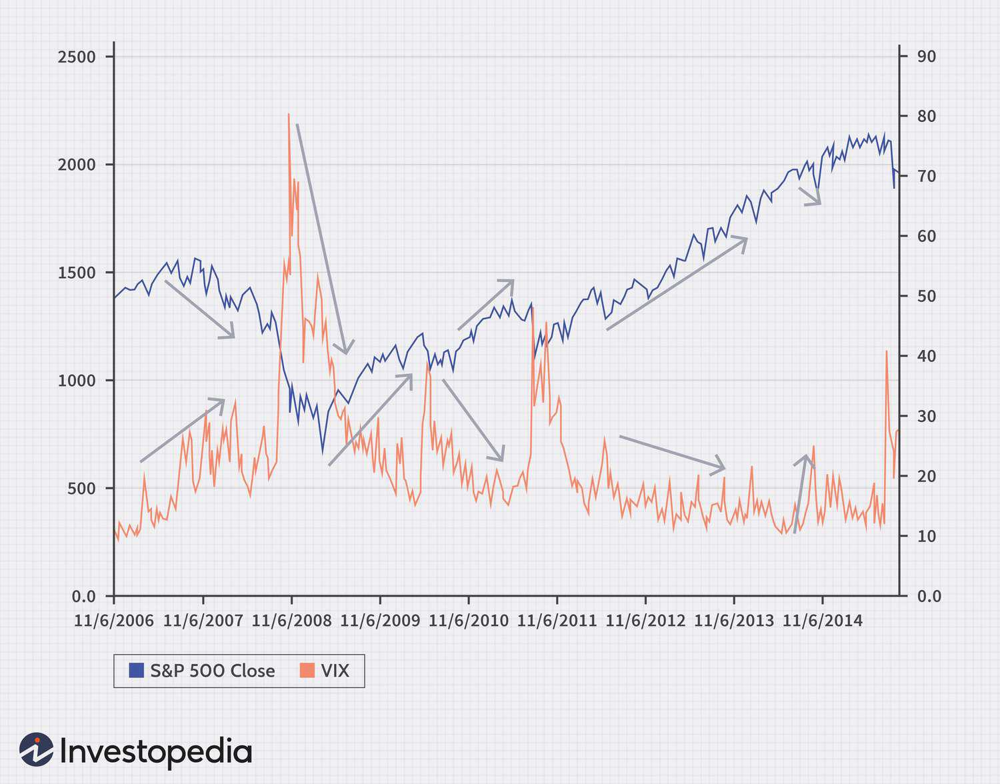

## Table of Contents

## What is the stock market and why is predicting its opening important?

The stock market is a place where people buy and sell pieces of companies, called stocks. When you buy a stock, you own a small part of that company. The price of stocks goes up and down based on how well the company is doing and what people think about it. The stock market is important because it helps companies get money to grow and it lets people invest their money to hopefully make more money.

Predicting the stock market's opening is important because it can help people make better decisions about buying or selling stocks. The opening price of the market can set the tone for the whole day. If you can guess if the market will go up or down when it opens, you might be able to make smarter choices about your investments. This can help you make more money or avoid losing money. Even though it's hard to predict the market perfectly, many people try to do it to get an advantage.

## What are the basic factors that influence stock market opening prices?

The stock market's opening prices are influenced by many things. One big factor is what happened in other markets around the world while the U.S. market was closed. For example, if stock markets in Asia or Europe went up or down a lot overnight, it can affect how the U.S. market opens. Another important thing is news that comes out before the market opens. If there's big news about a company or the economy, it can make people want to buy or sell stocks right away.

Another factor is what people expect to happen. If investors think the market will go up, they might buy stocks before the market opens, which can push the opening prices higher. On the other hand, if they think the market will go down, they might sell their stocks, which can make the opening prices lower. Also, economic reports like jobs numbers or inflation rates can influence the market. If these reports are better or worse than expected, it can change how people feel about the market and affect the opening prices.

## How can historical data be used to predict stock market openings?

Historical data can help predict stock market openings by showing patterns and trends from the past. People look at what happened in the market on similar days or during similar times in the past. For example, if the market usually goes up after a long holiday weekend, that might help predict what will happen the next time there's a long holiday weekend. By studying these patterns, people can make guesses about what might happen when the market opens.

Another way historical data is used is through technical analysis. This means looking at charts and graphs of past stock prices to find signals that might show what will happen next. For example, if a stock's price has been going up and up, and then it suddenly drops a little, some people might think it will keep going up after that small drop. They use this information to decide if they should buy or sell stocks when the market opens. While historical data can give clues, it's not perfect because the market can be unpredictable and influenced by new events.

## What role do economic indicators play in predicting stock market openings?

Economic indicators are important pieces of information that help people guess what the stock market will do when it opens. These indicators tell us about the health of the economy, like how many people have jobs, how much things cost, and how much money people are spending. If these numbers are good, it can make people feel confident about the economy, and they might want to buy more stocks. This can push the stock market prices up when it opens. On the other hand, if the economic indicators are bad, people might worry and sell their stocks, which can make the opening prices go down.

For example, if a report comes out saying that more people got jobs last month than expected, it might make investors think the economy is doing well. They might buy more stocks before the market opens, hoping to make money as the market goes up. But if a report shows that prices are going up a lot (which is called inflation), people might worry that the economy is getting too hot and could slow down soon. This might make them sell their stocks, which can lead to lower opening prices. So, economic indicators are like clues that help people make guesses about the stock market's opening.

## How do global events affect stock market opening predictions?

Global events can have a big impact on what happens when the stock market opens. If something big happens in another country, like a natural disaster or a big change in their government, it can make people around the world worried. This worry can spread to the stock market. For example, if there's a big earthquake in Japan, it might make people think that companies that do business there will have problems. So, they might sell their stocks before the market opens, which can make the opening prices go down.

Also, what happens in other stock markets around the world can affect the U.S. market. If the stock markets in Europe or Asia go down a lot overnight, it can make people in the U.S. think that their market might go down too. They might decide to sell their stocks before the market opens, which can lead to lower opening prices. On the other hand, if those markets do well, it might make people feel more confident and want to buy more stocks, pushing the opening prices up. So, keeping an eye on global events and other markets can help people guess what might happen when the U.S. stock market opens.

## What are technical analysis tools used for predicting stock market openings?

Technical analysis tools help people guess what the stock market will do when it opens by looking at past prices and other data. One common tool is the moving average, which shows the average price of a stock over a certain time, like 50 days or 200 days. If the current price is above the moving average, it might mean the stock will keep going up when the market opens. If it's below, it might go down. Another tool is the Relative Strength Index (RSI), which shows if a stock is overbought or oversold. If the RSI is high, it might mean the stock is due for a drop when the market opens, and if it's low, it might be ready to go up.

Chart patterns are also important in technical analysis. For example, a "head and shoulders" pattern might mean a stock's price will go down when the market opens, while a "cup and handle" pattern might mean it will go up. People also use support and resistance levels, which are price points where the stock has had trouble moving past before. If a stock is close to a support level before the market opens, it might bounce back up, and if it's near a resistance level, it might fall back down. By using these tools, people try to make better guesses about what will happen when the market opens.

## How can sentiment analysis from news and social media impact stock market opening predictions?

Sentiment analysis from news and social media can help people guess what the stock market will do when it opens. This is because what people are saying and feeling about a company or the economy can affect how they act in the stock market. If a lot of people are talking positively about a company on social media or in the news, it might make more people want to buy that company's stock before the market opens. This can push the opening price up. On the other hand, if there's a lot of negative talk, people might want to sell their stocks, which can make the opening price go down.

Tools that look at sentiment can read thousands of news articles and social media posts to figure out if people are feeling good or bad about the market. For example, if there's a lot of good news about the economy, like new jobs or lower prices, it might make people feel more confident. They might buy more stocks before the market opens, hoping to make money as the market goes up. But if there's bad news, like a big company having problems or the economy slowing down, it can make people worried. They might sell their stocks, which can lead to lower opening prices. So, by understanding what people are feeling, sentiment analysis can give clues about what might happen when the stock market opens.

## What are the differences between short-term and long-term stock market opening predictions?

Short-term stock market opening predictions focus on what might happen in the next few hours or days. People use things like the latest news, what other markets are doing, and technical analysis to guess if the market will go up or down when it opens. They might look at how the stock did yesterday or what people are saying on social media right now. Short-term predictions are often used by people who buy and sell stocks a lot, trying to make quick money by guessing what will happen in the next few minutes or hours.

Long-term stock market opening predictions, on the other hand, look at what might happen over weeks, months, or even years. These predictions use things like big economic reports, company earnings, and overall trends in the economy. People who make long-term predictions might not care so much about what happened yesterday but more about where the company or the economy is headed. Long-term predictions are usually used by people who plan to keep their stocks for a long time, hoping that the company will grow and their stocks will become more valuable over time.

## How do machine learning models improve the accuracy of stock market opening predictions?

Machine learning models can make stock market opening predictions more accurate by looking at a lot of different information all at once. They can learn from past data, like stock prices, news, and even what people are saying on social media. This means they can find patterns and connections that people might miss. For example, a machine learning model might see that when certain words are used a lot in news articles, the stock market usually goes up the next day. By using this information, the model can make better guesses about what will happen when the market opens.

These models also get better over time. As they see more data and get feedback on their predictions, they can adjust and improve. This is called "learning." So, the more data a machine learning model has, the better it can predict what will happen when the stock market opens. While no prediction is perfect, machine learning can help people make smarter choices about buying and selling stocks by giving them a clearer picture of what might happen next.

## What are the limitations and risks associated with predicting stock market openings?

Predicting stock market openings is hard because the market can be very unpredictable. Even with a lot of information and fancy tools, it's tough to guess exactly what will happen. The market can be affected by things that are hard to predict, like sudden news or global events. Also, people's feelings can change quickly, and this can make the market go up or down in ways that are hard to see coming. So, even the best predictions can be wrong, and this can lead to people losing money if they make choices based on those predictions.

Another risk is that people might rely too much on predictions and not think for themselves. If everyone is using the same information and tools, they might all make the same choices, which can lead to big swings in the market. This is called a "herd mentality." Also, some people might try to use predictions to make quick money, which can be risky. They might buy and sell stocks a lot, hoping to make a profit, but this can lead to big losses if the market doesn't go the way they expected. So, it's important to be careful and not depend too much on predictions when making choices about stocks.

## How can algorithmic trading strategies be developed based on stock market opening predictions?

Algorithmic trading strategies can be developed by using stock market opening predictions to decide when to buy or sell stocks. These strategies use computer programs to look at a lot of information, like past stock prices, news, and what people are saying on social media. The programs can find patterns and make guesses about what will happen when the market opens. If the prediction says the market will go up, the algorithm might buy stocks right before the market opens, hoping to sell them later for a profit. If the prediction says the market will go down, the algorithm might sell stocks or even "short" them, which means betting that the price will fall.

These strategies need to be careful because the market can be unpredictable. Even the best predictions can be wrong, so the algorithms need to be set up to handle surprises. They might use things like "stop-loss" orders, which automatically sell a stock if it drops to a certain price, to limit losses. Also, the algorithms can be made to learn from their mistakes and get better over time. By constantly updating with new data and adjusting their predictions, these strategies can become more accurate and help traders make smarter choices about when to buy and sell stocks based on how the market might open.

## What advanced statistical methods are used by experts to refine stock market opening predictions?

Experts use advanced statistical methods like time series analysis to make their stock market opening predictions better. Time series analysis looks at how stock prices change over time. It can find patterns and trends that help predict what might happen when the market opens. For example, it can see if stock prices usually go up or down on certain days of the week or after certain events. By understanding these patterns, experts can make more accurate guesses about the market's opening.

Another method experts use is regression analysis. This helps them see how different things, like economic reports or news, affect stock prices. They can use this information to predict how the market might react to new data when it opens. Also, machine learning techniques, like neural networks, are used to look at a lot of data at once and find connections that are hard for people to see. These methods help experts make better predictions, but they still need to be careful because the market can be unpredictable.

## References & Further Reading

[1]: Bergstra, J., Bardenet, R., Bengio, Y., & Kégl, B. (2011). ["Algorithms for Hyper-Parameter Optimization."](https://papers.nips.cc/paper/4443-algorithms-for-hyper-parameter-optimization) Advances in Neural Information Processing Systems 24.

[2]: ["Advances in Financial Machine Learning"](https://www.amazon.com/Advances-Financial-Machine-Learning-Marcos/dp/1119482089) by Marcos Lopez de Prado

[3]: ["Evidence-Based Technical Analysis: Applying the Scientific Method and Statistical Inference to Trading Signals"](https://www.amazon.com/Evidence-Based-Technical-Analysis-Scientific-Statistical/dp/0470008741) by David Aronson

[4]: ["Machine Learning for Algorithmic Trading: Predictive Models to Extract Signals from Market and Alternative Data for Systematic Trading Strategies with Python, 2nd Edition"](https://github.com/stefan-jansen/machine-learning-for-trading) by Stefan Jansen

[5]: ["Quantitative Trading: How to Build Your Own Algorithmic Trading Business"](https://www.amazon.com/Quantitative-Trading-Build-Algorithmic-Business/dp/1119800064) by Ernest P. Chan

[6]: Tsay, R. S. (2005). ["Analysis of Financial Time Series,"](https://cpb-us-w2.wpmucdn.com/blog.nus.edu.sg/dist/0/6796/files/2017/03/analysis-of-financial-time-series-copy-2ffgm3v.pdf) John Wiley & Sons.