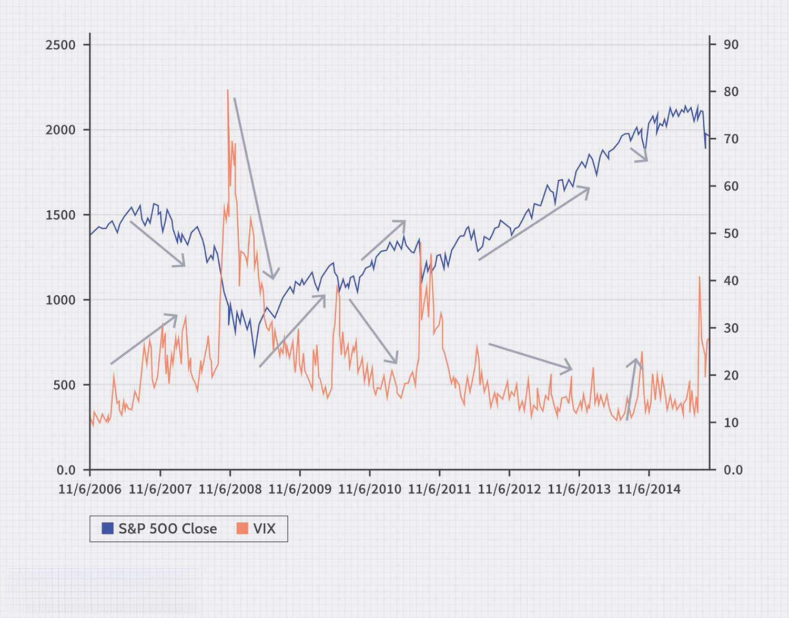

## Table of Contents

## What are stock market trends and why are they important?

Stock market trends are the general direction that the stock market or specific stocks are moving over time. They can go up, down, or stay the same. People look at trends to guess what might happen next in the market. Trends can last for a short time, like a few days, or a long time, like many years. They are shown on charts that use lines to connect the prices of stocks over time.

Trends are important because they help people make decisions about buying or selling stocks. If a trend shows that a stock's price is going up, people might want to buy it because they think it will keep going up. If the trend shows the price going down, people might want to sell it or not buy it. By understanding trends, investors can try to make money by buying low and selling high. However, trends are not always easy to predict, and they can change suddenly, so it's important to be careful.

## What are options and how do they relate to stock market trends?

Options are financial contracts that give you the right, but not the obligation, to buy or sell a stock at a specific price before a certain date. There are two types of options: calls and puts. A call option lets you buy a stock at a set price, while a put option lets you sell a stock at a set price. People use options to make money from stock market trends without actually owning the stocks.

Options relate to stock market trends because they allow investors to bet on where they think the stock price is going. If someone thinks a stock's price will go up based on the trend, they might buy a call option. If they think the price will go down, they might buy a put option. This way, options can be used to make money from trends without having to buy or sell the actual stock. However, options can be risky because if the trend doesn't go the way you expect, you could lose money.

## How can beginners start using options data to predict stock market trends?

Beginners can start using options data to predict stock market trends by first learning about the basics of options, like calls and puts. They should understand that options data can show what other investors think about a stock's future price. One way to do this is by looking at the "open interest" and "[volume](/wiki/volume-trading-strategy)" of options. Open interest is the total number of options contracts that are currently open, and volume is the number of contracts traded in a day. If a lot of people are buying call options, it might mean they think the stock price will go up. If they're buying put options, it might mean they think the price will go down.

Another way beginners can use options data is by looking at the "implied [volatility](/wiki/volatility-trading-strategies)" of options. Implied volatility shows how much the market thinks the stock price might move in the future. If the implied volatility is high, it means people expect big changes in the stock price, which could signal a strong trend. Beginners can find this information on financial websites or through trading platforms. It's important for beginners to start small, practice with a demo account, and learn from experienced traders before using real money. This way, they can get a feel for how options data can help predict stock market trends without risking too much.

## What are the key indicators in options data that can signal upcoming market trends?

Key indicators in options data that can signal upcoming market trends include open interest, volume, and implied volatility. Open interest shows the total number of options contracts that are currently open. If open interest is increasing, it means more people are interested in betting on the stock's future price, which could signal a strong upcoming trend. Volume is the number of contracts traded in a day. High volume can mean that a lot of people are making moves based on their predictions about the stock's direction, which can be a sign of an upcoming trend.

Implied volatility is another important indicator. It shows how much the market thinks the stock price might move in the future. If implied volatility is high, it means people expect the stock price to change a lot, which could signal a strong trend coming up. By looking at these indicators, beginners can get a sense of what other investors think about a stock's future and make their own predictions about market trends.

It's important for beginners to remember that while these indicators can be helpful, they are not always right. The stock market can be unpredictable, and trends can change quickly. So, it's a good idea to use options data along with other information, like news about the company or the economy, to make the best predictions about upcoming market trends.

## How does the volatility of options influence stock market predictions?

The volatility of options, which is often measured by implied volatility, can give clues about what might happen in the stock market. When options have high implied volatility, it means that people think the stock price might move a lot in the future. This could be because they expect good news or bad news that could change the stock's price. For example, if a company is about to release a new product, the options might have high volatility because people think the stock price could go up or down a lot depending on how the product does.

On the other hand, if options have low implied volatility, it means people think the stock price will stay pretty steady. This might happen if there's not much news or excitement about the company. Traders use this information to make guesses about where the stock market might be headed. High volatility might make them think a big change is coming, so they might buy options to try to make money from that change. Low volatility might make them think things will stay the same, so they might not make big moves. But remember, even with this information, the stock market can still surprise everyone, so it's important to be careful.

## What are the common statistical models used for analyzing options data?

One common statistical model for analyzing options data is the Black-Scholes Model. This model helps figure out how much an option should cost based on things like the stock's price, how long until the option expires, how much the stock's price might move (volatility), and the [interest rate](/wiki/interest-rate-trading-strategies). The Black-Scholes Model uses a math formula to make these calculations. It's popular because it gives a good starting point for understanding the price of options, but it assumes the stock's price moves in a smooth way, which isn't always true in real life.

Another model that people use is the Binomial Options Pricing Model. This model looks at what might happen to the stock's price at different points in time before the option expires. It breaks down the time into smaller pieces and says the stock's price can either go up or down at each step. By looking at all these possible paths, the model can figure out what the option might be worth. This model is good because it can handle situations where the stock's price might jump around more than the Black-Scholes Model expects.

A third model worth mentioning is the Monte Carlo Simulation. This model uses random numbers to guess what might happen to the stock's price many times over. By running these guesses lots of times, the model can show a range of possible outcomes for the option's price. It's useful for understanding the risk and possible rewards of options, especially when the stock's price might move in ways that are hard to predict with simpler models.

## How can machine learning be applied to options data for better trend predictions?

Machine learning can help predict stock market trends better by looking at options data in new ways. It can find patterns that are too hard for people to see just by looking at numbers. For example, [machine learning](/wiki/machine-learning) can use a lot of past data to learn how options prices have moved with stock prices before. Then, it can use this learning to guess what might happen next. This can be done with models like neural networks, which can learn from a lot of data and make predictions based on that learning.

Machine learning can also help by looking at many different things at once, like the stock's price, how much it might move (volatility), and even news about the company. By putting all this information together, machine learning can make smarter guesses about where the stock price might go. This can be especially useful for options because they are affected by so many things. While machine learning can't predict the future perfectly, it can give better guesses than just looking at simple trends, helping investors make more informed choices.

## What are the limitations of using options data for predicting stock market trends?

Using options data to predict stock market trends can be tricky because options are based on guesses about the future. People's guesses can be wrong, and the market can change suddenly because of news or other events that no one expected. For example, if a company announces bad news, the stock price might drop even if options data suggested it would go up. Also, options data can be influenced by things like how much people are willing to pay for options, which can change and not always reflect what will really happen to the stock price.

Another problem is that options data can be hard to understand. There are many numbers and calculations involved, and it takes time to learn how to use them correctly. Even with machine learning and statistical models, there's no guarantee that the predictions will be right. The stock market is unpredictable, and while options data can give clues about what might happen, it's not a crystal ball. So, it's important to use options data along with other information and to be careful about making big decisions based on it alone.

## How do professional traders incorporate options data into their market trend analysis?

Professional traders use options data to help them understand what other people think about where the stock market is going. They look at things like open interest, which shows how many options contracts are open, and volume, which shows how many options are being traded. If a lot of people are buying call options, it might mean they think the stock price will go up. If they're buying put options, it might mean they think the stock price will go down. Traders also pay attention to implied volatility, which shows how much the market thinks the stock price might move. By looking at these things, professional traders can get a better idea of what might happen next in the market.

Even though options data can be helpful, professional traders know it's not perfect. They use it along with other information, like news about companies and the economy, to make their predictions. They understand that the stock market can change quickly because of unexpected events, so they don't rely only on options data. Instead, they use it as one part of a bigger picture to make smarter decisions about buying and selling stocks.

## What advanced techniques can be used to enhance the accuracy of options-based predictions?

Professional traders often use advanced techniques like machine learning to make their options-based predictions more accurate. Machine learning can look at a lot of past data to find patterns that are hard for people to see. It can learn from how options prices have moved with stock prices before and use this learning to guess what might happen next. This can be done with models like neural networks, which can handle a lot of information and make predictions based on that. By using machine learning, traders can get better guesses about where the stock price might go, which can help them make smarter choices about buying and selling options.

Another advanced technique is using a mix of different models, like the Black-Scholes Model, the Binomial Options Pricing Model, and Monte Carlo Simulation. Each model looks at options pricing in a different way. The Black-Scholes Model uses a math formula to figure out how much an option should cost. The Binomial Model breaks down time into smaller pieces and looks at what might happen to the stock's price at each step. The Monte Carlo Simulation uses random numbers to guess what might happen many times over. By combining these models, traders can get a fuller picture of what might happen to the stock price and the options, making their predictions more accurate.

## How does global economic news impact the reliability of options data in trend prediction?

Global economic news can make options data less reliable for predicting stock market trends. Options data is based on what people think will happen to stock prices in the future. But if there's big news like a country's economy doing badly or a new law being passed, it can change what people think very quickly. This means the options data might not show the new situation right away. For example, if there's a surprise announcement about a trade war, the stock market might drop even if the options data suggested it would go up. So, traders need to be careful and not rely only on options data when there's a lot of global news happening.

Even though options data can give clues about what might happen, global economic news can make things unpredictable. Traders often use options data along with other information, like news about companies and the economy, to make better guesses about the market. But when big global news comes out, it can shake up the market in ways that options data can't always predict. So, it's important for traders to stay updated on global events and use options data as just one part of their overall strategy for predicting trends.

## What are the ethical considerations and potential regulatory issues when using options data for stock market predictions?

Using options data for stock market predictions can bring up some ethical questions. One big concern is fairness. If some people have better access to options data or use advanced tools like machine learning to predict trends, they might have an advantage over others. This can make the stock market less fair, because not everyone has the same information or tools. Another ethical issue is how this data is used. If people use options data to spread false information or manipulate the market, it can hurt other investors and damage trust in the stock market.

There are also regulatory issues to think about. Governments and financial watchdogs have rules to make sure the stock market is fair and safe for everyone. They might worry that using options data in certain ways could lead to insider trading or market manipulation. For example, if someone uses options data to predict a big drop in a stock's price and then spreads rumors to make that happen, it could be against the rules. Regulators might also set limits on how options data can be used or shared to prevent unfair advantages. So, it's important for people using options data to follow the rules and think about the ethical impact of their actions.

## Can we predict the stock market using options data?

Options market data is a vital resource for investors and traders aiming to forecast stock market trends. This data offers a glimpse into investors' expectations regarding the future movements of particular stocks or the market as a whole. Among the various metrics derived from options data, the Put-Call Ratio (PCR) and volatility indexes, such as the VIX, stand out as essential tools for analyzing market sentiment and predicting fluctuations.

The Put-Call Ratio is calculated by dividing the number of traded put options by the number of traded call options. Put options give the holder the right to sell at a pre-determined price, while call options grant the right to buy. A high PCR value, where put options greatly outnumber call options, typically indicates a bearish sentiment among investors. On the other hand, a low PCR suggests a bullish sentiment. The formula for PCR is given by:

$$
\text{PCR} = \frac{\text{Put Volume}}{\text{Call Volume}}
$$

Volatility indexes, like the VIX (often referred to as the "fear index"), measure market expectations for volatility over the coming 30 days based on S&P 500 index options. A higher VIX value indicates that investors expect larger price swings, suggesting a more unpredictable or volatile market environment. The VIX is derived from the prices of options and uses sophisticated calculations involving the implied volatilities of a range of options.

Analyzing options data requires sophisticated techniques due to its complexity. Advanced statistical models and machine learning algorithms are often employed to extract insights from this data. For instance, by using historical options data, predictive models can be trained to detect patterns that might indicate future market behaviors. Here is a simple example of using Python with machine learning to analyze options data:

```python
import pandas as pd
from sklearn.model_selection import train_test_split
from sklearn.ensemble import RandomForestClassifier

# Load options data (assuming a DataFrame with 'PCR', 'VIX', and 'MarketMovement' columns)
data = pd.read_csv('options_data.csv')

# Define features and target variables
X = data[['PCR', 'VIX']]
y = data['MarketMovement']

# Split the dataset into training and testing sets
X_train, X_test, y_train, y_test = train_test_split(X, y, test_size=0.2, random_state=42)

# Initialize and train the Random Forest model
model = RandomForestClassifier(n_estimators=100, random_state=42)
model.fit(X_train, y_train)

# Make predictions
predictions = model.predict(X_test)

# Evaluate model performance
accuracy = model.score(X_test, y_test)
print(f'Accuracy: {accuracy:.2f}')
```

This Python script illustrates a basic process of utilizing options data metrics such as PCR and VIX to predict market movements using a Random Forest classifier.

Despite the intricacies, options data can be a powerful tool in predicting market movements. It provides deep insights into market sentiment and potential future volatility, aiding in constructing informed trading strategies that anticipate various market conditions. By leveraging these data analytics, traders can gain a competitive advantage and enhance their market predictions.

## References & Further Reading

[1]: ["Advances in Financial Machine Learning"](https://www.amazon.com/Advances-Financial-Machine-Learning-Marcos/dp/1119482089) by Marcos Lopez de Prado

[2]: Hull, J. C. (2018). ["Options, Futures, and Other Derivatives."](https://www.semanticscholar.org/paper/Options%2C-Futures%2C-and-Other-Derivatives-Hull/89bdee500c8623864fc9eb7a471546aa713acc44) Pearson Education.

[3]: Carmona, R. (2004). ["Statistical Analysis of Financial Data in S-Plus."](https://link.springer.com/book/10.1007/b97626) Springer.

[4]: ["Quantitative Trading: How to Build Your Own Algorithmic Trading Business"](https://www.amazon.com/Quantitative-Trading-Build-Algorithmic-Business/dp/1119800064) by Ernest P. Chan

[5]: ["Machine Learning for Algorithmic Trading"](https://github.com/stefan-jansen/machine-learning-for-trading) by Stefan Jansen

[6]: Black, F., & Scholes, M. (1973). ["The Pricing of Options and Corporate Liabilities."](https://www.cs.princeton.edu/courses/archive/fall09/cos323/papers/black_scholes73.pdf) Journal of Political Economy, 81(3), 637-654.

[7]: Taleb, N. N. (2007). ["The Black Swan: The Impact of the Highly Improbable."](https://www.jstor.org/stable/23045073) Random House.

[8]: Aronson, D. R. (2006). ["Evidence-Based Technical Analysis: Applying the Scientific Method and Statistical Inference to Trading Signals."](https://www.amazon.com/Evidence-Based-Technical-Analysis-Scientific-Statistical/dp/0470008741) Wiley.