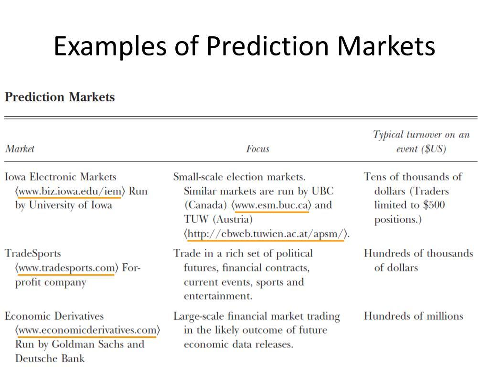

## Table of Contents

## What are prediction markets?

Prediction markets are places where people can bet on what they think will happen in the future. They work a bit like betting on sports, but instead of guessing who will win a game, you guess things like who will win an election, what the weather will be, or how a stock price will change. People buy and sell shares that represent different outcomes, and the price of these shares shows what most people think is likely to happen.

These markets can be useful because they gather a lot of different opinions and predictions from many people. When lots of people share their thoughts, it can help make better guesses about the future. Companies, governments, and other groups sometimes use prediction markets to help them make decisions or plan for what might happen next.

## How do prediction markets work?

Prediction markets work by letting people buy and sell shares that represent different possible outcomes of future events. For example, if you think it will rain tomorrow, you can buy a share that says "it will rain." The price of these shares changes based on what people are willing to pay for them. If more people think it will rain, the price of the "rain" share goes up. If fewer people think it will rain, the price goes down. The market uses these prices to show what most people think is likely to happen.

These markets are useful because they collect a lot of different opinions from many people. When lots of people share their thoughts, it can help make better guesses about the future. Companies, governments, and other groups sometimes use prediction markets to help them make decisions or plan for what might happen next. For example, a company might use a prediction market to guess how well a new product will sell, or a government might use one to predict the outcome of an election.

## What are the main components of a prediction market?

A prediction market has a few main parts that make it work. First, there are the traders, who are the people that buy and sell shares. These shares represent different possible outcomes of future events. For example, if you think a certain team will win a game, you can buy a share that says that team will win. The price of these shares changes based on what people are willing to pay for them. If more people think the team will win, the price of the share goes up. If fewer people think the team will win, the price goes down.

The second part is the market itself, which is like a place where all the buying and selling happens. This can be a website or a special platform where traders can see the current prices of shares and make their trades. The market keeps track of all the trades and updates the prices based on what people are doing. The third part is the event that the market is trying to predict. This could be anything from the weather to election results. The market uses the prices of the shares to show what most people think is likely to happen with that event.

## What are some common uses of prediction markets?

Prediction markets are used by companies to help them make better decisions about things like new products or business strategies. For example, a company might use a prediction market to guess how well a new product will sell. They can ask traders to buy and sell shares that represent different sales numbers. The price of these shares will show what most people think will happen. This can help the company decide if they should make the product or not.

Governments also use prediction markets to help them plan for the future. They might use them to predict things like election results or economic trends. For example, a government might set up a prediction market to guess who will win the next election. Traders can buy and sell shares that represent different candidates. The prices of these shares can help the government understand what people are thinking and plan accordingly.

In addition to companies and governments, prediction markets are also used by other groups like sports teams or event organizers. They can use them to predict things like the outcome of a game or how many people will attend an event. For example, a sports team might use a prediction market to guess if they will win their next game. Traders can buy and sell shares that represent a win or a loss. The prices of these shares can help the team understand what fans and experts think will happen.

## Can you provide examples of successful prediction markets?

One successful prediction market is the Iowa Electronic Markets (IEM). It's run by the University of Iowa and lets people buy and sell shares to predict things like election results. For example, during the U.S. presidential elections, the IEM has been very good at guessing who will win. It's been around since 1988 and has often been more accurate than traditional polls. This shows how prediction markets can gather a lot of different opinions and make good guesses about the future.

Another example is the Hollywood Stock Exchange (HSX). It's a place where people can trade shares that represent how well movies will do at the box office. The HSX has been good at predicting which movies will be hits and which will be flops. It's been around since 1996 and has helped movie studios understand what people want to see. This shows how prediction markets can be useful for businesses to make decisions about what products to make or promote.

## What are the benefits of using prediction markets?

Prediction markets help gather a lot of different opinions from many people. When lots of people share their thoughts, it can help make better guesses about the future. For example, if a company wants to know how well a new product will sell, they can use a prediction market. People can buy and sell shares that represent different sales numbers. The price of these shares will show what most people think will happen. This can help the company decide if they should make the product or not.

Another benefit is that prediction markets can be more accurate than other ways of guessing the future. For example, the Iowa Electronic Markets have been good at predicting election results. They often do better than traditional polls. This is because prediction markets use the wisdom of the crowd. When many people share their opinions, it can lead to better predictions. This can help companies, governments, and other groups make better decisions and plan for what might happen next.

## What are the potential risks and challenges associated with prediction markets?

One of the main risks with prediction markets is that they can be manipulated. If a small group of people work together to buy a lot of shares, they can change the prices and make it look like something is more likely to happen than it really is. This can trick other people into thinking the wrong thing. Another risk is that not everyone has the same information. Some people might know more about what will happen, and they can use that to make money. This can make the market unfair and less accurate.

Another challenge is that prediction markets can be hard to set up and run. They need a lot of people to work well, and it can be hard to get enough people to join. If there aren't enough traders, the market won't be able to gather enough different opinions to make good guesses. Also, some people might not trust prediction markets. They might think it's like gambling, and they might not want to take part. This can make it harder for prediction markets to be successful.

## How do prediction markets differ from traditional betting markets?

Prediction markets and traditional betting markets both let people bet on what they think will happen in the future. But they work a bit differently. In a prediction market, people buy and sell shares that represent different outcomes. The price of these shares changes based on what people think is likely to happen. For example, if more people think it will rain tomorrow, the price of the "rain" share goes up. In a traditional betting market, like a sports betting site, people place bets on specific outcomes, and the odds are set by the bookmaker. The odds don't change as much based on what other people are betting.

Another difference is that prediction markets often focus on a wider range of events, not just sports or horse races. They can be used to predict things like election results, economic trends, or how well a new product will sell. This makes them useful for companies and governments to make decisions. Traditional betting markets usually stick to more popular events like sports games or races. Also, prediction markets can be more accurate because they gather a lot of different opinions from many people, while traditional betting markets rely more on the bookmaker's predictions.

## What role do prediction markets play in decision-making and forecasting?

Prediction markets help people make better decisions and guesses about the future. They do this by letting lots of people share their thoughts on what might happen. For example, if a company wants to know how well a new product will sell, they can use a prediction market. People can buy and sell shares that represent different sales numbers. The price of these shares will show what most people think will happen. This can help the company decide if they should make the product or not.

Prediction markets can also be more accurate than other ways of guessing the future. For example, the Iowa Electronic Markets have been good at predicting election results. They often do better than traditional polls. This is because prediction markets use the wisdom of the crowd. When many people share their opinions, it can lead to better predictions. This can help companies, governments, and other groups make better decisions and plan for what might happen next.

## How are prediction markets regulated around the world?

Prediction markets are regulated differently in different countries. In the United States, they are often seen as a type of gambling, so they are tightly controlled. The Commodity Futures Trading Commission (CFTC) and the Securities and Exchange Commission (SEC) are the main groups that watch over them. They make sure that prediction markets follow the rules and don't let people cheat. Some prediction markets, like the Iowa Electronic Markets, are allowed to run because they are used for research and education.

In other countries, the rules can be different. In the United Kingdom, prediction markets are seen more like betting, so they are regulated by the Gambling Commission. This group makes sure that the markets are fair and that people don't get tricked. In some places, like Germany, prediction markets are not allowed at all because they are seen as a form of gambling that can be harmful. The way prediction markets are regulated can change over time as more people learn about them and as laws change.

## What advanced techniques can be used to improve the accuracy of prediction markets?

One way to make prediction markets more accurate is by using something called "scoring rules." These are special ways to reward people for making good guesses. For example, if someone makes a really good guess about what will happen, they can get more points or money. This encourages people to think carefully and share their best guesses. Another technique is to use "conditional markets," where people can bet on what will happen if something else happens first. This can help break down big questions into smaller, easier ones, making the overall predictions more accurate.

Another advanced technique is to use "automated market makers." These are computer programs that help keep the market running smoothly. They can set prices for shares and make sure there are always enough shares to buy and sell. This can make the market more stable and help more people join in. Also, using "data aggregation" can help. This means collecting information from many different places and using it to make better guesses. By combining lots of different data, prediction markets can get a fuller picture of what might happen in the future.

## What future developments can we expect in the field of prediction markets?

In the future, prediction markets might become more popular and easier to use. As more people learn about them and see how they can help make better guesses about the future, more companies and governments might start using them. Technology will also help. New apps and websites will make it easier for people to join prediction markets and share their thoughts. This could mean more people taking part, which can make the markets even more accurate.

Another thing that might happen is that prediction markets could start using new kinds of data. Right now, they mostly use what people think will happen. But in the future, they might also use information from things like social media, weather reports, or even satellite images. This could help make the guesses even better. Also, rules about prediction markets might change. As more people use them, governments might make new laws to make sure they are fair and safe for everyone.

## References & Further Reading

[1]: Bergstra, J., Bardenet, R., Bengio, Y., & Kégl, B. (2011). ["Algorithms for Hyper-Parameter Optimization."](https://dl.acm.org/doi/10.5555/2986459.2986743) Advances in Neural Information Processing Systems 24.

[2]: ["Advances in Financial Machine Learning"](https://www.amazon.com/Advances-Financial-Machine-Learning-Marcos/dp/1119482089) by Marcos Lopez de Prado

[3]: Wolfers, J., & Zitzewitz, E. (2004). ["Prediction Markets."](https://www.nber.org/papers/w10504) The Journal of Economic Perspectives, 18(2), 107-126.

[4]: Berg, J.E., & Rietz, T.A. (2006). ["The Iowa Electronic Market: Lessons Learned and Answers Yearned."](https://www.semanticscholar.org/paper/The-Iowa-Electronic-Market-%3A-Lessons-Learned-and-Berg-Rietz/3b80d9f834b6171e240e6ebe5a2ae297cbac2ef5) Journal of Economic Perspectives.

[5]: Tziralis, G., & Tatsiopoulos, I. (2007). ["Prediction Markets: An Extended Literature Review"](https://www.ubplj.org/index.php/jpm/article/view/421). The Journal of Prediction Markets. 

[6]: ["Machine Learning for Algorithmic Trading"](https://github.com/stefan-jansen/machine-learning-for-trading) by Stefan Jansen

[7]: Tetlock, P.C. (2008). ["Liquidity and Prediction Market Efficiency"](https://business.columbia.edu/sites/default/files-efs/pubfiles/3098/Tetlock_SSRN_Liquidity_and_Efficiency.pdf) The Review of Financial Studies, 21(3), 1239–1270.

[8]: ["Quantitative Trading: How to Build Your Own Algorithmic Trading Business"](https://www.amazon.com/Quantitative-Trading-Build-Algorithmic-Business/dp/0470284889) by Ernest P. Chan