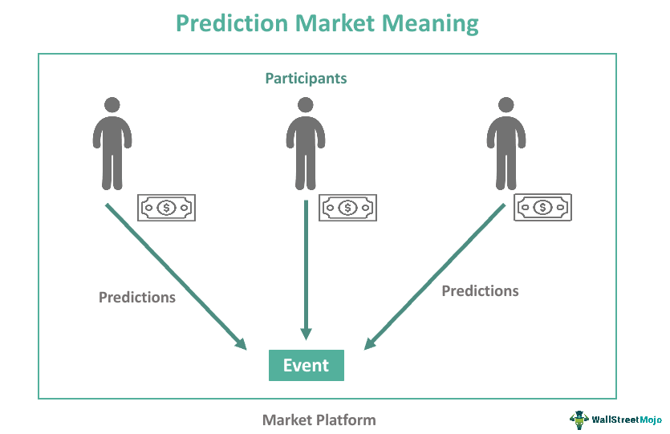

As the finance and trading sectors continue to evolve, understanding the dynamics at play is becoming increasingly vital for investors. Two key components shaping this modern landscape are prediction markets and algorithmic trading, both of which are gaining traction as essential tools for forecasting and making informed decisions.

Prediction markets serve as platforms where individuals can trade contracts tied to the anticipated outcomes of various future events. By doing so, these markets produce price points that encapsulate the collective predictions of their participants. Operating in a manner similar to futures markets, prediction markets focus on diverse events ranging from political elections to economic performance metrics. In doing so, they present a mechanism for speculating on real-world outcomes with a degree of analytical robustness.



In parallel, algorithmic trading employs computer programs to execute trades according to predefined criteria. This method seeks to minimize human emotional interference, thereby enhancing the efficiency and speed of trade execution. By implementing strategies such as trend-following, arbitrage, and asset rebalancing, algorithmic trading provides a structured approach to navigating financial markets. Its subset, high-frequency trading, processes multiple trades at lightning speed based on advanced algorithmic strategies, offering significant advantages in precision and cost but also posing challenges related to market volatility and the requisite high capital investment.

This article aims to explore prediction markets, illustrating their examples and the varying types, while also addressing the significant role that algorithmic trading plays. By examining the interaction and contribution of these elements to today's financial ecosystems, we will unravel the complexities and advantages they offer. Join us on this journey to understand how prediction markets and algorithmic trading are forging new pathways in financial strategy and market insight.

## Table of Contents

## What Are Prediction Markets?

Prediction markets are specialized platforms that enable participants to trade contracts contingent on the outcomes of future events. Functioning similarly to futures markets, these platforms concentrate on forecasting events such as election results, economic indicators, or corporate sales outcomes, rather than commodity prices or financial instruments. By allowing participants to buy and sell contracts whose payoff depends on a specific outcome, prediction markets generate prices that embody the collective expectations and probabilities assigned by all traders to potential future scenarios.

One key aspect of prediction markets is their ability to aggregate diverse information inputs from a wide range of participants to produce a consensus view. As market participants place trades based on their individual beliefs and access to information, the resulting market prices effectively reflect a synthesis of public knowledge and sentiment. This "wisdom of crowds" principle is a foundational concept in prediction markets, suggesting that the collective judgment of many is often more accurate than that of an isolated individual or expert.

The Iowa Electronic Markets (IEM) and PredictIt are notable examples of prediction markets that have demonstrated high levels of accuracy in forecasting political events, such as election outcomes. IEM, operated by the University of Iowa, allows traders to buy and sell contracts based on political and economic forecasts. Participants use real money to invest in contracts, making the market relatively unique in its educational and research-oriented mandate. PredictIt, on the other hand, operates as a regulated entity that caps investments to maintain its academic exemption from gambling laws in the United States.

In practice, a typical prediction market will list a series of outcome-related contracts, each corresponding to a potential result of a future event. For instance, during an election, contracts could represent different candidates winning. If a trader believes a particular candidate is likely to win, they will buy contracts associated with that outcome, hoping to profit if their prediction proves correct. The market price of a specific contract is interpreted as a probability estimate for the associated event occurring, derived from the collective trading activity of all participants.

In summary, prediction markets serve as platforms for forecasting real-world outcomes by enabling speculation on uncertain future events. Through the mechanism of trading contracts, these markets leverage collective intelligence to produce informed predictions, often demonstrating remarkable accuracy and reliability in forecasting complex, variable, and ambiguous scenarios.

## Types of Prediction Markets

Prediction markets are structured in several distinct forms, each with unique mechanisms for facilitating trades and price discovery. The primary types include Continuous Double Auction (CDA), Automated Market Makers (AMM), Play Money Markets, and Blockchain-based markets.

Continuous Double Auctions are a traditional form of market where buyers and sellers submit bids and offers, respectively. The market continuously matches these bids and offers to execute trades. Prices in a CDA adjust dynamically based on the supply and demand for contracts, providing real-time feedback on the likelihood of future events. This format is commonly used in financial exchanges and was historically the basis for many real-world prediction markets.

Automated Market Makers differ from CDAs by using mathematical algorithms to provide [liquidity](/wiki/liquidity-risk-premium) and determine prices. AMMs act as counterparties to trades, allowing market participants to buy or sell contracts at any time. Prices in an AMM are typically defined by a pricing function, such as the constant product formula used by platforms like Uniswap. This function ensures that the market remains liquid regardless of the number of participants. AMMs simplify trading processes and are essential in decentralized finance (DeFi) ecosystems.

Play Money Markets provide an alternative for those interested in prediction markets without the risks associated with actual financial transactions. These markets use virtual tokens instead of real money, making them accessible and legally compliant in jurisdictions with restrictive gambling laws. Despite lacking real financial stakes, Play Money Markets can still provide valuable insights into event probabilities by aggregating the opinions of participants.

Blockchain-based prediction markets, like Augur and Gnosis, introduce decentralization into the equation. These platforms utilize blockchain technology to ensure transparency, immutability, and resistance to censorship. By leveraging smart contracts, they facilitate automated event resolution and payouts without the need for a central authority. Blockchain integration enhances security and trust in prediction markets, allowing participants to engage with high confidence in the integrity of the market.

Together, these various types of prediction markets enable diverse applications and innovations in forecasting and decision-making. Each type offers distinct advantages in terms of liquidity, accessibility, and technological integration, contributing to the broader financial landscape.

## Real-World Examples and Uses of Prediction Markets

Prediction markets have emerged as robust tools for forecasting, primarily due to their ability to capitalize on the collective intelligence of a diverse group of participants. One of the most notable examples is the Iowa Electronic Market, which has consistently demonstrated remarkable accuracy in predicting election outcomes. This platform functions by allowing participants to buy and sell contracts based on political events, with prices reflecting the aggregated expectations of its users. The historical success of the Iowa Electronic Market underscores the power of prediction markets in capturing the collective insights and anticipations of a population.

Beyond political forecasting, prediction markets have found significant applications in economics. They are used to aggregate crowd-sourced forecasts across various sectors, providing a unique mechanism through which the collective estimates of numerous individuals can be synthesized into actionable insights. This synthesis of information can be particularly advantageous in contexts where traditional data sources are unavailable or unreliable.

In the corporate sphere, large companies have started leveraging prediction markets for strategic decision-making and risk management. By enabling employees to wager on potential business outcomes, these companies can harness a wide array of perspectives, leading to more informed and strategic decisions. For instance, prediction markets can offer insights into potential product success, enabling companies to allocate resources more efficiently and mitigate associated risks.

The benefits of prediction markets are manifold. One key advantage is their ability to mitigate uncertainty by providing real-time insights that can enhance decision-making accuracy. This is especially crucial in rapidly changing environments, where traditional forecasting methods may falter. Prediction markets excel by incorporating the 'wisdom of crowds', a concept that posits that large groups of people collectively can make more accurate predictions than individuals or small groups of experts. This concept is supported by numerous studies that indicate that the aggregation of diverse opinions can lead to highly reliable forecasts.

Thus, prediction markets are not only powerful tools for forecasting specific outcomes but also act as mechanisms for uncovering latent information dispersed across individuals. They illustrate the potential of collective intelligence in providing insights that might otherwise remain obscured in more conventional settings.

## Understanding Algorithmic Trading

Algorithmic trading, frequently referred to as algo trading, employs computer software to execute buy and sell orders in financial markets according to predefined criteria. This approach leverages the speed and computational power of computers to mitigate the influence of human emotions in trading decisions, thereby increasing the efficiency and speed of trade execution.

One of the core benefits of [algorithmic trading](/wiki/algorithmic-trading) is its ability to execute trades at the best possible rate, which minimizes the likelihood of human error and the emotional biases that can lead to suboptimal trades. Algorithms can be designed to process vast datasets at high speeds, identifying patterns and trends that a human trader might overlook.

Common strategies utilized in algorithmic trading include trend-following, [arbitrage](/wiki/arbitrage), and index fund rebalancing. Trend-following is a strategy where algorithms are programmed to buy stocks that are rising and sell stocks that are falling, taking advantage of market [momentum](/wiki/momentum). Arbitrage involves exploiting price differentials in different markets or financial instruments, allowing algorithms to profit from temporary price imbalances. Index fund rebalancing ensures that a fund maintains its desired asset allocation by executing trades to align the portfolio with the index it tracks.

A subcategory of algorithmic trading, high-frequency trading ([HFT](/wiki/high-frequency-trading-strategies)), involves executing a large number of trades in fractions of a second. This method capitalizes on small price discrepancies and requires access to advanced technical infrastructure as well as low-latency data feeds.

While the advantages of algorithmic trading include enhanced precision, reduced transaction costs, and the ability to backtest trading strategies prior to live implementation, there are some drawbacks. One notable disadvantage is the potential for increased market [volatility](/wiki/volatility-trading-strategies) due to the rapid execution of large volumes of orders, which can magnify price swings. Additionally, the initial development and ongoing maintenance of algorithmic trading systems require substantial capital investment, often making it accessible only to institutional investors and well-capitalized individuals.

In summary, by leveraging sophisticated computational techniques, algorithmic trading transforms traditional trading paradigms, offering a systematic and efficient approach to market participation.

## The Intersection of Prediction Markets and Algorithmic Trading

Prediction markets and algorithmic trading represent an evolving and dynamic intersection in modern finance. Prediction markets often leverage algorithms to manage and analyze vast amounts of data, providing forecasts on the outcomes of various future events. These predictions can reflect the collective intelligence of market participants, thus yielding probabilistic insights valuable for investment decisions. 

Algorithmic trading, in turn, can benefit significantly from the data generated by prediction markets. By integrating insights on probable future events, algorithmic trading systems can refine their strategies. For instance, an algorithm executing trades in equities might incorporate data from prediction markets about geopolitical events or economic indicators, allowing for adjustments in trading signals to optimize performance under new predictions.

The practical application of this synergy between prediction markets and algorithmic trading leads to more astute and agile investment decisions. Traders can use algorithms that analyze prediction market data, adjusting trades based on updated information. This integration results in improved predictive accuracy and trading outcomes. For example, Python libraries such as pandas and scikit-learn can be employed to analyze and model prediction market data, enhancing the development of robust trading algorithms:

```python
import pandas as pd
from sklearn.linear_model import LinearRegression

# Load prediction market data
data = pd.read_csv('prediction_market_data.csv')

# Feature selection
features = data[['event1_prediction', 'event2_prediction']]
target = data['market_price']

# Linear Regression Model
model = LinearRegression()
model.fit(features, target)

# Predict future market prices based on new prediction data
new_data = pd.DataFrame({'event1_prediction': [0.7], 'event2_prediction': [0.6]})
predicted_price = model.predict(new_data)
print(f"Predicted market price: {predicted_price[0]}")
```

This sample Python code demonstrates how prediction market data can be used to predict market prices, which can then serve as input to algorithmic trading strategies.

Blending the analytical rigor of prediction markets with the precision and speed of algorithmic trading enhances overall trading efficiency. These methodologies provide traders with timely and data-driven insights, thus directly impacting decision-making efficacy across financial markets. As prediction markets continue to evolve with advancements in data analytics and [machine learning](/wiki/machine-learning), their integration with algorithmic trading is poised to transform the landscape of modern finance, offering investors powerful tools for navigating complex market environments.

## Conclusion

Prediction markets and algorithmic trading stand at the forefront of technological advancement in the finance industry. These innovations offer unique insights and automated processes that significantly enhance market forecasting and refine trading strategies. By efficiently aggregating information and executing trades at high speeds, they provide investors with a competitive edge through timely and data-driven decision-making.

Harnessing these tools effectively necessitates a deep understanding of their underlying mechanisms and the broader impact they exert on financial markets. Prediction markets aggregate collective intelligence to forecast outcomes with remarkable accuracy, while algorithmic trading executes trades based on predefined criteria, optimizing transactions for efficiency and precision. Together, they form a powerful alliance that bolsters market predictions and trading outcomes, thus reinforcing the pillars of modern financial analysis.

As financial ecosystems continue to evolve, the integration of technological advancements like prediction markets and algorithmic trading presages a future dominated by predictive and data-centric investing strategies. The symbiotic relationship between these tools exemplifies the trend toward automated and informed decision processes in financial markets.

Investors and traders are encouraged to embrace the potential of prediction markets and algorithmic trading, enhancing their financial strategies and market understanding. By tapping into the wealth of data and automation these tools offer, market participants can achieve more informed, agile, and successful navigation of the complex landscape of contemporary finance.

## References & Further Reading

[1]: Bergstra, J., Bardenet, R., Bengio, Y., & Kégl, B. (2011). ["Algorithms for Hyper-Parameter Optimization."](https://dl.acm.org/doi/10.5555/2986459.2986743) Advances in Neural Information Processing Systems 24.

[2]: ["Advances in Financial Machine Learning"](https://www.amazon.com/Advances-Financial-Machine-Learning-Marcos/dp/1119482089) by Marcos Lopez de Prado

[3]: Wolfers, J., & Zitzewitz, E. (2004). ["Prediction Markets."](https://www.nber.org/papers/w10504) The Journal of Economic Perspectives, 18(2), 107-126.

[4]: Berg, J.E., & Rietz, T.A. (2006). ["The Iowa Electronic Market: Lessons Learned and Answers Yearned."](https://www.semanticscholar.org/paper/The-Iowa-Electronic-Market-%3A-Lessons-Learned-and-Berg-Rietz/3b80d9f834b6171e240e6ebe5a2ae297cbac2ef5) Journal of Economic Perspectives.

[5]: Tziralis, G., & Tatsiopoulos, I. (2007). ["Prediction Markets: An Extended Literature Review"](https://www.ubplj.org/index.php/jpm/article/view/421). The Journal of Prediction Markets. 

[6]: ["Machine Learning for Algorithmic Trading"](https://github.com/stefan-jansen/machine-learning-for-trading) by Stefan Jansen

[7]: Tetlock, P.C. (2008). ["Liquidity and Prediction Market Efficiency"](https://business.columbia.edu/sites/default/files-efs/pubfiles/3098/Tetlock_SSRN_Liquidity_and_Efficiency.pdf) The Review of Financial Studies, 21(3), 1239–1270.

[8]: ["Quantitative Trading: How to Build Your Own Algorithmic Trading Business"](https://www.amazon.com/Quantitative-Trading-Build-Algorithmic-Business/dp/0470284889) by Ernest P. Chan