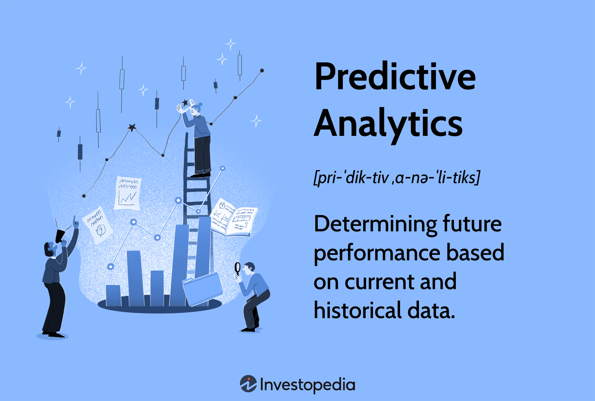

Predictive analytics is a branch of advanced analytics that involves using historical data, statistical algorithms, and machine learning techniques to make predictions about future events. It is a powerful tool in data-driven decision-making processes, providing insights that can drive strategic actions. In the context of modern industries, predictive analytics is crucial for gaining a competitive edge by anticipating trends, understanding consumer behavior, and optimizing operations.

In financial markets, predictive analytics plays a vital role by enabling firms to forecast asset prices, manage risks, and identify lucrative opportunities. Financial institutions utilize predictive models to analyze vast datasets and generate accurate predictions about stock prices, market trends, and economic indicators. These predictive insights enhance decision-making capabilities, providing significant advantages in trading and investment strategies.

Algorithmic trading, a predominant force in contemporary financial markets, relies heavily on predictive analytics. Algorithmic trading utilizes automated algorithms to execute trades based on predefined criteria. Predictive models are fundamental to this process, as they generate foresight into market movements, aiding the development of algorithms that can swiftly capitalize on potential opportunities while mitigating risks. The integration of predictive analytics in algorithmic trading not only improves efficiency but also reduces the emotional bias often present in manual trading activities.

As we explore the intricate relationship between predictive analytics and algorithmic trading, it becomes essential to understand the various types of models employed in these analytical processes. Regression analysis, time series forecasting, decision trees, and neural networks are just some of the models leveraged in predictive analytics. Each model has distinct applications in data and algorithmic trading, tailored to predict different aspects of market behavior and investor sentiment. This introduction sets the stage for a deeper examination of these predictive models and how they shape the landscape of data-driven trading activities.

## Table of Contents

## Understanding Predictive Analytics

Predictive analytics is a technique used to forecast future events by analyzing historical data and applying statistical algorithms and machine learning models. This forecasting ability is invaluable in a data-driven world, where informed decision-making can significantly impact various industries, such as finance, healthcare, and retail. By assessing patterns in existing data, predictive analytics provides insights that help organizations anticipate trends, improve operations, and gain a competitive advantage.

The process of predictive analytics involves three key components: data collection, data processing, and statistical analysis. These stages work together to extract meaningful insights from large volumes of data. 

1. **Data Collection:** This initial step involves gathering historical data from diverse sources. It is crucial to ensure that the data is accurate, consistent, and complete. The quality of data influences the reliability of the predictive models. Data can be collected from databases, social media, sensors, and other digital platforms, which makes it both varied and voluminous.

2. **Data Processing:** Once collected, the data is cleaned and transformed into a suitable format for analysis. This involves handling missing values, filtering outliers, normalizing data, and selecting relevant features. Effective data processing ensures that the dataset is ready for accurate and efficient model training.

3. **Statistical Analysis:** The processed data is then used in statistical models to identify patterns and relationships. Techniques such as regression analysis, time series forecasting, and clustering, among others, are applied to predict future trends. Statistical analysis provides a foundation for building models that can simulate various scenarios and generate predictions.

Machine learning enhances the capabilities of predictive analytics by enabling systems to learn from data and improve predictions over time. Machine learning models efficiently handle complex datasets, uncovering intricate patterns that traditional statistical methods might miss. Popular algorithms used in predictive analytics include linear regression, random forests, neural networks, and support vector machines.

For instance, a simple linear regression model attempts to establish a relationship between a dependent variable $y$ and an independent variable $x$ through the equation:

$$
y = \beta_0 + \beta_1 x + \epsilon
$$

where $\beta_0$ is the intercept, $\beta_1$ is the slope of the line, and $\epsilon$ is the error term. Machine learning expands on this by applying more complex algorithms that can manage non-linear relationships and interactions between variables.

In recent years, advancements in [machine learning](/wiki/machine-learning) have led to increased prediction accuracy and efficiency. Algorithms have become capable of processing enormous datasets, thanks to innovations in parallel computing and cloud infrastructure. Machine learning models can be retrained continually with new data, ensuring that predictions remain relevant as external conditions evolve.

In conclusion, predictive analytics stands as a transformative technology in data analysis, driven by machine learning's ability to enhance precision and adaptability. By utilizing historical data to foresee future outcomes, organizations can make strategic decisions that optimize performance and drive success.

## Types of Predictive Analytics Models

Predictive analytics employs various models to analyze historical data and forecast future outcomes. This section explores four primary types of predictive models: regression, time series analysis, decision trees, and neural networks. Each model has distinct applications, strengths, and limitations in forecasting and predictions.

### Regression Models

Regression models are a fundamental tool in predictive analytics used to understand relationships between variables and predict a continuous outcome. The simplest form, linear regression, seeks to model the relationship between a dependent variable $Y$ and one or more independent variables $X$ using a linear equation:

$$
Y = \beta_0 + \beta_1X_1 + \beta_2X_2 + \ldots + \beta_nX_n + \epsilon
$$

where $\beta$ represents the coefficients, and $\epsilon$ is the error term.

**Applications:** Linear regression is often used in financial forecasting, such as predicting stock prices based on market indicators.

**Strengths:** These models are easy to interpret and computationally efficient, making them suitable for scenarios where relationships between variables are linear and datasets are not too large.

**Limitations:** Linear regression assumes a linear relationship between variables, which can be overly simplistic in real-world scenarios. It is sensitive to outliers and multicollinearity.

### Time Series Analysis

Time series analysis focuses on data points collected or recorded at specific time intervals. The objective is to forecast future values based on previously observed data. Common methods in time series analysis include autoregressive integrated moving average (ARIMA) and exponential smoothing.

**Applications:** Time series models are prevalent in economic forecasting and stock market predictions where the temporal factor is critical.

**Strengths:** They leverage temporal patterns such as trends and seasonality, making them highly effective for datasets with a time component.

**Limitations:** Accurate time series forecasting requires a substantial amount of historical data. These models can be complex and computationally intensive, potentially limiting their applicability in real-time scenarios.

### Decision Trees

Decision trees are a non-parametric model used for classification and regression tasks. They work by splitting the data into subsets based on the value of input features, following a tree-like structure of decisions.

**Applications:** Decision trees are used extensively in credit scoring and risk assessment in finance, where interpretability and decision logic are critical.

**Strengths:** They are easy to understand and visualize, handle both numerical and categorical data, and require little data preprocessing.

**Limitations:** Decision trees can be prone to overfitting, especially when they are deep. They also tend to be biased towards dominant classes if the data is unbalanced.

### Neural Networks

Neural networks are a class of models inspired by the human brain, capable of modeling complex, non-linear relationships. They consist of layers of interconnected nodes (neurons) that process inputs to predict an output.

**Applications:** Neural networks are used in a variety of forecasting tasks, including stock market predictions, where patterns are intricate and non-linear.

**Strengths:** They are powerful and flexible, able to capture non-linear patterns in large, complex datasets.

**Limitations:** Neural networks require large amounts of data and computational resources. They are often referred to as "black box" models due to their lack of transparency, making them challenging to interpret.

In summary, each predictive model offers unique advantages and challenges. The choice of model depends on the specific requirements of the task, the nature of the dataset, and the desired balance between interpretability and predictive power.

## Data Applications in Predictive Analytics

Predictive analytics relies heavily on the effective use of data, with the triad of data quality, [volume](/wiki/volume-trading-strategy), and variety playing critical roles in its successful application. The quality of data is fundamental, as accurate, consistent, and unbiased data ensures the reliability of predictive models. Volume, represented by large datasets, enhances model training, allowing for more comprehensive insights and robust predictions. Variety, encompassing diverse data sources and types, further enriches the analytical process by offering multiple perspectives on the phenomena being studied.

The advent of big data has revolutionized predictive analytics, particularly in its ability to improve the accuracy of predictions. Large datasets provide a wealth of information that, when analyzed, can reveal patterns and trends not discernible in smaller datasets. Real-time data processing, a subset of big data, allows organizations to generate insights promptly, enabling them to react swiftly to emerging trends and make informed decisions. This capability is particularly valuable in industries where timing is crucial, such as finance and retail.

In healthcare, predictive analytics has been instrumental in enhancing patient care and optimizing operational efficiency. By analyzing historical patient data, healthcare providers can predict disease outbreaks, personalize treatment plans, and improve patient outcomes. Predictive models can foresee which patients are at risk of developing chronic conditions, allowing for early intervention. Moreover, real-time data from wearable devices and electronic health records enhance these predictions, providing continuous updates on patient status and enabling timely responses.

The retail sector uses predictive analytics to anticipate consumer behavior and optimize stock management. By evaluating past purchasing patterns and customer preferences, retailers can forecast demand for certain products, streamline inventory, and reduce waste. This approach not only improves customer satisfaction by ensuring product availability but also maximizes profitability. Real-time data plays a role here by allowing retailers to adjust their strategies in sync with current market trends and consumer dynamics.

In finance, predictive analytics aids in risk management and the identification of investment opportunities. Financial institutions use historical market data to predict stock price movements, assess credit risks, and uncover fraudulent activities. Real-time processing of trading and market data enables these institutions to make split-second decisions, crucial in the turbulent financial markets. Predictive models can analyze a variety of data inputs, from economic indicators to news sentiment, to provide a comprehensive view of potential market shifts.

Overall, predictive analytics transforms data into actionable insights across various sectors. The integration of big data and real-time processing amplifies its potential, ensuring that organizations can achieve higher prediction accuracy and maintain a competitive edge.

## Algorithmic Trading and Predictive Models

Algorithmic trading refers to the use of computer-generated algorithms to execute trades on financial markets, optimizing for speed and precision. These algorithms can process a vast array of variables, assets, and market indicators in ways that humans cannot match in terms of speed or efficiency. Predictive models play a crucial role in [algorithmic trading](/wiki/algorithmic-trading) because they help forecast asset prices and identify profitable market opportunities.

**Predictive Models in Algorithmic Trading**

Numerous predictive models are employed in algorithmic trading. These models range from straightforward statistical methods to complex machine learning algorithms.

1. **Statistical Arbitrage Models**: These models focus on identifying price inefficiencies between different markets or securities. By exploiting these inefficiencies, traders can achieve arbitrage profits. A typical approach within this category is pairs trading, which involves buying and selling two correlated assets. For example, if two historically correlated stocks deviate from their expected price ratio, a statistical arbitrage model may signal a buy for one stock and a short for the other, anticipating a return to the historical ratio.

2. **Market Trend Predictors**: These models aim to forecast the direction of market prices by analyzing historical data. Techniques such as moving averages, trend lines, and momentum indicators fall within this category. Machine learning algorithms, such as neural networks, can also be employed to detect more sophisticated patterns in data that may indicate future trends.

3. **Time Series Analysis**: This involves analyzing time-ordered data points to extract meaningful statistics and characteristics of the data. Models like Autoregressive Integrated Moving Average (ARIMA) are employed to predict future values based on past data. These models assume that future values are a function of previous data, making them particularly useful for financial data which often have time-dependent relationships.

4. **Machine Learning Models**: Advanced machine learning techniques, including random forests, support vector machines, and deep learning models, provide powerful tools for predicting market movements. These models learn from complex patterns in historical data, adjusting to new information dynamically, and can be used for tasks like classification (e.g., predicting whether a stock will go up or down) or regression (e.g., estimating the future price of an asset).

**Challenges and Risks**

While predictive models in algorithmic trading offer significant advantages, they also present notable challenges and risks:

- **Data Quality and Availability**: The accuracy of predictive models heavily depends on the quality and amount of historical data available. Inaccurate, incomplete, or biased data can lead to flawed predictions.

- **Market Dynamics**: Financial markets are influenced by numerous unpredictable factors, such as economic shifts, political events, and natural disasters, which models may not account for. This can result in unexpected outcomes and potential losses.

- **Model Overfitting**: A common risk when designing complex models is overfitting, where a model is too closely tailored to past data and performs poorly on new, unseen data. Ensuring that models generalize well is a critical concern in algorithmic trading.

- **Regulatory and Compliance**: Algorithmic trading is subject to regulatory scrutiny, and models must comply with relevant laws and regulations to prevent issues such as market manipulation or unfair trading practices.

Despite these challenges, predictive models continue to be a mainstay in algorithmic trading, offering the potential for enhanced decision-making and profitability when designed and implemented with care.

## Future Trends in Predictive Analytics

Predictive analytics is poised for transformative advancements due to emerging technologies like [artificial intelligence](/wiki/ai-artificial-intelligence) (AI) and quantum computing. AI, particularly through advancements in machine learning algorithms, is set to refine predictive models by enhancing their accuracy and adaptability. Machine learning models, which learn from data iteratively, will benefit from AI's capability to process vast datasets more efficiently, resulting in more robust predictions. This is crucial for fields such as finance, healthcare, and retail, where minor increases in prediction accuracy can lead to significant gains.

Quantum computing offers another frontier for predictive analytics. Unlike classical computing, quantum computing has the potential to process information at unprecedented speeds, handling computations that were previously thought to be intractable. Its application to predictive analytics could lead to a paradigm shift where complex simulations and analytics tasks are completed in drastically reduced times. This, in turn, could enhance the optimization of trading algorithms, benefiting from the rapid processing of large datasets to make near-instantaneous predictions.

Emerging trends in data applications, including increased use of real-time data and Internet of Things (IoT) devices, will continue to enhance predictive analytics. The volume and velocity of available data are increasing, enabling more granular insights. Real-time data processing allows for updating predictive models in seconds, which is particularly advantageous in algorithmic trading, where market conditions evolve rapidly.

Algorithmic trading stands to benefit substantially from these advancements. Enhanced predictive models can identify market trends more accurately, assess risk dynamically, and execute trades with greater precision. For example, AI-driven models could continually adapt trading strategies based on real-time market analysis, while quantum computing could facilitate near-instantaneous analysis of vast data, identifying trading opportunities at speeds unimaginable before.

The intersection of AI and quantum computing will likely lead to novel methodologies in predictive analytics, such as hybrid quantum-classical algorithms that combine the strengths of both approaches. This synergy could unlock new capabilities in handling complex data structures and improving model interpretability, a critical [factor](/wiki/factor-investing) for applying predictive analytics in highly regulated industries like finance.

As companies increasingly invest in and adopt these technologies, predictive analytics will become more powerful, providing deeper insights and transforming decision-making processes across sectors. Consequently, the future landscape of algorithmic trading and other data-intensive domains will likely be defined by unprecedented levels of precision and agility.

## Conclusion

Predictive analytics stands as a cornerstone in modern decision-making processes, significantly augmenting the capabilities of various industries, including finance, healthcare, and retail. At its core, predictive analytics involves leveraging historical data to anticipate future outcomes, which has become essential for organizations aiming to optimize operations, enhance customer experiences, and generate competitive advantages.

Across diverse sectors, the importance of predictive analytics continues to grow, driven by advancements in machine learning and data processing capabilities. In finance, particularly, predictive models are crucial in algorithmic trading, where they enable the forecasting of asset prices and identification of market opportunities. By employing various types of predictive models, such as regression, time series analysis, and neural networks, financial institutions can navigate complex market dynamics with increased precision.

The landscape of data applications and algorithmic trading is constantly evolving, propelled by technological advancements in artificial intelligence and data science. The integration of big data and real-time processing technologies is transforming predictive analytics, allowing for the handling of larger datasets and more complex algorithms. This evolution not only enhances predictive accuracy but also opens new avenues for innovation in algorithmic trading strategies.

As we look to the future, the potential impact of emerging technologies like quantum computing and advanced AI models suggests profound possibilities for predictive analytics. These technologies promise to further refine prediction capabilities and introduce unprecedented levels of computational power, carrying the potential to reshape how industries utilize data-driven insights.

In conclusion, predictive analytics is crucial for enabling data-driven strategies and decisions across various sectors. The continued innovation in data applications and algorithmic trading underscores a burgeoning field with expanding influence and capability. As these technologies evolve, they will undoubtedly continue to provide transformative benefits, driving efficiency, uncovering new opportunities, and crafting a future where data informs every critical business decision.

## References & Further Reading

[1]: Bergstra, J., Bardenet, R., Bengio, Y., & Kégl, B. (2011). ["Algorithms for Hyper-Parameter Optimization."](https://papers.nips.cc/paper/4443-algorithms-for-hyper-parameter-optimization) Advances in Neural Information Processing Systems 24.

[2]: ["Advances in Financial Machine Learning"](https://www.amazon.com/Advances-Financial-Machine-Learning-Marcos/dp/1119482089) by Marcos Lopez de Prado

[3]: ["Evidence-Based Technical Analysis: Applying the Scientific Method and Statistical Inference to Trading Signals"](https://www.amazon.com/Evidence-Based-Technical-Analysis-Scientific-Statistical/dp/0470008741) by David Aronson

[4]: ["Machine Learning for Algorithmic Trading"](https://github.com/stefan-jansen/machine-learning-for-trading) by Stefan Jansen

[5]: ["Quantitative Trading: How to Build Your Own Algorithmic Trading Business"](https://www.amazon.com/Quantitative-Trading-Build-Algorithmic-Business/dp/1119800064) by Ernest P. Chan