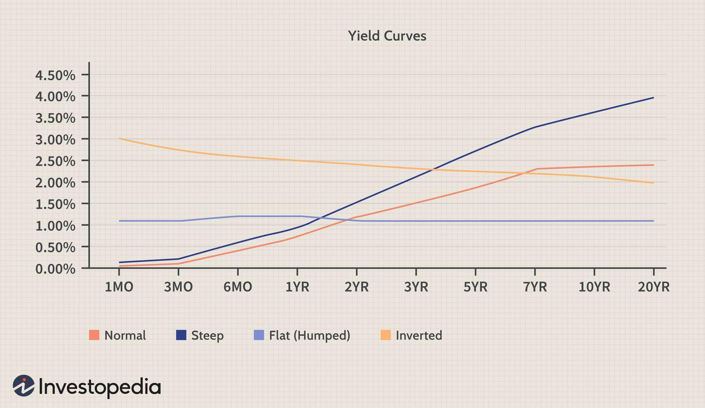

The relationship between bond yield curves and economic forecasting is essential for understanding financial markets. Yield curves, which graphically represent the varying interest rates of debt securities against their maturities, are indispensable tools for policymakers, investors, and economic analysts. These curves serve as essential financial indicators that provide insights into market expectations regarding future interest rates and economic conditions.

Yield curves take on several shapes, including normal, inverted, flat, and steep, each offering different implications for economic forecasting. A normal yield curve suggests stable growth, whereas an inverted yield curve often signals a pending economic recession. This predictive capability makes yield curves particularly valuable for economic analysis and forecasting future financial conditions.

Algorithmic trading, a major component of modern financial markets, is continually evolving by incorporating yield curve analysis into its predictive models. These quantitative trading systems leverage yield curve data to gain insights into market conditions, identify profitable trading opportunities, and enhance overall predictive performance. By integrating yield curve analytics, traders can develop sophisticated strategies that optimize investment decisions and risk management.

This article explores the role of bond yield curves in economic forecasting, their influence on financial indicators, and their integration into algorithmic trading strategies. We will examine the different types of yield curves, how they impact economic predictions, and their implications for investment strategies and economic policy formulation. Understanding these relationships is crucial for anyone involved in the financial markets, as it enables more informed decision-making and strategic planning.

## Table of Contents

## Understanding the Bond Yield Curve

The bond yield curve is a key financial graph that depicts the relationship between interest rates and the different maturities of debt securities, primarily government bonds. The x-axis of the curve represents the time to maturity, while the y-axis indicates the yield or interest rate. The shape of the yield curve is instrumental in conveying economic expectations and market sentiment.

### Shapes of Yield Curves

1. **Normal Yield Curve**: Typically upward sloping, this curve suggests that longer-term securities provide higher yields compared to shorter-term ones. This shape is often associated with positive economic growth, as investors anticipate higher yields over time due to expected economic expansion.

2. **Inverted Yield Curve**: In contrast, an inverted curve occurs when short-term interest rates exceed long-term rates. This shape is widely recognized as a predictor of economic recession. Historically, inverted curves have preceded downturns, reflecting investors’ expectations of falling rates in the future due to weakening economic conditions.

3. **Flat Yield Curve**: When short-term and long-term yields are nearly the same, the curve is flat. This can indicate a transition phase in the economy, either from growth to recession or vice versa. It suggests uncertainty about future economic direction.

4. **Steep Yield Curve**: A steep curve implies that the difference between short-term and long-term yields is pronounced, signaling strong future economic growth. This often occurs after a period of economic recovery.

### Importance in Economic Analysis

Yield curves are essential for analyzing market sentiment about future interest rates and economic activities. Market analysts and policymakers use these curves to gain insights into economic forecasts and potential trends. For instance, central banks might use the yield curve to gauge the necessity of monetary policy interventions.

### Benchmarking and Economic Policies

Yield curves serve as benchmarks for setting interest rates for various types of loans, impacting the broader economy. For example, mortgage rates often align with the interest rates suggested by the yield curve, influencing consumer spending and investment.

### Projecting Economic Growth and Recession

Market analysts analyze the yield curve shapes to make better predictions concerning economic growth and potential recessions. The historical correlation of curve inversions with recessions has made them a critical tool for forecasting economic downturns. As such, a significant portion of economic forecasting relies on interpreting yield curve data to anticipate the ebbs and flows of economic activity.

To interpret these curves, analysts often employ mathematical models to calculate yield spreads and other important metrics. Python, with libraries like NumPy and pandas, can be utilized to process yield data and generate insights into yield curve dynamics. For instance, fitting yield curves to a polynomial function can help model the expected directions of interest rates under various economic scenarios.

## Economic Forecasting Using Yield Curves

Yield curves are powerful tools in economic forecasting, playing a crucial role in predicting economic trends. Their significance is especially pronounced when it comes to anticipating recessions. The yield curve typically plots the interest rates of bonds with different maturities at a certain point in time, providing insights into the market's expectations regarding future interest rates and economic conditions.

One of the most significant features of yield curves is their historical capacity to forecast future [interest rate](/wiki/interest-rate-trading-strategies) movements. When yield curves invert—where long-term interest rates fall below short-term rates—it often signals an impending economic slowdown. This inversion has historically preceded many recessions, making it a reliable predictor for central banks and policymakers.[^1] For example, the U.S. has seen yield curve inversions precede each of the past seven recessions since 1969[^2].

The interpretation of yield curves goes beyond mere inversions. A normal yield curve, which slopes upward, generally indicates expectations of economic expansion. This scenario suggests that investors anticipate economic growth, which typically leads to higher inflation and interest rates over time. Conversely, a steep yield curve can be seen as a sign that economic growth will accelerate, potentially accompanied by rising inflation—a concern for both central banks aiming to maintain price stability and traders interested in anticipating interest rate changes.

The integration of yield curve analysis into economic forecasting provides a more nuanced approach, improving the accuracy of GDP and inflation predictions. By modeling yield curves, forecasters can evaluate potential scenarios for economic performance based on current market sentiments. The ability to quantify expectations about future interest rates and economic conditions allows for a more informed approach to policy-making and investment decisions.

In conclusion, understanding yield curves enriches economic forecasting by offering valuable insights into future economic activities. As such, the study and interpretation of these curves are indispensable for economic analysts aiming to anticipate market shifts and prepare for various economic outcomes.

[^1]: Estrella, A., & Trubin, M. R. (2006). "The Yield Curve as a Leading Indicator: Some Practical Issues." *Federal Reserve Bank of New York*.
[^2]: Wheelock, D. C., & Wohar, M. E. (2009). "Can the Yield Curve Predict Output Growth and Recessions? A Survey of the Literature." *Federal Reserve Bank of St. Louis Review*.

## Yield Curves as Financial Indicators

The shapes and movements of bond yield curves are pivotal in shaping fixed-income investment strategies and influencing financial decisions across various asset classes. A bond yield curve graphically represents the interest rates on debt securities for a range of maturities. The curve's shape—whether normal, inverted, flat, or steep—provides essential insights that investors use to gauge economic conditions and adjust their portfolios accordingly.

Investors rely on yield curve analysis to assess interest rate risks and returns. A normal yield curve, typically sloping upwards, signifies expectations of economic growth and higher future interest rates. Conversely, an inverted yield curve, where short-term rates exceed long-term rates, is perceived as a precursor to economic downturns. These distinctions directly affect investors' strategies, particularly in fixed-income securities where the timing and magnitude of interest rate changes are crucial. For instance, in an anticipatory move against rising rates, investors might favor shorter-duration bonds to mitigate the decline in bond prices.

The influence of yield curves extends beyond bond markets, affecting exchange rates, inflation expectations, and borrowing costs across the financial spectrum. For example, an upward-sloping curve often predicts a strengthening currency due to anticipated economic expansion and potential rate hikes, attracting foreign investment. This movement in exchange rates can, in turn, affect international trade balances and inflation levels. Similarly, corporations and governments [factor](/wiki/factor-investing) yield curve trends into their financing decisions, as shifts in interest rates directly impact borrowing expenses.

Financial planning and investment across diverse asset classes, such as real estate, equities, and commodities, also benefit from insights derived from yield curve analysis. Understanding the predictive power of yield curves allows investors to align their asset allocation strategies with economic indicators. For instance, if yield curves suggest an upcoming expansion, investors might increase their equity exposure, given the favorable conditions for business profits and stock market performance. Conversely, an inverted curve might lead to a defensive strategy, with higher allocations in stable assets less sensitive to economic fluctuations.

Comprehending the implications of various yield curve shapes is crucial for effective financial planning. A keen awareness of how these curves mirror macroeconomic conditions aids investors in positioning their portfolios to maximize returns while managing risk. As yield curves harbor exceptionally rich information, their comprehensive analysis becomes indispensable for informed investment decision-making in the ever-evolving financial landscape.

## Algorithmic Trading and Yield Curves

Algorithmic trading systems utilize bond yield curve data extensively for predicting market conditions and designing trading strategies. These systems assess fluctuations in the yield curve to identify [arbitrage](/wiki/arbitrage) opportunities, a core function in capitalizing on discrepancies that arise between different securities or markets. By evaluating the differences between short-term and long-term interest rates, algorithms can pinpoint mismatches that suggest undervalued or overvalued assets, enabling traders to optimize their portfolio allocations.

Yield curve modeling forms the foundation for understanding market dynamics, as it allows the anticipation of economic shifts. Algorithms analyze historical yield curve data to forecast future changes and simulate potential market outcomes. These simulations help traders craft strategies that account for possible changes in economic conditions and interest rates. A typical model might involve regression analysis where the yield on a bond is expressed as a function of its maturity and other economic indicators. This can be formulated as:

$$
Y_t = \beta_0 + \beta_1 X_1 + \beta_2 X_2 + \cdots + \beta_n X_n + \epsilon_t
$$

where $Y_t$ is the yield at time $t$, $X_1, X_2, \ldots, X_n$ represent different maturities and market variables, and $\epsilon_t$ is the error term.

Traders employ algorithms adaptable to yield curve shape variations to devise risk management strategies. For example, when curves shift from normal to inverted, indicating potential economic slowdowns, algorithms may suggest reducing exposure to certain riskier assets. This adaptability is crucial for maintaining profitable trading in volatile markets.

The integration of AI tools in trading systems introduces automation in yield curve analysis, significantly enhancing decision-making. Machine learning models, such as neural networks, can learn from vast datasets, recognizing patterns that might elude traditional analysis. By automating routine tasks and offering predictive insights, AI supports traders in the swift detection of yield curve changes and corresponding market responses. This automation not only increases the efficiency of trading operations but also improves the reliability and precision of economic forecasts and risk assessments. As these technologies evolve, the role of yield curves in algo trading will likely expand, offering deeper insights and more robust trading solutions.

## Conclusion

Understanding bond yield curves is critical for enhancing market analysis and economic forecasting. The insights garnered from yield curves influence both investment strategies and economic policies significantly. These curves serve as key indicators of economic conditions, offering early warnings of potential recessions through their shapes, particularly the inverted curve. This predictive power allows policymakers to anticipate economic shifts and adjust their strategies accordingly, thus stabilizing economic environments.

Algorithmic trading systems can utilize yield curve analytics to bolster their trading strategies. By analyzing yield curve data, these systems can identify trends and potential arbitrage opportunities. The ability to predict changes in the yield curve helps in devising precise trading strategies, which are crucial for managing risks and maximizing returns. As such, the integration of yield curve analytics into [algorithmic trading](/wiki/algorithmic-trading) models is becoming increasingly beneficial.

As economic indicators continue to evolve, the application of technology in yield curve analysis is crucial. Advanced computational methods enable more precise modeling and simulations of yield curves, improving the accuracy of economic forecasts and investment decisions. The vast array of data that needs to be processed to understand and interpret these curves demands the efficiency and power of modern technological tools.

The continuous advancement in [artificial intelligence](/wiki/ai-artificial-intelligence) (AI) and [machine learning](/wiki/machine-learning) is set to revolutionize the way traders and analysts engage with yield curves. These technologies can process large datasets and identify patterns much more efficiently than traditional methods. Machine learning algorithms can adapt to new data, continually improving their predictions of yield curve movements. This adaptive learning capability ensures that traders and analysts can respond promptly and accurately to shifts in economic indicators, leading to more informed financial decisions and effective risk management strategies. 

In summary, the analysis of bond yield curves offers invaluable insights into financial markets, aiding policymakers, investors, and financial analysts in navigating economic landscapes. The integration of advanced technologies will further enhance our understanding and application of yield curves, ensuring that they remain a vital tool in economic forecasting and investment strategy development.

## References & Further Reading

[1]: Estrella, A., & Trubin, M. R. (2006). ["The Yield Curve as a Leading Indicator: Some Practical Issues."](https://www.newyorkfed.org/research/current_issues/ci12-5.html) Federal Reserve Bank of New York.

[2]: Wheelock, D. C., & Wohar, M. E. (2009). ["Can the Yield Curve Predict Output Growth and Recessions? A Survey of the Literature."](https://www.semanticscholar.org/paper/Can-the-Term-Spread-Predict-Output-Growth-and-A-of-Wheelock-Wohar/82966dad6c71ca8797415f3817e042f53a5c83d9) Federal Reserve Bank of St. Louis Review.

[3]: Lopez de Prado, M. (2018). ["Advances in Financial Machine Learning."](https://www.amazon.com/Advances-Financial-Machine-Learning-Marcos/dp/1119482089) John Wiley & Sons.

[4]: Jansen, S. (2020). ["Machine Learning for Algorithmic Trading – Second Edition: Predictive models to extract signals from market and alternative data for systematic trading strategies with Python."](https://thuvienso.hoasen.edu.vn/bitstream/handle/123456789/12260/Contents.pdf?sequence=1) Packt Publishing.

[5]: Chan, E. P. (2008). ["Quantitative Trading: How to Build Your Own Algorithmic Trading Business."](https://github.com/ftvision/quant_trading_echan_book) Wiley Trading.