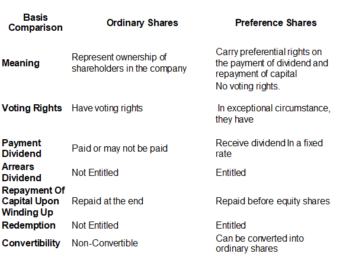

## Table of Contents

## What are preference shares?

Preference shares are a type of stock that gives certain advantages to shareholders over common stock holders. When a company makes money, preference shareholders get paid their dividends before common shareholders. Dividends are payments companies make to shareholders from their profits. This makes preference shares a bit safer than common shares because you are more likely to get some money back even if the company doesn't do very well.

There are different types of preference shares, but they all have one thing in common: they give shareholders a priority over common shareholders when it comes to dividends and assets if the company goes bankrupt. Some preference shares can be converted into common shares, which can be good if the company does really well. Others might have a fixed dividend rate, which means you know exactly how much you will get each year, making it easier to plan your finances.

In summary, preference shares can be a good choice if you want a bit more safety and a steady income from your investments. They are not as risky as common shares but might not grow as much in value if the company does very well. It's important to understand the specific terms of the preference shares you are buying because they can vary a lot from one company to another.

## What are ordinary shares?

Ordinary shares, also known as common shares, are the most basic type of stock that a company can issue. When you buy ordinary shares, you become a part-owner of the company. This means you have a say in how the company is run, usually by voting at shareholder meetings. Ordinary shares are different from preference shares because they don't have any special rights. If the company makes money, ordinary shareholders get paid dividends, but only after preference shareholders have been paid.

The value of ordinary shares can go up or down based on how well the company is doing. If the company does well, the price of the shares can go up, and you might make a profit if you sell them. But if the company does poorly, the price can go down, and you could lose money. Ordinary shares are riskier than preference shares because they don't guarantee dividends, and you are last in line to get any money back if the company goes bankrupt. But they also have the potential for higher rewards if the company grows and does well.

## What are the key differences between preference shares and ordinary shares?

Preference shares and ordinary shares are two types of stocks that companies can issue, but they have some key differences. Preference shares give shareholders priority over ordinary shareholders when it comes to getting paid dividends. This means if a company makes money, preference shareholders get their dividends before ordinary shareholders get anything. Preference shares also give shareholders a better chance of getting some money back if the company goes bankrupt, because they get paid before ordinary shareholders. Some preference shares can be converted into ordinary shares, and they might have a fixed dividend rate, which means you know exactly how much you'll get each year.

Ordinary shares, on the other hand, are the most common type of stock and don't have any special rights. When you own ordinary shares, you are a part-owner of the company and can vote at shareholder meetings. But you only get dividends if the company makes enough money after paying preference shareholders. The value of ordinary shares can go up or down a lot, depending on how well the company is doing. This makes them riskier than preference shares, but they also have the potential for bigger rewards if the company grows and does well.

## How do preference shares and ordinary shares impact voting rights?

Preference shares usually don't give you the right to vote at company meetings. This means if you own preference shares, you can't help decide things like who should be on the company's board of directors or other big decisions. The main reason people buy preference shares is for the steady dividends they get, not for having a say in how the company is run.

On the other hand, ordinary shares do give you voting rights. If you own ordinary shares, you get to vote at shareholder meetings. This means you can have a say in important decisions about the company, like choosing the board of directors or approving big changes. This is one of the main differences between preference shares and ordinary shares, and it's something to think about when deciding which type of shares to buy.

## What are the dividend payment structures for preference shares versus ordinary shares?

Preference shares have a special way of getting dividends. When a company makes money, preference shareholders get paid their dividends before ordinary shareholders. Sometimes, preference shares have a fixed dividend rate, which means you know exactly how much you will get each year. This can be good if you want a steady income from your investments. But if the company doesn't make enough money, preference shareholders might not get their full dividend, though they are still paid before ordinary shareholders.

Ordinary shares don't have a fixed dividend rate. If the company makes money, ordinary shareholders get dividends, but only after preference shareholders have been paid. The amount of dividends for ordinary shares can change a lot from year to year, depending on how well the company is doing. Sometimes, the company might not pay any dividends at all if it's not making enough money. This makes ordinary shares riskier than preference shares when it comes to getting dividends, but they can also offer bigger rewards if the company does really well.

## In what scenarios would a company issue preference shares instead of ordinary shares?

A company might choose to issue preference shares instead of ordinary shares when it wants to raise money without giving away voting rights. Preference shareholders usually don't get to vote at company meetings, so the company can keep control in the hands of the existing owners or management. This can be important for a company that wants to bring in new investors but doesn't want them to have a say in how the business is run.

Another reason a company might issue preference shares is to attract investors who are looking for a steady income. Preference shares often come with a fixed dividend rate, which means investors know exactly how much they will get each year. This can be appealing to people who want a reliable source of income from their investments, especially if they are more interested in getting regular payments than in having the potential for big gains if the company does really well.

## How do preference shares and ordinary shares affect a company's capital structure?

Preference shares and ordinary shares both help a company raise money, but they do it in different ways that affect the company's capital structure. When a company issues preference shares, it gets money from investors who want a safer investment with a steady income. These shares don't usually give voting rights, so the company can keep control in the hands of existing owners or management. Preference shares are like a middle ground between debt and ordinary shares because they have to be paid dividends before ordinary shares, but they don't have to be paid back like a loan.

Ordinary shares, on the other hand, are the most common way for a company to raise money. When a company issues ordinary shares, it gets money from investors who are willing to take more risk for the chance of bigger rewards. Ordinary shareholders get voting rights, which means they can help make big decisions about the company. This can change the company's capital structure by spreading out control among more people. Ordinary shares don't guarantee dividends, so the company has more flexibility in how it uses its profits, but it also means ordinary shareholders are last in line to get paid if the company runs into trouble.

## What are the risks associated with investing in preference shares compared to ordinary shares?

When you invest in preference shares, you take on less risk than with ordinary shares. Preference shares usually come with a fixed dividend rate, so you know how much money you'll get each year. This makes them safer because you're more likely to get some money back even if the company doesn't do well. But there's still some risk. If the company doesn't make enough money, it might not pay the full dividend. Also, preference shares don't usually give you voting rights, so you can't help make big decisions about the company.

Ordinary shares are riskier than preference shares. The value of ordinary shares can go up or down a lot, depending on how well the company is doing. If the company does well, you might make a lot of money, but if it does poorly, you could lose a lot. Ordinary shares don't guarantee dividends, so you might not get any money back if the company isn't making enough profit. But ordinary shareholders do get voting rights, which means you can have a say in how the company is run. This makes ordinary shares a riskier but potentially more rewarding investment than preference shares.

## How do preference shares and ordinary shares behave during a company's liquidation?

When a company goes bankrupt and has to close down, it has to sell everything it owns to pay back the people it owes money to. Preference shareholders get paid before ordinary shareholders during this process. This means if there's any money left after paying off all the debts, preference shareholders get their share first. This makes preference shares a bit safer than ordinary shares because you're more likely to get some money back if the company goes bankrupt.

Ordinary shareholders are last in line to get paid during a company's liquidation. After the company pays off all its debts and the preference shareholders, if there's any money left, it goes to the ordinary shareholders. But often, there's not much money left by the time it gets to them, so ordinary shareholders might not get anything back. This makes ordinary shares riskier than preference shares, but they can also offer bigger rewards if the company does well.

## What are the tax implications of holding preference shares versus ordinary shares?

The tax implications of holding preference shares and ordinary shares can be different. When you get dividends from preference shares, you might have to pay taxes on that money. The tax rate can depend on where you live and how much money you make. Sometimes, preference shares can be treated like debt for tax purposes, which might mean you pay a different kind of tax on the dividends. It's a good idea to talk to a tax expert to understand exactly how much tax you'll have to pay.

Ordinary shares also come with tax implications, but they can be a bit different. Like with preference shares, you might have to pay taxes on the dividends you get from ordinary shares. The tax rate can also depend on your income and where you live. If you sell your ordinary shares and make a profit, you might have to pay capital gains tax on that profit. The tax rules can be complicated, so it's always a good idea to get advice from a tax professional to make sure you understand all the tax implications of your investments.

## How do convertible preference shares work and how do they differ from ordinary shares?

Convertible preference shares are a special type of preference share that can be turned into ordinary shares at some point. This means if you own convertible preference shares, you can choose to swap them for ordinary shares, usually at a set price. This can be good if the company does really well because the value of ordinary shares can go up a lot. But until you convert them, you still get the benefits of preference shares, like getting paid dividends before ordinary shareholders and having a safer investment.

Convertible preference shares are different from ordinary shares in a few ways. First, they give you the safety of preference shares because you get paid dividends before ordinary shareholders. But they also give you the chance to turn them into ordinary shares, which can be more rewarding if the company grows a lot. Ordinary shares don't have this option; they are just ordinary shares from the start. Also, like other preference shares, convertible preference shares usually don't give you voting rights, while ordinary shares do. So, convertible preference shares can be a good choice if you want a bit of safety but also the chance to make more money if the company does well.

## What are the advanced financial strategies involving preference and ordinary shares for optimizing a company's financial health?

Companies can use preference and ordinary shares in smart ways to make their financial health better. One way is to issue preference shares to raise money without giving up control. Since preference shareholders usually don't get to vote, the company can keep the power in the hands of the current owners or managers. This can be really helpful if the company wants to bring in new money but doesn't want to lose control over big decisions. Also, because preference shares often have a fixed dividend rate, the company knows exactly how much it has to pay out each year, which can help with planning and keeping the company's finances stable.

Another strategy is to use a mix of preference and ordinary shares to balance risk and reward. By issuing ordinary shares, the company can attract investors who are looking for big gains if the company does well. These investors are willing to take more risk because they might make a lot of money if the company grows. At the same time, the company can issue preference shares to investors who want a safer investment with a steady income. This mix can help the company raise money from different kinds of investors, which can make the company's finances stronger and more flexible. By carefully choosing how many preference and ordinary shares to issue, the company can manage its capital structure to support growth while keeping things stable.

## References & Further Reading

[1]: ["Advances in Financial Machine Learning"](https://www.amazon.com/Advances-Financial-Machine-Learning-Marcos/dp/1119482089) by Marcos Lopez de Prado

[2]: ["Algorithmic and High-Frequency Trading"](https://assets.cambridge.org/97811070/91146/frontmatter/9781107091146_frontmatter.pdf) by Alvaro Cartea, Sebastian Jaimungal, and Jose Penalva

[3]: ["Quantitative Trading: How to Build Your Own Algorithmic Trading Business"](https://www.amazon.com/Quantitative-Trading-Build-Algorithmic-Business/dp/1119800064) by Ernest P. Chan

[4]: ["Financial Markets and Corporate Strategy"](https://www.amazon.com/Financial-Markets-Corporate-Strategy-Grinblatt/dp/0072294337) by Mark Grinblatt and Sheridan Titman

[5]: ["The Intelligent Investor"](https://en.wikipedia.org/wiki/The_Intelligent_Investor) by Benjamin Graham

[6]: ["Machine Learning for Algorithmic Trading"](https://github.com/stefan-jansen/machine-learning-for-trading) by Stefan Jansen

[7]: ["Handbook of Fixed-Income Securities"](https://www.amazon.com/Handbook-Fixed-Income-Securities-Ninth/dp/1260473899) by Frank J. Fabozzi

[8]: Bergstra, J., Bardenet, R., Bengio, Y., & Kégl, B. (2011). ["Algorithms for Hyper-Parameter Optimization."](https://dl.acm.org/doi/10.5555/2986459.2986743) Advances in Neural Information Processing Systems 24.